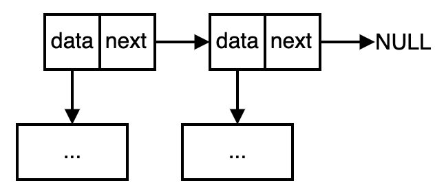
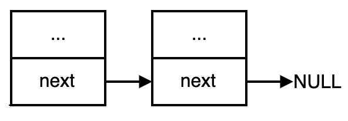

# Linked List

Created: 2018-01-30 19:03:53 +0500

Modified: 2020-01-07 22:36:30 +0500

---

**Points to remember -**

1.  Explicit Data Structure

2.  Linear Data Structure
**Operations**

1.  AddFirst

2.  AddLast

3.  Remove/delete (key)

4.  Iterator

5.  Clonning
**Variants**

1.  Singly Linked List

2.  Doubly Linked List (Double Ended Linked List)

3.  Circular Linked List

4.  Doubly Circular Linked List

5.  Skip List

The idea is simple, we create multiple layers so that we can skip some nodes.

6.  Intrusive Linked List

Intrusive linked lists are a variation of[linked lists](https://www.data-structures-in-practice.com/linked-lists/)where the links are embedded in the structure that's being linked.
In a typical linked list implementation, a list node contains adatapointer to the linked data and anextpointer to the next node in the list.

In an intrusive linked list implementation, the list node containsnextpointer to the next list node, but nodatapointer because the list is embedded in the linked object itself.

There are two main reasons to use intrusive lists over non-intrusive linked lists:
-   Fewer memory allocations

With non-intrusive linked lists, creating a new object and adding it to a list requires two memory allocations: one for the object, and one for the list node. With intrusive linked lists, you only need to allocate one object (since the list node is embedded in the object). This means fewer errors to be handled, because there are half as many cases where memory allocation can fail.-   Less cache thrashing

Intrusive linked lists also suffer less from cache thrashing. Iterating through a non-intrusive list node requires dereferencing a list node, and then dereferencing the list data. Intrusive linked lists only require dereferencing the next list node.
<https://www.data-structures-in-practice.com/intrusive-linked-lists>
In a Linked List the first node is called the**head**and the last node is called the**tail**.

## 

## Pros
-   Linked Lists have constant-time insertions and deletions in any position, in comparison, arrays require O(n) time to do the same thing.
-   Linked lists can continue to expand without having to specify their size ahead of time (remember our lectures on Array sizing form the Array Sequence section of the course!)

## 

## Cons
-   To access an element in a linked list, you need to take O(k) time to go from the head of the list to the kth element. In contrast, arrays have constant time operations to access elements in an array.
**Interview Questions**
-   Reverse a linked list
-   Detect loop in a linked list
-   Return Nth node from the end in a linked list
-   Remove duplicates from a linked list
