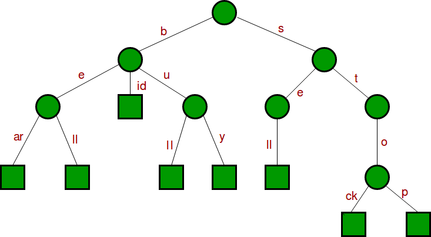

# Compressed Trie

Created: 2018-04-10 22:45:52 +0500

Modified: 2018-04-10 22:47:48 +0500

---

Compressed Trie is obtained from standard trie by joining chains of single nodes. The nodes of a compressed trie can be stored by storing index ranges at the nodes

