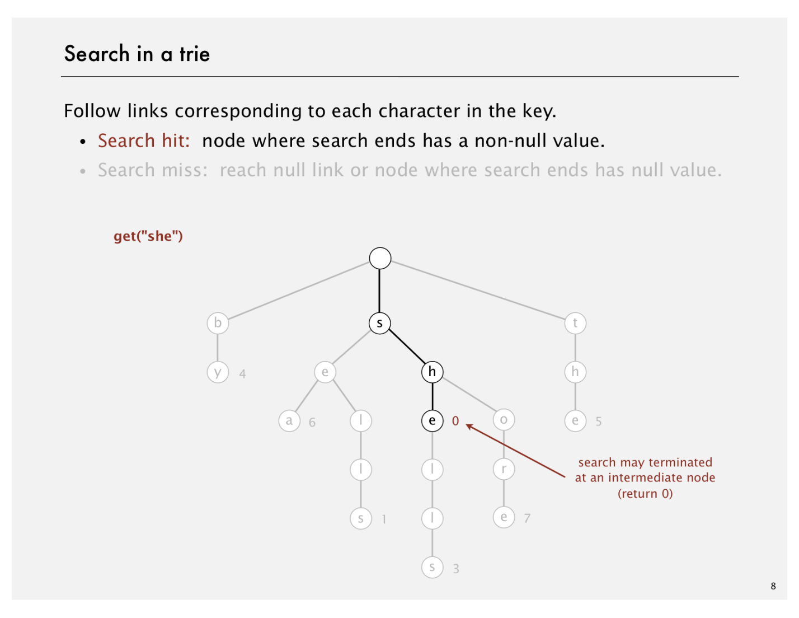
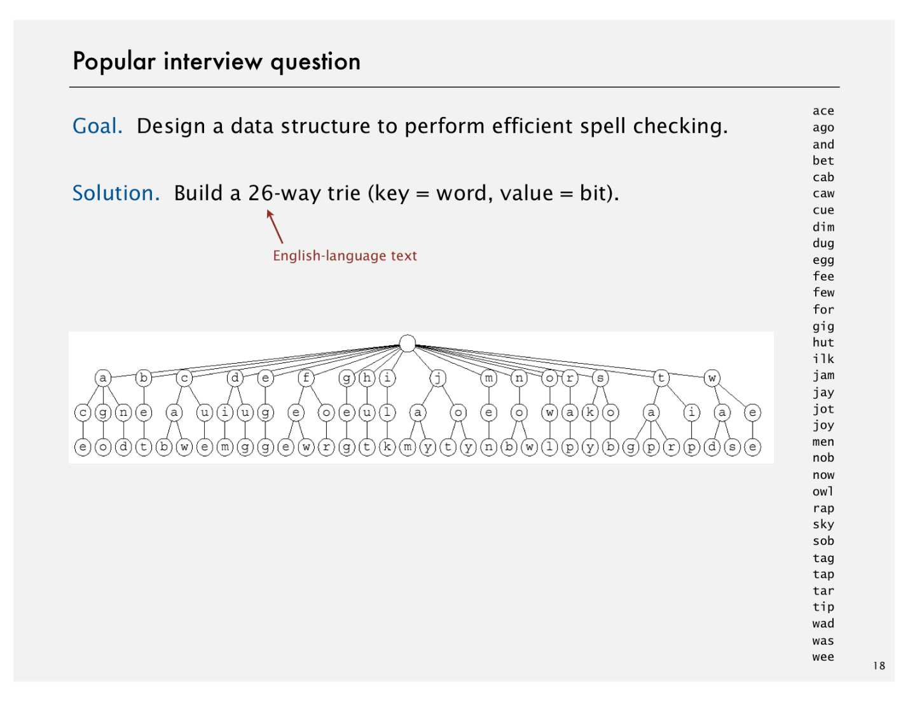

# R-way Tries

Created: 2018-04-10 23:06:14 +0500

Modified: 2018-05-03 23:28:29 +0500

---

![Tries Tries. [from retrieval, but pronounced "try"] • Store characters in nodes (not keys). • Each node has R children, one for each possible characte • For now, we do not draw null links. link to trie for all keys that start with s key by sea b y value 4 6 4 root -.............................+ e 6 s h e o o t h e ](media/R-way-Tries-image1.png){width="6.489583333333333in" height="5.010416666666667in"}

{width="6.489583333333333in" height="5.010416666666667in"}

{width="6.489583333333333in" height="5.010416666666667in"}

{width="6.489583333333333in" height="5.010416666666667in"}

{width="6.489583333333333in" height="5.010416666666667in"}

{width="6.489583333333333in" height="5.010416666666667in"}
{width="6.489583333333333in" height="5.010416666666667in"}

![Trie representation: Java implementation Node. A value, plus references to R nodes. private static class Node private Object val ue; private Node[] next = new Node [R] ; characters are implicitly s use Object insl no generic arr; s h h e 0 defined by link index 2 ](media/R-way-Tries-image8.png){width="6.489583333333333in" height="5.010416666666667in"}

{width="6.489583333333333in" height="5.010416666666667in"}

{width="6.489583333333333in" height="5.010416666666667in"}

{width="6.489583333333333in" height="5.010416666666667in"}

{width="6.489583333333333in" height="5.010416666666667in"}

{width="6.489583333333333in" height="5.010416666666667in"}

{width="6.489583333333333in" height="5.010416666666667in"}

{width="6.489583333333333in" height="5.010416666666667in"}
