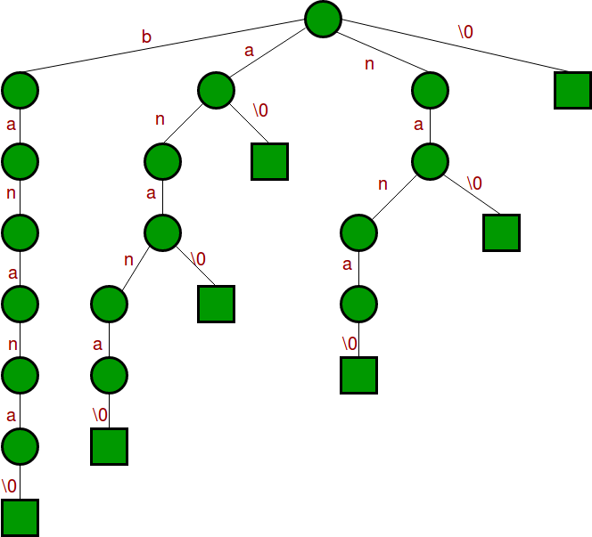
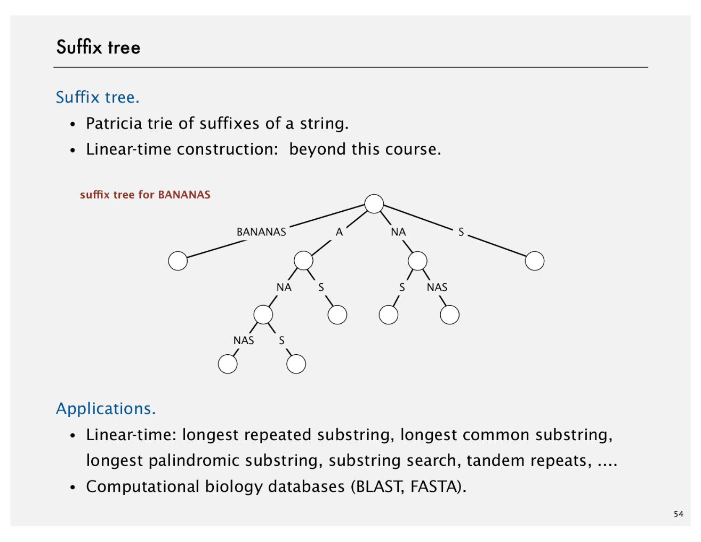

# Suffix Tree

Created: 2018-04-10 22:48:56 +0500

Modified: 2019-12-10 00:10:20 +0500

---

In [computer science](https://en.wikipedia.org/wiki/Computer_science), a suffix tree (also called PAT tree or, in an earlier form, position tree) is a compressed [trie](https://en.wikipedia.org/wiki/Trie) containing all the [suffixes](https://en.wikipedia.org/wiki/Suffix_(computer_science)) of the given text as their keys and positions in the text as their values. Suffix trees allow particularly fast implementations of many important string operations.
The construction of such a tree for the string S takes time and space linear in the length of S. Once constructed, several operations can be performed quickly, for instance locating a [substring](https://en.wikipedia.org/wiki/Substring) in S, locating a substring if a certain number of mistakes are allowed, locating matches for a [regular expression](https://en.wikipedia.org/wiki/Regular_expression) pattern etc. Suffix trees also provide one of the first linear-time solutions for the [longest common substring problem](https://en.wikipedia.org/wiki/Longest_common_substring_problem). These speedups come at a cost: storing a string's suffix tree typically requires significantly more space than storing the string itself.
The suffix tree for the string S of length n is defined as a tree such that:
-   The tree has exactly n leaves numbered from 1 to n.
-   Except for the root, every [internal node](https://en.wikipedia.org/wiki/Tree_(data_structure)#Terminology) has at least two children.
-   Each edge is labelled with a non-empty substring of S.
-   No two edges starting out of a node can have string-labels beginning with the same character.
-   The string obtained by concatenating all the string-labels found on the path from the root to leaf i spells out suffix S[i..n], for i from 1 to n.

Since such a tree does not exist for all strings, S is padded with a terminal symbol not seen in the string (usually denoted $). This ensures that no suffix is a prefix of another, and that there will be n leaf nodes, one for each of the n suffixes of S. Since all internal non-root nodes are branching, there can be at most *n*− 1 such nodes, and *n*+(*n*−1)+1=2*n* nodes in total (*n* leaves, *n*−1 internal non-root nodes, 1 root).

**Generalized Suffix Tree -**

A [generalized suffix tree](https://en.wikipedia.org/wiki/Generalized_suffix_tree) is a suffix tree made for a set of words instead of a single word. It represents all suffixes from this set of words. Each word must be terminated by a different termination symbol or word.
**How to build a Suffix Tree for a given text?**

As discussed above, **Suffix Tree is compressed trie of all suffixes**, so following are very abstract steps to build a suffix tree from given text.

1) Generate all suffixes of given text.

2) Consider all suffixes as individual words and build a compressed trie.

Let us consider an example text "banana0" where '0' is string termination character. Following are all suffixes of "banana0"

banana0
anana0
nana0
ana0
na0
a0
0

If we consider all of the above suffixes as individual words and build a trie, we get following.
{width="5.0in" height="4.53125in"}
If we join chains of single nodes, we get the following compressed trie, which is the Suffix Tree for given text "banana0"

{width="5.0in" height="2.7291666666666665in"}
{width="5.979166666666667in" height="4.614583333333333in"}
# Suffix Tree and Its Construction

Suffix Tree were first introduced to solve SubString Problem -

The substring problem: Pre-process text T so that the computation string matching problem is solved in time proportional to m, the length of pattern P.
Use Case - Performing intensive queries on a big database, which is represented by T. Once the suffix tree for T is built each query is proportional to O(m) time.
Problems -

a.  SME - String Matching Existence problem - Given a pattern P and a text T, determine whether there is an occurance of P in T.

b.  SMC - String Matching Computation problem - Given a pattern P and a text T, determine all the occurance of P in T
# Advanced
-   Ukkonen's Linear Time Algorithm
    -   Implicit's Suffix Tree

An implicit suffix tree for a string S is a tree obtained from T(S$) by performing the following operations:

1. Remove all the terminal symbols $.

2. From the resulting tree, remove all edges without label.

3. Finally, from the resulting tree, remove all nodes that do not have at least two children.
-   Suffix Links
-   Extension Algorithm
-   Edge Label Compression
-   Phase Algorithm
