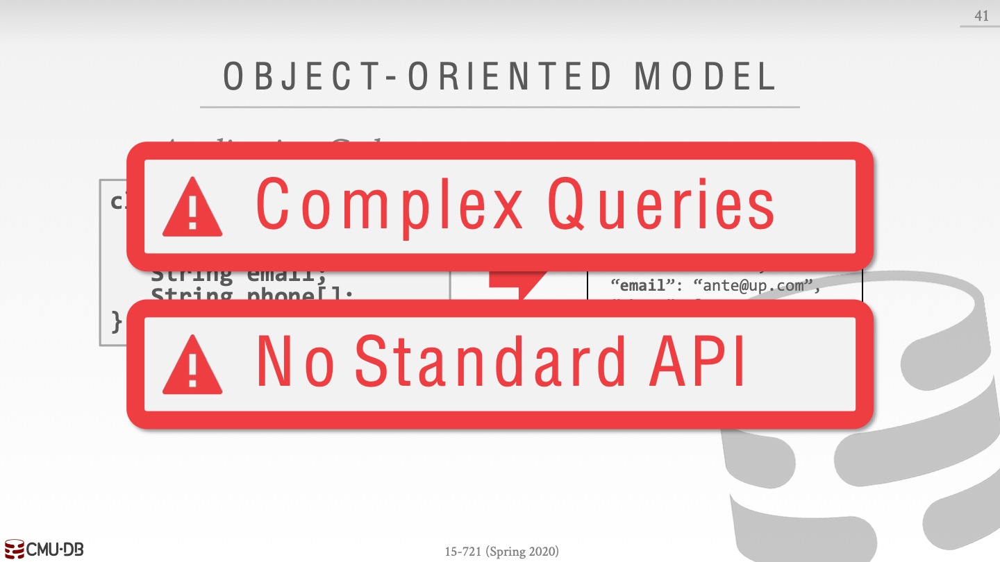
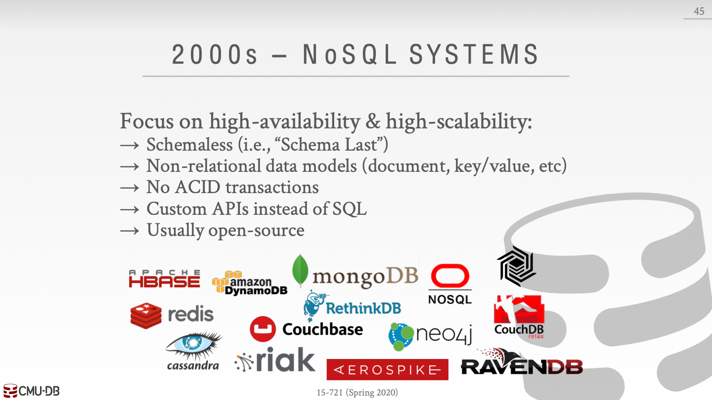
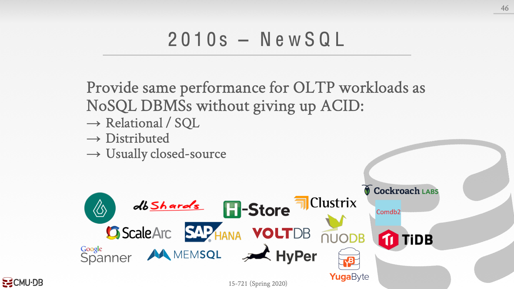
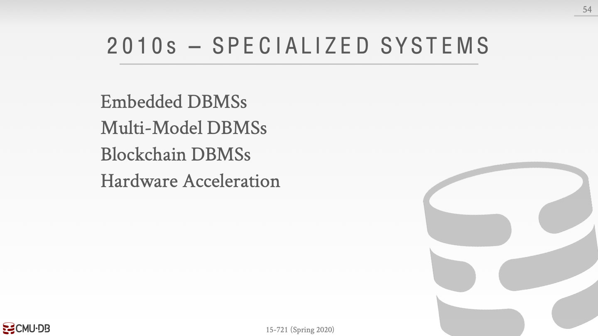
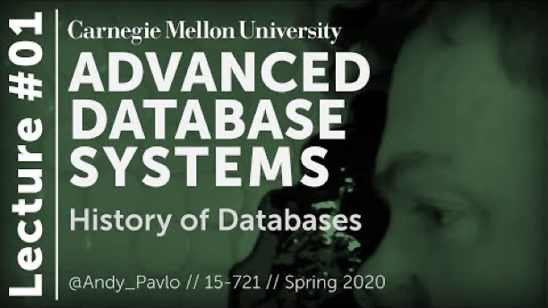

# History

Created: 2020-04-19 16:40:35 +0500

Modified: 2020-08-18 23:26:22 +0500

---

{width="7.479166666666667in" height="4.197916666666667in"}

{width="7.479166666666667in" height="4.197916666666667in"}

![41 OBJECT-ORIENTED MODEL Application Code class Student { int id; String name; String email; String phone[]; Relational Schema STUDENT (id, name, email) STUDENT PHONE (Sid, phone) id 1001 ±CMU.DB name m.O.p. email ante@up.com Sid leel leel phone 444-444-4444 555-555-5555 15-721 (spring 2020) ](media/History-image3.png){width="7.479166666666667in" height="4.197916666666667in"}

![41 OBJECT-ORIENTED MODEL Application Code class Student { int id; String name; String email; String phone[]; ±CMU.DB Student "id": leøl, "name": "M.O.P." "email": "ante@u 4444" , "555-5 -5555" 15-721 (spring 2020) ](media/History-image4.png){width="7.479166666666667in" height="4.197916666666667in"}

{width="7.479166666666667in" height="4.197916666666667in"}

{width="7.479166666666667in" height="4.197916666666667in"}

{width="7.479166666666667in" height="4.197916666666667in"}

{width="7.479166666666667in" height="4.197916666666667in"}

{width="7.479166666666667in" height="4.197916666666667in"}

{width="7.479166666666667in" height="4.197916666666667in"}

{width="7.479166666666667in" height="4.197916666666667in"}

{width="7.479166666666667in" height="4.197916666666667in"}

{width="7.479166666666667in" height="4.197916666666667in"}

{width="7.479166666666667in" height="4.197916666666667in"}

{width="7.479166666666667in" height="4.197916666666667in"}

{width="7.479166666666667in" height="4.197916666666667in"}
[01 - History of Databases (CMU Databases / Spring 2020)](https://www.youtube.com/watch?v=SdW5RKUboKc)
{width="5.0in" height="2.8020833333333335in"}