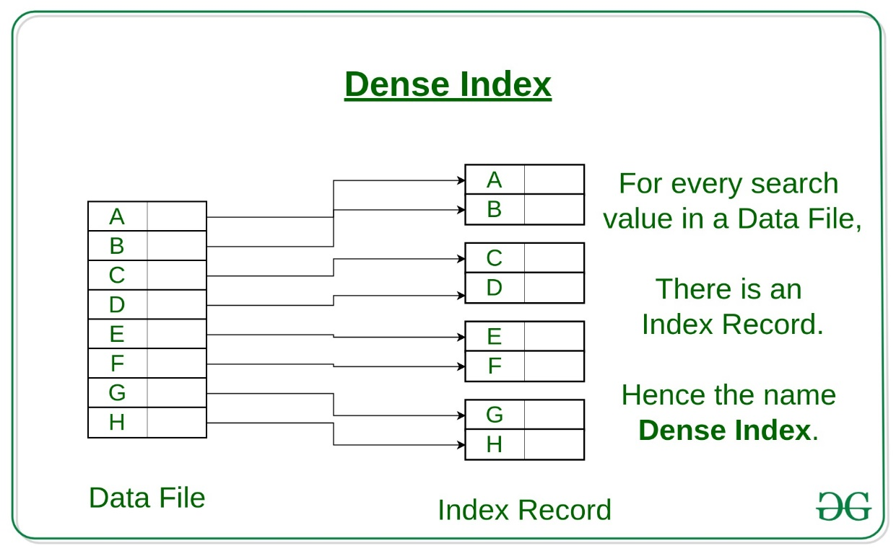
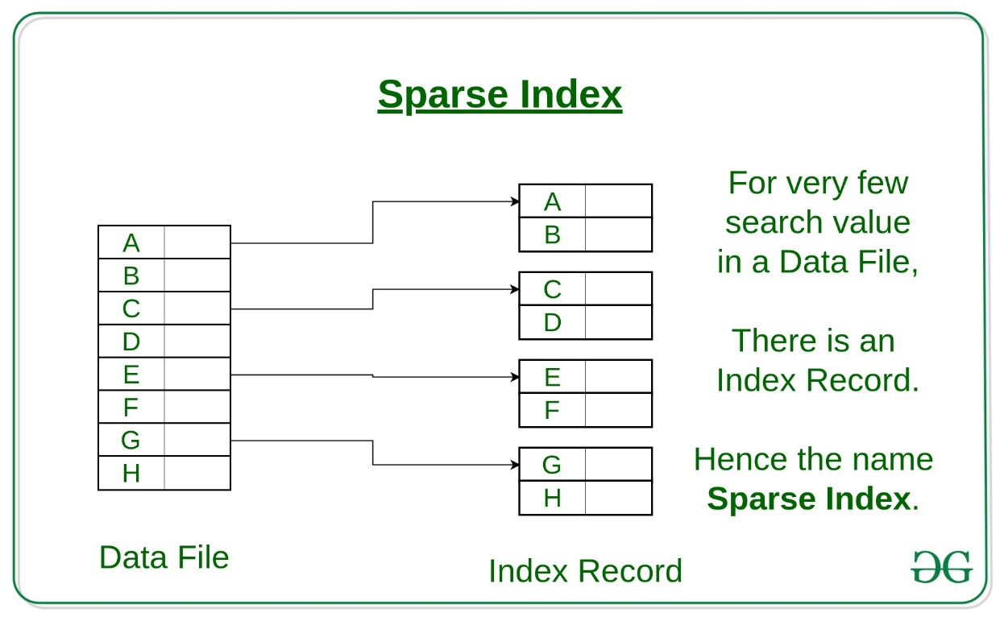
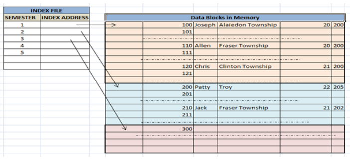
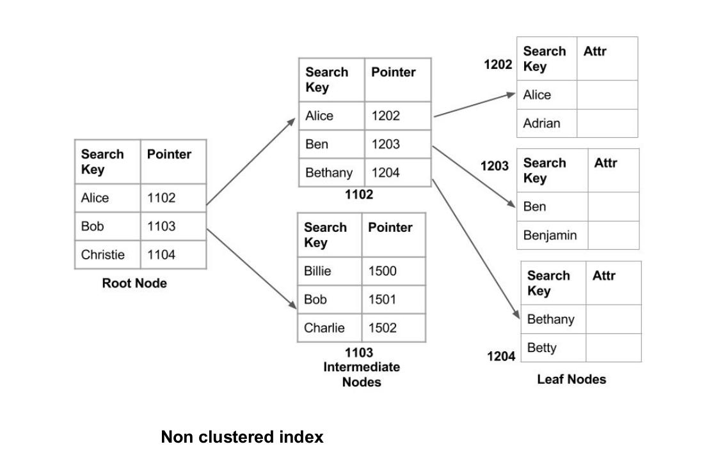
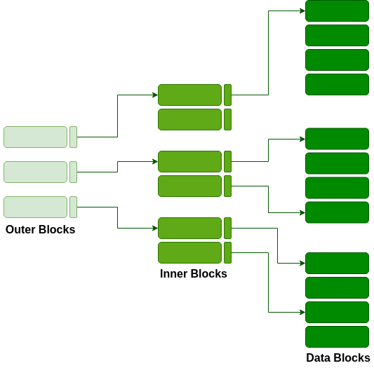

# Indexing

Indexing is a data structure technique to efficiently retrieve records from the database files based on some attributes on which the indexing has been done. Indexing in database systems is similar to what we see in books - Table of contents.
Indexing is a way to optimize the performance of a database by minimizing the number of disk accesses required when a query is processed. It is a data structure technique which is used to quickly locate and access the data in a database.

## Benefits

- Prevent queries from doing full scans of an entire dataset
- Access less and therefore lock less rows during queries
- Speed up queries drastically
- Prevent sorting records post fetching
- Impose constraints e.g. data uniqueness
- Join datasets efficiently

## Common problems that surface when applying indexes are

- Having an index for every column in the table
- Not utilizing composite (multicolumn) indexes
- Using composite indexes but with ineffective column orderings that prevent the index being fully utilized
- Creating indexes based on rules of thumb or heuristics, such as indexing all columns that appear in the WHERE clause

## Indexes are created using a few database columns

- The first column is the**Search key** that contains a copy of the primary key or candidate key of the table. These values are stored in sorted order so that the corresponding data can be accessed quickly.
    Note: The data may or may not be stored in sorted order.-  The second column is the**Data ReferenceorPointer** which contains a set of pointers holding the address of the disk block where that particular key value can be found.

The indexing has various attributes:

- **Access Types:** This refers to the type of access such as value based search, range access, etc.
- **Access Time:** It refers to the time needed to find particular data element or set of elements.
- **Insertion Time:** It refers to the time taken to find the appropriate space and insert a new data.
- **Deletion Time:** Time taken to find an item and delete it as well as update the index structure.
- **Space Overhead:** It refers to the additional space required by the index.
Indexing is defined based on its indexing attributes. Indexing can be of the following types
- **Primary Index**

Primary index is defined on an ordered data file. The data file is ordered on akey field. The key field is generally the primary key of the relation.-  **Secondary Index**

Secondary index may be generated from a field which is a candidate key and has a unique value in every record, or a non-key with duplicate values.-  **Clustering Index**

Clustering index is defined on an ordered data file. The data file is ordered on a non-key field.
In general, there are two types of file organization mechanism which are followed by the indexing methods to store the data:

1. **Sequential File Organization or Ordered Index File:**In this, the indices are based on a sorted ordering of the values. These are generally fast and a more traditional type of storing mechanism. These Ordered or Sequential file organization might store the data in a dense or sparse format:
    - **Dense Index:**
        - In dense index, there is an index record for every search key value in the database. This makes searching faster but requires more space to store index records itself. Index records contain search key value and a pointer to the actual record on the disk.
        - For every search key value in the data file, there is an index record.
        - This record contains the search key and also a reference to the first data record with that search key value.

- **Sparse Index:**
  - In sparse index, index records are not created for every search key. An index record here contains a search key and an actual pointer to the data on the disk. To search a record, we first proceed by index record and reach at the actual location of the data. If the data we are looking for is not where we directly reach by following the index, then the system starts sequential search until the desired data is found.
  - The index record appears only for a few items in the data file. Each item points to a block as shown.
  - To locate a record, we find the index record with the largest search key value less than or equal to the search key value we are looking for.
  - We start at that record pointed to by the index record, and proceed along with the pointers in the file (that is, sequentially) until we find the desired record.

2. **Hash File organization:**Indices are based on the values being distributed uniformly across a range of buckets. The buckets to which a value is assigned is determined by a function called a hash function.
There are primarily three methods of indexing:

- Clustered Indexing
- Non-Clustered or Secondary Indexing
- Multilevel Indexing

1. **Clustered Indexing**

Aclustered indexis collocated with the data in the same table space or same disk file. You can consider that a clustered index is aB-Treeindex whose leaf nodes are the actual data blocks on disk, since the index & data reside together. This kind of index physically organizes the data on disk as per the logical order of the index key.
When more than two records are stored in the same file these types of storing known as cluster indexing. By using the cluster indexing we can reduce the cost of searching reason being multiple records related to the same thing are stored at one place and it also gives the frequent joining of more than two tables(records).

Clustering index is defined on an ordered data file. The data file is ordered on a non-key field. In some cases, the index is created on non-primary key columns which may not be unique for each record. In such cases, in order to identify the records faster, we will group two or more columns together to get the unique values and create index out of them. This method is known as the clustering index. Basically, records with similar characteristics are grouped together and indexes are created for these groups.

For example, students studying in each semester are grouped together. i.e. 1stSemester students, 2ndsemester students, 3rdsemester students etc are grouped.

Clustered index sorted according to first name (Search key)

## Primary Indexing

This is a type of Clustered Indexing wherein the data is sorted according to the search key and the primary key of the database table is used to create the index. It is a default format of indexing where it induces sequential file organization. As primary keys are unique and are stored in a sorted manner, the performance of the searching operation is quite efficient.
2. **Non-clustered or Secondary Indexing**
    A non clustered index just tells us where the data lies, i.e. it gives us a list of virtual pointers or references to the location where the data is actually stored. Data is not physically stored in the order of the index. Instead, data is present in leaf nodes. For eg. the contents page of a book. Each entry gives us the page number or location of the information stored. The actual data here(information on each page of the book) is not organized but we have an ordered reference(contents page) to where the data points actually lie. We can have only dense ordering in the non-clustered index as sparse ordering is not possible because data is not physically organized accordingly.
    It requires more time as compared to the clustered index because some amount of extra work is done in order to extract the data by further following the pointer. In the case of a clustered index, data is directly present in front of the index.

3. **Multilevel Indexing**
    With the growth of the size of the database, indices also grow. As the index is stored in the main memory, a single-level index might become too large a size to store with multiple disk accesses. The multilevel indexing segregates the main block into various smaller blocks so that the same can be stored in a single block. The outer blocks are divided into inner blocks which in turn are pointed to the data blocks. This can be easily stored in the main memory with fewer overheads.

Index records comprise search-key values and data pointers. Multilevel index is stored on the disk along with the actual database files. As the size of the database grows, so does the size of the indices. There is an immense need to keep the index records in the main memory so as to speed up the search operations. If single-level index is used, then a large size index cannot be kept in memory which leads to multiple disk accesses.

Multi-level Index helps in breaking down the index into several smaller indices in order to make the outermost level so small that it can be saved in a single disk block, which can easily be accommodated anywhere in the main memory.
<https://www.geeksforgeeks.org/indexing-in-databases-set-1>

<https://www.tutorialspoint.com/dbms/dbms_indexing.htm>
<https://www.toptal.com/database/sql-indexes-explained-pt-1>
With a clustered index the rows are stored physically on the disk in the same order as the index. Therefore, there can be only one clustered index.
With a non clustered index there is a second list that has pointers to the physical rows. You can have many non clustered indices, although each new index will increase the time it takes to write new records.
It is generally faster to read from a clustered index if you want to get back all the columns. You do not have to go first to the index and then to the table.
Writing to a table with a clustered index can be slower, if there is a need to rearrange the data.
<https://stackoverflow.com/questions/1251636/what-do-clustered-and-non-clustered-index-actually-mean>

## KEY is the synonym for INDEX . You use the KEY when you want to create an index for a column or a set of columns that is not the part of aprimary keyorunique key. AUNIQUEindex ensures that values in a column must beunique. Unlike the PRIMARY index, MySQL allows NULL values in theUNIQUEindex

Key is synonymous to an index. If you want to create an index for a column, then use 'Key'.
<https://www.mysqltutorial.org/mysql-primary-key>

## Cardinality

Index cardinality refers to the uniqueness of values stored in a specified column within an index.
MySQL generates the index cardinality based on statistics stored as integers, therefore, the value may not be necessarily exact.
The query optimizer uses the index cardinality to generate an optimal query plan for a given query. It also uses the index cardinality to decide whether to use the index or not in the [join](https://www.mysqltutorial.org/mysql-join/) operations.

If the query optimizer chooses the index with a low cardinality, it may be more effective than scan rows without using the index.
Do not reverse the order of the columns. You should always index lower cardinality columns first.

- statehas 22
- sourcehas 1122

That being the case, you need to run the following

ALTER TABLE tbl DROP INDEX state;
ALTER TABLE tbl ADD INDEX state_source_index (state, source);
<https://dba.stackexchange.com/questions/63047/why-is-mysql-not-using-the-index-with-the-higher-cardinality>
Index selectivity is the ratio of the number of distinct indexed values (the ​cardinality) to the total number of rows in the table (#T).

- It ranges from 1/#T to 1. A unique index has a selectivity of 1, which is as good as it gets.
- Using the phonebook example: an index of(first_name, last_name)might be less effective than(last_name, first_name)because first names are much less distinct when compared to last_names, meaning it narrow down less results.

## Why low cardinality indexes negatively impact performance

<https://www.ibm.com/developerworks/data/library/techarticle/dm-1309cardinal>
