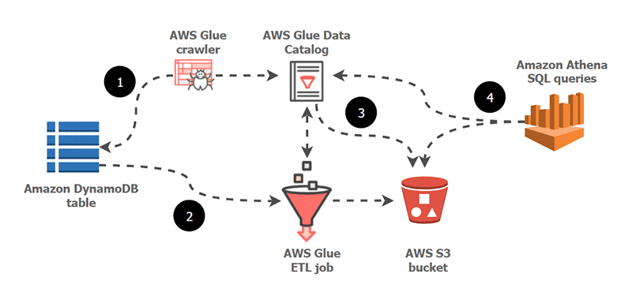

# Documentation

Created: 2020-02-17 11:04:04 +0500

Modified: 2020-03-12 23:30:03 +0500

---

<https://docs.aws.amazon.com/amazondynamodb/latest/developerguide/Introduction.html>
**Partitions & Data Distribution**

<https://docs.aws.amazon.com/amazondynamodb/latest/developerguide/HowItWorks.Partitions.html>
**Best Practices > Partition key design**

The primary key that uniquely identifies each item in an Amazon DynamoDB table can be simple (a partition key only) or composite (a partition key combined with a sort key).
Generally speaking, you should design your application for uniform activity across all logical partition keys in the table and its secondary indexes. You can determine the access patterns that your application requires, and estimate the total read capacity units (RCU) and write capacity units (WCU) that each table and secondary index requires.
<https://docs.aws.amazon.com/amazondynamodb/latest/developerguide/bp-partition-key-design.html>
**Appendix**

Integrating with Amazon Data Pipeline

<https://docs.aws.amazon.com/amazondynamodb/latest/developerguide/DynamoDBPipeline.html>
**Blogs**

Simplify Amazon DynamoDB data extraction and analysis by using AWS Glue and Amazon Athena

{width="5.0in" height="2.4270833333333335in"}

<https://aws.amazon.com/blogs/database/simplify-amazon-dynamodb-data-extraction-and-analysis-by-using-aws-glue-and-amazon-athena/>

[**https://aws.amazon.com/blogs/big-data/how-to-export-an-amazon-dynamodb-table-to-amazon-s3-using-aws-step-functions-and-aws-glue/**](https://aws.amazon.com/blogs/big-data/how-to-export-an-amazon-dynamodb-table-to-amazon-s3-using-aws-step-functions-and-aws-glue/)

