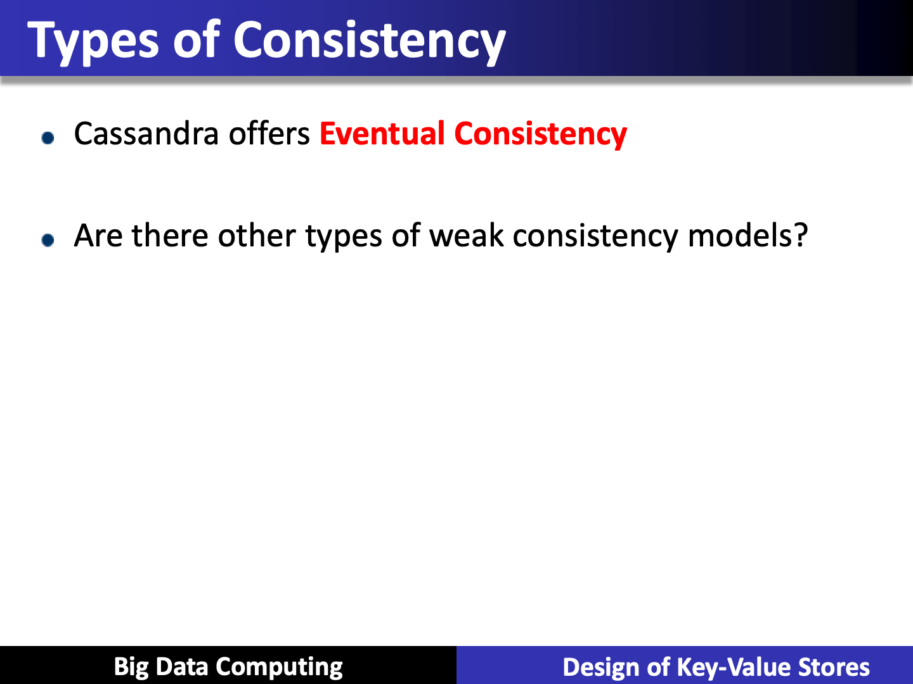

# Consistency

Created: 2019-04-21 13:17:45 +0500

Modified: 2019-12-30 16:06:43 +0500

---

**ANY**
-   any server (may not be replica)
-   Fastest: coordinator caches write and replies quickly to client

**ALL**
-   all replicas
-   Ensures strong consistency, but slowest

**ONE**
-   at least one replica
-   Faster than ALL, but cannot tolerate a failure

**QUORUM**
-   quorum across all replicas in all datacenters
-   Majority > 50%
-   Quorums faster than ALL, but still ensure strong consistency
-   Several key-value/NoSQL stores (e.g., Riak and Cassandra) use quorums

![Cassandra Consistency Levels (Contd.) • Client is allowed to choose a consistency level for each operation (read/write) ANY: any server (may not be replica) • Fastest: coordinator may cache write and reply quickly to client ALL: all replicas • Slowest, but ensures strong consistency ONE: at least one replica • Faster than ALL, and ensures durability without failures QUORUM: quorum across all replicas in all datacenters (DCs) • Global consistency, but still fast • LOCAL QUORUM: quorum in coordinator's DC • Faster: only waits for quorum in first DC client contacts • EACH_QUORUM: quorum in every DC • Lets each DC do its own quorum: supports hierarchical replies Big Data Computing Design of Key-Value Stores ](media/Cassandra_Consistency-image4.png)

