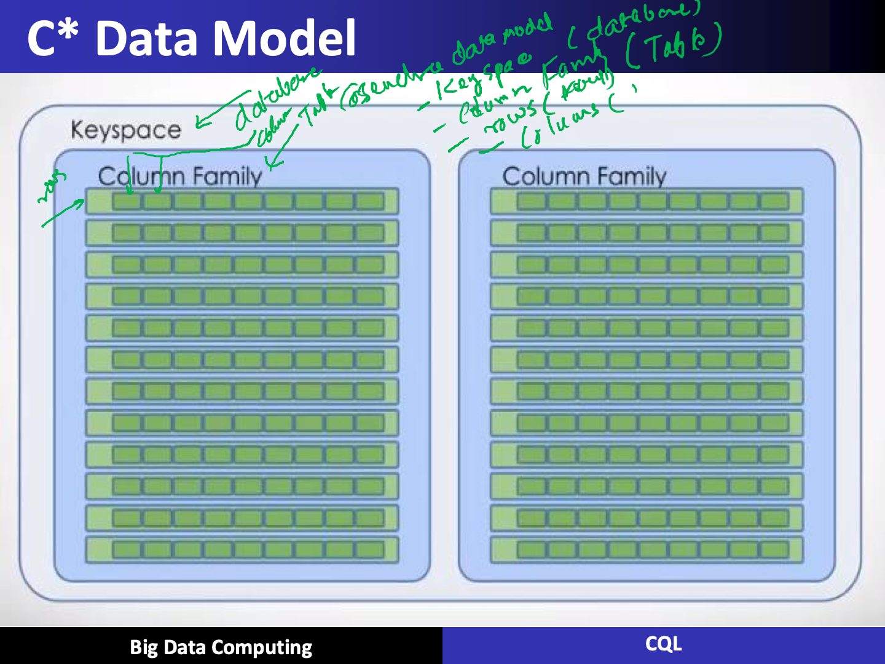
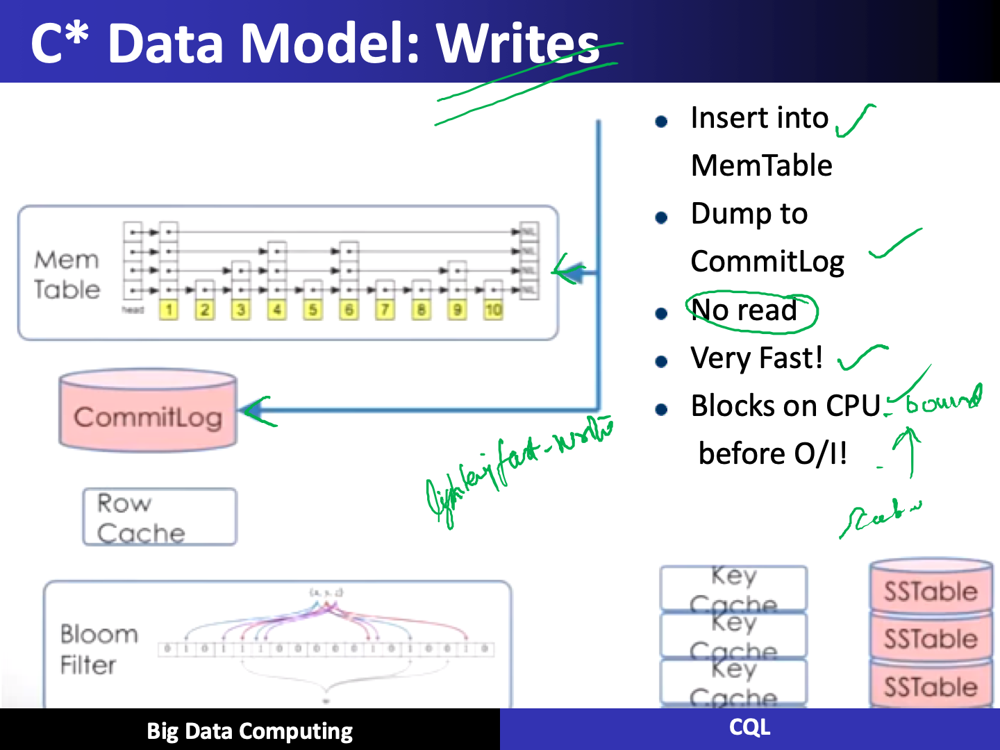

# Data Model

Created: 2019-12-27 19:18:38 +0500

Modified: 2020-01-07 22:00:50 +0500

---
-   **Partition Key**
-   **Clustering Key**
**Querying Clustering Columns**
-   You must first provide a partition key
-   Clustering columns can follow thereafter
-   You can perform either equality (=) or range queries (<, >) on clustering columns
-   All equality comparisions must come before inequality comparisions
-   Since data is sorted on disk, range searches are a binary search followed by a linear read
{width="7.479166666666667in" height="5.604166666666667in"}

{width="7.479166666666667in" height="5.604166666666667in"}

{width="7.479166666666667in" height="5.604166666666667in"}

{width="7.479166666666667in" height="5.604166666666667in"}

{width="7.479166666666667in" height="5.604166666666667in"}
**Bucketing**

Bucketing is a strategy that lets us control how much data is stored in each partition as well as spread writes out to the entire cluster.
To break up this big partition, we'll leverage our first form of bucketing. We'll break our partitions into smaller ones based on time window. The ideal size is going to keep partitions under 100MB. For example, one partition per sensor per day would be a good choice if we're storing 50-75MB of data per day. We could just as easily use week (starting from some epoch), or month and year as long as the partitions stay under 100MB. Whatever the choice, leaving a little headroom for growth is a good idea.
A variation on this technique is to use a different table per time window. For instance, using a table per month means you'd have twelve tables per year
This strategy has a primary benefit of being useful for archiving and quickly dropping old data. For instance, at the beginning of each month, we could archive last month's data to HDFS or S3 in parquet format, taking advantage of cheap storage for analytics purposes. When we don't need the data in Cassandra anymore, we can simply drop the table. You can probably see there's a bit of extra maintenance around creating and removing tables, so this method is really only useful if archiving is a requirement. There are other methods to archive data as well, so this style of bucketing may be unnecessary.
The second technique uses multiple partitions at any given time to fan out inserts to the entire cluster. The nice part about this strategy is we can use a single partition for low volume, and many partitions for high volume.
<https://thelastpickle.com/blog/2017/08/02/time-series-data-modeling-massive-scale.html>
**Others**

<https://shermandigital.com/blog/designing-a-cassandra-data-model/>