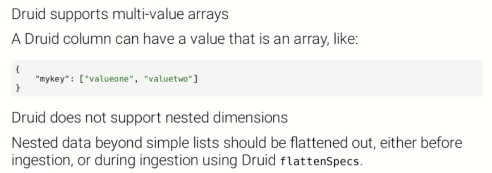
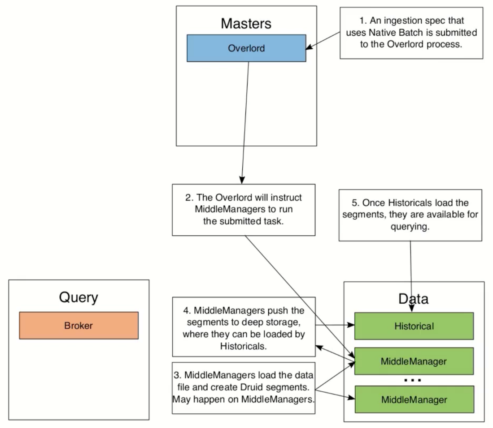
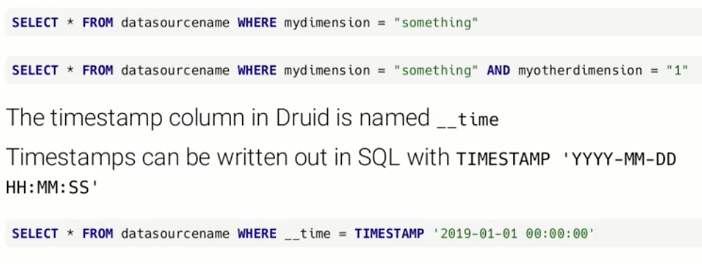
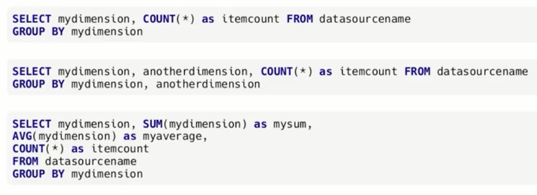
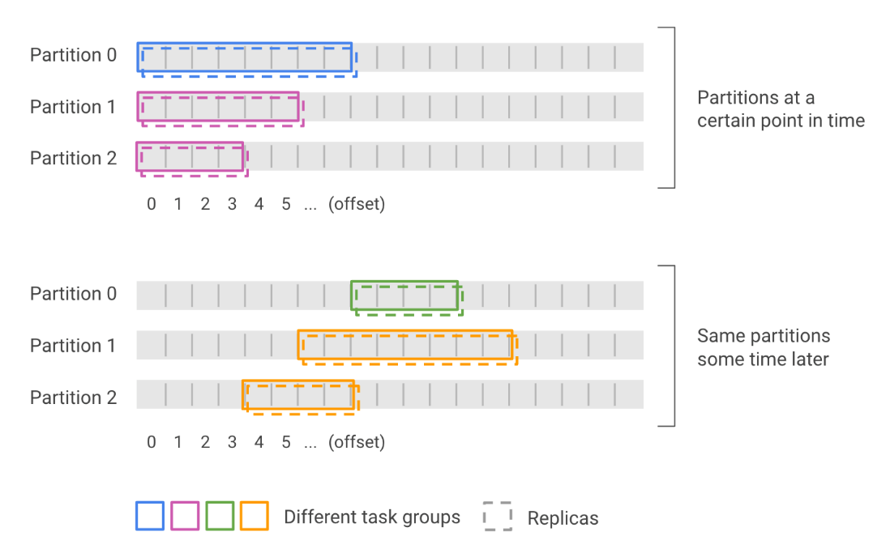
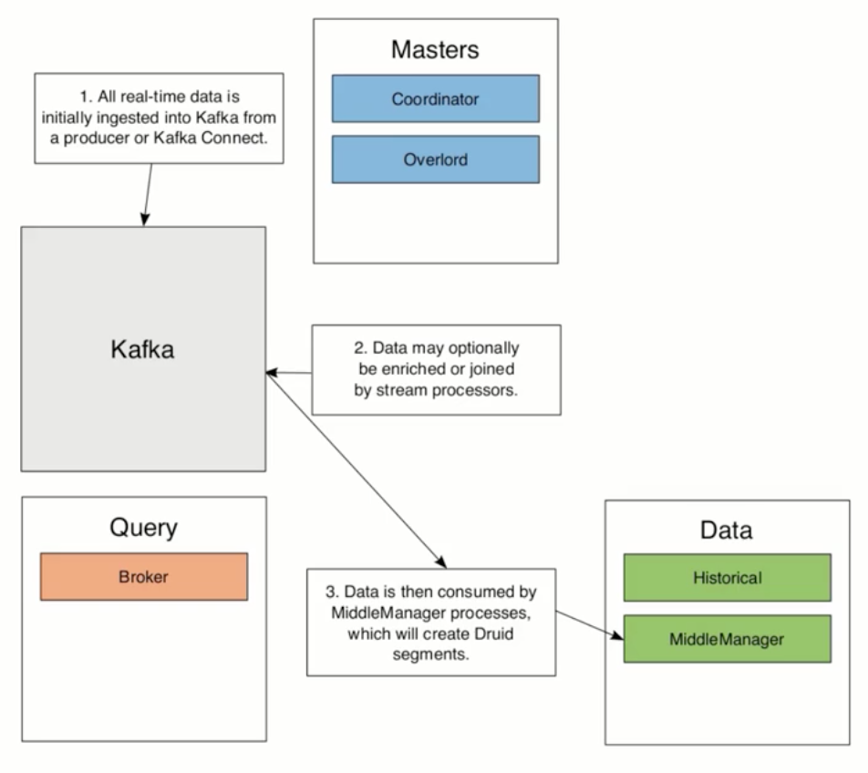

# Druid

Created: 2019-02-06 11:04:11 +0500

Modified: 2021-01-29 02:06:32 +0500

---

Apache Druid (incubating) is a real-time analytics database designed for fast slice-and-dice analytics ("[OLAP](http://en.wikipedia.org/wiki/Online_analytical_processing)" queries) on large data sets. Druid is most often used as a database for powering use cases where real-time ingest, fast query performance, and high uptime are important. As such, Druid is commonly used for powering GUIs of analytical applications, or as a backend for highly-concurrent APIs that need fast aggregations. Druid works best with event-oriented data.-  **High performance, column oriented, distributed data store**

- Druid is primarily used to store, query, and analyze large event streams
- Druid is optimized for sub-second queries to slice-and-dice, drill down, search, filter, and aggregate this data. Druid is commonly used to power interactive applications where performance, concurrency, and uptime are important.

## Features

- Column-oriented storage
- Native search indexes

Druid uses [CONCISE](https://arxiv.org/pdf/1004.0403) or [Roaring](https://roaringbitmap.org/) compressed bitmap indexes to create indexes that power fast filtering and searching across multiple columns.

- Scalable distributed system
- Massively parallel processing
- Streaming and batch ingest
- Self-healing, self-balancing, easy to operate

As an operator, to scale the cluster out or in, simply add or remove servers and the cluster will rebalance itself automatically, in the background, without any downtime. If any Druid servers fail, the system will automatically route around the damage until those servers can be replaced. Druid is designed to run 24/7 with no need for planned downtimes for any reason, including configuration changes and software updates.

- Cloud-native, fault-tolerant architecture that won't lose data

Once Druid has ingested your data, a copy is stored safely in [deep storage](http://druid.io/docs/latest/design/index.html#deep-storage)(typically cloud storage, HDFS, or a shared filesystem). Your data can be recovered from deep storage even if every single Druid server fails. For more limited failures affecting just a few Druid servers, replication ensures that queries are still possible while the system recovers.

- Approximation algorithms
- Automatic summarization at ingest time
- Flexible schemas
- Time-optimized partitioning
- SQL support
- Horizontally scalable

## Applications

- Clickstream analytics
- Network telemetry analytics (network performance monitoring)
- Server metrics storage
- Supply chain analytics (manufacturing metrics)
- Application performance metrics
- Digital marketing/advertising analytics
- Business intelligence / OLAP

## Druid Important Points

Druid does not natively support nested data, so, we need to flatten arrays in our JSON events by providing a [flattenspec](https://druid.apache.org/docs/latest/ingestion/index.html#flattenspec), or by doing some preprocessing before the event lands in it.
Druid assigns types to columns --- string, long, float, complex, etc. The type enforcement at the column level can be restrictive if the incoming data presents with mixed types for a particular field/fields. Each column except the timestamp can be of type dimension or metric.
One can filter and group by on dimension columns, but not on metric columns. This needs some forethought when picking which columns to pre-aggregate and which ones will be used for slice-and-dice analyses.
Partition keys must be picked carefully for load-balancing and scaling up. Streaming new updates to the table after creation requires using one of the [supported ways of ingesting](https://druid.apache.org/docs/latest/ingestion/index.html#streaming)--- Kafka, Kinesis, or Tranquility.
Druid works well for event analytics in environments where data is somewhat predictable and rollups and pre-aggregations can be defined a priori. It involves some maintenance and tuning overhead in terms of engineering, but for event analytics that doesn't involve complex joins, it can serve queries with low latency and scale up as required.
Druid is fundamentally a column store, and is designed for analytical queries (GROUPBYs with complex WHERE clauses) that need to scan across multiple partitions. Druid stores its index in [segment files](http://druid.io/docs/latest/design/segments.html), which are partitioned by time. Segment files are columnar, with the data for each column laid out in **separate data structures**. By storing each column separately, Druid can decrease query latency by scanning only those columns that are required for a query. There are different column types for different data types (string, numbers, etc.). Different columns can have different encoding and compression algorithms applied. For example, string columns will be dictionary encoded, LZF compressed, and have search indexes created for faster filtering. Numeric columns will have completely different compression and encoding algorithms applied. Druid segments are immutable once finalized, so updates in Druid have limitations. Although more recent versions of Druid have added "lookups", or the ability to join a mutable table external to Druid with an immutable one in Druid, I would not recommend Druid for any workflows where the same underlying data is frequently updated and those updates need to complete in less than a second (say, powering a social media profile page). Druid supports bulk updates, which are more commonly seen with analytic workloads.

## Druid File Format

## Segments

- Datasources are broken into files called segments
- Segments are grouped into time chunks and potentially, further partitioned at creation time
  - This allows Druid to parallelize ingestion and querying of data
- Segments are immutable
  - Each segment is versioned to allow new versions to replace old versions
  - This can be done as a background task without blocking queries
- Druid segments have their own file format
- The file format is columnar
  - Data is laid out into columns and each column is packed and compressed individually
  - String columns are dictionary encoded instead of having the full string value in every row
  - Numeric columns use various kinds of numeric compression based on the data
- Columnar formats are the standard for analytical workloads due to superior scan performance
- String columns in Druid are indexed with bitmap indexes
- Columns are further compressed with general-purpose algorithms like LZ4 (Lossless compression)
- Example

- This on-disk format has several benefits:
  - Filtering if a domain exists require reading less data
  - Compression of like data performs better than a row-oriented format
  - Druid only needs to read the columns involved in a query, eliminating extraneous fetches from disk and memory
- 

## Druid Data Modelling

- Designing a data model for Druid is different than a RDBMS
- Most RDBMS design focuses on normalization
  - Each piece of data should only appear once in the database
- Databases like Druid favor some denormalization
  - Each piece of data may appear many different times in the database
- Druid favors denormalized data because this is faster than doing a join with another large table
  - Flat schemas increase performance by allowing Druid to operate directly on compressed dictionary-encoded data
- When designing a table, you must
  - Choose the datasource name
  - The source for the input data
  - The columns you want to store-  **Columns**
- Creating a data model is more than just copying the table structure of a RDBMS table
- When transitioning from a RDBMS, you will need to choose
  - Which columns should be included
  - Which types to use for each column (Druid doesn't support all RDBMS types)
  - Whether you will be totally flattening your tables, or using Druid's query-time lookups to partially normalize data
- In Druid, columns will become
  - Dimensions (stored as-is)
  - Metrics (partially aggregated)
- **Supported Types**

- **Multi-value and Nested Dimensions**

- **Druid Native Batch**
  - Native batch is a built-in way to index data in Druid
  - Native batch ingestion is useful when you have a file that you want to load into Druid
  - There has to be a method to convert your file to Druid's file format and make segments (Native batch performs this conversion)
  - Druid also supports batching ingestion with Hadoop
  - **Native Batch Architecture**

- **Druid SQL Query API**
  - Data stored in Druid can be queried with a SQL API
  - These calls go over a HTTP REST API
    - The payload of the REST call is JSON
    - The query results come back as JSON or CSV
  - Not every SQL feature is supported
  - The query engine is implemented with Apache Calcite
  - The SQL queries are translated into Druid's native queries
  - There is a native JSON query API available too
    - The SQL API is virtually at parity with the JSON and is easier to use
  - Where clauses

- Limiting

- Group By Query

## Druid kafka ingestion

<http://druid.io/docs/latest/development/extensions-core/kafka-ingestion.html>

<http://druid.io/docs/latest/tutorials/tutorial-kafka.html>

## Kafka Indexing Service - Exactly once ingestion

<https://imply.io/post/exactly-once-streaming-ingestion>

## References

<http://druid.io/docs/latest/design/index.html>
<https://medium.com/@leventov/the-problems-with-druid-at-large-scale-and-high-load-part-1-714d475e84c9>

<https://medium.com/@leventov/the-challenges-of-running-druid-at-large-scale-and-future-directions-part-2-ef594ce298f2>
<https://druid.apache.org/docs/latest/ingestion/data-management.html>
<https://imply.io/druid-university/intro-to-druid-university>

## Imply Druid

- tiered data
- data volumes-  Plywood
  - queries
  - expressions
- Pivot - alerts
- Measures
- Roll up
- Virtual columns (middle manager)
- Clarity
- Imply Manager

## Others

- Ingestion Spec can handle flattening of schema
- Primary partition keys
- Secondary partition keys
- 2 threads in middlemanager can handle 25 GB/hour of ingestion (2 HyperThreads per task)
- Per tasks per partition ingest from Kafka
- Segment scan rate
  - 4 GB/s/HT for data sitting in RAM
  - 0.5 GB/s/HT for data sitting in disk
- Druid is not good for computing moving averages
- No ML library in Druid
- Duplicate data removal using HyperLogLog- <https://cleanprogrammer.net/getting-unique-counts-from-druid-using-hyperloglog>
- Druid not build for historical storage
- MiddleManager creates segments, and then put it in deep storage, Historical pulls data from deep storage, create segment cache and serves it. Local Cache is there until the retention policy.
- Middle manager will skip the data if it's not in the right format. There's no way

to know which data was skipped.

## Ingestion spec tuning

1. Task duration - 60 minutes (PT60M) (current - 5 minutes)

2. Task completion time - 60 minutes (current - 5 minutes)

3. Segment size - 5 Million

4. Segment granularity - 1 day/1hour (current - 1 hour)

5. Handoff period - currently too large (tune it)
