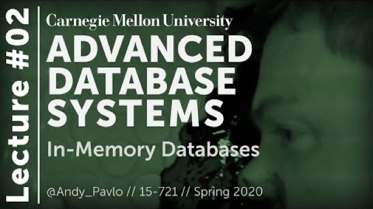

# Course - Advanced Database Systems

Created: 2020-04-19 23:43:01 +0500

Modified: 2020-04-26 00:23:08 +0500

---

1.  Course Introduction and History of Databases

2.  In-Memory Databases

3.  Multi-Version Concurrency Control (Design Decisions)

4.  Multi-Version Concurrency Control (Protocols)

5.  Multi-Version Concurrency Control (Garbage Collection)

6.  OLTP Indexes (B+Tree Data Structures)

7.  OLTP Indexes (Trie Data Structures)

8.  Storage Models, Data Layout, & System Catalogs

9.  Database Compression

10. Recovery Protocols

11. Networking Protocols

12. Scheduling

13. Query Execution & Processing

14. Query Compilation

15. Vectorized Execution

16. Vectorization vs. Compilation

17. Parallel Join Algorithms (Hashing)

18. Parallel Join Algorithms (Sorting)

19. Optimizer Implementation (Overview)

20. Optimizer Implementation (Top-Down vs. Bottom-Up)

21. Optimizer Implementation (Alternative Approaches)

22. Cost Models

23. Larger-than-Memory Databases

24. Server-side Logic Execution

25. Databases on New Hardware
**Query Optimizer**

Building a really good query optimizer and query execution system in a distributed database system is hard. It requires a number of sophisticated components including statistics, cardinality estimation, plan space search, the right storage structures, fast query execution operators, intelligent shuffle, both broadcast and point-to-point data transmission, and more.
[15-721 Advanced Database Systems (Spring 2020)](https://www.youtube.com/playlist?list=PLSE8ODhjZXjasmrEd2_Yi1deeE360zv5O)

