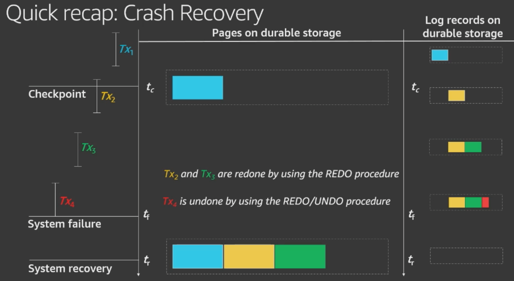
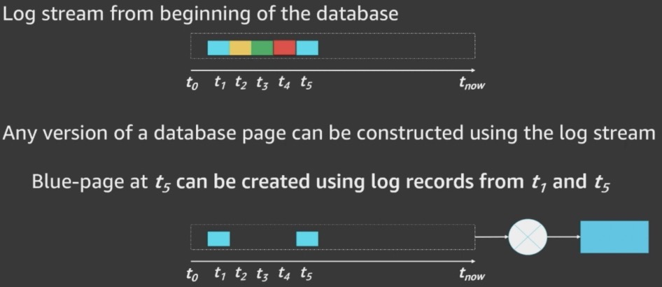
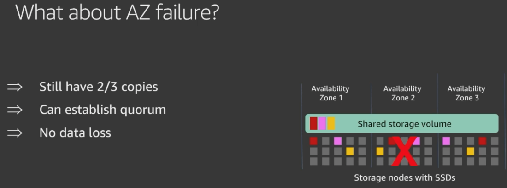
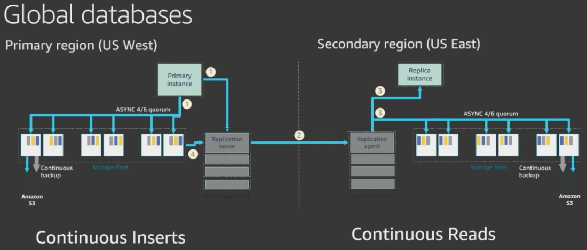

# Storage

Created: 2020-02-25 17:47:33 +0500

Modified: 2022-11-18 16:12:39 +0500

---

[AWS re:Invent 2019: [REPEAT 1] Amazon Aurora storage demystified: How it all works (DAT309-R1)](https://www.youtube.com/watch?v=DrtwAOND1Pc)

**Cost**

| Storage Rate | $0.11per GB-month           |
|--------------|-------------------------------|
| I/O Rate     | $0.22per 1 million requests |

S3 - $0.025per GB

**Storage**

The minimumstorageis 10GB. Based on yourdatabaseusage, your AmazonAurora storagewill automatically grow, up to 64 TB, in 10GB increments with no impact todatabaseperformance. There is no need to provisionstoragein advance

{width="5.0in" height="2.75in"}

{width="5.0in" height="2.9166666666666665in"}

{width="5.0in" height="2.7395833333333335in"}

{width="5.0in" height="2.7708333333333335in"}

**Cloud native database architecture**

**Traditional database architecture**
-   Databases are all about I/O
-   Design principles for > 40 years
    -   Increase I/O bandwidth
    -   Decrease number of I/Os

**Aurora approach: Log is the database**

{width="5.0in" height="2.1666666666666665in"}

**Aurora approach: Offload checkpointing to the storage fleet**

{width="5.0in" height="2.5416666666666665in"}

{width="5.0in" height="2.71875in"}

{width="5.0in" height="2.8333333333333335in"}

![I/O flow in Amazon Aurora storage node Storage node Incoming queue Database instance Peer storage nodes Log records ACK Update Queue Group GC Data Pages Coa lesce Continuous backup S3 backup Scrub Peer-to-peer gossip H ot log (j) Receive log records and add to in-memory queue and durably persist log records @ ACK to the database @ Organize records and identify gaps in log @ Gossip with peers to fill in holes @ Coalesce log records into new page versions @ Periodically stage log and new page versions to S3 @ Periodically garbage collect old versions @ Periodically validate CRC codes on blocks Note: • All steps are asynchronous • Only steps 1 and 2 are in the foreground latency path ](media/AWS-Aurora_Storage-image9.png){width="5.0in" height="2.4479166666666665in"}

**Durability at scale**

{width="5.0in" height="2.0833333333333335in"}

{width="5.0in" height="1.8645833333333333in"}

{width="5.0in" height="2.0833333333333335in"}

{width="5.0in" height="2.1770833333333335in"}

**Aurora uses segmented storage**
-   Partition volume into n fixed-size segments
    -   Replicate each segment 6 ways into a protection group (PG)
-   Trade-off between likelihood of faults and time to repair
    -   If segments are too small, failures are more likely
    -   If segments are too big, repairs take too long
-   Choose the biggest size that lets us repair "fast enough"
    -   We currently picked a segment size of 10 GB, as we repair a 10-GB segment in less than a minute

{width="5.0in" height="2.25in"}

**Performance results**

{width="5.0in" height="2.3958333333333335in"}

{width="5.0in" height="2.6770833333333335in"}

**Global databases**

![Global physical replication Primary region AZ 3 Replica instance backup Amazon AZ 2 Replica instance AZ 1 O Primary instance o O Replication Replication Fleet Secondary region Replica instance Replication agent Replication Fleet AZ 2 Replica instance ASYNC 4/6 quorum Replica instance ASYNC 4/6 quorum 0 backup @ Primary instance sends log records in parallel to storage nodes, replica instances, and replication server @ Replication server streams log records to replication agent in secondary region @ Replication agent sends log records in parallel to storage nodes and replica instances @ Replication server pulls log records from storage nodes to catch up after outages Up to 150K writes/second; negligible performance impact <1 second cross-region replica lag under heavy load <1 minute to accept full read-write workloads after region failure ](media/AWS-Aurora_Storage-image17.png){width="5.0in" height="2.5208333333333335in"}

{width="5.0in" height="2.3541666666666665in"}

{width="5.0in" height="2.1354166666666665in"}

**Fast database cloning**

![Fast database cloning Create a copy of a database without duplicate storage costs Creation of a clone is instantaneous because it doesn't require deep copy Data copy happens only on write, when original and cloned volume data differ Typical use cases Clone a production database to run tests Reorganize a database • Save a point-in-time snapshot for analysis without impacting production system Dev/test applications Production applications oo Benchmarks Production applications oo Production database ](media/AWS-Aurora_Storage-image20.png){width="5.0in" height="2.75in"}

{width="5.0in" height="3.0729166666666665in"}

**Database backtrack**

{width="5.0in" height="2.8645833333333335in"}

