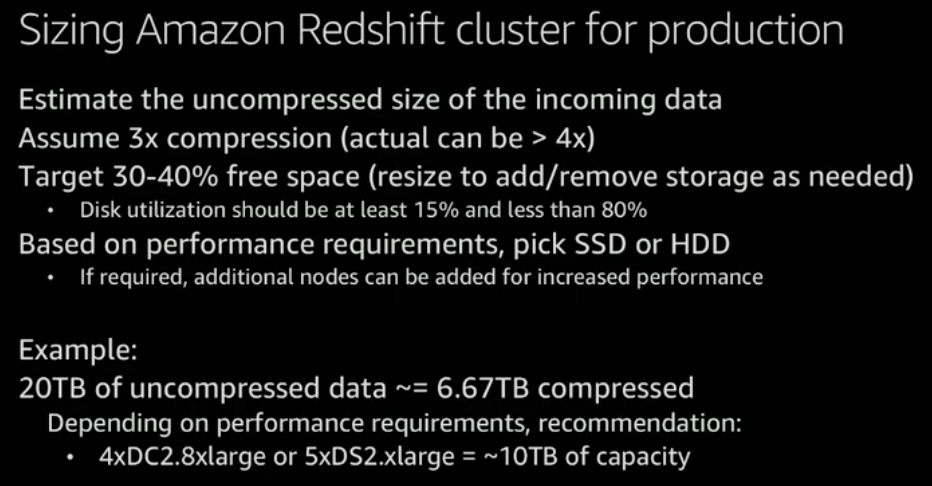
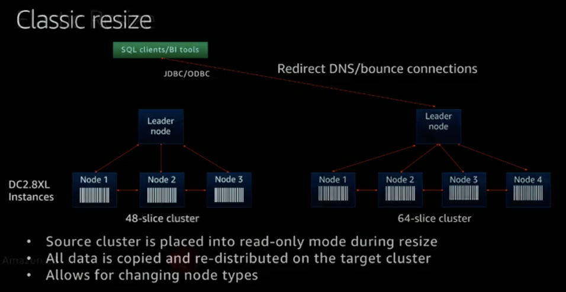
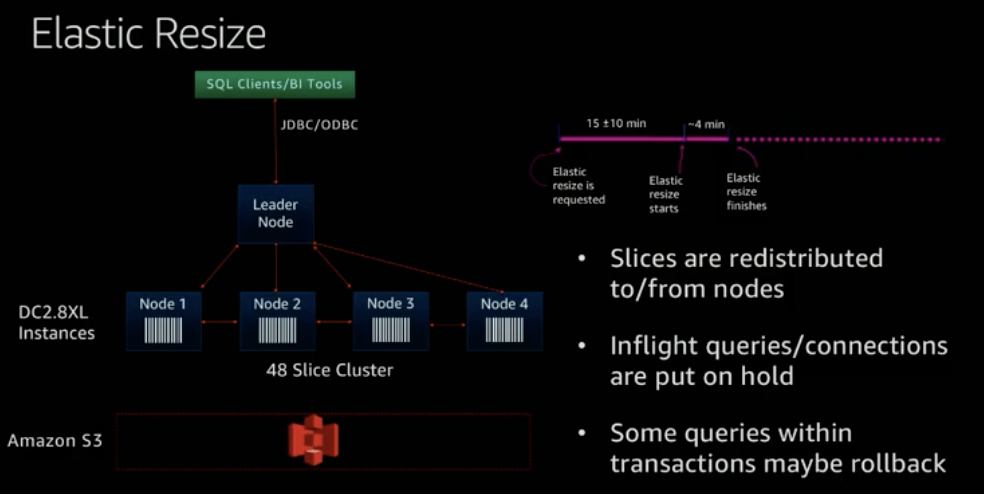
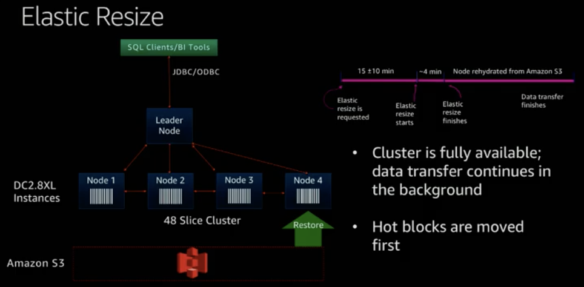
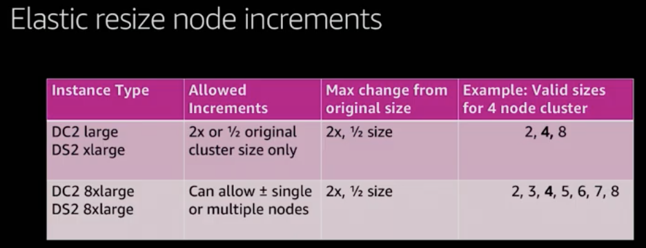
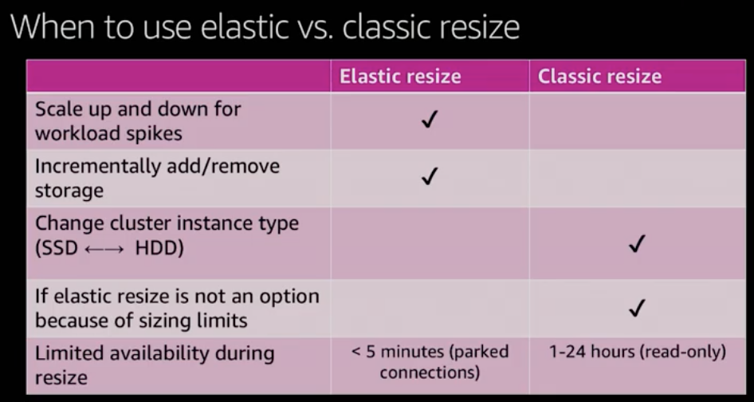

# Pricing / Sizing

Created: 2020-12-23 02:00:47 +0500

Modified: 2021-12-08 23:39:19 +0500

---

## Node Types

Amazon Redshift offers different node types to accommodate your workloads, and we recommend choosing RA3 or DC2 depending on the required performance, data size and its growth.

## RA3 nodes with managed storage

Allow you to optimize your data warehouse by scaling and paying for compute and managed storage independently. With RA3, you choose the number of nodes based on your performance requirements and only pay for the managed storage that you use. You should size your RA3 cluster based on the amount of data you process daily.
Redshift managed storage uses large, high-performance SSDs in each RA3 node for fast local storage and Amazon S3 for longer-term durable storage. If the data in a node grows beyond the size of the large local SSDs, Redshift managed storage automatically offloads that data to Amazon S3. You pay the same low rate for Redshift managed storage regardless of whether the data sits in high-performance SSDs or S3. For workloads that require ever-growing storage, managed storage lets you automatically scale your data warehouse storage capacity without adding and paying for additional nodes.

## Managed, Analytics-Optimized Storage

The new managed storage is equally exciting. There's a cache of large-capacity, high-performance SSD-based storage on each instance, backed by[S3](https://aws.amazon.com/s3/), for scale, performance, and durability. The storage system uses multiple cues, including data block temperature, data blockage, and workload patterns, to manage the cache for high performance. Data is automatically placed into the appropriate tier, and you need not do anything special to benefit from the caching or the other optimizations. You pay the same low price for SSD and S3 storage, and you can scale the storage capacity of your data warehouse without adding and paying for additional instances.
<https://docs.aws.amazon.com/redshift/latest/mgmt/working-with-clusters.html#rs-ra3-node-types>

## DC2 nodes**

allow you to have compute-intensive data warehouses with local SSD storage included. You choose the number of nodes you need based on data size and performance requirements. DC2 nodes store your data locally for high performance, and as the data size grows, you can add more compute nodes to increase the storage capacity of the cluster. **For datasets under 1TB uncompressed,** we recommend DC2 node types for the best performance at the lowest price. If you expect your data to grow, we recommend using RA3 nodes so you can size compute and storage independently to achieve the best price and performance.

## DS2 nodes

enable you to create large data warehouses using hard disk drives (HDDs), and we recommend using RA3 nodes instead. If you are using DS2 nodes, see[Overview of RA3 Node Types](https://docs.aws.amazon.com/redshift/latest/mgmt/working-with-clusters.html#rs-ra3-node-types)in the Cluster Management Guide for upgrade guidelines. Customers using eight or more nodes of DS2.xlarge, or any number of DS2.8xlarge nodes, can now upgrade to RA3 and get 2x more storage and better performance for the same on-demand cost.
<https://aws.amazon.com/redshift/pricing>
<table style="width:100%;">
<colgroup>
<col style="width: 22%" />
<col style="width: 8%" />
<col style="width: 11%" />
<col style="width: 8%" />
<col style="width: 19%" />
<col style="width: 11%" />
<col style="width: 18%" />
</colgroup>
<thead>
<tr class="header">
<th></th>
<th><strong>vCPU</strong></th>
<th><strong>Memory</strong></th>
<th><strong>Slices</strong></th>
<th><strong>Addressable storage capacity</strong></th>
<th><strong>I/O</strong></th>
<th><strong>Price</strong></th>
</tr>
</thead>
<tbody>
<tr class="odd">
<td><strong>Dense Compute DC2</strong></td>
<td></td>
<td></td>
<td></td>
<td></td>
<td></td>
<td></td>
</tr>
<tr class="even">
<td>dc2.large</td>
<td>2</td>
<td>15 GiB</td>
<td>2</td>
<td>
0.16TB SSD

= 160 GB
</td>
<td>0.60 GB/s</td>
<td>$0.315per Hour <strong>0.315 *8 = $2.52 per Hour</strong></td>
</tr>
<tr class="odd">
<td>dc2.8xlarge</td>
<td>32</td>
<td>244 GiB</td>
<td>32</td>
<td>2.56TB SSD</td>
<td>7.50 GB/s</td>
<td>$6.10per Hour</td>
</tr>
<tr class="even">
<td><strong>Dense Storage DS2</strong></td>
<td></td>
<td></td>
<td></td>
<td></td>
<td></td>
<td></td>
</tr>
<tr class="odd">
<td>ds2.xlarge</td>
<td>4</td>
<td>31 GiB</td>
<td>2</td>
<td>2TB HDD</td>
<td>0.40 GB/s</td>
<td>$1.19per Hour</td>
</tr>
<tr class="even">
<td>ds2.8xlarge</td>
<td>36</td>
<td>244 GiB</td>
<td>16</td>
<td>16TB HDD</td>
<td>3.30 GB/s</td>
<td>$9.50per Hour</td>
</tr>
<tr class="odd">
<td><strong>RA3 with Redshift Managed Storage*</strong></td>
<td></td>
<td></td>
<td></td>
<td></td>
<td></td>
<td></td>
</tr>
<tr class="even">
<td>ra3.xlplus</td>
<td>4</td>
<td>32 GiB</td>
<td></td>
<td>32TB RMS</td>
<td>0.65 GB/sec</td>
<td>
$1.235per Hour

<strong>1.235* 2 = 2.47 per hour</strong>
</td>
</tr>
<tr class="odd">
<td>ra3.4xlarge</td>
<td>12</td>
<td>96 GiB</td>
<td></td>
<td>64TB RMS</td>
<td>2.00 GB/s</td>
<td>$3.706per Hour</td>
</tr>
<tr class="even">
<td>ra3.16xlarge</td>
<td>48</td>
<td>384 GiB</td>
<td></td>
<td>64TB RMS</td>
<td>8.00 GB/s</td>
<td>$14.827per Hour</td>
</tr>
</tbody>
</table>

## Migrate from DC2 to DS2**

- **50% cheaper**
- **2x query time**
<https://medium.com/tensult/how-to-migrate-aws-redshift-dc2-to-ds2-node-cluster-73f320dc57f6>

## Resizing Amazon Redshift

Classic Resize

- Data is transferred from old cluster to new cluster (within hours)
- Change node types
- Enable / disable full disk encryption
Elastic Resize
- Nodes are added/removed to/from existing cluster (within minutes)

## Best Practices: Cluster Sizing

Use at least two computes nodes (multi-node cluster) in production for data mirrioring

- Leader node is given for no additional cost
Maintain at least 20% free space or three times the size of the largest table
- Scratch space for usage, rewriting tables
- Free space is required for vacuum to re-sort table
- Temporary tables used fo intermediate query results
The maximum number of available Amazon Redshift Spectrum nodes is a function of the number of slices in the Amazon Redshift cluster
If you're using DC1 instances, upgrade to the DC2 instance type
- Same price as DC1, significantly faster
- Reserved instances can be migrated without additional cost in the AWS console
