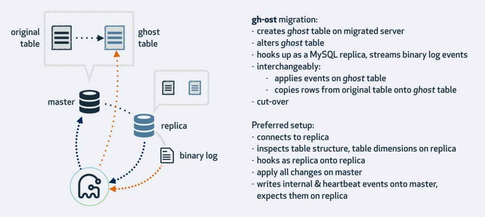
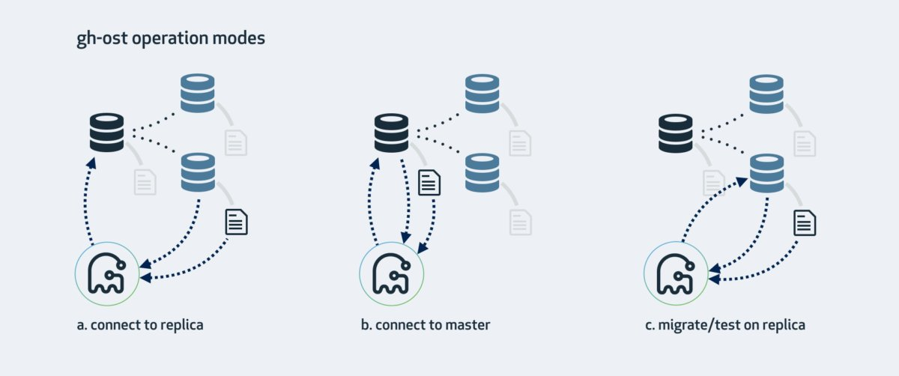

# SQL / MySQL Tools

Created: 2020-12-02 23:07:43 +0500

Modified: 2021-11-25 19:26:25 +0500

---

## Monitoring

<https://www.percona.com/doc/percona-monitoring-and-management/index.html>

## MySQL Diagnostic Manager (Monyog) - <https://www.webyog.com/product/monyog>
<https://www.eversql.com/top-5-mysql-monitoring-tools>

## Testing**

## mysqlslap

It's a benchmarking tool that can help DBAs and developers load test their database servers.
mysqlslap can emulate a large number of client connections hitting the database server at the same time. The load testing parameters are fully configurable and the results from different test runs can be used to fine-tune database design or hardware resources.
<https://www.digitalocean.com/community/tutorials/how-to-measure-mysql-query-performance-with-mysqlslap>

## Optimizations**

## MySQLTuner

<https://github.com/major/MySQLTuner-perl>

<https://github.com/pdufault/mysqlfragfinder/blob/master/mysqlfragfinder.sh>

## Mysqlreport**

Mysqlreport transforms the values from SHOW STATUS into an easy-to-read report that provides an in-depth understanding of how well MySQL is running. mysqlreport is a better alternative (and practically the only alternative) to manually interpreting SHOW STATUS.
## percona-toolkit
-   Verify MySQL replication integrity by checking source and replica data consistency
-   Efficiently archive rows
-   Find duplicate indexes
-   Summarize MySQL and MongoDB servers
-   Analyze MySQL queries from logs and tcpdump
-   Analyze MongoDB query profiler
-   Collect vital system information when problems occur
## brew install percona-toolkit-   [pt-align](https://www.percona.com/doc/percona-toolkit/LATEST/pt-align.html)
-   [pt-archiver](https://www.percona.com/doc/percona-toolkit/LATEST/pt-archiver.html)
-   [pt-config-diff](https://www.percona.com/doc/percona-toolkit/LATEST/pt-config-diff.html)
-   [pt-diskstats](https://www.percona.com/doc/percona-toolkit/LATEST/pt-diskstats.html)
-   [pt-duplicate-key-checker](https://www.percona.com/doc/percona-toolkit/LATEST/pt-duplicate-key-checker.html)
-   [pt-fifo-split](https://www.percona.com/doc/percona-toolkit/LATEST/pt-fifo-split.html)
-   [pt-find](https://www.percona.com/doc/percona-toolkit/LATEST/pt-find.html)
-   [pt-fingerprint](https://www.percona.com/doc/percona-toolkit/LATEST/pt-fingerprint.html)
-   [pt-fk-error-logger](https://www.percona.com/doc/percona-toolkit/LATEST/pt-fk-error-logger.html)
-   [pt-heartbeat](https://www.percona.com/doc/percona-toolkit/LATEST/pt-heartbeat.html)
-   [**pt-index-usage**](https://www.percona.com/doc/percona-toolkit/LATEST/pt-index-usage.html)

Read queries from a log and analyze how they use indexes.-   [pt-align](https://www.percona.com/doc/percona-toolkit/LATEST/pt-align.html)
-   [pt-archiver](https://www.percona.com/doc/percona-toolkit/LATEST/pt-archiver.html)
-   [pt-config-diff](https://www.percona.com/doc/percona-toolkit/LATEST/pt-config-diff.html)
-   [**pt-deadlock-logger**](https://www.percona.com/doc/percona-toolkit/LATEST/pt-deadlock-logger.html)

## pt-deadlock-loggerprints information about MySQL deadlocks by polling and parsingSHOWENGINEINNODBSTATUS. When a new deadlock occurs, it's printed toSTDOUTand, if specified, saved to[--dest](https://www.percona.com/doc/percona-toolkit/LATEST/pt-deadlock-logger.html#cmdoption-pt-deadlock-logger-dest).
pt-deadlock-logger -host sttash-main-db-instance-new-cluster.cluster-ro-c1z93jsyca9u.ap-south-1.rds.amazonaws.com --user lms-website --password Rf9zdHwB9E3GHWKq2yZM-   [pt-diskstats](https://www.percona.com/doc/percona-toolkit/LATEST/pt-diskstats.html)
-   [pt-duplicate-key-checker](https://www.percona.com/doc/percona-toolkit/LATEST/pt-duplicate-key-checker.html)

pt-duplicate-key-checker -host sttash-main-db-instance-new-cluster.cluster-ro-c1z93jsyca9u.ap-south-1.rds.amazonaws.com --user lms-website --password Rf9zdHwB9E3GHWKq2yZM
-   [pt-fifo-split](https://www.percona.com/doc/percona-toolkit/LATEST/pt-fifo-split.html)
-   [pt-find](https://www.percona.com/doc/percona-toolkit/LATEST/pt-find.html)
-   [pt-fingerprint](https://www.percona.com/doc/percona-toolkit/LATEST/pt-fingerprint.html)
-   [pt-fk-error-logger](https://www.percona.com/doc/percona-toolkit/LATEST/pt-fk-error-logger.html)
-   [pt-heartbeat](https://www.percona.com/doc/percona-toolkit/LATEST/pt-heartbeat.html)
-   [pt-index-usage](https://www.percona.com/doc/percona-toolkit/LATEST/pt-index-usage.html)
-   [pt-ioprofile](https://www.percona.com/doc/percona-toolkit/LATEST/pt-ioprofile.html)
-   [pt-kill](https://www.percona.com/doc/percona-toolkit/LATEST/pt-kill.html)
-   [pt-mext](https://www.percona.com/doc/percona-toolkit/LATEST/pt-mext.html)
-   [pt-mongodb-query-digest](https://www.percona.com/doc/percona-toolkit/LATEST/pt-mongodb-query-digest.html)
-   [pt-mongodb-summary](https://www.percona.com/doc/percona-toolkit/LATEST/pt-mongodb-summary.html)
-   [pt-mysql-summary](https://www.percona.com/doc/percona-toolkit/LATEST/pt-mysql-summary.html)

pt-mysql-summary --host localhost --user root --ask-pass > mysql-summary.txt

pt-mysql-summary --host sttash-main-db-instance-new-cluster.cluster-ro-c1z93jsyca9u.ap-south-1.rds.amazonaws.com --user lms-website --password Rf9zdHwB9E3GHWKq2yZM > mysql-summary.txt-   [pt-online-schema-change](https://www.percona.com/doc/percona-toolkit/LATEST/pt-online-schema-change.html)

pt-online-schema-change --host dailydb.snapshot.stashfin.com --user deepak_sood --password 72062eacf89016e8c2bb4fe9c4457b90 --alter='ENGINE=InnoDB' D=sttash_website_LIVE,t=elev8_offer_tmp --preserve-triggers --dry-run
Works by creating an empty copy of the table to alter, modifying it as desired, and then copying rows from the original table into the new table. When the copy is complete, it moves away the original table and replaces it with the new one. By default, it also drops the original table.
<https://dev.mysql.com/doc/refman/5.7/en/innodb-online-ddl-operations.html>

<https://www.percona.com/doc/percona-toolkit/3.0/pt-online-schema-change.html>-   [pt-pmp](https://www.percona.com/doc/percona-toolkit/LATEST/pt-pmp.html)
-   [pt-query-digest](https://www.percona.com/doc/percona-toolkit/LATEST/pt-query-digest.html)
-   [pt-secure-collect](https://www.percona.com/doc/percona-toolkit/LATEST/pt-secure-collect.html)
-   [pt-show-grants](https://www.percona.com/doc/percona-toolkit/LATEST/pt-show-grants.html)
-   [pt-sift](https://www.percona.com/doc/percona-toolkit/LATEST/pt-sift.html)
-   [pt-slave-delay](https://www.percona.com/doc/percona-toolkit/LATEST/pt-slave-delay.html)
-   [pt-slave-find](https://www.percona.com/doc/percona-toolkit/LATEST/pt-slave-find.html)
-   [pt-slave-restart](https://www.percona.com/doc/percona-toolkit/LATEST/pt-slave-restart.html)
-   [pt-stalk](https://www.percona.com/doc/percona-toolkit/LATEST/pt-stalk.html)
-   [pt-summary](https://www.percona.com/doc/percona-toolkit/LATEST/pt-summary.html)
-   [pt-table-checksum](https://www.percona.com/doc/percona-toolkit/LATEST/pt-table-checksum.html)
-   [pt-table-sync](https://www.percona.com/doc/percona-toolkit/LATEST/pt-table-sync.html)
-   [pt-table-usage](https://www.percona.com/doc/percona-toolkit/LATEST/pt-table-usage.html)
-   [pt-upgrade](https://www.percona.com/doc/percona-toolkit/LATEST/pt-upgrade.html)
-   [pt-variable-advisor](https://www.percona.com/doc/percona-toolkit/LATEST/pt-variable-advisor.html)
-   [pt-visual-explain](https://www.percona.com/doc/percona-toolkit/LATEST/pt-visual-explain.html)
-   [pt-slave-find](https://www.percona.com/doc/percona-toolkit/LATEST/pt-slave-find.html)
-   [pt-slave-restart](https://www.percona.com/doc/percona-toolkit/LATEST/pt-slave-restart.html)
-   [pt-stalk](https://www.percona.com/doc/percona-toolkit/LATEST/pt-stalk.html)
-   [pt-summary](https://www.percona.com/doc/percona-toolkit/LATEST/pt-summary.html)
-   [pt-table-checksum](https://www.percona.com/doc/percona-toolkit/LATEST/pt-table-checksum.html)
-   [pt-table-sync](https://www.percona.com/doc/percona-toolkit/LATEST/pt-table-sync.html)
-   [pt-table-usage](https://www.percona.com/doc/percona-toolkit/LATEST/pt-table-usage.html)
-   [pt-upgrade](https://www.percona.com/doc/percona-toolkit/LATEST/pt-upgrade.html)
-   [pt-variable-advisor](https://www.percona.com/doc/percona-toolkit/LATEST/pt-variable-advisor.html)
-   [pt-visual-explain](https://www.percona.com/doc/percona-toolkit/LATEST/pt-visual-explain.html)
<https://www.percona.com/software/database-tools/percona-toolkit>

## Event Reduce**

An algorithm to optimize database queries that run multiple times
<https://github.com/pubkey/event-reduce>

## SQLCheck**

SQL anti-patterns can slow down queries, but often it takes experienced DBAs and developers poring over code to identify and resolve them.
Four categories of anti-pattern:

i.  Logical database design

ii. Physical database design

iii. Query

iv. Application development
Sqlcheck can be targeted at varying risk levels, categorized as low, medium, or high risk. This is helpful if your list of anti-patterns is large, since you can prioritize the queries with the greatest performance impact.All you need to do to get started is gather a list of your distinct queries into a file and then pass them as an argument to the tool.
<https://github.com/jarulraj/sqlcheck>

## Gh-ost (Ghost)**

If like 99 percent of MySQL DBAs you have faced implementing a change to a MySQL table while fearing the impact on production, then you should consider[Gh-ost](https://github.com/github/gh-ost) (GitHub Online Schema Migration). Gh-ost provides MySQL schema changes without blocking writes, without using triggers, and with the ability to pause and resume the migration!
Why is this so important? Since MySQL 5.6 shipped with new[ALTER TABLE ... ALGORITHM=INPLACE](https://dev.mysql.com/doc/refman/5.6/en/alter-table.html)DDL (Data Definition Language) functionality, it became possible to modify a table without blocking writes for common operations such as adding an index (B-tree). However, there remain a few conditions where[writes (DML statements) are blocked](https://dev.mysql.com/doc/refman/5.7/en/innodb-create-index-overview.html#innodb-online-ddl-summary-grid), most notably the addition of aFULLTEXTindex, the encryption of the tablespace, and the conversion of a column type.
Other popular online schema change tools, such as Percona's[pt-online-schema-change](https://www.percona.com/doc/percona-toolkit/LATEST/pt-online-schema-change.html), work by implementing a set of three triggers (INSERT,UPDATE, andDELETE) on the master to keep a shadow copy table in sync with changes. This introduces a small performance penalty due to write amplification, but more significantly requires seven instances of metadata locks. These effectively stall DML (Data Manipulation Language) events.
Since Gh-ost operates using the binary log, it is not susceptible to the[trigger-based drawbacks](https://github.com/github/gh-ost/blob/master/doc/why-triggerless.md). Finally Gh-ost is able to effectively[throttle activity to zero events](https://github.com/github/gh-ost/blob/master/doc/interactive-commands.md#examples), allowing you to pause the schema migration for a while if your server begins to struggle, and resume when the activity bubble moves on.
So how does Gh-ost work? By default, Gh-ost connects to a replica (slave), identifies the master, and applies the migration on the master. It receives changes on a replica to the source table in[binlog_format=ROW](https://dev.mysql.com/doc/en/binary-log-setting.html), parses the log, and converts these statements to be re-executed on the master's shadow table.It keeps track of the row counts on the replica and identifies when it is time to perform an atomic cutover (switch tables).

## Gh-ost operation modes
Gh-ost provides an alternative mode where you execute the migration directly on the master (whether it has slaves or not), read back the master'sbinlog_format=ROWevents, and then re-apply them to the shadow table.
A final option is available to run the migration only on the replica without impacting the master, so you can test or otherwise validate the migration.

## Gh-ost general flow
Note that if your schema has foreign keys then Gh-ost may not operate cleanly, as this configuration is not supported.
<https://github.com/github/gh-ost>
<https://www.infoworld.com/article/3241730/top-5-open-source-tools-for-mysql-administrators.html>

## Maintenance Scripts**

<https://jonlabelle.com/snippets/view/shell/mysql-database-maintenance-script>

Backup + Optimize - <https://github.com/mmerian/MySQL-Maint/blob/master/mysql_maint.sh>
InnoDB stores data using a page-allocation method and does not suffer from fragmentation in the same way that legacy storage engines (such as MyISAM) will. When considering whether or not to run optimize, consider the workload of transactions that your server will process:
-   Some level of fragmentation is expected. InnoDB only fills pages 93% full, to leave room for updates without having to split pages.
-   Delete operations might leave gaps that leave pages less filled than desired, which could make it worthwhile to optimize the table.
-   Updates to rows usually rewrite the data within the same page, depending on the data type and row format, when sufficient space is available. See Section 14.10.5, "How Compression Works for InnoDB Tables" and Section 14.12.1, "Overview of InnoDB Row Storage".
-   High-concurrency workloads might leave gaps in indexes over time, as InnoDB retains multiple versions of the same data due through its MVCC mechanism. See Section 14.5.12, "InnoDB Multi-Versioning".
## Orchestrator

orchestratoris a MySQL high availability and replication management tool, runs as a service and provides command line access, HTTP API and Web interface.
<https://github.com/openark/orchestrator>

## CueObserve**

Anomaly detection on SQL data warehouses and databases

<https://github.com/cuebook/cueobserve>

<https://cueobserve.cuebook.ai>
