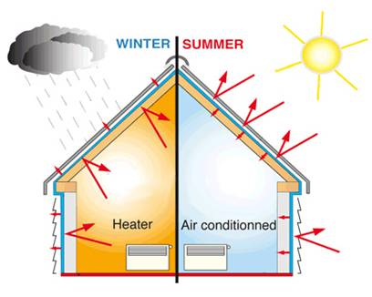

# Civil Engineering

## Civil Engineering

- IMHOTEP - First engineering in Egypt
- Structural Engineering

Focus more on the design and framework of structures

- Construction Engineering

Involved with actually building the structure

- Hippodamian plan (Hippodamus of Miletus, Greece, 460 BCE, Father of city planning)

Rectangle city blocks with roads

Dividing up city into different parts for different purposes

- Transportation
- Joseph Aspdin (patented portland cement)
- Sanitation

Sir Joseph William Bazalgette (created london sewers)

His network helped relieve the city of its cholera epidemic by treating the water and cleansing the polluted river thames, which took nearly 20 years to complete, and he was eventually knighted for this work

- Hydraulic engineering
- Geotechnical engineering

## Sacrificial Concrete

Sacrificial concrete is a cement-based material used for fire protection purposes. It is commonly used as a protective layer in nuclear reactor core containment structures in nuclear power plants. Its purpose is to act as a protection material only. Sacrificial concrete is particularly effective in protecting nuclear reactor core containment because it possesses high temperature stability and high melt capability that can reduce or help avoid the deterioration due to ultra-high temperature exposure from nuclear reactor core accidents or meltdowns.

## Thermal Insulation

Thermal insulation refers to the provisions or constructions employed to reduce the transfer of heat into or out of the building. It helps to keep the house warm in winters and cool in summers, exactly what is desirable. In short, thermal insulation techniques help in keeping the indoors of a house independent of the outdoors.

<https://happho.com/insulate-house-thermally>
