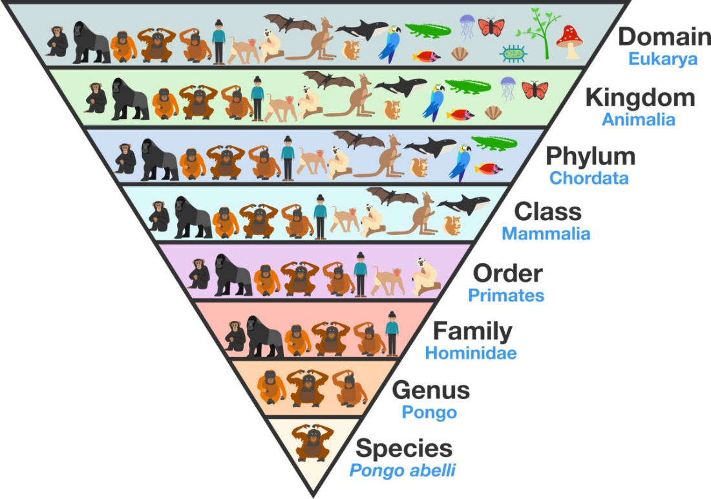
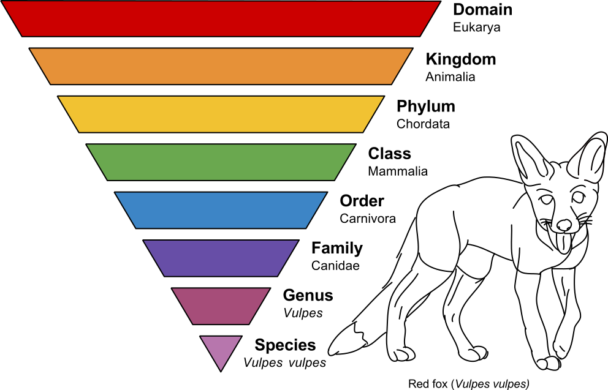
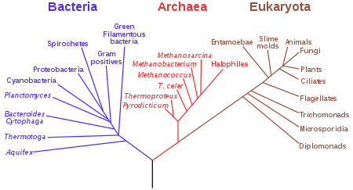
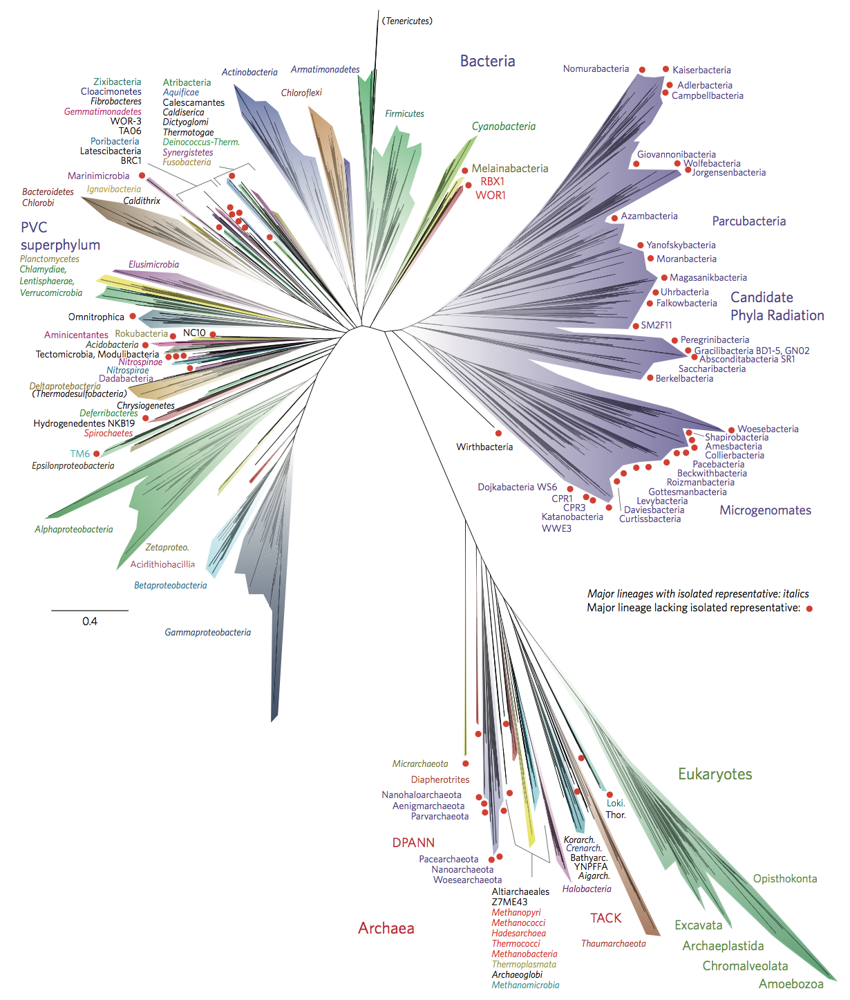
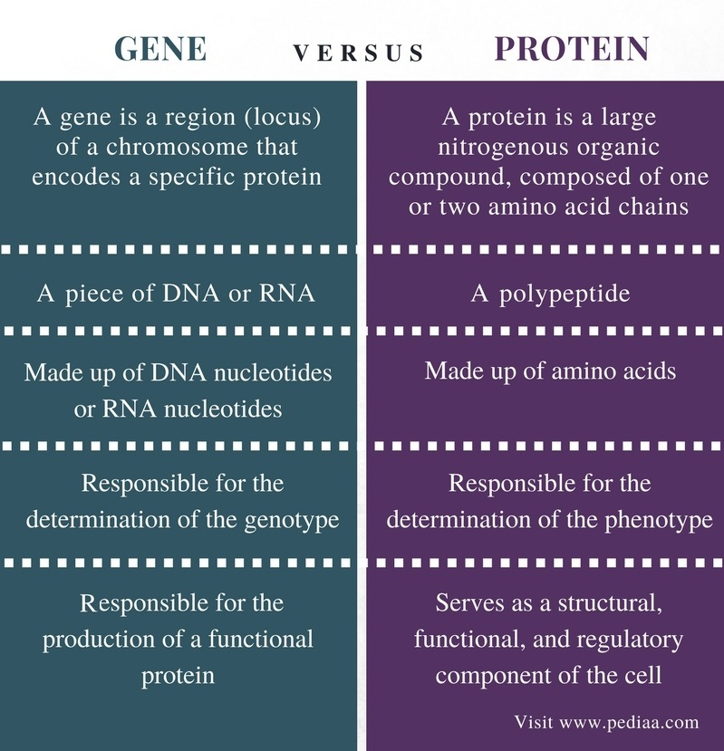

# Biology

## Live longer

1. Avoid DNA damage
2. Eat less
3. Eat less protein
4. HIIT
5. Be cold
6. Be hot

Taxonomy, which translates from Ancient Greek as "arrangement method," is a tool for categorizing living organisms into groups (ortaxa) based on shared genetic traits and common ancestry. Organisms grouped higher up in the hierarchy share very broad traits, while organisms grouped together farther down the hierarchy are more closely related (they share more genetic traits). Historically, we have classified living organisms into these taxa (in order of increasing specificity): domain, kingdom, phylum, class, order, family, genus, species, [Variety]. (Mnemonic - "**D** ear **K** ing **P** hilip **C** ame **O** ver **F** or **G** ood **S** oup")

## Humans

- Domain - Eukarya
- Kingdom - Animalia
- Phylum - Chordata
- Class - Mammalia
- Order - Primates
- Suborder - Haplorhini
- Infraorder - Simiiformes
- Family - Hominidae
- Subfamily - Homininae
- Tribe - Hominini
- Genus - Homo
- Species - Home sapiens

<https://en.wikipedia.org/wiki/Human>

<https://en.wikipedia.org/wiki/Taxonomic_rank>

<https://en.wikipedia.org/wiki/Kingdom_(biology)>

## Tree of life

<https://en.wikipedia.org/wiki/Tree_of_life_(biology)>

[Evolution & Classification of Life | Single Celled Bacteria to Humans](https://www.youtube.com/watch?v=HpXaiG8L28s)

<https://en.wikipedia.org/wiki/Template:Human_timeline>

## Protein

Proteins play countless roles throughout the biological world, from catalyzing chemical reactions to building the structures of all living things. Despite this wide range of functions all proteins are made out of the same twenty amino acids, but combined in different ways. The way these twenty amino acids are arranged dictates the folding of the protein into its primary, secondary, tertiary, and quaternary structure. Since protein function is based on the ability to recognize and bind to specific molecules, having the correct shape is critical for proteins to do their jobs correctly.

[What is a Protein?](https://www.youtube.com/watch?v=wvTv8TqWC48)

## Gene vs Protein

## Lymphatic System

The**lymphatic system** is part of the [vascular system](https://en.wikipedia.org/wiki/Vascular_system) and an important part of the [immune system](https://en.wikipedia.org/wiki/Immune_system), comprising a network of [lymphatic vessels](https://en.wikipedia.org/wiki/Lymphatic_vessel) that carry a clear fluid called [lymph](https://en.wikipedia.org/wiki/Lymph)(from Latin,*lympha*meaning "[water](https://en.wikipedia.org/wiki/Water)") directionally towards the [heart](https://en.wikipedia.org/wiki/Heart).

## Brain (Rosehip Neuron)

New type of inhibitory neuron discovered, in cortex.

Pyramidal neurons - Excitatory neurons

## All about Brain

<https://waitbutwhy.com/2017/04/neuralink.html>

## Hypnagogia

Altered state of Consciousness, occur just before deep sleep

## Carrying Capacity

Thecarrying capacityof a biological [species](https://en.wikipedia.org/wiki/Species) in an [environment](https://en.wikipedia.org/wiki/Natural_environment) is the maximum population size of the species that the environment can sustain indefinitely, given the food, [habitat](https://en.wikipedia.org/wiki/Habitat), [water](https://en.wikipedia.org/wiki/Drinking_water), and other [necessities available](https://en.wikipedia.org/wiki/Resource) in the environment. In [population biology](https://en.wikipedia.org/wiki/Population_biology), carrying capacity is defined as the [environment](https://en.wikipedia.org/wiki/Environment_(biophysical))'s maximal load, which is different from the [concept](https://en.wikipedia.org/wiki/Concept) of population equilibrium. Its effect on [population dynamics](https://en.wikipedia.org/wiki/Population_dynamics) may be approximated in a [logistic model](https://en.wikipedia.org/wiki/Logistic_function), although this simplification ignores the possibility of [overshoot](https://en.wikipedia.org/wiki/Overshoot_(population)) which real systems may exhibit.

<https://en.wikipedia.org/wiki/Carrying_capacity>

## e-DNA (Environmental DNA)

[How we can detect pretty much anything - Hélène Morlon and Anna Papadopoulou](https://www.youtube.com/watch?v=bdwU_ZPk1cY&ab_channel=TED-Ed)

## Resources

<https://user-images.githubusercontent.com/21294/94627410-73b6c680-028b-11eb-9501-d7453af56106.png?ck_subscriber_id=389278734>

<https://www.scotthyoung.com/blog/2021/01/18/biology>

<https://github.com/CompCogNeuro/ed4>

<https://www.weizmann.ac.il/mcb/UriAlon/download/systems-biology-course-2018>
