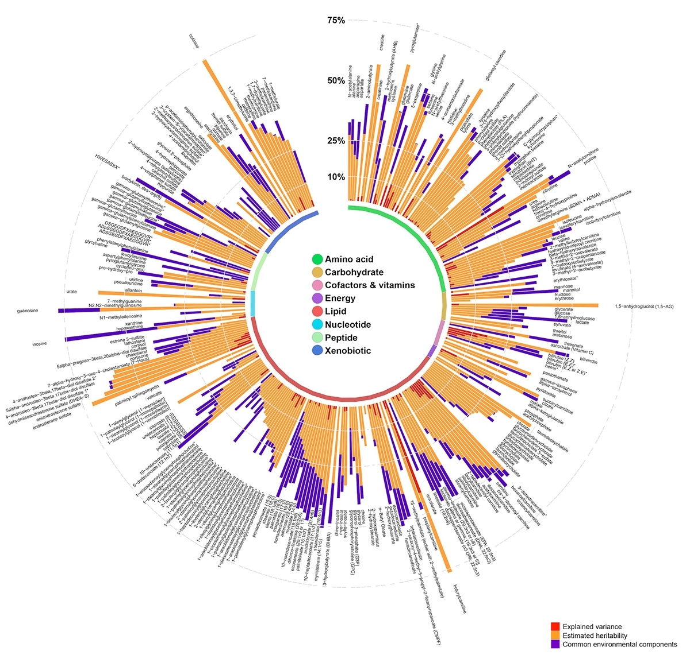

# Digestive System

Created: 2019-08-23 21:50:54 +0500

Modified: 2022-10-30 23:38:07 +0500

---

**Metabolic chart of the Human Body**

<https://en.wikipedia.org/wiki/Human_feces>

**Bristol stool chart**

The type of stool or faeces depends on the time it spends in the colon. After you pass faeces, what you see in the toilet bowl is basically the result of your diet, fluids, medications and lifestyle. You can use the Bristol Stool Chart to check what your stools are telling you.

The Bristol Stool Chart shows seven categories of stool. Every person will have different bowel habits, but the important thing is that your stools are soft and easy to pass -- like types 3 and 4 below.

-   [Type 1--2 indicate constipation](https://www.continence.org.au/pages/constipation.html)
-   [Type 3--4 are ideal stools](https://www.continence.org.au/pages/about-your-bowel.html)as they are easier to pass, and
-   [Type 5--7 may indicate diarrhoea and urgency.](https://www.continence.org.au/pages/diarrhoea.html)

<https://www.continence.org.au/pages/bristol-stool-chart.html>

