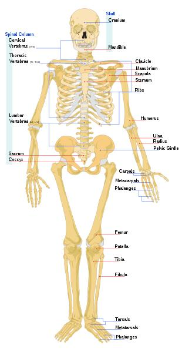

# Human Skeleton

Created: 2019-05-06 14:47:46 +0500

Modified: 2019-05-07 12:37:47 +0500

---

Thehuman skeletonis the internal framework of the body. It is composed of around 270 [bones](https://en.wikipedia.org/wiki/Bone) at birth -- this total decreases to around 206 bones by adulthood after some bones get fused together.The bone mass in the skeleton reaches maximum [density](https://en.wikipedia.org/wiki/Bone_density) around age 21. The human skeleton can be divided into the [axial skeleton](https://en.wikipedia.org/wiki/Axial_skeleton) and the [appendicular skeleton](https://en.wikipedia.org/wiki/Appendicular_skeleton). The axial skeleton is formed by the [vertebral column](https://en.wikipedia.org/wiki/Human_vertebral_column), the [rib cage](https://en.wikipedia.org/wiki/Human_rib_cage), the [skull](https://en.wikipedia.org/wiki/Human_skull) and other associated bones. The appendicular skeleton, which is attached to the axial skeleton, is formed by the [shoulder girdle](https://en.wikipedia.org/wiki/Shoulder_girdle), the [pelvic girdle](https://en.wikipedia.org/wiki/Pelvic_girdle) and the bones of the upper and lower limbs.

The human skeleton performs six major functions; support, movement, protection, production of [blood cells](https://en.wikipedia.org/wiki/Blood_cells), storage of minerals, and endocrine regulation.

The human skeleton is not as [sexually dimorphic](https://en.wikipedia.org/wiki/Sexual_dimorphism) as that of many other primate species, but subtle differences between sexes in the [morphology](https://en.wikipedia.org/wiki/Morphology_(biology)) of the [skull](https://en.wikipedia.org/wiki/Human_skull), [dentition](https://en.wikipedia.org/wiki/Dentition), [long bones](https://en.wikipedia.org/wiki/Long_bone), and pelvis exist. In general, female skeletal elements tend to be smaller and less robust than corresponding male elements within a given population. The human [female pelvis](https://en.wikipedia.org/wiki/Female_pelvis) is also different from that of males in order to facilitate [childbirth](https://en.wikipedia.org/wiki/Childbirth).Unlike most primates, human males do not have [penile bones](https://en.wikipedia.org/wiki/Penile_bone).

## Skeletal Divisions

## Axial skeleton

The axial skeleton (80 bones) is formed by the [vertebral column](https://en.wikipedia.org/wiki/Human_vertebral_column)(32--34 bones; the number of the vertebrae differs from human to human as the lower 2 parts, sacral and coccygeal bone may vary in length), a part of the [rib cage](https://en.wikipedia.org/wiki/Human_rib_cage)(12 pairs of [ribs](https://en.wikipedia.org/wiki/Rib) and the [sternum](https://en.wikipedia.org/wiki/Human_sternum)), and the [skull](https://en.wikipedia.org/wiki/Human_skull)(22 bones and 7 associated bones).

The upright posture of humans is maintained by the axial skeleton, which transmits the weight from the head, the trunk, and the upper extremities down to the lower extremities at the [hip joints](https://en.wikipedia.org/wiki/Hip_joint). The bones of the spine are supported by many ligaments. The [erector spinae muscles](https://en.wikipedia.org/wiki/Erector_spinae_muscles) are also supporting and are useful for balance.

## Appendicular skeleton

The appendicular skeleton (126 bones) is formed by the pectoral girdles, the upper limbs, the pelvic girdle or pelvis, and the lower limbs. Their functions are to make locomotion possible and to protect the major organs of digestion, excretion and reproduction.

## Functions

The skeleton serves six major functions: support, movement, protection, production of blood cells, storage of minerals and endocrine regulation.

## List of bones

## Spine (vertebral column)

A fully grown adult features 26 bones in the spine, whereas a child can have 33.

- [Cervical vertebrae](https://en.wikipedia.org/wiki/Cervical_vertebrae)(7 bones)
- [Thoracic vertebrae](https://en.wikipedia.org/wiki/Thoracic_vertebrae)(12 bones)
- [Lumbar vertebrae](https://en.wikipedia.org/wiki/Lumbar_vertebrae)(5 bones)
- [Sacral vertebrae](https://en.wikipedia.org/wiki/Sacral_vertebrae)(5 bones at birth, fused into one after adolescence)
- [Coccygeal vertebrae](https://en.wikipedia.org/wiki/Coccygeal_vertebrae)

## Chest (thorax)

Various bones of the human skeletal system.

There are usually 26 bones in the chest but sometimes there can be additional cervical ribs in humans. Cervical ribs occur naturally in other animals such as reptiles.

- [Hyoid](https://en.wikipedia.org/wiki/Hyoid)(1)
- [Sternum](https://en.wikipedia.org/wiki/Human_sternum)(1)
- [Ribs](https://en.wikipedia.org/wiki/Ribs)(24, in 12 pairs)
- [Cervical ribs](https://en.wikipedia.org/wiki/Cervical_rib) are extra ribs that occur in some humans.

## Head

There are 22 bones in the [skull](https://en.wikipedia.org/wiki/Skull). Including the bones of the middle ear, the head contains 28 bones.

- [Cranial bones](https://en.wikipedia.org/wiki/Human_skull)(8)
- [Occipital bone](https://en.wikipedia.org/wiki/Occipital_bone)
- [Parietal bones](https://en.wikipedia.org/wiki/Parietal_bone)(2)
- [Frontal bone](https://en.wikipedia.org/wiki/Frontal_bone)
- [Temporal bones](https://en.wikipedia.org/wiki/Temporal_bone)(2)
- [Sphenoid bone](https://en.wikipedia.org/wiki/Sphenoid_bone)(sometimes counted as facial)
- [Ethmoid bone](https://en.wikipedia.org/wiki/Ethmoid_bone)(sometimes counted as facial)
- [Facial bones](https://en.wikipedia.org/wiki/Facial_bone)(14)
- [Nasal bones](https://en.wikipedia.org/wiki/Nasal_bone)(2)
- [Maxillae](https://en.wikipedia.org/wiki/Maxillae)(upper jaw) (2)
- [Lacrimal bone](https://en.wikipedia.org/wiki/Lacrimal_bone)(2)
- [Zygomatic bone](https://en.wikipedia.org/wiki/Zygomatic_bone)(2)
- [Palatine bone](https://en.wikipedia.org/wiki/Palatine_bone)(2)
- [Inferior nasal concha](https://en.wikipedia.org/wiki/Inferior_nasal_concha)(2)
- [Vomer](https://en.wikipedia.org/wiki/Vomer)
- [Mandible](https://en.wikipedia.org/wiki/Human_mandible)(1)
- [Hyoid bone](https://en.wikipedia.org/wiki/Hyoid_bone)(1)
- [Middle ears](https://en.wikipedia.org/wiki/Middle_ear)(6 bones in total, 3 on each side)
- [Malleus](https://en.wikipedia.org/wiki/Malleus)(2)
- [Incus](https://en.wikipedia.org/wiki/Incus)(2)
- [Stapes](https://en.wikipedia.org/wiki/Stapes)(2)

## Arm

There are a total of 64 bones in the arm.

- Upper arm bones (6 bones in total; 3 on each side)
- [Humerus](https://en.wikipedia.org/wiki/Humerus)(2)
- [Pectoral girdle](https://en.wikipedia.org/wiki/Pectoral_girdle)(shoulder)
- [Scapula](https://en.wikipedia.org/wiki/Scapula)(2)
- [Clavicles](https://en.wikipedia.org/wiki/Clavicles)(2)
- Lower arm bones (4 bones in total, 2 on each side)
- [Ulna](https://en.wikipedia.org/wiki/Ulna)(2)
- [Radius](https://en.wikipedia.org/wiki/Radius_(bone))(2)
- [Hand](https://en.wikipedia.org/wiki/Hand)(54 bones in total; 27 in each hand)
- [Carpals](https://en.wikipedia.org/wiki/Carpals)
- [Scaphoid bone](https://en.wikipedia.org/wiki/Scaphoid_bone)(2)
- [Lunate bone](https://en.wikipedia.org/wiki/Lunate_bone)(2)
- [Triquetral bone](https://en.wikipedia.org/wiki/Triquetral)(2)
- [Pisiform bone](https://en.wikipedia.org/wiki/Pisiform_bone)(2)
- [Trapezium](https://en.wikipedia.org/wiki/Trapezium_(bone))(2)
- [Trapezoid bone](https://en.wikipedia.org/wiki/Trapezoid_bone)(2)
- [Capitate bone](https://en.wikipedia.org/wiki/Capitate_bone)(2)
- [Hamate bone](https://en.wikipedia.org/wiki/Hamate_bone)(2)
- [Metacarpals](https://en.wikipedia.org/wiki/Metacarpus)(10 bones in total; 5 on each side)
- [Phalanges of the hand](https://en.wikipedia.org/wiki/Phalanges_of_the_hand)
- [Proximal phalanges](https://en.wikipedia.org/wiki/Proximal_phalanges)(10 bones in total; 5 on each side)
- [Intermediate phalanges](https://en.wikipedia.org/wiki/Intermediate_phalanges)(8 bones in total; 4 on each side)
- [Distal phalanges](https://en.wikipedia.org/wiki/Distal_phalanges)(10 bones in total; 5 on each side)

## Pelvis (pelvic girdle)

The pelvis (or [hip bone](https://en.wikipedia.org/wiki/Hip_bone)) is made up of three regions that have fused to form two coxal bones. They are:[ilium](https://en.wikipedia.org/wiki/Ilium_(bone)), [ischium](https://en.wikipedia.org/wiki/Ischium), and [pubis](https://en.wikipedia.org/wiki/Pubis_(bone))

- The [sacrum](https://en.wikipedia.org/wiki/Sacrum) and the [coccyx](https://en.wikipedia.org/wiki/Coccyx) attach to the two hip bones to form the [pelvis](https://en.wikipedia.org/wiki/Human_pelvis), but are more important to the spinal column, where they are counted.

## Leg

There are a total of 60 bones in the legs.

- [Femur](https://en.wikipedia.org/wiki/Femur)(2 bones)
- [Patella](https://en.wikipedia.org/wiki/Patella) or kneecap (2 bones)
- [Tibia](https://en.wikipedia.org/wiki/Tibia)(2 bones) Also called shin bone
- [Fibula](https://en.wikipedia.org/wiki/Fibula)(2 bones)
- [Foot](https://en.wikipedia.org/wiki/Foot)(52 bones in total, 26 per foot)
- [Tarsus](https://en.wikipedia.org/wiki/Tarsus_(skeleton))
- [Calcaneus](https://en.wikipedia.org/wiki/Calcaneus) or heel bone (2 bones)
- [Talus](https://en.wikipedia.org/wiki/Talus_bone)(2 bones)
- [Navicular bone](https://en.wikipedia.org/wiki/Navicular_bone)(2 bones)
- [Medial cuneiform bone](https://en.wikipedia.org/wiki/Cuneiform_(anatomy))(2 bones)
- [Intermediate cuneiform bone](https://en.wikipedia.org/wiki/Cuneiform_(anatomy))(2 bones)
- [Lateral cuneiform bone](https://en.wikipedia.org/wiki/Cuneiform_(anatomy))(2 bones)
- [Cuboid bone](https://en.wikipedia.org/wiki/Cuboid_bone)(2 bones)
- [Metatarsals](https://en.wikipedia.org/wiki/Metatarsals)(10 bones)
- [Phalanges of the foot](https://en.wikipedia.org/wiki/Phalanges_of_the_foot)
- [Proximal phalanges](https://en.wikipedia.org/wiki/Proximal_phalanges)(10 bones)
- [Intermediate phalanges](https://en.wikipedia.org/wiki/Intermediate_phalanges)( 8 bones)
- [Distal phalanges](https://en.wikipedia.org/wiki/Distal_phalanges)( 10 bones)

Axial skeleton = 80 Skull =22 Vertebral Coloumn = 26 Ribs = 12 Fore limb = 60 Hind limb = 60

[Sesamoid bones](https://en.wikipedia.org/wiki/Sesamoid_bone)

- [Patella](https://en.wikipedia.org/wiki/Patella)
- [Pisiform bone](https://en.wikipedia.org/wiki/Pisiform_bone)
- [Fabella](https://en.wikipedia.org/wiki/Fabella)
- Sesamoids in the [first](https://en.wikipedia.org/wiki/First_metacarpal_bone) and [second](https://en.wikipedia.org/wiki/Second_metacarpal_bone) metacarpal bones
- Sesamoids in the [first metatarsal bone](https://en.wikipedia.org/wiki/First_metatarsal_bone)
- Lenticular [process](https://en.wikipedia.org/wiki/Process_(anatomy)) of the [incus](https://en.wikipedia.org/wiki/Incus_bone)
- For bones that are present variably in different people, see [Accessory bone](https://en.wikipedia.org/wiki/Accessory_bone)

## References

<https://en.wikipedia.org/wiki/Human_body>

<https://en.wikipedia.org/wiki/Human_skeleton>

<https://en.wikipedia.org/wiki/List_of_bones_of_the_human_skeleton>
