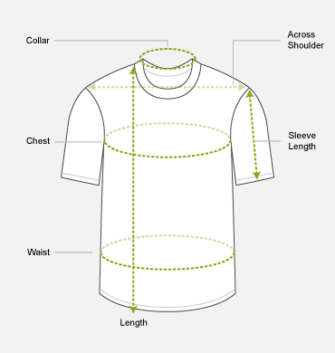

# My Body / About me

---

## Age - 28

## Weight - 58 KG / 127 pounds

## Height - 172 cm / 5 ft 7.7 inch

## Neck - 36 cm / 14 inch / 1.2 ft

## Chest - 101.6 cm / 40 inch

## Front Length - 68.6 cm / 27.0 inch

## Across Shoulder - 43.2 cm / 17.0 inch

## Waist - 68 cm / 31 inch / 2.7 ft

## Hip - 84 cm / 33 inch / 2.9 ft

## BMI - 19.3

## BMR - 2400-2700 cal/day (consume 2600 cal/day)

Finger Ring - 15

## Shoe / Shoes Size - UK-8 or EU-42 (Decathlon too)

Brief size / Capri - M (80-85 cm)

Innerwear Vest - S (80-85 cm)

Body Fat - 3.8%

Fat Weight: 58 * 0.038 = 2.204 KG

Lean Weight: 58 - 2.2 = 55.8 KG / 123 lbs

<table>
<colgroup>
<col style="width: 70%" />
<col style="width: 29%" />
</colgroup>
<thead>
<tr class="header">
<th>Body Fat (U.S. Navy Method)</th>
<th>3.8%</th>
</tr>
</thead>
<tbody>
<tr>
<td>Body Fat Category</td>
<td>Essential Fat</td>
</tr>
<tr>
<td>Body Fat Mass</td>
<td>2.2 kgs</td>
</tr>
<tr>
<td>Lean Body Mass</td>
<td>55.8 kgs</td>
</tr>
<tr>
<td>
Ideal Body Fat for Given Age

(Jackson &amp; Pollard)
</td>
<td>10.5%</td>
</tr>
<tr>
<td>Body Fat to Gain to Reach Ideal</td>
<td>3.9 kgs</td>
</tr>
<tr>
<td>Body Fat (BMI method)</td>
<td>15.4%</td>
</tr>
</tbody>
</table>

Maa bangles - 2/6

Maa ring -

Papa ring - 16-17 (preferrable - 17)

## Nutrition

Protein: 1.5 * 123 = 184.5 grams

Fat: 0.5 * 123 = 61.5 grams

Carbs: 1300/4 = 325 grams

## Other

Protein: 250g (1000 calorie)

Carbs: 150g (600 calorie)

Fat: 100g (900 calorie)

## Meal Plan

Protein: 184.5 * 4 = 738 calorie

Fat: 61.5 * 9 = 553.5 calorie

Carbs: 2600 - 738 - 553.5 = 1308.5 calorie

## Macros Grams to Calories

Protein: 1 gram = 4 calorie

Carbs: 1 gram = 4 calorie

Fat: 1 gram = 9 calorie

## Carb Intake Guidelines

Accelerated fat loss: 0g - 50g (take a carb intake refill day)

Fat loss: 50g - 100g

Maintainence: 100g - 150g

Weight gain: 150g - 300g

Excessive weight gain: 300g+

## Psychology

- 10 - 02 AM most productive for studying
- Not very productive in morning

## Allergies

Boiled egg

Lactose (Milk, Dahi)

Momos (maybe)

Doritos (maybe)

## Biological Prime Time (Chronotype)

Your "biological prime time" is the time of the day when you have the most energy, and therefore the greatest potential to be productive. To calculate yours, chart your energy levels for at least three weeks. Then schedule your most important, highest-leverage activities when you have the most energy.

<https://alifeofproductivity.com/calculate-biological-prime-time>

<https://blog.trello.com/find-productive-hours>

<https://drive.google.com/file/d/0B6X0IsWnb3Y3NVFJZHgtSV9rSG8/view>

[**https://collegeinfogeek.com/track-body-energy-focus-levels/**](https://collegeinfogeek.com/track-body-energy-focus-levels/)

1. **Early birds / morning larks-** people who do their best work early in the morning

2. **Night owls-** people who do their best work late in the day

3. **Third birds-** people who fall somewhere in between, typically doing their best work later in the morning

- **Peak:** This is when you have your greatest amount of mental and physical energy. Reserve this time for tasks that require analytical work. Avoid doing mindless tasks like checking email or social media since they will not take full advantage of your mental clarity.
- **Trough:** This is when you experience that familiar mid-day dip in energy. For most people, this occurs just after lunch. Pink recommends taking a nap or going for a walk instead of trying to push through this period.
- **Rebound:** During the rebound you will have less mental sharpness but your physical energy will have returned. This is a good time to do tasks that benefit from disinhibition such as creative brainstorming.
