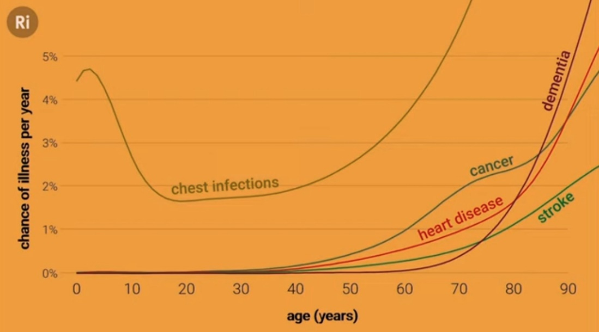
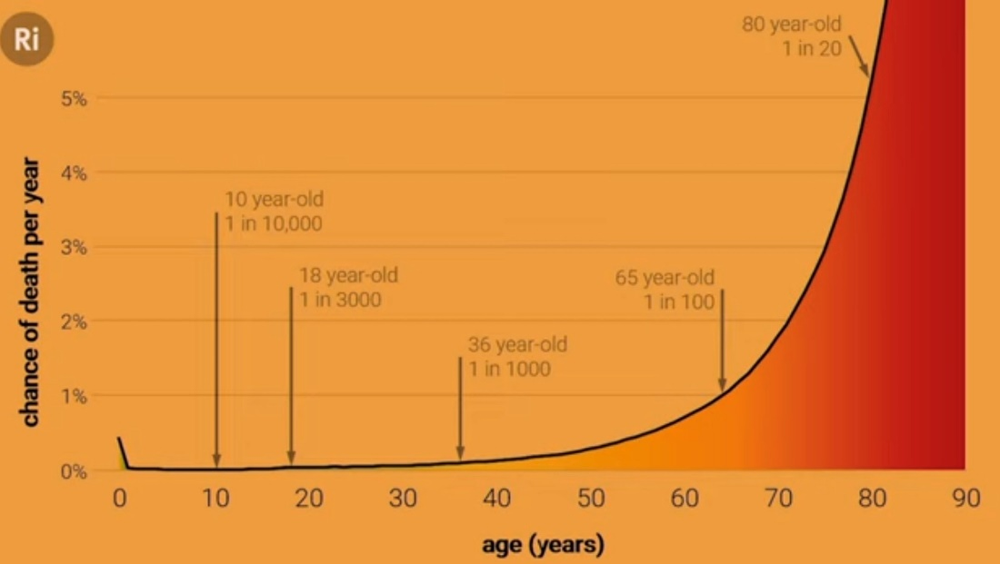

# Others

Created: 2019-01-23 23:18:57 +0500

Modified: 2022-06-09 17:01:31 +0500

---

**Blinkists**

1.  The End of Illness

2.  What to Eat When by Michael Roizen, Michael Crupain and Ted Spiker

3.  The Longevity Paradox by Dr. Stevan Gundry

4.  Eat to beat disease by William W. Li

**Autophagy**

Autophagy(orautophagocytosis) (from the[Ancient Greek](https://en.wikipedia.org/wiki/Ancient_Greek)αὐτόφαγοςautóphagos, meaning "self-devouring"andκύτοςkýtos, meaning "hollow") is the natural, regulated mechanism of the cell that disassembles unnecessary or dysfunctional components.It allows the orderly degradation and recycling of cellular components

<https://en.wikipedia.org/wiki/Autophagy>

**Homeopathy**

Homeopathy is a system of medicine that treats the individual with medicines that stimulate the body's self-healing mechanisms to restore its natural equilibrium

**Angiogenesis**

Physiological process through which new blood vessels form from per-existing vessels, formed in the earlier stage of vasculogenesis.
-   Vital process in growth and development, as well as in wound healing and in the formation of granulation tissue

**Tomography**

**Tomography**is[imaging](https://en.wikipedia.org/wiki/Image)by sections or sectioning, through the use of any kind of penetrating[wave](https://en.wikipedia.org/wiki/Wave). The method is used in[radiology](https://en.wikipedia.org/wiki/Radiology),[archaeology](https://en.wikipedia.org/wiki/Archaeology),[biology](https://en.wikipedia.org/wiki/Biology),[atmospheric science](https://en.wikipedia.org/wiki/Atmospheric_science),[geophysics](https://en.wikipedia.org/wiki/Geophysics),[oceanography](https://en.wikipedia.org/wiki/Oceanography),[plasma physics](https://en.wikipedia.org/wiki/Plasma_physics),[materials science](https://en.wikipedia.org/wiki/Materials_science),[astrophysics](https://en.wikipedia.org/wiki/Astrophysics),[quantum information](https://en.wikipedia.org/wiki/Quantum_information), and other areas of science. The word*tomography*is derived from[Ancient Greek](https://en.wikipedia.org/wiki/Ancient_Greek)τόμος*tomos*, "slice, section" and γράφω*graphō*, "to write" (see also[Etymology](https://en.wikipedia.org/wiki/Etymology)). A device used in tomography is called a**tomograph**, while the image produced is a**tomogram**.

<https://en.wikipedia.org/wiki/Tomography>

Your body has two types of sweat glands:
-   eccrine glands, which secrete an odorless mixture of water and salt to cool your skin and lower your body temperature
-   apocrine glands, which produce the smelly substance we usually associate with sweating

**Old Age / Ageing**
-   How you age

[Getting older without getting old - with Andrew Steele](https://www.youtube.com/watch?v=fX9P1xuIJGg)

Hydra don't age

**What is Ageing**

1.  DNA damage and mutations

2.  Trimmed telomeres

3.  Protein problems

4.  Epigenetic alterations

5.  Senescent cells

6.  Malfunctioning mitochondria

7.  Signalling changes

8.  Microbiome changes

9.  Cellular exhaustion

10. Immune malfunction

