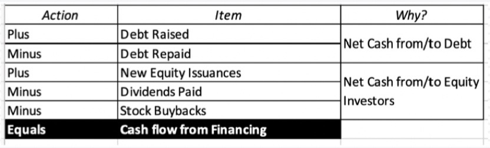

# 4: Cash Flow Statements - Cash In and Cash Out

Created: 2020-09-06 14:15:48 +0500

Modified: 2022-05-23 00:02:39 +0500

---

**The End Game with Cash Flows**
-   The surface level objective of a statement of cash flows is to explain how much the cash balance of a business changed during a period and why it changed.
-   Embedded in the statement of cash flows, though, is other information including:
    -   How much cash earnings the company had during the period, as contrasted with accural earnings (in income statements)
    -   How much and where the company reinvested cash during the period to sustain and grow its business
    -   How much cash it raised from or returned to its debt and equity investors
-   The statement of cash flows preserves the signs on cash flows, with negative cash flows shown as minuses and positive cash flows as pluses. It also looks at cash flows through the eyes of equity investors in the company

**Revisiting the Cash Flow Statement**

![Statement of Cash Flows Net cash flow from operations, after taxes and interest expenses Includes divestiture and acquisition of real assets (capital expenditures), disposal and purchase of financial assets and cash spent on acquisition of other firms. Net cash flow from the issue and repurchase of equity, from the issue and repayment of debt and after dividend payments. Net cash flow, after investing and financing Cash Flows From Operations + Cash Flows From Investing + Cash Flows from Financing --- etChangeinCash al ](media/Accounting-for-Finance_4--Cash-Flow-Statements---Cash-In-and-Cash-Out-image1.jpg)

1.  Cash flows from Operations

**The working capital effect?**
-   Embedded in the cash flow from operations is the change in working capital items, exclusing cash
    -   Non-cash working capital = non-cash current assets - non-debt current liabilities
    -   As increase in non-cash working capital will decrease cash flows, whereas a decrease in non-cash working capital will increase cash flows
-   To the extent that non-cash working capital ties up cash and capital, a firm with higher needs for the working capital will have lower cash flows from operations, for any given level of net income, than a firm with lower needs

2.  **Cash flows from Investing**

**Operating or Non-operating assets**
-   The investing activities section includes investments in both operating and non-operating assets, except for investment in liquid, close to riskless securities, which is treated as cash & marketable securities
-   The investments into operating assets, whether internal (cap ex, net of divestitures) or external (acquisitions of other companies) are the engine that drives growth in the operating line items (revenues, operating income etc.) Note that acquisitions funded with stock will not show up here for obvious reasons
-   The investments into non-operating assets create a separate source of value, where the payoff will not show up in the operating line items but below the operating income line, as income from cross holdings or securities

3.  **Cash flows from Financing**

**Debt cash flows**
-   While interest expenses show up in the operating cash flow section, by reducing net income and showing up in deferred taxes, debt repayments are part of the financing section
-   To the extent that some or all of these debt repayments are funded with debt issuances, the net effect on cash flows can be neutralized or become positive
-   **If total debt increases during a period, it will represent a cash inflow, and if it decreases, it will be a cash outflow. Companies that embark on plans to bring their debt down (up) over time should therefore expect these consequences**

**Dividends and Buybacks**
-   Until the 1980s, the only cash flow that was received by equity investors in publicly traded companies was dividends. The effect of paying dividends is simple: it reduces the cash balance at the company and increases the cash in the pockets of every shareholder who receives dividends.
-   Starting in the 1980s, US companies have returned increasing amounts to their shareholders in the form of buybacks.
    -   The effect of buying back stock is exactly the same as paying dividends, to the company, with cash leaving the company.
    -   Fore shareholders, though, the cash flow effect is disparate. Those shareholders who sell their shares back get cash form the company, and those that do not get no cash, but get a larger share of the equity left in the company.
    -   Both dividends and buybacks reduce shareholder equity on the balance sheet.

**Free Cash Flow to Equity - FCFE**
-   A measure of equity cash usage, free cash flow to equity calculates how much cash is available to the equity shareholders of a company after all expenses, reinvestment, and debt are paid.
-   Free cash flow to equity is composed of net income, capital expenditures, working capital, and debt.
-   The FCFE metric is often used by analysts in an attempt to determine the value of a company.
-   FCFE, as a method of valuation, gained popularity as an alternative to the **dividend discount model (DDM)**, especially for cases in which a company does not pay a dividend.

<https://www.investopedia.com/terms/f/freecashflowtoequity.asp>

**Dividend Discount Model (DDM)**

The dividend discount model (DDM) is a quantitative method used for predicting the price of a company's stock based on the theory that its present-day price is worth the sum of all of its future[dividend](https://www.investopedia.com/terms/d/dividend.asp)payments when[discounted](https://www.investopedia.com/terms/d/discounting.asp)back to their present value. It attempts to calculate the fair value of a stock irrespective of the prevailing market conditions and takes into consideration the dividend payout factors and the market expected returns. If the value obtained from the DDM is higher than the current trading price of shares,then the stock is undervalued and qualifies for a buy, and vice versa.

<https://www.investopedia.com/terms/d/ddm.asp>

**Time Value of Money (TVM)**
-   Time value of money means that a sum of money is worth more now than the same sum of money in the future
-   This is because money can grow only through investing. An investment delayed is an opportunity lost
-   The formula for computing the time value of money considers the amount of money, its future value, the amount it can earn, and the time frame
-   For savings accounts, the number of compounding periods is an important determinant as well

<https://www.investopedia.com/terms/t/timevalueofmoney.asp>

**Potential Dividends (FCFE)**

![Session 4: Post Class tests I. 2. 3. 4. 5. To get to operating cash flows, which of the following do we do, to start the process? a. b. c. d. e. Start with EBITDA and subtract out depreciation, amortization and other non-cash charges Start with EBIT and add back depreciation, amortization and other non-cash charges Start with Net Income and add back depreciation, amortization and other non-cash charges Start with EBIT and subtract out depreciation, amortization and other non-cash charges Start with Net Income and subtract out depreciation, amortization and other non-cash charges Following up, we then bring in changes in current assets, like inventory, and current liabilities, like accounts payable. Which of the following best describes the effect of those changes? a. b. c. d. e. Increases in inventory decrease cash flows and increases in accounts payable increase cash flows. Increases in inventory increase cash flows and increases in accounts payable decrease cash flows. Increases in inventory decrease cash flows and increases in accounts payable also decrease cash flows. Increases in inventory increase cash flows and increases in accounts payable also increase cash flows. Increases in inventory and increases in accounts payable do not affect cash flows. Embedded in investing cash flows are acquisitions made by the company. These acquisitions can be paid for with cash, with stock or with a mix of cash and stock. Which of the following will show up under investing activities? a. Only stock-based acquisitions b. Only cash-based acquisitions. c. Cash-based acquisitions and cash portion of mixed acquisitions d. Cash-based acquisitions and stock portion of mixed acquisitions e. All acquisitions Dividends can be cash dividends or stock dividends and share buybacks can be either to keep as treasury stock or to reduce share count. Which of the following will show up in the financing section? a. All dividends, no share buybacks b. All dividends, all buybacks c. Cash dividends, no share buybacks d. Cash dividends, all share buybacks e. Cash dividends, only share buybacks that reduce share count f. Cash dividends, only share buybacks for treasury stock If you are looking at the statement of cash flows for a very young, high- growth company, which of the following would you expect to see? ](media/Accounting-for-Finance_4--Cash-Flow-Statements---Cash-In-and-Cash-Out-image6.jpg)

![a. b. c. d. e. Positive cash flow from operations, Negative cash flow from investing and Negative cash flow from financing Negative cash flow from operations, Negative cash flow from investing and Positive cash flow from financing Negative cash flow from operations, Positive cash flow from investing and Negative cash flow from financing Negative cash flow from operations, Negative cash flow from investing and Negative cash flow from financing Positive cash flow from operations, Positive cash flow from investing and Positive cash flow from financing ](media/Accounting-for-Finance_4--Cash-Flow-Statements---Cash-In-and-Cash-Out-image7.jpg)

![1. 2. 3. 4. 5. Session 4: Post class test solutions c. Start with Net Income and add back depreciation, amortization and other non-cash charges. The statement of cashflows is constructed from the perspective of equity investors and it starts with net income, not EBITDA or operating income. a. Increases in inventory decrease cash flows and increases in accounts payable increase cash flows. An increase in inventory ties up cash flows, but an increased use of supplier credit (accounts payable) releases cash flows. c. Cash-based acquisitions and cash portion of mixed acquisitions. It is a statement of cash flows. So, only cash spent on acquisitions, in part or in full, show up under investing. d. Cash dividends, all share buybacks. Stock dividends have no cash effect and all stock buybacks, no matter what the motive, are going to be cash outflows. b. Negative cash flow from operations, Negative cash flow from investing and Positive cash flow from financing. Young companies generally lose money and have little depreciation to add back, as well as substantial investment needs (to deliver future growth). These cash outflows all have to be funded with cash infusions from financing (mostly from equity). ](media/Accounting-for-Finance_4--Cash-Flow-Statements---Cash-In-and-Cash-Out-image8.jpg)

