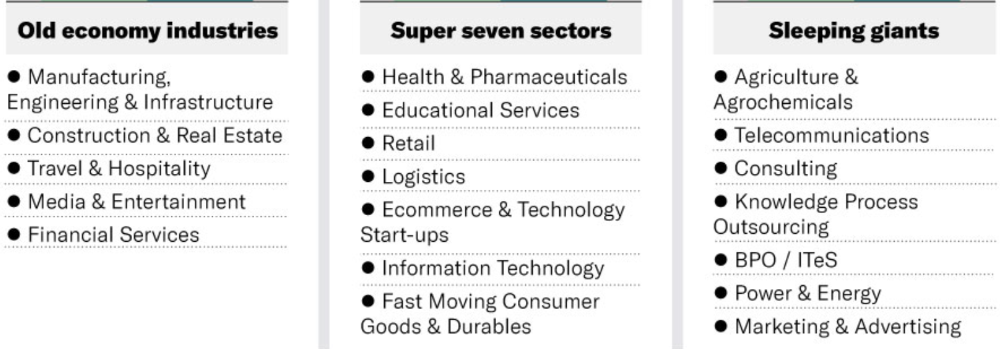
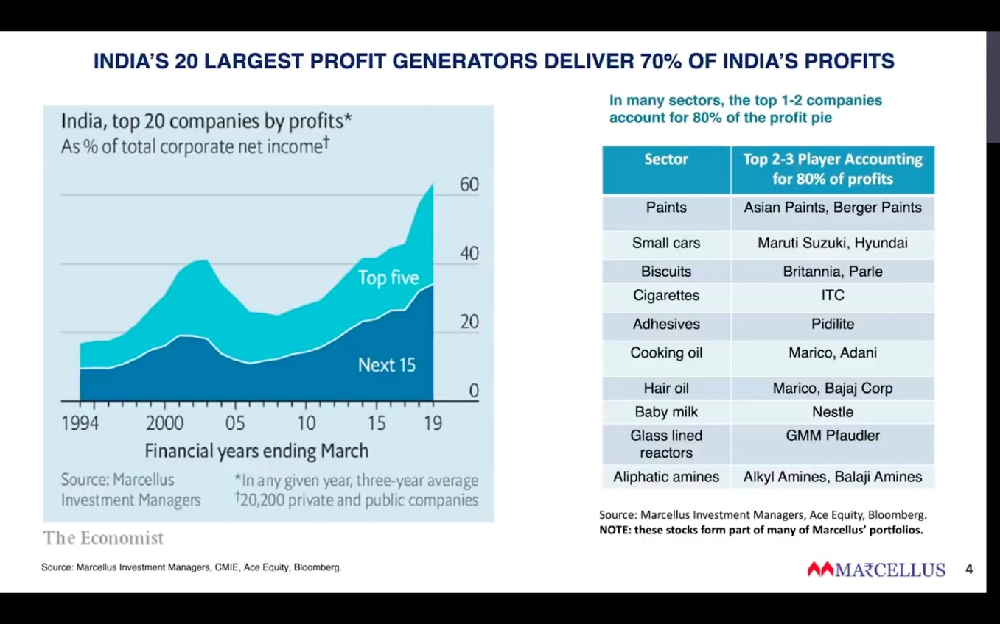
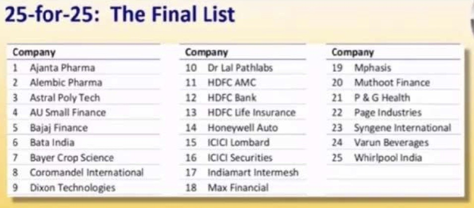
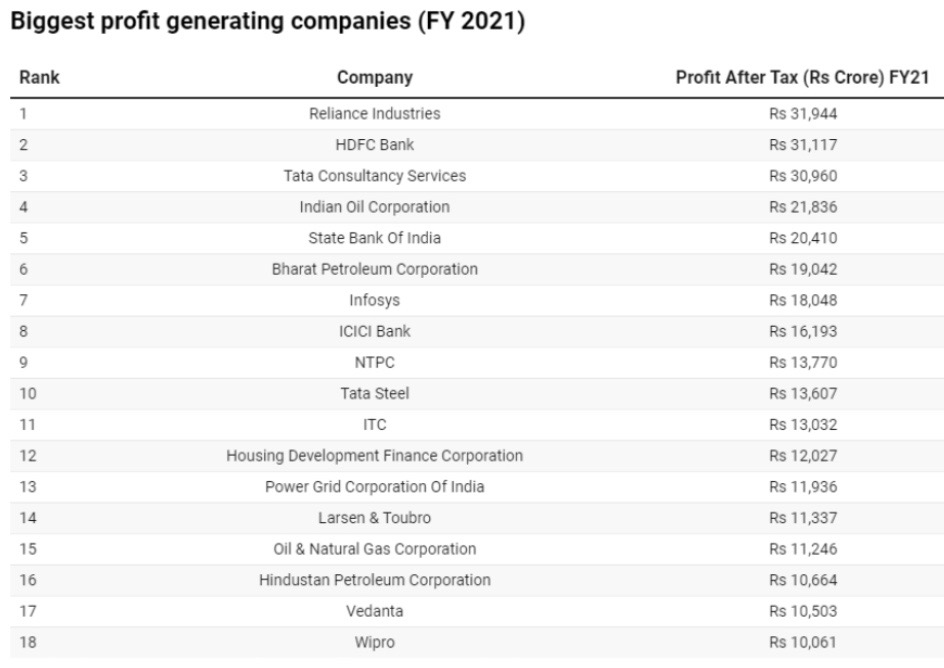
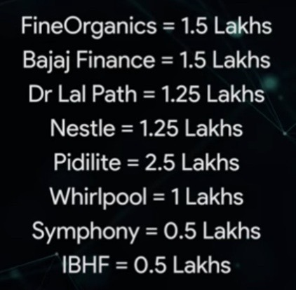
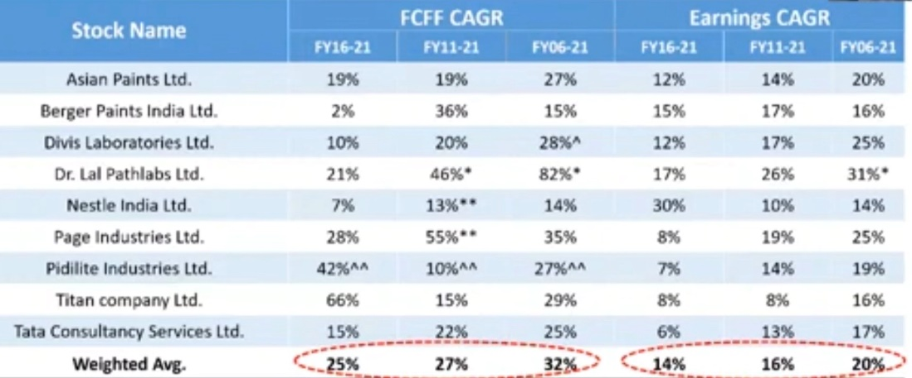
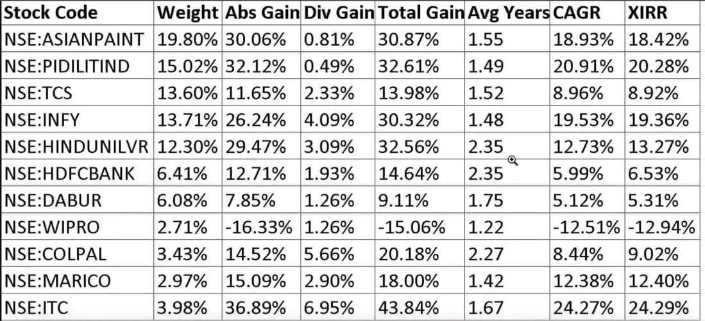
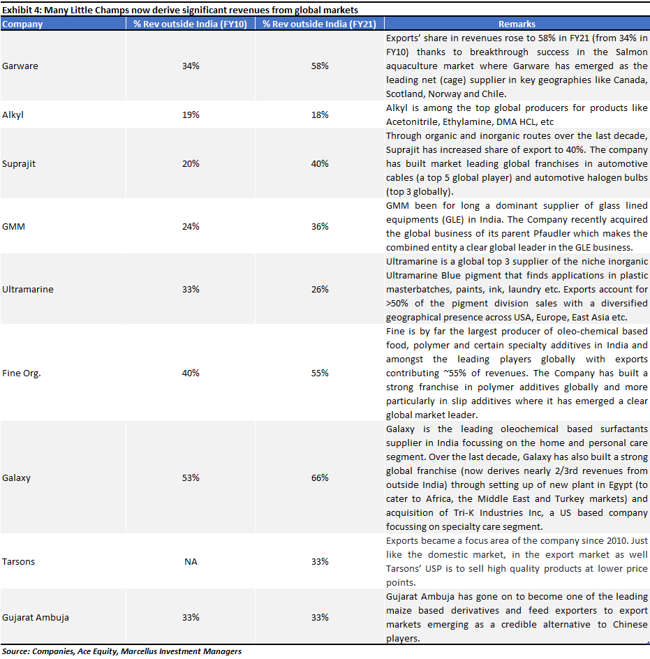

# Stocks

Created: 2022-01-30 11:49:58 +0500

Modified: 2022-09-04 23:04:48 +0500

---

The stock market is a device for transferring money from the impatient to the patient -- Warren Buffet

<https://marcellus.in/newsletter/consistent-compounders/studying-the-holiday-schedule-of-consistent-compounders>

Selling stock is as important as buying stock

Don't sell the stocks which gives you high returns, sell the negative or no returns stock

Long-term capital gains from the transfer of equity shares (listed and non-listed) or from stake sales in a startup can be avoided under section 54F of the Income Tax Act, 1961, if the gains are invested in residential property.

## Screener

<https://www.screener.in/explore>

<https://www.screener.in/screens/103296/52-week-lows>

<https://www.screener.in/screens/343087/fii-buying>

<https://www.tickertape.in/screener/equity/prebuilt/SCR0001>

<https://www.screener.in/screens/218753/marcellus-little-champs>

<https://www.screener.in/screens/395078/consistent-compounders-marcellus>

<https://www.screener.in/screens/523311/rising-giants-marcellus>

## Invested

- **Indigo**
- **Pidilite**

## NiftyETF

## Industry Sectors

- Communication Services
- Consumer Discretionary
- Consumer Staples
- Energy
- Financials
- Health Care
- Industrials
- Information Technology
- Materials
- Real Estate
- Utilities

## Industry Groups

<https://en.wikipedia.org/wiki/Global_Industry_Classification_Standard>

## Five Fusty Sectors

- manufacturing, engineering and infrastructure
- construction and real estate
- travel and hospitality
- media and entertainment
- financial services

## Super Seven sectors

- e-commerce
- tech startups
- logistics
- retail
- educational services
- healthcare

## Company / Companies

- Adani Energy
- HINDUNILVR
- ASIANPAINT
- PIDILITIND
- TCS
- HDFCBANK
- INFY
- COLPAL
- ITC
- MARICO
- HINDPETRO
- IOC
- COALINDIA
- VEDL
- GODREJCP
- WIPRO
- DABUR

## Freefincal direct equity list

- **Happiest Minds**
- **Dixon**

## Marcellus

1. Private sector banks

2. Asian Paints and Berger Paints (the most efficient paint manufacturers), Astral Poly (the most efficient CPVC pipe manufacturer), Pidilite (the most efficient adhesives and waterproofing manufacturer) and Titan (the most efficient jeweler).

- HDFC Bank
- Dr Lal PathLabs
- GMM Pfaudler
- Amrutanjan

<https://marcellus.in/blogs/three-distinct-layers-of-polarization-in-the-indian-stock-market>

## Top retail investors

1. Rakesh Jhunjhunwala and Associates

2. Premji and Associates

3. Radhakishan Damani

4. Mukul Agrawal

5. Mukul Mahavir Prasad Agarwal

<https://www.moneycontrol.com/india-investors-portfolio>
