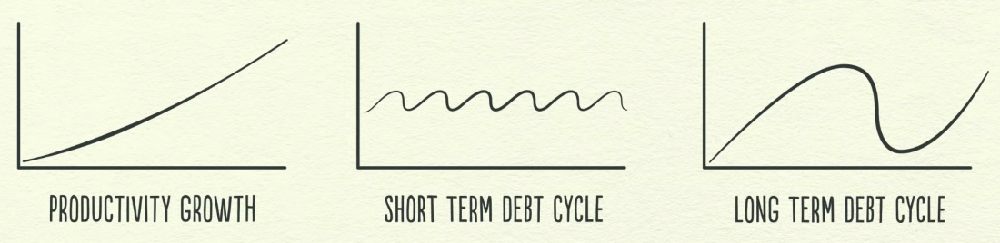
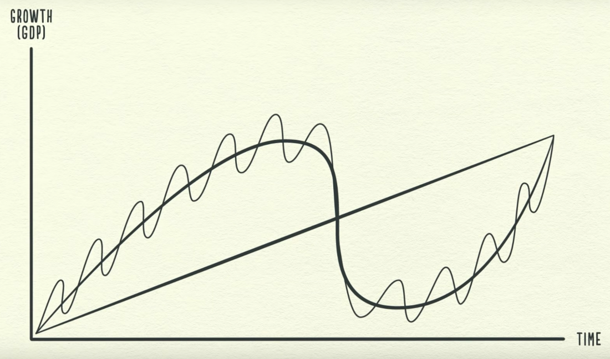

# Intro

[**https://en.wikipedia.org/wiki/Outline_of_economics**](https://en.wikipedia.org/wiki/Outline_of_economics)

Crash Course - [Economics](https://www.youtube.com/playlist?list=PL8dPuuaLjXtPNZwz5_o_5uirJ8gQXnhEO)

## How the economic machine works

1. Transactions

Exchanging money or credit for goods, services or financial assets

2. Market

3. Government

   - Central government (collect taxes and spend money)

   - Central bank (control the amount of credit and money in the economy)

       - Influencing interest rates

       - Printing new money

4. Credit is the most important part of economy (biggest and most volatile)

   - Lenders

   - Borrowers

       - Creditworthy borrower

            1. The ability of repay

            2. Collateral if he can't

5. One person's spending is another's person income

6. Credit is bad if it increases overspending on luxury items, it is good if it is used to increase productivity.

7. Debt swings

   - **Short term debt cycle: 5-8 years**

Average business cycle -- the time between **recessions** -- is about **eight** years.

2. **Long term debt cycle: 75-100 years**

   - Long term debt peak

   - Deleveraging

Less spending -> Less income -> Less wealth -> Less credit -> Less borrowing

3. Solving deleveraging

   - Cut spending (Austerity)

   - Reduce debt (Debt restructuring)

       - Central government deficit (budget deficit)

   - Redistribute wealth (from the haves to the have nots)

   - Print money (Inflationary and stimulative)

       - Central bank prints money to buy financial assets and government bonds

   - Beautiful deleveraging

8. Asset

9. Liability

10. Inflation
    - Packaged Inflation / Shrinkflation / Shadow Inflation
    - Stagflation

<https://finshots.in/archive/secret-inflation>

## Why Constant Inflation is Bad

If people start thinking that the price rise could persist indefinitely, then, they'll panic. They'll ask for a pay rise. Landlords will start raising rent indiscriminately. Businesses will bump up the final price of everyday items like milk and bread.

Ergo, that expectation and consequent behaviour alone could trigger further inflation.

It's a vicious cycle.

11. Deflation

12. Recession

13. Expansion

14. Debt burden

- High debt burden

- Low debt burden

15. Depression

16. Reflation

17. Lost decade

Book - <https://www.principles.com/big-debt-crises> Free pdf

## Ecnomic school of thought

- Classical
- Socialist > Marxian Economics

## Marxian economics

**Marxian economics**, or the **Marxian school of economics**, is a [heterodox](https://en.wikipedia.org/wiki/Heterodox_economics) school of political economic thought. Its foundations can be traced back to Marx [critique of political economy](https://en.wikipedia.org/wiki/Critique_of_political_economy). Marxian economics comprises several different theories and includes multiple schools of thought, which are sometimes opposed to each other, and in many cases Marxian analysis is used to complement or supplement other economic approaches.Because one does not necessarily have to be politically [Marxist](https://en.wikipedia.org/wiki/Marxism) to be economically Marxian, the two adjectives coexist in [usage](https://en.wikipedia.org/wiki/Usage) rather than being [synonymous](https://en.wikipedia.org/wiki/Synonym). They share a [semantic field](https://en.wikipedia.org/wiki/Semantic_field) while also allowing [connotative](https://en.wikipedia.org/wiki/Connotation) and [denotative](https://en.wikipedia.org/wiki/Denotation) differences

- Austrian
- Keynesian
  - **counter cyclical fiscal policy**

measures which counteract the effects of the economic cycle

<https://www.investopedia.com/terms/k/keynesianeconomics.asp>

- Mercantalism
  - an economic policy that is designed to maximize the exports and minimize the imports for an economy

- Laissez-faire

Laissez-faire (from [French](https://www.wikiwand.com/en/French_language):laissez faire, [lit.](https://www.wikiwand.com/en/Literal_translation)'let do') is an [economic system](https://www.wikiwand.com/en/Economic_system) in which transactions between private parties are absent of any form of [economic interventionism](https://www.wikiwand.com/en/Economic_interventionism) such as [regulation](https://www.wikiwand.com/en/Regulation) and [subsidies](https://www.wikiwand.com/en/Subsidy). As a system of thought, laissez-fairerests on the axiomsthat the individual is the basic unit in society and has a natural right to freedom; that the physical order of nature is a harmonious and self-regulating system; and that corporations are creatures of the state and therefore the citizens must watch them closely due to their propensity to disrupt the Smithian [spontaneous order](https://www.wikiwand.com/en/Spontaneous_order).

<https://www.wikiwand.com/en/Laissez-faire>

- Anarcho-capitalism

Anarcho-capitalismis a [political philosophy](https://www.wikiwand.com/en/Political_philosophy) and [economic theory](https://www.wikiwand.com/en/Economic_theory) that advocates the elimination of [centralized states](https://www.wikiwand.com/en/Centralized_state) in favor of [free markets](https://www.wikiwand.com/en/Free_market), [private property](https://www.wikiwand.com/en/Private_property) and the [right-libertarian](https://www.wikiwand.com/en/Right-libertarian) interpretation of [self-ownership](https://www.wikiwand.com/en/Self-ownership). In the absence of [statute](https://www.wikiwand.com/en/Statute), anarcho-capitalists hold that society tends to [contractually](https://www.wikiwand.com/en/Contract) self-regulate and civilize through participation in the free market which they describe as a [voluntary society](https://www.wikiwand.com/en/Voluntary_society). Anarcho-capitalists support [wage labour](https://www.wikiwand.com/en/Wage_labour) and believe that neither protection of person and property nor victim compensation requires a state. In a theoretical anarcho-capitalist society, the system of private property would still exist and be enforced by [private defense agencies](https://www.wikiwand.com/en/Private_defense_agencies) and [insurance companies](https://www.wikiwand.com/en/Insurance_companies) selected by customers which would operate competitively in an [open market](https://www.wikiwand.com/en/Open_market) and fulfill the roles of [courts](https://www.wikiwand.com/en/Court) and the [police](https://www.wikiwand.com/en/Police).

<https://www.wikiwand.com/en/Anarcho-capitalism>

## Autarky

- economic independence or self-sufficiency
- a country, state, or society which is economically independent
- a [military](https://en.wikipedia.org/wiki/Military) autarky would be a state that could defend itself without help from another country, or could manufacture all of its weapons without any imports from the outside world.

## Capitalism

Problem with Capitalism - It creates a problem, and rather than fixing the problem, it creates a new business to solve the problem

[Is capitalism actually broken?](https://www.youtube.com/watch?v=wcR815SfWOU)

## Economic machine of a country

- Capital - all the stuff that a business might use, including intangibles like ideas
- Labor - people's work
- Natural resources

## Valuation

<https://www.youtube.com/playlist?list=PLUkh9m2BorqnKWu0g5ZUps_CbQ-JGtbI9>

Value Driver

1. Revenue Growth
2. Operating Margin
3. Capital Ratio
4. Cost of Capital

Industries

- Corporate finance
- Investment banking
- Public and private markets

## Finance activites

- PFR - Project Finance Report
- Cost model
- WCM - Working Capital Management
  - Capex planning requirement
  - Dealing with recieables and payable
- Treasury management
- Corporate action planning
- Investor relation

## Others

<https://finshots.in/archive/finshots-special-how-to-be-a-rational-investor>
