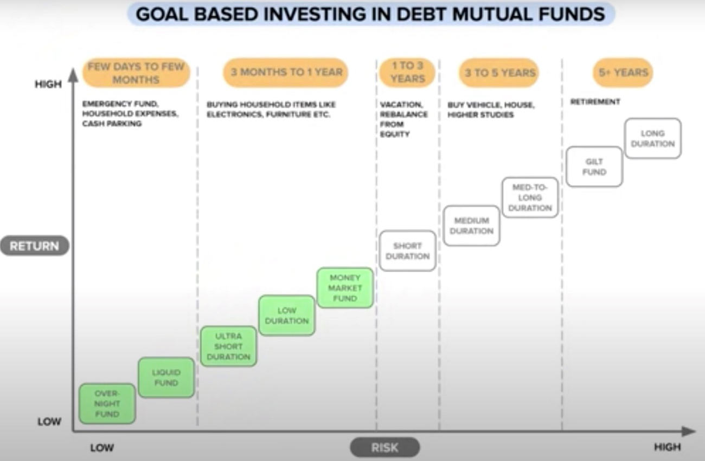

# Debt Mutual Funds

Created: 2021-08-23 17:07:35 +0500

Modified: 2022-04-19 22:18:31 +0500

---

<https://zerodha.com/varsity/chapter/the-debt-funds-part-1

<https://zerodha.com/varsity/chapter/government-securities

<https://www.thefixedincome.com

## Debt Funds / Income Funds / Bond Funds
-   <https://www.thefixedincome.com
-   <https://www.bharatbond.in

## MFs
-   Quantum Liquid Fund + ICICI Arbitrage Fund

They are a type of mutual funds that invest primarily in fixed income instruments (such as bonds) issued by government, public and private companies. These funds get interest from these borrowers, which is then reflected in the returns of debt investments.

Debt funds, alternatively known as fixed-income funds or credit funds, come under the fixed income asset category of mutual funds. They are low-risk investments vehicles and are comparatively more secure than equity funds which are subject to volatile market forces.

There are several avenues through which you can invest in thebest performing debt fundsfor higher returns. It can be long-term or short-term bonds, monthly income plans (MIPs), floating-rate debt, money market instruments, fixed maturity plans (FMPs) or security products.

[Debt Mutual Funds](http://email.info.paytmmoney.com/wf/click?upn=CK3nLlrM7MlJV3MxyjGbYKT3UouLeg7phHd0GSqL4H8ouhNw2turuxUsaXwS1t74_mJi8Qyxl6vjZFuOwDEFvIlGczZ87gm-2BujsPbsKBbAPTyj6WVVrVBnrVnuW9pa-2BEh6x-2FNHbvxQqSjSHVYhUG2bZ-2B3KuAKYX3-2F4hmczOfEay4XCb7PY1l4RRJWp9RqAe36l9GQzNVsDPcqaQ5xTNaD0xTPkU-2FwuA-2FnubMndVJM9LgKvlloauVm7uiVu9f19Yk5-2BSGYN7cDAqJgzN5rhnDMHEN-2FLBl-2BRDgf6m4sakFZkcIa7f6W9b9TnpVGHh1NkGHKmKtyMWCB5Vyy6ErkvQhoLttvMX19gv7tssYtIbdTniE-3D)can be broadly classified into:
-   **Theme based:**SEBI has defined some categories based on the kind of instruments the mutual fund invests in, for example, corporate bonds, Government bonds, etc.
-   **Duration based:**These funds are based on maturity or Macaulay duration of the fund. The Macaulay Duration is the time taken for a bond to repay its own purchase price in present value terms.

Below are ten such duration based categories of debt funds as defined by SEBI:

| **Category of Schemes**                                                                                                                                                                                                                                                                                                                                                                                                                                          | **Macaulay Duration [Volatility increases with duration]** | **3 Year Annualised Returns** |
|-------------------------------|--------------------------|---------------|
| [Overnight Funds](http://email.info.paytmmoney.com/wf/click?upn=CK3nLlrM7MlJV3MxyjGbYIcYwAAxA3cU3zhUeGBzXBs-3D_mJi8Qyxl6vjZFuOwDEFvIlGczZ87gm-2BujsPbsKBbAPTyj6WVVrVBnrVnuW9pa-2BEh6x-2FNHbvxQqSjSHVYhUG2bTtPZEs1mE7duNdx-2BQtZ0jIYEUmKH6tqqA8THYlA9JBpu39qHqT8J-2Fev6pPbg192goCsW1MZxLp5Xvam3ljPG1uy-2BOv0ehIIYntGkZeKWRgjSApF9mH-2FoEHbWAJk5ULnerbFzy3-2BWCV4SnkWOETnRjWT3Z7pbRMXM9BjhWrCiyVp2-2Ba8sFRreOTQ3AZZfjYx8yq4-2FdVD8y27TWBgeOKQLK4-3D)               | *Maturity up to 1 Day                                       | 6.39 %                        |
| [Liquid Funds](http://email.info.paytmmoney.com/wf/click?upn=CK3nLlrM7MlJV3MxyjGbYAWvCsGQ8BuPm8Si2hkM5Es-3D_mJi8Qyxl6vjZFuOwDEFvIlGczZ87gm-2BujsPbsKBbAPTyj6WVVrVBnrVnuW9pa-2BEh6x-2FNHbvxQqSjSHVYhUG2bafZdS3gLQHxIRasdDlQ0P9mE5vIAw-2BsWN6f9THfcZsxWL1v0mogQzc0Ki6BEEuSfgdcsjz2hoZJZxXm798AQQqNJY6ZmapltLfWoVlFCUEAKq8ipMzb-2FpZM6tQVjUfxJmzEV4RzYa71uiOvfXsutTwGr91UDoTo0dDc7Q-2By1DJ-2FWFwUWRQclkoCyWnUNUwigi8RiQybM-2F8-2BFd-2FJwSarTmE-3D)                  | *Maturity up to 91 Days                                     | 6.85 %                        |
| [Ultra Short Duration Funds](http://email.info.paytmmoney.com/wf/click?upn=CK3nLlrM7MlJV3MxyjGbYO84-2B74qRyuCub80xnbkJGM-3D_mJi8Qyxl6vjZFuOwDEFvIlGczZ87gm-2BujsPbsKBbAPTyj6WVVrVBnrVnuW9pa-2BEh6x-2FNHbvxQqSjSHVYhUG2bbRUMpOlbdSc9yd-2F7CC61NwyaMjZmgS3S0KREyCloDTc2BFw-2F3JIKo6fUtiJALfq1i9FfostwSYHDku9Sl3xrZP2b-2B7d5X-2BQUzh2a5z7StKpWzKCPtvhWQpq2EARMDtSPamSqR9tphNDw7ve8puQq2M4d7sxHrqS89qVdbkhBcfGPuDQ8DYdKyk7gup4DfYFfI8YULHDTjSmhgu1gCZnaLw-3D)        | Between 3 to 6 Months                                        | 7.34 %                        |
| [Low Duration Funds](http://email.info.paytmmoney.com/wf/click?upn=CK3nLlrM7MlJV3MxyjGbYMyvyhgbqB470ZkX-2FjPsJI8-3D_mJi8Qyxl6vjZFuOwDEFvIlGczZ87gm-2BujsPbsKBbAPTyj6WVVrVBnrVnuW9pa-2BEh6x-2FNHbvxQqSjSHVYhUG2bWSQQa-2FMhnszxicvryvVV4Oj-2BlJxiflLDYoR55NDmtQN7UhnN4txVmhVMJm5x4UTIZ-2BdSUaO0EQOsB6TpMyO31NO9R5MLacZtBDK2RUpT65vEp8ln2KBL2rYht0BCMAxXj1pFz2HMMiUyJWtI2HkC9K9ruVtkiFPQDY2gZsE0XZJdy6qvb1x0Gprg7Z3PaXql5A1XyL0-2BmkNpoXtbxYjbBk-3D)                | Between 6 to 12 Months                                       | 7.88 %                        |
| [Money Market Funds](http://email.info.paytmmoney.com/wf/click?upn=CK3nLlrM7MlJV3MxyjGbYBHj5XpEEFLMjwIeLI1i4-2F4-3D_mJi8Qyxl6vjZFuOwDEFvIlGczZ87gm-2BujsPbsKBbAPTyj6WVVrVBnrVnuW9pa-2BEh6x-2FNHbvxQqSjSHVYhUG2beNUEHqK3MBpvynZfoG4aCHkVR28mprPelEoXdq4cWYzkQu-2FbRccgvnq3fx9iIbH4Iwf7jEYLdXXaZQg1ajzmOFmE99YimAo2FmF4jQ-2F8tN8Ba4GWzHrR5Xlk7HBd1E9PeU2NZDyI1VhelZaFA6PtiEvrTFJi5slcwAOrRWqEAS-2Bi6fp9qW-2FZVuHgd18gQfg-2FI16cpTxQeEkClADXQ4YzC0-3D)              | *Maturity up to 1 Year                                      | 7.31 %                        |
| [Short Duration Funds](http://email.info.paytmmoney.com/wf/click?upn=CK3nLlrM7MlJV3MxyjGbYKgb8IniB7mqp8EB3WmzMCI-3D_mJi8Qyxl6vjZFuOwDEFvIlGczZ87gm-2BujsPbsKBbAPTyj6WVVrVBnrVnuW9pa-2BEh6x-2FNHbvxQqSjSHVYhUG2bUFAg5LdWNbZJehHBQaO9cn4iW9RjI3ctbU-2BCxI0i6yeyLSIZ2Hjt8Ai9a-2F-2BMbWUA7BKKFEOnJqVHm0gLtoJFoOfVQ6bYp2DAyaQXiwaglsxfZM0Kdmg4MZappZOOZquyP6YG13nxwy9-2BvCWwoFOVE3gCQvcEdt-2FO3zEdTGx2rO-2FKvOwDOeAubxV65ygl8bAiUVVfUTPO5lBW06H-2FsIUowo-3D)          | Between 1 to 3 Years                                         | 7.74 %                        |
| [Medium Duration Funds](http://email.info.paytmmoney.com/wf/click?upn=CK3nLlrM7MlJV3MxyjGbYBGK2ABEBYiqPOtLI-2BcT0QU-3D_mJi8Qyxl6vjZFuOwDEFvIlGczZ87gm-2BujsPbsKBbAPTyj6WVVrVBnrVnuW9pa-2BEh6x-2FNHbvxQqSjSHVYhUG2bZFFDbTHSDfZt6ISTi-2FvPTGG63LGuwE-2FUcFSqOtCgYHSXmLuqBBcAR1eUxN50yYrDgZTXP4EidqJI4LSfRZ59Gs4xRDiPFj9skrgP2dK2IdHvi-2BU1-2B-2FiDqfMasQx-2Be6ORitZkKJPdIN3rwR0BgUTGI5TonSP3RbAc9JPP-2F44mhcUc55cbTlMenoZlvaAQ7wEtn0I3Nhs8IhcHiRkYR7iMeE-3D)       | Between 3 to 4 Years                                         | 7.90 %                        |
| [Medium to Long Duration Funds](http://email.info.paytmmoney.com/wf/click?upn=CK3nLlrM7MlJV3MxyjGbYLOhE7-2FGF9jiOJUmHHwvz1E-3D_mJi8Qyxl6vjZFuOwDEFvIlGczZ87gm-2BujsPbsKBbAPTyj6WVVrVBnrVnuW9pa-2BEh6x-2FNHbvxQqSjSHVYhUG2bf84ZWrbEZj4qvOAhJsSwzClQ86MUVROBelAgVE-2Fs6W-2FclrJEgLdNSFOPWfreUBTnYbvekLPJ-2F25jH2DVmkMAJzPnqP64tMlpTAhjgvwb9QolsEht15dzlYQXQBG8Xz2iNHbubvWDDH590VW-2BFB7i-2FnN18jpqNBtvsaRXMrHJW9HQ7WCl51uWtPFZek7HGK5AkfGBHbBSKEz6N-2F1mH3bXy4-3D) | Between 4 to 7 Years                                         | 7.05 %                        |
| [Long Duration Funds](http://email.info.paytmmoney.com/wf/click?upn=CK3nLlrM7MlJV3MxyjGbYGnIAnr1fx7w-2BGf68gFqG08-3D_mJi8Qyxl6vjZFuOwDEFvIlGczZ87gm-2BujsPbsKBbAPTyj6WVVrVBnrVnuW9pa-2BEh6x-2FNHbvxQqSjSHVYhUG2bWPaE9jw7PVbxZprZ2TWEfyOMfFnkm-2BrpiUA-2BZZyqbL7FzoN0Da-2B3FCBMPGqHjIi-2FxxpJkbvh-2B4-2FhFixvvQ5tiecnV2V9FMRZ3eWUiGo4XuVbIpB1uQpON6PZ5kuLj2Hzw5nTLysz3H7HECNtM6rFn3956AvqlmIU4ioUzfaKKcIxPlrhRs6MKdM-2B36cuppSqefa1Wowgl7BzxPmonv2czY-3D)         | Greater than 7 Years                                         | 8.60 %                        |
| Dynamic Bond Fund                                                                                                                                                                                                                                                                                                                                                                                                                                                |                                                             |                              |
| Corporate Bond Fund                                                                                                                                                                                                                                                                                                                                                                                                                                              |                                                             |                              |
| Credit Risk Fund                                                                                                                                                                                                                                                                                                                                                                                                                                                 |                                                             |                              |
| Banking and PSU Fund                                                                                                                                                                                                                                                                                                                                                                                                                                             |                                                             |                              |
| Gilt Fund                                                                                                                                                                                                                                                                                                                                                                                                                                                        |                                                             |                              |
| Gilt with 10Y constant duration fund                                                                                                                                                                                                                                                                                                                                                                                                                             |                                                             |                              |
| Floater Fund                                                                                                                                                                                                                                                                                                                                                                                                                                                     |                                                             |                              |
| IDCW - Income Distribution cum Capital Withdrawal / Divident plans                                                                                                                                                                                                                                                                                                                                                                                               |                                                             |                              |

[How to select a debt mutual fund?](https://www.youtube.com/watch?v=8R4yoe2dRIQ)

[Debt Mutual Funds for Beginners Part 2 | Use YTM & Modified Duration to Improve Returns & Lower Risk](https://www.youtube.com/watch?v=1BTke9iLuYg&ab_channel=ETMONEY)
-   Coupon rate / Interest rate on bonds
-   Debt fund factsheet
-   Yield to maturity (YTM) / book yield / redemption yield
    -   Face value
    -   Market price / Par value / At par
    -   At discount (better yields)
    -   At premium (lower yields)
    -   Time value of money (Since the interest will get reinvested, interest at 1st year will be invested for 9 years, whereas interest received at 9th year, will be invested only for 1 year)

Yield to maturity (YTM) is the total return anticipated on a bond if the bond is held until it matures. Yield to maturity is considered a long-term[bond yield](https://www.investopedia.com/terms/b/bond-yield.asp)but is expressed as an annual rate. In other words, it is the[internal rate of return](https://www.investopedia.com/terms/i/irr.asp)(IRR) of an investment in a bond if the investor holds the bond until maturity, with all payments made as scheduled and reinvested at the same rate.

-   Yield to maturity (YTM) is the total rate of return that will have been earned by a bond when it makes all interest payments and repays the original principal.
-   YTM is essentially a bond's internal rate of return (IRR) if held to maturity.
-   Calculating the yield to maturity can be a complicated process, and it assumes all coupon or interest, payments can be reinvested at the same rate of return as the bond.
-   If the YTM is higher than the coupon rate, this suggests that the bond is being sold at a discount to its par value. If, on the other hand, the YTM is lower than the coupon rate, then the bond is being sold at a premium.

<https://www.investopedia.com/terms/y/yieldtomaturity.asp>

[What is Yield to Maturity? | How to Calculate YTM? | CA Rachana Ranade](https://www.youtube.com/watch?v=xifvYllUGso)

## Yield Curve

[The Yield Curve Just Inverted. What Next For Investors?](https://youtu.be/1d2NGMKxhj4)

Inverse relationship between price of bond and yield, if price of bond goes up yield comes down and vice versa

-   Average maturity
-   Macaulay duration

The Macaulay duration is the[weighted average](https://www.investopedia.com/terms/w/weightedaverage.asp)[term to maturity](https://www.investopedia.com/terms/t/termtomaturity.asp)of the cash flows from a[bond](https://atlas.dotdash.com/terms/b/bond.asp). The weight of each cash flow is determined by dividing the present value of the cash flow by the price. Macaulay duration is frequently used by[portfolio managers](https://atlas.dotdash.com/terms/p/portfoliomanager.asp)who use an immunization strategy.
-   Modified duration

The modified duration (measured in years) of a bond is essentially the sensitivity of the bond's price to the change in interest rate. So if a bond has a modified duration of 3.2 years, then
-   A 1% increase in interest rate decreases the bond's price by 3.2%. A 1.5% increase in the interest rate, lower the bond's price by 4.8%
-   A 1% decrease in interest rate increases the bond's price by 3.2%. A 1.5% decrease in bond price, increases the bond's price by 4.8%

## Debentures / Bonds

A long-term security yielding a fixed rate of interest, issued by a company and secured against assets.

In[corporate finance](https://en.wikipedia.org/wiki/Corporate_finance), adebentureis a medium- to long-term debt[instrument](https://en.wikipedia.org/wiki/Financial_instrument)used by large companies to borrow money, at a fixed rate of interest. The legal term "debenture" originally referred to a document that either creates a debt or acknowledges it, but in some countries the term is now used interchangeably with[bond](https://en.wikipedia.org/wiki/Bond_(finance)),loan stockornote. A debenture is thus like a certificate of loan or a loan bond evidencing the fact that the company is liable to pay a specified amount with interest. Although the money raised by the debentures becomes a part of the company's[capital structure](https://en.wikipedia.org/wiki/Capital_structure), it does not become[share capital](https://en.wikipedia.org/wiki/Share_capital).Senior debentures get paid before subordinate debentures, and there are varying rates of risk and payoff for these categories.

Debentures are freely[transferable](https://en.wikipedia.org/wiki/Assignment_(law))by the debenture holder. Debenture holders have no rights to vote in the company's general meetings of[shareholders](https://en.wikipedia.org/wiki/Shareholder), but they may have separate meetings or votes e.g. on changes to the rights attached to the debentures. The interest paid to them is a charge against profit in the company's[financial statements](https://en.wikipedia.org/wiki/Financial_statements).

## Notes
-   Provides a slightly higher rates than bank FDs
-   Don't go from a 10 year term since equity will give you a higher return than debentures

## What is Put Option in a NCD?

A put option in NCD means that the investor has an option to surrender the NCD if he wants to, and get back his/her principal. The put option provides the investor with a lot of flexibility. If NCD interest rates go up, and the investor can get better rates from the market, he can exercise the put option and get back his/her principal which can be invested elsewhere.

## What is Call Option in a NCD?

A call option in NCD means that the company has an option to ask the investor to surrender the NCD in exchange for the principal investment. A call option gives flexibility to the company. If NCD interest rates go down, and the company can get funds at lower rates from the market, it can exercise the call option to give the money back and can raise money from the market at lower rates.

## Types

1.  **Convertible debentures,** which are[convertible bonds](https://en.wikipedia.org/wiki/Convertible_bond)or bonds that can be converted into equity shares of the issuing company after a predetermined period of time. "Convertibility" is a feature that corporations may add to the bonds they issue to make them more attractive to buyers. In other words, it is a special feature that a corporate bond may carry. As a result of the advantage a buyer gets from the ability to convert, convertible bonds typically have lower[interest rates](https://en.wikipedia.org/wiki/Interest_rate)than non-convertible corporate bonds.

2.  **Non-convertible debentures (NCD),**which are simply regular debentures, cannot be converted into equity shares of the liable company. They are debentures without the convertibility feature attached to them. As a result, they usually carry higher interest rates than their convertible counterparts.

1.  **Secured debentures**

Backed by collateral, in time of backruptcy, assets are sold to pay debenture holders

2.  **Unsecured debentures**

No backed by any collateral

-   **Fixed Rate Bonds:**Has a coupon or interest rate fixed till the maturity of a bond.
-   **Floating Rate Bonds:**Also, known as floaters where the interest rate is linked to reference rate such as MIBOR (Mumbai Interbank Offered Rate).
-   **Zero-Coupon Bonds:**It does not pay periodic interest or coupon rate but is effectively rolled up to maturity and the bondholder receives the full principal amount at the redemption date.
-   **Convertible Bonds:**This bond lets a bondholder exchange a bond to a number of shares of the issuer's common stock.
-   **Inflation-indexed Bonds:**Inflation-indexed bonds are bonds in which the principal amount and the interest payments are indexed to inflation
-   **Perpetual Bonds:**These bonds are also often called perpetuities or 'Perps'. They have no maturity.

<https://www.youtube.com/watch?v=vL2_fjgtP3A>

Recurring deposits and fixed deposits can be terribly tax-inefficient for those in the 20% and 30% slabs. Primarily because the gains have to declared and tax paid each financial year.A debt mutual fund is a natural choice.

Debt mutual fund schemes that invest in fixed income instruments, such as Bonds, and money market instruments etc. that offer capital appreciation.

There are three options with debt funds:

a.  Stick to money market funds like liquid, overnight or very short-term bond funds with reasonable credit quality. The risk of loss is low(er) but over the long term, returns will gradually head south.

b.  Avoid all credit risk and use only long term gilt funds. See for example[SBI Magnum Constant Maturity Fund: A Debt Fund With Low Credit Risk for long term goals!](https://freefincal.com/sbi-magnum-constant-maturity-fund/)The NAV here will be highly volatile and the investor must practice and mix of annual rebalancing (aka strategic) and tactical rebalancing as per bond yield movements. This does not involve much effort.

c.  Take on a mix of credit and interest rate risk. The management effort is less, returns can be higher than money market funds but there is always a risk of bond defaults. To negate that, choice of fund selection and monthly monitoring of the portfolio is crucial.

It is important for investors to understand that there is no escape from risk whatever choice they make. It is only a question of **familiar risk vs unfamiliar risk**. **Comfortable risk vs uncomfortable risk**. Sadly, when it comes to returns, we study the past and take it seriously. When it comes to risk, we ignore the past and assume what did not cause a loss is not risky.

<https://freefincal.com/fixed-income-investment-retirement

1.  Do not use debt funds if you do not have an idea of how volatile they can be.
    -   Youcan use the[Multi-index Mutual Fund Rolling Returns Calculator](https://freefincal.com/multi-index-mutual-fund-rolling-returns-calculator/)to get the above graphs for the fund that hold or aim to invest in.

2.  The average maturity of the portfolio should be much lower than the investment duration of the fund.
    -   If your investment duration is 3 years, then an average maturity of a few months is good (liquid funds)
    -   If your investment duration is 10 years, then an average maturity of 1-2 years is good.
        -   Ultra-short-termfunds ~ 1Y.
        -   Short-term gilts ~1-3Y if you want to avoid credit risk.
        -   Income funds from solid bonds from banks and PSUs or a bit of corporate debt ~ 1-3Y is also okay.

3.  A fixed deposit is a wonderful product for investment durations less than 3 years. After all,[there is more to investing than obtaining real returns](https://freefincal.com/there-is-more-to-investing-than-obtaining-real-returns/)

<https://freefincal.com/are-debt-mutual-funds-an-alternative-to-fixed-deposits

## Gilt funds

Gilt funds are debt funds that invest in government securities. The government bonds used to be issued in golden-edged certificates. The nickname gilt comes from gilded edge certificates. As per Sebi norms, gilt funds have the mandate to invest at least 80% of their assets in government securities.

There are two kinds of gilt funds

1.  gilt funds that invest mostly in government securities across maturities.

2.  gilt funds with constant maturity of 10 years -- these funds must invest at least 80% of their assets in government securities with a maturity of 10 years.

Investors should keep in mind that since these schemes invest in government securities, they have zero default risk. However, they have very high interest rate risk. In fact, government securities set the tone for interest rates in the money market and economy. The mostly traded 10-year government security is considered the benchmark. Its yield movement sets the tone for trading in the bond market. For example, traders look for trading opportunities based on the spread or interest rate difference between government bonds and corporate bonds or between the 10-year bond and other government bonds.

Finally, invest in gilt funds only if you can keep track of the interest rate movements and time your entry and exit in these schemes. Always remember that their extreme sensitivity to interest rate movements in the economy. This means gilt schemes may start going up or down, depending on the interest rate outlook. The RBI action might come later.

<https://economictimes.indiatimes.com/mf/analysis/what-are-gilt-funds/articleshow/76425288.cms>

An arbitrage fund held for several years might be an underutilization of funds. I wanted the possibility of a bit more return than arbitrage -- meaning more volatility but not as much equity.

There two categories here: the 10-year gilts and the normal gilts. The 10-year gilt is the closest we have to a debt index fund but is the most volatile among the lot.

<https://freefincal.com/why-i-partially-switched-from-icici-multi-asset-fund-to-icici-gilt-fund

[What are Gilt Funds, when to use them, how to select them](https://www.youtube.com/watch?v=rzVPsRGZeBY)

## Fixed income

Fixed incomerefers to any type of[investment](https://en.wikipedia.org/wiki/Investment)under which the borrower or issuer is obliged to make payments of a fixed amount on a fixed schedule. For example, the borrower may have to pay[interest](https://en.wikipedia.org/wiki/Interest)at a fixed rate once a year, and to repay the principal amount on maturity. Fixed-income[securities](https://en.wikipedia.org/wiki/Security_(finance))can be contrasted with equity securities -- often referred to as stocks and shares -- that create no obligation to pay dividends or any other form of income.

In order for a company to grow its business, it often must raise money -- for example, to finance an acquisition; to buy equipment or land; or to invest in new product development. The terms on which investors will finance the company will depend on the risk profile of the company. The company can give up[equity](https://en.wikipedia.org/wiki/Ownership_equity)by issuing stock, or can promise to pay regular[interest](https://en.wikipedia.org/wiki/Interest)and repay the principal on the loan (bonds or bank loans). Fixed-income securities also trade differently than equities. Whereas equities, such as common stock, trade on exchanges or other established trading venues, many fixed-income securities trade over-the-counter on a principal basis.

The term "fixed" in "fixed income" refers to both the schedule of obligatory payments and the amount. "Fixed income securities" can be distinguished from[inflation-indexed bonds](https://en.wikipedia.org/wiki/Inflation-indexed_bond), variable-interest rate notes, and the like. If an issuer misses a payment on a fixed income security, the issuer is in[default](https://en.wikipedia.org/wiki/Default_(finance)), and depending on the relevant law and the structure of the security, the payees may be able to force the issuer into[bankruptcy](https://en.wikipedia.org/wiki/Bankruptcy). In contrast, if a company misses a quarterly dividend to stock (non-fixed-income) shareholders, there is no violation of any payment covenant, and no default.

The termfixed incomeis also applied to a person's income that does not vary materially over time. This can include income derived from fixed-income investments such as bonds and[preferred stocks](https://en.wikipedia.org/wiki/Preferred_stock)or[pensions](https://en.wikipedia.org/wiki/Pension)that guarantee a fixed income. When pensioners or retirees are dependent on their pension as their dominant source of income, the term "fixed income" can also carry the implication that they have relatively limited[discretionary income](https://en.wikipedia.org/wiki/Discretionary_income)or have little financial freedom to make large or discretionary expenditures.

<https://en.wikipedia.org/wiki/Fixed_income>

## Fixed Income Investment Options

a.  EPF (Increase upto 12% of Basic)

b.  PPF

c.  Recurring deposits (isave ICICI, bigger deposit allowed)

d.  Fixed deposits

e.  arbitrage mutual funds

f.  money market debt funds

g.  gilt debt funds

h.  short to medium-term bond funds

i.  Bonds

<https://www.thefixedincome.com

j.  Debentures (good option)

## Emergency Fund / War Chest / Contingency Kitty
-   30% should be parked in a savings bank account (other than primary account) for easy liquidity **(50K)**
-   40-50% should be parked in two or three good liquid funds with insta-redemption facility **(100K)**
-   20-30% should be parked in high credit quality money market, corporate bond or banking and PSU debt funds **(50K)**

For your ease of selection, Paytm Money has created filtered lists comprising of the above mentioned debt fund categories. These are under "Better than Savings Account", "Better than Fixed Deposit" and "High Quality Debt Funds" investment ideas

## Long-term emergency funds

This is where you save for large-scale emergencies like a major natural disaster or a sudden medical emergency. This fund should be invested in instruments that allow you to earn a slightly higher rate of interest but may take a couple of days to liquidate.

## Short-term emergency funds

This is the fund you rush to in cases of emergencies. Such a fund should offer little in terms of interest but allow immediate accessibility, which in case of extreme situations can suffice till you gain access to your long-term emergency funds.

<https://www.paytmmoney.com/blog/emergency-funds>

## Retirement

## LIC PMVVY - Papa - 15 lakh (10 years)
-   Last date - March 31, 2023
-   10K per month
-   <https://groww.in/p/savings-schemes/pradhan-mantri-vaya-vandana-yojana

## SCSS - Papa - 15 lakh (8 years)
-   **only one time deposit**
-   **no partial withdrawal**
-   This is allowed only after 1 complete year. After 1 year and before 2 years, 1.5% interest is deducted and the rest is paid out. After 2 years and before Maturity, 1% interest is deducted. After 3 years, premature closure is allowed without any deduction of interest. Use Form E as application for premature account closure.
-   After5 years. You can extend it further by 3 years but submitting Form B.
-   An extension is allowed only once. (total time period - 8 years)

A 6% return from arbitrage fund is enough (5.37% post-tax) to beat the 7.75% bonds even without factoring in the one-lakh tax-free gains.
