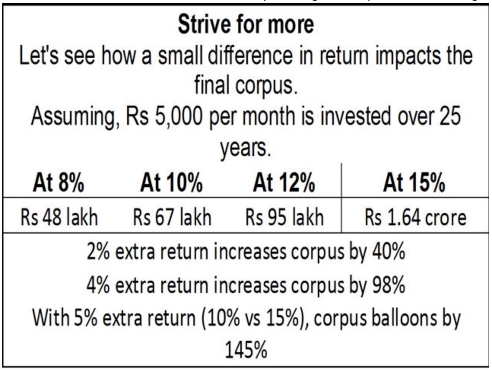
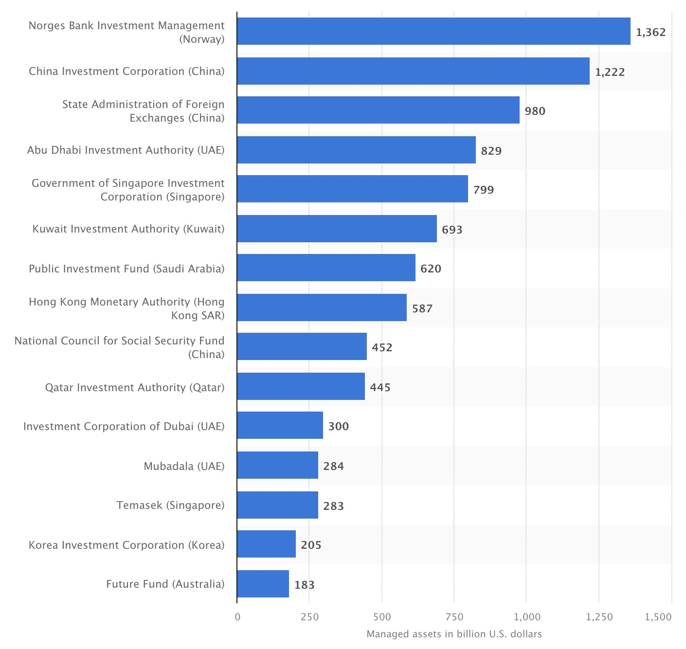

# TODO Financial/Finance / Investing

Created: 2020-04-09 02:47:27 +0500

Modified: 2022-11-28 13:59:47 +0500

---

## I am a Risk Averse Passive Investor and not an Active Investor

## Always think about Ideal world, as to what will happen in ideal world

1 lakh to 1 crore to 100 crore in stock market in 1 year can be done - **Options trading**

## Hold Cash till FIIs don't stop selling (don't invest - pump and dump type situation)

## Invest in liquid debt bonds

## Don't invest a lot in US, new world order, China is a rising giant

Buy the rumors sell the news

Past performance is no guarantee for future performance

## TODO
-   All the investments in parents name (can save atleast on interest and passive income)
-   Add investments in investment's sheet so that you can see proper trend
-   **Vanguard Global Stock Index Fund (VT Index)**
-   **MON100 - Nasdaq 100 ETF**

-   Neha - Corporate bond

<https://freefincal.com/hdfc-corporate-bond-fund

~~Trading 2 Lakh~~

Parag Parikh Flexi Cap

VPF - <https://cleartax.in/s/pf-vs-vpf>

-   ET Money Break
-   1 cr term insurance
-   Stop sbi / ppf migrate
-   P2P - Grip Invest (Code - Think) / Lendenclub / wintwealth / GoldenPi
-   SGB (no SGB till buying home)
-   **PMS**
    -   Marcellus - 50L
    -   <https://truebeacon.com
    -   <https://www.dezerv.in
-   Employee Provident Fund (EPF)

<https://www.youtube.com/watch?v=lBagn--KERk>

Increase EPF - 20K 12% pm - Deepak
-   1 lakh LTCG
-   Every year buy 10 grm of physical gold
-   And 10 grm of sgb
-   Top 10 focused stocks - Marcellus PMS

## Tools

<https://www.tikr.com

## Buying

<https://www.joinhoney.com

## Two types of income
-   Active Income where the time and effort you put pays for just that time
-   Passive Income where past efforts makes you money (all time - 24x7)

## Fixed Income / Debt
-   Wintwealth (Wint Wealth)
-   <https://altifi.ai

My Portfolio - <https://docs.google.com/spreadsheets/d/1C1c24a7Qn3LySXz7_IgvLwMi3jEGvVqUmHCc2IVHcMA/edit?usp=sharing>

## Sequence of Returns - [This is crucial for investing success! Be sure to understand what sequence of returns risk is!](https://www.youtube.com/watch?v=GruEpZFBvQg&ab_channel=freefincal-PrudentDIYInvesting)

[Do not make these 15 investing mistakes!!](https://www.youtube.com/watch?v=BDDrd98WYL8)

[Does Buy-And-Hold Investing Still Work? | ET Money](https://youtu.be/0Fe_qjdgJSM)

[How To Find Multi-baggers (100x) In The Stock Market? | ET Money](https://www.youtube.com/watch?v=YwwhtZuJkyU)

[Be careful with these Mutual Fund Categories | Thematic | Sector Funds | Multi-Cap | ET Money](https://youtu.be/1zgSvdQXw0I)

[Intangible Assets: The Invisible Superhero Of Investing | ET Money](https://youtu.be/XG4esIF_eGE)

[Alternative Investment Options | Should You Go for them? | ET Money](https://www.youtube.com/watch?v=_dAH-7EdAUw)

Alternative investments are of many types: There are hedge funds, private equity, commodities like agricultural produce, energy and metals, etc. Then there is real estate, venture capital, private debt placement, peer-to-peer lending, investing in start-ups, arts & antiques, vintage coins, stamps, etc. In addition to the higher returns most alternative investments are not linked to the stock markets or even the bond markets which then acts as an asset hedge and can be used by investors to diversify one's portfolio.

## P2P LENDING(Peer to peer lending)

In P2P lending programs depositors or lenders earn more interest on their money and likewise, more borrowers can get access to finance with customized approval procedures. In essence, P2P lending platforms like Faircent, Lendbox, LiquiLoans, RupeeCircle etc. act more as facilitators and risk mitigators. In the process, they provide a range of facilities which includes on-boarding, credit evaluation, agreement signing, disbursement of loans and collection services. Individual lenders can now select borrowers per their preferred loan criteria, location, profile, reason for loan loan tenure which is typically between 3 to 36 months and their desired rate of interest which ranges from 12 to 35%.

## FRACTIONAL REAL ESTATE

Traditionally, investing in real estate requires capital ranging from a few lakhs to a few crores. But now platforms like Strata, PropShare etc. have made it possible for retail investors to own commercial real estate in smaller proportions. The business model starts off with the fractional ownership platform identifying an investable Grade A property like a commercial building or a warehouse. Ofcourse, the properties that are identified almost always has an existing tenant who's been locked on a long-term contract which helps with cash flow visibility. Fractional ownership startups generally charge an annual asset management fee of about 1% and they also take in share of the profits over a particular hurdle rate. From an investor's perspective Like any real estate, the owner receives a monthly rental income which comes with built-in rent escalations. Additionally, the investor also benefits from the price appreciation that these properties have over the years.

## HIGH YIELDING FIXED INCOME INVESTMENTS

For the last two years, fixed deposit investors have been a grieving lot with FD returns struggling to match the inflation rate. But now, we are seeing a boom in start-ups offering bonds, structured debt and other high yielding fixed income instruments to retail investors as they look to make a dent in the 1.5 trillion dollar fixed deposit market. One of these weapons of FD destruction are high yielding debt instruments which in addition to offering higher interest rates also allows investors to put in amounts as low as 10,000 rupees. Platforms like Wint Wealth, BondsKart, AltiFi etc. offer products like government bonds, AAA rated papers from lending institutions, high yielding BBB rated corporate bonds, private bond placements and also structured debt.

## INVOICE DISCOUNTING

There is usually a time lag between a vendor supplying goods or services and he getting paid for it. Now, to better manage cash flows during this period, vendors typically approach a bank or a financial institution who then purchases these receivables at a discount for upfront cash. Today, several platforms like KredX, Jiraaf, TradeCred etc. have skipped the banking connection and match vendors and investors who are keen to participate in this financial opportunity Now, invoices can run into lakhs and even crores which is why these platforms break up an invoice into manageable parts allowing investors to buy a fraction of the unpaid invoice amount. The minimum investment amount changes from deal to deal but we do see transactions starting from 50,000 rupees in some cases. These opportunities typically run for a short tenure of 30 to 90 days and the pre-tax IRR can be as high as 15%.

## Masterworks

Masterworksis the first platform for buying and selling shares representing an investment in iconic artworks.

<https://www.masterworks.com

## Strategies
-   **Value Investing**

<https://www.youtube.com/watch?v=CZA3rVOfti8>
-   **Growth Investing**

<https://www.youtube.com/watch?v=TLGalocqj00>

## Quotes / Tips / Philosophy

## counter cyclical fiscal policy

## Malinvestment - the action or fact of investing money in an ill-judged or wasteful way

A**consumer spendsmoney andfollowstrends** while an**investor puts capital to work**andtakes advantageof trends.

Chronic consumers often go broke, and persistent investors often get rich.

2 Crore corpus for getting 1,00,000 monthly income at 6% interest before tax

I don't want returns in % I want returns in X

Debt is a hedge against inflation

Us dollars as back-up currency in case of war

Investing should be more like watching paint dry or watching grass grow. If you want excitement, take $800 and go to Las Vegas

In a bear market, smart long-term decisions often look foolish in the short-term; whereas in a bull market foolish long-term decisions often look smart in the short-term.

You can't take the same actions as everyone else and expect to outperform

You can't hope to earn above average returns if you don't place active bets, but if your active bets are wrong, your return will be below average.

If you hope to distinguish yourself in terms of performance, you have to depart from the pack. But, having departed, the difference will only be positive if your choice of strategies and tactics is correct and/or you're able to execute better"

## 5 Warren Buffet Tips
-   Invest in a business and not in a stock as of a specific company
-   Don't have too many stocks in your portfolio
-   Invest in what you understand
-   Read, read and extensively read
-   Earlier you start better it would be

-   "Price is what you pay, value is what you get." ([2008](http://www.berkshirehathaway.com/letters/2008ltr.pdf))
-   "For investors as a whole, returns decrease as motion increases." ([2005](http://www.berkshirehathaway.com/letters/2005ltr.pdf))
-   "Be fearful when others are greedy and greedy only when others are fearful." ([2004](http://www.berkshirehathaway.com/letters/2004ltr.pdf))
-   "You only find out who is swimming naked when the tide goes out." ([2001](http://www.berkshirehathaway.com/letters/2001.html))

<https://www.cbinsights.com/research/buffett-berkshire-hathaway-shareholder-letters

[9 Important Lessons from Warren Buffett's Letters to Shareholders | ET Money](https://youtu.be/GSBtCxVLRqA)

-   Don't have debt rise faster than income
-   Don't have income rise faster than productivity
-   Do all that you can to raise your productivity

<https://www.youtube.com/watch?v=PHe0bXAIuk0>

## Steps
-   Term Life Insurance
-   Buy a house with a home loan: Tips to maximize benefits
-   How to reduce risk in an investment portfolio
-   Jot down clearly the dates when you need money (do not just write the year, time to be specific!)
-   For all goals that occur within 15 years, stick to the FDs (too late for equity here)
-   You can consider some exposure to equity mutual funds only for goals more than 15 years away.
-   Start slowly. Make a small investment in an equity fund. Say 10% of what you park in FD or RD each month. observe the volatility and then gradually increase exposure

<https://freefincal.com/download-re-assemble-e-book-on-our-6th-birthday

## Invest in a franchise (McDonalds)

<https://www.financialexpress.com/money/exhausted-your-ppf-investment-limit-here-are-some-other-fixed-investment-options-for-risk-averse-investors/1594500/lite

<https://freefincal.com/mutual-fund-faq-new-investors

[**https://freefincal.com/how-rohits-early-struggles-defined-his-investment-journey/**](https://freefincal.com/how-rohits-early-struggles-defined-his-investment-journey/)

[**https://freefincal.com/how-abhisek-funded-his-marriage-is-on-track-to-financial-freedom/**](https://freefincal.com/how-abhisek-funded-his-marriage-is-on-track-to-financial-freedom/)

## Financial planning
-   <https://www.businesstoday.in/magazine/money-today/investment/as-good-as-it-gets/story/256057.html>
-   [Build Your Own Stock Portfolio Tracker On Google Sheets](https://youtu.be/qtY1NOVQ6iE)
-   Finshots Money Financial Planning Calculator - <https://docs.google.com/spreadsheets/d/13LUIThaOS_QLXAtQz4gxEA7v5UaZQsp3/edit#gid=262879150>

## Dream
-   Financial freedom after owning a good house with land
-   Start my own company with own funds (so there is no pressure from investors)

## Nightmare
-   Job loss for 6 months
-   Will never be able to work again

## Courses

Finance for Everyone

<https://www.edx.org/course/finance-everyone-smart-tools-decision-michiganx-fin101x-1>

## Soverign Gold Bond (SGB)
-   **Buy it in secondary market instead of applying for new issue**
-   Interest - 2.5 % (taxable) (simple interest given biannually)
-   Discount of Rs.50 per gram
-   Exit option at 5 years and maturity at 8 years
-   No tax on capital gain
-   SGB are tradable on stock exchange
    -   Capital gain is taxable
    -   LTCG with indexation available
-   No TDS (pay in returns)
-   4KG per individual per year limit
-   <https://www.youtube.com/watch?v=sJR0ge1779w&feature=youtu.be&ab_channel=ETMONEY>
-   Sold before 3 years - Short Term Capital Gains
    -   Gains added to income
    -   Taxed as per income tax slab
-   Sold after 3 years - Long term Capital Gains
    -   20% tax after indexation

## National Pension Scheme (NPS)

[How Much Monthly Pension Does NPS Give? | ET Money](https://youtu.be/908WbEQRG04)

## International
-   MSCI World Index
-   MSCI All Country World Index
-   S&P Global Index
-   S&P 500 Index Fund (USA)

-   **Vanguard Global Stock Index Fund (VT Index)**

-   Dow Jones Industrial Average
-   FTSE 100 Index (London)
-   Nasdaq Composite (QQQ ETF)
-   DAX 30 (Germany)
-   NIKKEI 225 (Japan)

<https://www.youtube.com/watch?v=qRT917PvEns>

## Indian
-   Nifty 50 (NSE)
-   Nifty Next 50 (NSE)
-   Sensex (30% in BSE by free-float market capatiliation)
-   Motilal Oswal Nasdaq 100 Fund (Foreign index available in india)
-   Nippon BANKBEES ETF

<https://www.moneycontrol.com/mutual-funds/amc-details/RC>

## Since Nifty50 companies form over 75% of the free-float market capitalisation of Nifty100, the allocation of Nifty50 and Nifty Next50 could be 75:25 in the portfolio.

It is prudent to keep a third of the equity portfolio in mutual funds that invest in **foreign stocks.**

For foreign equity allocation, the ideal option would a fund like Vanguard Global Stock Index Fund that holds the biggest companies in developed countries in the proportion of their free-float market capitalisation. Since this option is not available for Indian investors, we can allocate up to 20% of the total equity portfolio in funds like Motilal Oswal Nasdaq 100 Fund of Fund. For taxation, these funds are treated like debt mutual funds; but that is fine since we diversify the portfolio to reduce risk not to increase the return.

## A better approach, therefore, is to take the middle path. Invest half the Indian equity investment in index funds (Nifty50 and Nifty Next50 with 75:25 allocation) and the remaining equally in 3 to 4 multicap funds managed by fund managers with a proven track record of over ten years. Up to 20% of the equity portfolio can be kept in foreign equity index funds.

<https://freefincal.com/build-equity-mutual-fund-portfolio

## Tips
-   Invest less during bullish market (SIP 25%)
    -   importance of not getting caught up in bull markets---speculative investments during bull markets can lead to huge loss of principal investment.
-   Invest more during bearish market (SIP 75%)

## Resources

<https://freefincal.com/best-mutual-funds-2019-quarter-three

<https://freefincal.com/my-stock-portfolio-vs-nifty-jan-2021

<https://youtu.be/xiiAn0lShj8>

<https://www.youtube.com/c/SUBRAMONEYPVSUBRAMANYAM/videos>

[How To Retire Rich In Your 20's 🔥 | Financial Freedom 🔥 | 5 Rules Of Money 💸 |](https://youtu.be/LKRKTE33JR8)

## Financial Independence

<https://networthify.com/calculator/earlyretirement>

## Finance Gratitude
-   **Entitlement**

rags to riches and back to rags stories of film stars, lottery ticket winners, and such other starkly high income earners who lost their wealth.

They would be surrounded by relatives and friends that systematically leached off the wealth or led them to poor quality investments. The man who won the first round of Kaun Banega Crorepati admitted that he bought houses for siblings and funded their businesses before losing his winnings and returning to his old job in a few years. Easy money belongs to everyone---that seems to be the credo.

-   Do not disclose your earnings, income or wealth. No one other than your spouse and children at an appropriate age need to know. What you give is always measured with respect to what you make. In itself, a gift of 50,000 at a relative's wedding is substantial. It might be bigger than what others gave. But if it is known that you earn Rs.5 lakh every month, that is seen as too little.

-   Keep control and equity about who will receive your charities. Someone is not ahead of the queue only because they are related to you or your spouse. You make the decision because it is your money and you know who deserves it. Putting a dozen poor children through college is better than enabling a sibling to upgrade their car. You don't have to justify that decision.

-   Money given away to those around you who behave with a sense of entitlement, is almost never returned. You mostly lose the money and the relationship if you asked. Earmark an amount you can afford to write off. Limit your commitment to that amount and no more.

-   Do not respond to a request for funds with an immediate yes or no. The yes will be seen as too willing; the no will be seen as too rude. Try a response like: let me think about this and come back to you. That gives you the time and those that were taking a shot at asking may not come back. Just as we do not invest in a do-it-right-now investment option, giving also need not be an immediate response.

-   Do not try to use your money to buy friendships and relationships. A very common mistake that the moneyed make is to use the power of their wealth to be surrounded by followers and ego massaging yes men. These are poor investments. None of these last when your money is gone. You are aware of your importance in the family due to your wealth; learn to use it wisely.

-   Make rules that indicate how you will decide whom to support. Keep it equitable between both spouses. Discuss how you will support both parents; how you will contribute to old age support and hospitalizations; and so on. Identify specific causes like education and the limits you will go towards funding it. Allocate a percentage of your earnings and be gracious about it to the outside world, but clear and rule based within the household.

<https://economictimes.indiatimes.com/wealth/save/set-limits-when-it-comes-to-helping-others-financially-5-ways-to-deal-with-the-entitled-lot/set-limits-when-it-comes-to-helping-others-financially-5-ways-to-deal-with-the-entitled-lot/articleshow/91556379.cms>

## Facts

US GDP - 21 lakh crore USD (21 trillion)

China GDP - 14.7 lakh crore USD (14.7 trillion)

India GDP - 2.6 lakh crore USD (2.6 trillion)

Real state capitalization, economy - 340 trillion dollar

Global Equity market - 80 trillion dollar

Global debt and bond market - 250 trillion dollar

Global gold - 7 trillion dollar

## Largest sovereign wealth funds

