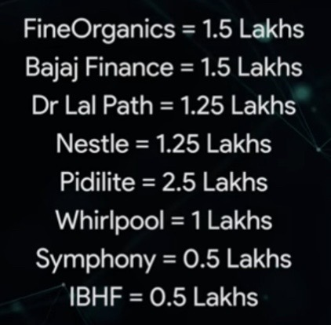

# Stocks

Created: 2022-01-30 11:49:58 +0500

Modified: 2022-09-04 23:04:48 +0500

---

The stock market is a device for transferring money from the impatient to the patient -- Warren Buffet

<https://marcellus.in/newsletter/consistent-compounders/studying-the-holiday-schedule-of-consistent-compounders

Selling stock is as important as buying stock

Don't sell the stocks which gives you high returns, sell the negative or no returns stock

Long-term capital gains from the transfer of equity shares (listed and non-listed) or from stake sales in a startup can be avoided under section 54F of the Income Tax Act, 1961, if the gains are invested in residential property.

**Screener**

<https://www.screener.in/explore

<https://www.screener.in/screens/103296/52-week-lows

<https://www.screener.in/screens/343087/fii-buying

<https://www.tickertape.in/screener/equity/prebuilt/SCR0001>

<https://www.screener.in/screens/218753/marcellus-little-champs

<https://www.screener.in/screens/395078/consistent-compounders-marcellus

<https://www.screener.in/screens/523311/rising-giants-marcellus

**Invested**
-   **Indigo**
-   **Pidilite**

**NiftyETF**

**Industry Sectors**
-   Communication Services
-   Consumer Discretionary
-   Consumer Staples
-   Energy
-   Financials
-   Health Care
-   Industrials
-   Information Technology
-   Materials
-   Real Estate
-   Utilities

**Industry Groups**

<https://en.wikipedia.org/wiki/Global_Industry_Classification_Standard>

**Five Fusty Sectors**
-   manufacturing, engineering and infrastructure
-   construction and real estate
-   travel and hospitality
-   media and entertainment
-   financial services

**Super Seven sectors**
-   e-commerce
-   tech startups
-   logistics
-   retail
-   educational services
-   healthcare

**Company / Companies**
-   Adani Energy
-   HINDUNILVR
-   ASIANPAINT
-   PIDILITIND
-   TCS
-   HDFCBANK
-   INFY
-   COLPAL
-   ITC
-   MARICO
-   HINDPETRO
-   IOC
-   COALINDIA
-   VEDL
-   GODREJCP
-   WIPRO
-   DABUR

![INDIA'S 20 LARGEST PROFIT GENERATORS DELIVER OF INDIA'S PROFITS India, top 20 companies by profits* As % of total corporate net incomet In many sectors, the top 1-2 companies account for 80% of the profit pie 60 40 Top five 20 Next 15 1994 2000 05 10 financial years ending March 15 0 19 Sector Paints Small cars Biscuits Cigarettes Adhesives Cooking oil Hair oil Baby milk Glass lined reactors Top 2-3 Player Accounting for 80% of profits Asian Paints, Berger Paints Maruti Suzuki, Hyundai Britannia, Parle ITC Pidilite Marico, Adani Marico, Bajaj Corp Nestle GMM Pfaudler Source: Marcellus Investment Managers The Econmnist any given year, three-year average t20,200 private and public companies Source: Marcellus Investment Managers, CMIE, Ace Equity, Bloomberg. Aliphatic amines Alkyl Amines, Balaji Amines Source: Marcellus Investment Managers, Ace Equity, Bloomberg. NOTE: these stocks form part of many of Marcellus' portfolios. AAMARCELLUS 4 ](media/TODO-Financial-Finance---Investing_Stocks-image2.jpeg)

![Biggest profit generating companies (FY 2021) Rank 2 3 4 5 6 7 8 9 10 11 12 13 14 15 16 17 18 Company Reliance Industries HDFC Bank Tata Consultancy Services Indian Oil Corporation State Bank Of India Bharat Petroleum Corporation Infosys ICICI Bank NTPC Steel ITC Housing Development Finance Corporation Power Grid Corporation Of India Larsen & Toubro Oil & Natural Gas corporation Hindustan Petroleum Corporation Vedanta Wipro Profit After Tax (Rs crore) FY21 Rs 31,944 31,117 Rs 30,960 RS 21,836 RS 20,410 RS 19,042 RS 18,048 RS 16,193 RS 13,770 RS 13,607 Rs 13,032 RS 12027 RS 11,936 Rs 11,337 RS 11,246 RS 10,664 RS 10,503 RS 10,061 ](media/TODO-Financial-Finance---Investing_Stocks-image4.jpg)

**Freefincal direct equity list**

![Stock Code 19.80% 30.06% NSE:ASIANPAINT 15.02% 32.12% NSE:PIDILITIND 13.60% 11.65% NSE:TCS 13.71% 26.24% NSE:INFY NSE:HINDUNILVR 12.30% 29.47% NSE:HDFCBANK NSE:DABUR -12.51% -12.94% NSE:WIPRO NSE:COLPAL NSE:MARICO NSE:ITC Weight Abs Gain Div Gain Total Gai 6.41% 6.08% 2.71% 3.43% 2.97% 3.98% 12.71% 7.85% -16.33% 14.52% 15.09% 36.89% 0.81% 0.49% 2.33% 4.09% 3.09% 1.93% 1.26% 1.26% 5.66% 2.90% 6.95% 30.87% 32.61% 13.98% 30.32% 32.56% 14.64% 9.11% -15.06% 20.18% 18.00% 43.84% Avg Year 1.55 1.49 1.52 1.48 2.35 2.35 1.75 1.22 2.27 1.42 1.67 CAGR 18.93% 20.91% 8.96% 19.53% 12.73% 5.99% 5.12% 8.44% 12.38% 24.27% XIRR 18.42% 20.28% 8.92% 19.36% 13.27% 6.53% 5.31% 9.02% 12.40% 24.29% ](media/TODO-Financial-Finance---Investing_Stocks-image7.jpeg)

-   **Happiest Minds**
-   **Dixon**

**Marcellus**

1.  Private sector banks

2.  Asian Paints and Berger Paints (the most efficient paint manufacturers), Astral Poly (the most efficient CPVC pipe manufacturer), Pidilite (the most efficient adhesives and waterproofing manufacturer) and Titan (the most efficient jeweler).

![Exhibit 4: Man Company Garware Alkyl Suprajit GMM Ultramarine Fine Org. Galaxy Tarsons Gujarat Ambuja Little Cham snow derive si nificant revenues from lobal markets % Rev outside India (FYIO) % Rev outside India (FY21) 34% 24% 33% 53% 33% 55% 33% 33% Remarks Exports' share in revenues mse to 58% in FY21 (from 34% in FYIO) thanks to breakthrough success in the Salmon aquaculture market where Garware has emerged as the leading net (cage) supplier in key geographies like Canada, Scotland, Norway and Chile. Alkyl is among the top global producers for products like Acetonitrile, Ethylamine, DMA HCL, etc Through organic and inorganic routes over the last decade, Suprajit has increased share of export to 40%. The company has built market leading global franchises in automotive cables (a top 5 global player) and automotive halogen bulbs (top 3 globally). GMM been for long a dominant supplier of glass lined equipments (GLE) in India. The Company recently acquired the global business of its parent Pfaudler which makes the combined entity a clear global leader in the GLE business. Ultramarine is a global top 3 supplier of the niche inorganic ultramarine Blue pigment that finds applications in plastic masterbatches, paints, ink, laundry etc. Exports account for >50% of the pigment division sales with a diversified geographical presence across USA, Europe, East Asia etc. Fine is by far the largest producer of oleo-chemical based food, polymer and certain specialty additives in India and amongst the leading players globally with exports contributing N55% of revenues. The Company has built a strong franchise in polymer additives globally and more particularly in slip additives where it has emerged a clear global market leader. Galaxy is the leading oleochemical based surfactants supplier in India focussing on the home and personal care segment. Over the last decade, Galaxy has also built a strong global franchise (now derives nearly 2/3rd revenues from outside India) through setting up of new plant in Egypt (to cater to Africa, the Middle East and Turkey markets) and acquisition of Tri-K Industries Inc, a US based company focussing on specialty care segment. Exports became a focus area of the company since 2010. Just like the domestic market, in the export market as well Tarsons' USP is to sell high quality products at lower price points. Gujarat Ambuja has gone on to become one of the leading maize based derivatives and feed exporters to export markets emerging as a credible alternative to Chinese players. Source : Companies, Ace Equity, Marcellus Investment Managers ](media/TODO-Financial-Finance---Investing_Stocks-image8.png)
-   HDFC Bank
-   Dr Lal PathLabs
-   GMM Pfaudler
-   Amrutanjan

<https://marcellus.in/blogs/three-distinct-layers-of-polarization-in-the-indian-stock-market

**Top retail investors**

1.  Rakesh Jhunjhunwala and Associates

2.  Premji and Associates

3.  Radhakishan Damani

4.  Mukul Agrawal

5.  Mukul Mahavir Prasad Agarwal

<https://www.moneycontrol.com/india-investors-portfolio

