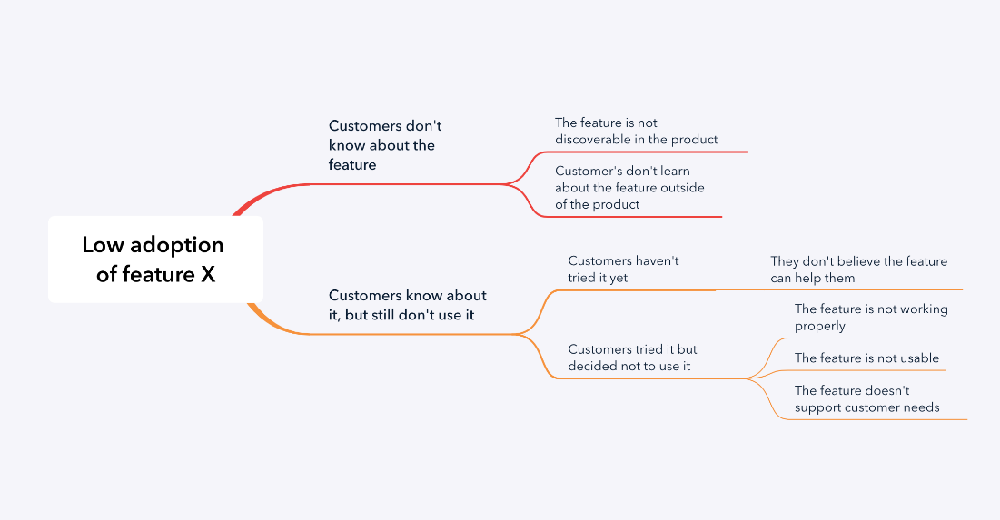

# Thinking Mental Models

Created: 2020-06-20 11:15:43 +0500

Modified: 2022-04-12 23:26:12 +0500

---
-   [The Scientific Method](https://en.wikipedia.org/wiki/Scientific_method)
-   **[Inversion](https://jamesclear.com/inversion) / Reframing**
-   Surfing or "Riding the Wave"
-   [Working Backward](https://en.wikipedia.org/wiki/Backward_chaining)
-   Structured thinking

you methodically[break down problems](https://forge.medium.com/the-500-year-old-piece-of-advice-that-will-change-your-life-1e580f115731)and solve them piece by piece, rather than worrying, relying on past assumptions, or shrugging in absolute cluelessness.
-   The Map is not the Territory
-   Circle of competence
-   Thought Experiment
-   Probablistic Thinking
-   **Gradually, and then suddenly**

The quote is from Ernest Hemingway. The graphic is from Gautam John, a subscriber, who combined two important systems thinking models - the Iceberg Model and Pace Layers framework.

-   **Systems Thinking**

"Systems thinking is a way of seeing the world as a series of **interconnected** and **interdependent** systems rather than lots of independent parts. As a thinking tool, it seeks to oppose the **reductionist view** --- the idea that a system can be understood by the sum of its isolated parts --- and replace it with **expansionism**, the view that everything is part of a larger whole and that the connections between all elements are critical."

-   (1)[Systems Thinking](https://en.wikipedia.org/wiki/Systems_thinking)--- "By taking the overall system as well as its parts into account systems thinking is designed to avoid potentially contributing to further development of unintended consequences." (related:[causal loop diagrams](https://en.wikipedia.org/wiki/System_dynamics#Causal_loop_diagrams);[stock and flow](https://en.wikipedia.org/wiki/Stock_and_flow);[Le Chatelier's principle](https://en.wikipedia.org/wiki/Le_Chatelier%27s_principle#Effect_of_a_catalyst), [hysteresis](https://en.wikipedia.org/wiki/Hysteresis#In_biology) - "the time-based dependence of a system's output on present and past inputs."; "Can't see the forest for the trees.")

-   Iceberg Model
-   Connection circles
-   Balancing feedback loop
-   Reinforcing feedback loop
    -   Ex - **Compound Interest** (The more money you have in the bank, the more you earn on interest. That money is added to your balance and so you earn on interest even more.)

-   **Decision Making**
    -   Confidence determines speed vs. quality
        -   Is your confidence in the problem importance low? Focus on speed.
        -   Is your confidence in the problem and the solution high? Focus on quality.
        -   Is your confidence in the problem importance high, but low in the solution? Balance both speed and quality.
    -   Second order thinking
        -   Ex - living an hour away from work → need to buy a car → spending two hours of each day in a car
    -   Hard choice model
    -   Decision matrix
-   **Problem Solving**
    -   Issue trees

-   First principles

Break down complex problems into basic elements and create innovative solutions from there.
-   Abstraction laddering

Frame your problem better with different levels of abstraction.
-   Inversion

Approach a problem from a different point of view.

**[Arguing from First Principles](https://en.wikipedia.org/wiki/First_principle)---** "A first principle is a basic, foundational, self-evident proposition or assumption that cannot be deduced from any other proposition or assumption." (related:[dimensionality reduction](https://en.wikipedia.org/wiki/Dimensionality_reduction);[orthogonality](https://en.wikipedia.org/wiki/Orthogonality); "Reasonable minds can disagree" if underlying premises differ.)

**First Principles Thinking**

1.  Clarifying your thinking and explaining the origins of your ideas (Why do I think this? What exactly do I think?)

2.  Challenging assumptions (How do I know this is true? What if I thought the opposite?)

3.  Looking for evidence (How can I back this up? What are the sources?)

4.  Considering alternative perspectives (What might others think? How do I know I am correct?)

5.  Examining consequences and implications (What if I am wrong? What are the consequences if I am?)

6.  Questioning the original questions (Why did I think that? Was I correct? What conclusions can I draw from the reasoning process?)

**Blinkist - Thinking in Systems by Donella H. Meadows**
-   A system is a group of connected elements with a shared purpose
    -   behavior of a system breaks down into stocks and flows, which change over time
    -   **Stocks** are the elements of a system that can be accounted for at any given time. Ex - Water in a bathtub, books in a store or money in a bank.
    -   **Flow** is the change in stock over time as a result of **inflows,** which add, and **outflow,** which subtract. Ex - births and deaths or purchases and sales
-   Every sustainable system relies on some kind of feedback for stabilization
    -   Self balancing feedback
        -   If a force stabilizes the difference between the actual and desired levels of stock
        -   Such a feedback is a chain for rules or physical laws that relate to the level of stock and have the ability to change it. ex - thermostat with radiator
    -   Reinforcing feedback
        -   Perpetually generates more or less of what already exists.
        -   Ex - The more money you have in savings account, the more interest you accure, and the more interest you accure, and the more money you have in your account
        -   The reinforcing mechanism can produce constant, even exponential, growth or destruction
-   Well-functioning systems are resilient, self-organized and hierarchical
    -   As systems build new, increasingly complex structures, they naturally organize themselves based on a hierarchy.
    -   Why hierarchies? Because they reduce the level of information any given part of the system has to handle
-   Corrupt systems are produced by disproportionate power and can enable overuse
-   Systems can be physically adjusted to improve efficiency
    -   By changing **buffers**, **system design** and **delays**, we can produce more effective systems
-   Systems can be made even more efficient by adjusting their internal mechanisms and rules
-   Paying attention to the inner workings of systems will help you better understand the world
-   **Emergence:** Emergence is a simple but powerful concept. It means that when things come together, somethingnew and unexpectedhappens. And this new thing isn't present in the individual elements. It's biological as much as social. A caterpillar becomes a butterfly.
-   Actionable advice - Always expect a positive outcome, not a negative one.

**Modeling**
-   (1)[Thought Experiment](https://en.wikipedia.org/wiki/Thought_experiment)--- "considers some hypothesis, theory, or principle for the purpose of thinking through its consequences." (related:[counterfactual thinking](https://en.wikipedia.org/wiki/Counterfactual_thinking))
-   (1)[Scenario Analysis](https://en.wikipedia.org/wiki/Scenario_analysis)--- "A process of analyzing possible future events by considering alternative possible outcomes." (related: "Skate to where the puck is going.";[black swan theory](https://en.wikipedia.org/wiki/Black_swan_theory)--- "a metaphor that describes an event that comes as a surprise, has a major effect, and is often inappropriately rationalized after the fact with the benefit of hindsight.")
-   (1)[Power-law](https://en.wikipedia.org/wiki/Power_law)--- "A functional relationship between two quantities, where a relative change in one quantity results in a proportional relative change in the other quantity, independent of the initial size of those quantities: one quantity varies as a power of another." (related:[Pareto distribution](https://en.wikipedia.org/wiki/Pareto_distribution);[Pareto principle](https://en.wikipedia.org/wiki/Pareto_principle)--- "for many events, roughly 80% of the effects come from 20% of the causes.",[diminishing returns](https://en.wikipedia.org/wiki/Diminishing_returns),[premature optimization](https://en.wikipedia.org/wiki/Program_optimization#When_to_optimize),[heavy-tailed distribution](https://en.wikipedia.org/wiki/Heavy-tailed_distribution#Relationship_to_fat-tailed_distributions),[fat-tailed distribution](https://en.wikipedia.org/wiki/Fat-tailed_distribution);[long tail](https://en.wikipedia.org/wiki/Long_tail)--- "the portion of the distribution having a large number of occurrences far from the "head" or central part of the distribution.";[black swan theory](https://en.wikipedia.org/wiki/Black_swan_theory)--- "a metaphor that describes an event that comes as a surprise, has a major effect, and is often inappropriately rationalized after the fact with the benefit of hindsight.")

<https://en.wikipedia.org/wiki/Power_law>

<https://www.scotthyoung.com/blog/2021/02/22/productivity-frontier

-   (1)[Normal Distribution](https://en.wikipedia.org/wiki/Normal_distribution)--- "A very common continuous probability distribution...Physical quantities that are expected to be the sum of many independent processes (such as measurement errors) often have distributions that are nearly normal." (related:[central limit theorem](https://en.wikipedia.org/wiki/Central_limit_theorem))
-   (1)[Sensitivity Analysis](https://en.wikipedia.org/wiki/Sensitivity_analysis)--- "The study of how the uncertainty in the output of a mathematical model or system (numerical or otherwise) can be apportioned to different sources of uncertainty in its inputs."
-   **(1)[Cost-benefit Analysis](https://en.wikipedia.org/wiki/Cost%E2%80%93benefit_analysis)**

A systematic approach to estimating the strengths and weaknesses of alternatives that satisfy transactions, activities or functional requirements for a business." (related:[net present value](https://en.wikipedia.org/wiki/Net_present_value)--- "a measurement of the profitability of an undertaking that is calculated by subtracting the present values of cash outflows (including initial cost) from the present values of cash inflows over a period of time.",[discount rate](https://en.wikipedia.org/wiki/Discount_rate))

<https://www.wikiwand.com/en/Cost%E2%80%93benefit_analysis>

<https://www.investopedia.com/terms/c/cost-benefitanalysis.asp>

-   (3)[Simulation](https://en.wikipedia.org/wiki/Simulation)--- "The imitation of the operation of a real-world process or system over time." (related:[Queuing theory](https://en.wikipedia.org/wiki/Queueing_theory)--- "the mathematical study of waiting lines, or queues.")
-   (3)[Pareto Efficiency](https://en.wikipedia.org/wiki/Pareto_efficiency)--- "A state of allocation of resources in which it is impossible to make any one individual better off without making at least one individual worse off...A Pareto improvement is defined to be a change to a different allocation that makes at least one individual better off without making any other individual worse off, given a certain initial allocation of goods among a set of individuals."

**Brainstorming**
-   (1)[Lateral Thinking](https://en.wikipedia.org/wiki/Lateral_thinking)--- "Solving problems through an indirect and creative approach, using reasoning that is not immediately obvious and involving ideas that may not be obtainable by using only traditional step-by-step logic."
-   (1)[Divergent Thinking](https://en.wikipedia.org/wiki/Divergent_thinking)vs[Convergent Thinking](https://en.wikipedia.org/wiki/Convergent_thinking)--- "Divergent thinking is a thought process or method used to generate creative ideas by exploring many possible solutions. It is often used in conjunction with its cognitive opposite, convergent thinking, which follows a particular set of logical steps to arrive at one solution, which in some cases is a 'correct' solution." (related:[groupthink](https://en.wikipedia.org/wiki/Groupthink))
-   (2)[Crowdsourcing](https://en.wikipedia.org/wiki/Crowdsourcing)--- "The process of obtaining needed services, ideas, or content by soliciting contributions from a large group of people, especially an online community, rather than from employees or suppliers." (related:[wisdom of the crowd](https://en.wikipedia.org/wiki/Wisdom_of_the_crowd)--- "a large group's aggregated answers to questions involving quantity estimation, general world knowledge, and spatial reasoning has generally been found to be as good as, and often better than, the answer given by any of the individuals within the group.";[collective intelligence](https://en.wikipedia.org/wiki/Collective_intelligence);[bandwagon effect](https://en.wikipedia.org/wiki/Bandwagon_effect)--- "a phenomenon whereby the rate of uptake of beliefs, ideas, fads and trends increases the more that they have already been adopted by others.";[Stone Soup](https://en.wikipedia.org/wiki/Stone_Soup))

A crowd can be smarter than a single person, Consider other's perspective to challenge your own biases.

-   (2)[Paradigm shift](https://en.wikipedia.org/wiki/Paradigm_shift)--- "a fundamental change in the basic concepts and experimental practices of a scientific discipline." (related:[The Structure of Scientific Revolutions](https://en.wikipedia.org/wiki/The_Structure_of_Scientific_Revolutions)--- "An episodic model in which periods of such conceptual continuity in normal science were interrupted by periods of revolutionary science;[Planck's principle](https://en.wikipedia.org/wiki/Planck%27s_principle)--- "the view that scientific change does not occur because individual scientists change their mind, but rather that successive generations of scientists have different views.";[punctuated equilibrium](https://en.wikipedia.org/wiki/Punctuated_equilibrium))

**Reasoning**
-   (1)[Anecdotal](https://yourlogicalfallacyis.com/anecdotal)--- "Using a personal experience or an isolated example instead of a sound argument or compelling evidence."
-   (1)[False Cause](https://yourlogicalfallacyis.com/false-cause)--- "Presuming that a real or perceived relationship between things means that one is the cause of the other." (related:[correlation does not imply causation](https://en.wikipedia.org/wiki/Correlation_does_not_imply_causation), or in[xkcd form](https://xkcd.com/552/))
-   (1)[Straw Man](https://en.wikipedia.org/wiki/Straw_man)--- "Giving the impression of refuting an opponent's argument, while actually refuting an argument that was not advanced by that opponent."
-   (1) Plausible --- Thinking that just because something is plausible means that it is true.
-   (1) Likely --- Thinking that just because something is possible means that it is likely.
-   (1)[Appeal to Emotion](https://yourlogicalfallacyis.com/appeal-to-emotion)--- "Manipulating an emotional response in place of a valid or compelling argument."
-   (1)[Ad Hominem](https://yourlogicalfallacyis.com/ad-hominem)--- "Attacking your opponent's character or personal traits in an attempt to undermine their argument."
-   (1)[Slippery Slope](https://yourlogicalfallacyis.com/slippery-slope)--- "Asserting that if we allow A to happen, then Z will eventually happen too, therefore A should not happen." (related:[broken windows theory](https://en.wikipedia.org/wiki/Broken_windows_theory)--- "maintaining and monitoring urban environments to prevent small crimes such as vandalism, public drinking, and toll-jumping helps to create an atmosphere of order and lawfulness, thereby preventing more serious crimes from happening.")
-   (1)[Black or White](https://yourlogicalfallacyis.com/black-or-white)--- "When two alternative states are presented as the only possibilities, when in fact more possibilities exist."
-   (1)[Bandwagon](https://yourlogicalfallacyis.com/bandwagon)--- "Appealing to popularity or the fact that many people do something as an attempted form of validation."
-   For a longer list, see[Thou shall not commit logical fallacies](https://yourlogicalfallacyis.com/)(I have this poster on my office door.)

<https://untools.co

**Strategic Thinking**

Defined as the process that determines the manner in which people think about, assess, view, and create the future for themselves and others.It's a combination of mindset and techniques that determines one's ability to know their goal and how to achieve it.

Strategic thinkers arehighly sought after for leadership positionsand areable to imagine the big picture, identify the possible impact of their decisions and project the way to get there.

1.  **Being more reflective**

**Strategic thinkers understand and dig deeper**when analyzing processes, developing and applying performance metrics, collecting data and producing analytics for better decision-making. They challenge the involved to consider answers for important questions.

2.  **Being better leaders**

Strategic thinkers advance their careers by being better leaders. Not all great thinkers are great leaders, but the ones who are leadership material are likely better leaders than those who fail to think strategically.

Strategic leaders go beyond the role of having and communicating a vision to fully understanding, planning and executing the necessary strategies to realize it.They make better decisions as they**have a more holistic view**that includes the organization and the people inside and outside it.

3.  **Creating a domino effect**

Strategic thinkers demonstrate organizational value by creating more strategic thinkers.Developing**a culture that considers strategy and doesn't lose sight of the value that needs to be delivered greatly increases the capabilities of a company.**Strategic thinkers are the ones in the organization who ponder and prompt questions that are designed to create even more strategic thinkers.

4.  **Questions a strategic thinker might make**
    -   **Why is this important?**
    -   **What are the long-term and short-term goals?**
    -   **Who are the stakeholders and why are they so?**
    -   **What biases influence the situation?**
    -   **What are the fundaments behind our premises?**
    -   **What are the consequences?**
    -   **What is the plan and why is it so?**
    -   **What are the resources available?**
    -   **Which strategic analysis model do we apply?**
    -   **What are the accountabilities? Does the culture encourage 360-degree accountability? How?**
    -   **When it comes to performance management, what are our common standards for behavior?**
    -   **What is the most powerful thing to do tomorrow to build/execute/advance the organizational and/or operational strategy? Why?**

**7 Characteristics of Strategic Thinking**

1.  **Vision:**they use a mix of logic and creativity to define ambitious but rigorous visions of what needs to be achieved.

2.  **Framework:** taking into account their own biases, timeline and resources, they can define their objectives and develop multiple action plans.

3.  **Perceptiveness:**they observe and understand the world from all the different perspectives.

4.  **Assertiveness:** They're good at evaluating, deciding and promptly executing their decisions without letting doubts fog their vision.

5.  **Flexibility:** they seek advice to compensate for their weaknesses and then twist their ideas and framework to achieve their goals. But they are flexible without breaking the rules.

6.  **Emotional Balance:** they are aware and balance their emotions so as to favor the achievement of their goals.

7.  **Patience:**they understand that most achievements are a long-term endeavor involving various milestones and a lot of effort.

**Black and White Thinking by Kevin Dutton**

The burden of a binary brain in a complex world
-   Today, life's rarely black and white, but often shades of gray
-   Too many alternatives can quickly overwhelm the brain. Similarly, having too few choices is a path to stereotyping, hatred, and militancy

**The Fallacy of Affirming the Consequent**

**Problem:** As a logical claim, it doesn't work

Just because a prediction turns out to be true, does not prove that the theory that made the prediction is true.

**Reason:** False hypotheses can make true predictions

<https://www.youtube.com/watch?v=t7PwqiiQmVM>

**Blinkist - The Art of Logic by Eugenia Cheng**

How to Make Sense in a World that Doesn't
-   Logic is the process of investigating, or constructing, a complex argument by asking questions. These questions then act as stepping stones that lead us to a place of clarity.
-   If we want to use logic to explore truth, we must first clarify our personal beliefs.
    -   In the context of logic, our beliefs are referred to asaxioms.Axioms are our North Star -- statements we do not question. These statements will help us understand our positions in arguments.
    -   To identify your axioms, reflect on what you believe to be true. The author's axioms fall into three groups: kindness, knowledge, and existence. These groups give her a starting point for her ethical views, her confidence in scientific and historical research, and her choice to assume she does, indeed, exist as a living person.
    -   To be useful, axioms must be true and basic -- you can't break them down further.
    -   "The process of repeatedly asking 'Why?' is a way of uncovering the deep logic behind something."
-   To argue logically, you need to be as precise as possible.
-   Combining emotion with logic is a powerful way to change someone's point of view.
-   How to be irrefutable in arguments
    -   get into the habit of qualifying what you're saying with phrases like, "in my opinion," or words like, "probably" and "might."

<https://system.com

Howard Gardner, a psychologist & professor at Harvard University, first introduced the concept of 8 types of human intelligence in his 1983 book Frames of Mind.

Each type is said to represent different ways of how a person best processes information

**8 Types of Intelligence**

1.  **Linguistic**

Sensitivity to the meaning, sound, rhythms, inflections & meter of words.

Generally observed in poets, journalists, writers, orators, translators

2.  **Logical mathematical**

The ability to analyse problems logically, discern logical or numerical patterns, carry out mathematical operations & perform scientific investigations.

Generally observed in scientists, mathematicians, accountants, engineers.

3.  **Musical**

Sensitivity to understand & appreciate rhythm, pitch, meter, tone, melody and timbre. This may also include the ability to sing and/or play musical intruments.

Generally observed in musicians, vocalists, DJ, composers.

4.  **Interpersonal**

The capacity to detect & respond appropriately to the moods, motivations & desires of others see from others' perspectives, empathise, & co-operate.

Generally observed in political leaders, salespersons, counsellors.

5.  **Intrapersonal**

The intelligence to understand oneself

...in pre-history.. people did what their parents & grandparents did.. But nodwadays.. in developed societies, people live their own lives, switch careers.. And if you don't have a good understanding of yourself, you're in big trouble.

6.  **Spatial**

Capacity to think in images and pictures, to visualize accurately and abstractly & in multiple dimensions.

Generally observed in chess players, surgeons, pilots, sculptors

7.  **Bodly kinesthetic**

The intelligence to use your body in a way that demostrate physical & athletic prowess.

Generally observed in athletes, dancers & craftsmen

8.  **Naturalist**

The capacity to make important relevant distinctions in the world of nature, such as "between one plant & another, between one animal & another", etc.

It's the intelligence of Charles Darwin... We're all using our naturalist intelligence even if we never walk out into the woods or into the Savannah...

**Five minds for the future**
-   The Disciplined Mind
-   The Synthesizing Mind
-   The Creating Mind
-   The Respectful Mind
-   The Ethical Mind

**[IQ](https://en.wikipedia.org/wiki/Intelligence_quotient)vs[EQ](https://en.wikipedia.org/wiki/Emotional_intelligence)**

IQis a total score derived from one of several standardized tests designed to assess human intelligence." "EQ is the capacity of individuals to recognize their own, and other people's emotions, to discriminate between different feelings and label them appropriately, and to use emotional information to guide thinking and behavior

**Emotional Intelligence**

Emotional Intelligence (EQ or EI)can be defined asthe ability to understand, manage, and effectively express one's own feelings, as well as engage and navigate successfully with those of others.

EQ can evolve and increase with our desire to learn and grow.
-   Reduce negative emotions
-   Stay cool and manage stress
-   Express difficult emotions
    -   One method to consider when needing to express difficult emotions is the XYZ technique -I feel X when you do Y in situation Z.

Avoid using sentences that begin with "you" and followed by accusation or judgment, such as "you are...," "you should...," or "you need to... ."
-   Stay proactive, not reactive
-   Bounce back from adversity
-   Express intimate emotions

<https://deepstash.com/article/2273/how-to-increase-your-emotional-intelligence--6-essentials>

[Workshop on 'Emotional Intelligence' with Rajeshwar Upadhyaya](https://youtu.be/t7ncfBoifHs)

