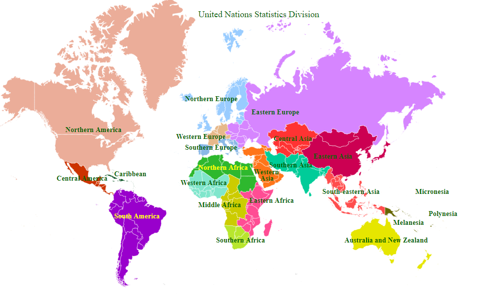

# Continents

Created: 2020-01-05 18:45:31 +0500

Modified: 2022-01-28 23:23:41 +0500

---

<table style="width:100%;">
<colgroup>
<col style="width: 13%" />
<col style="width: 13%" />
<col style="width: 13%" />
<col style="width: 12%" />
<col style="width: 16%" />
<col style="width: 10%" />
<col style="width: 19%" />
</colgroup>
<thead>
<tr class="header">
<th><strong>Continent</strong></th>
<th><strong>Area (km²)</strong></th>
<th><strong>Area (mi²)</strong></th>
<th>
<strong>Percent total</strong>

<strong>landmass</strong>
</th>
<th><strong>Population</strong></th>
<th>
<strong>Percent</strong>

<strong>total pop.</strong>
</th>
<th>
<strong>Most populous</strong>

<strong>city</strong>
</th>
</tr>
</thead>
<tbody>
<tr>
<td><a href="https://en.wikipedia.org/wiki/Africa">Africa</a></td>
<td>30,370,000</td>
<td>11,730,000</td>
<td>20.4%</td>
<td>1,287,920,000</td>
<td>16.9%</td>
<td><a href="https://en.wikipedia.org/wiki/Lagos">Lagos</a>,<a href="https://en.wikipedia.org/wiki/Nigeria">Nigeria</a></td>
</tr>
<tr>
<td><a href="https://en.wikipedia.org/wiki/Antarctica">Antarctica</a></td>
<td>14,000,000</td>
<td>5,400,000</td>
<td>9.2%</td>
<td>4,490</td>
<td>0.0%</td>
<td><a href="https://en.wikipedia.org/wiki/McMurdo_Station">McMurdo Station</a></td>
</tr>
<tr>
<td><a href="https://en.wikipedia.org/wiki/Asia">Asia</a></td>
<td>44,579,000</td>
<td>17,212,000</td>
<td>29.5%</td>
<td>4,545,133,000</td>
<td>59.5%</td>
<td><a href="https://en.wikipedia.org/wiki/Shanghai">Shanghai</a>,<a href="https://en.wikipedia.org/wiki/China">China</a></td>
</tr>
<tr>
<td><a href="https://en.wikipedia.org/wiki/Australia_(continent)">Australia</a></td>
<td>8,600,000</td>
<td>3,300,000</td>
<td>5.9%</td>
<td>41,261,000</td>
<td>0.5%</td>
<td><a href="https://en.wikipedia.org/wiki/Sydney">Sydney</a>,<a href="https://en.wikipedia.org/wiki/Australia">Australia</a></td>
</tr>
<tr>
<td><a href="https://en.wikipedia.org/wiki/Europe">Europe</a></td>
<td>10,180,000</td>
<td>3,930,000</td>
<td>6.8%</td>
<td>742,648,000</td>
<td>9.7%</td>
<td><a href="https://en.wikipedia.org/wiki/Moscow">Moscow</a>,<a href="https://en.wikipedia.org/wiki/Russia">Russia</a></td>
</tr>
<tr>
<td><a href="https://en.wikipedia.org/wiki/North_America">North America</a></td>
<td>24,709,000</td>
<td>9,540,000</td>
<td>16.5%</td>
<td>587,615,000</td>
<td>7.7%</td>
<td><a href="https://en.wikipedia.org/wiki/Mexico_City">Mexico City</a>,<a href="https://en.wikipedia.org/wiki/Mexico">Mexico</a></td>
</tr>
<tr>
<td><a href="https://en.wikipedia.org/wiki/South_America">South America</a></td>
<td>17,840,000</td>
<td>6,890,000</td>
<td>12.0%</td>
<td>428,240,000</td>
<td>5.6%</td>
<td><a href="https://en.wikipedia.org/wiki/S%C3%A3o_Paulo">São Paulo</a>,<a href="https://en.wikipedia.org/wiki/Brazil">Brazil</a></td>
</tr>
</tbody>
</table>

The term [Oceania](https://en.wikipedia.org/wiki/Oceania) refers to a group of [island countries](https://en.wikipedia.org/wiki/Island_country) and territories in the [Pacific Ocean](https://en.wikipedia.org/wiki/Pacific_Ocean), together with the [continent of Australia](https://en.wikipedia.org/wiki/Australia_(continent)).[Pacific islands](https://en.wikipedia.org/wiki/Pacific_islands) with ties to other continents (such as [Japan](https://en.wikipedia.org/wiki/Japan), [Hawaii](https://en.wikipedia.org/wiki/Hawaii) or [Easter Island](https://en.wikipedia.org/wiki/Easter_Island)) are usually grouped with those continents rather than Oceania. This term is used in several different continental models instead of [Australia](https://en.wikipedia.org/wiki/Australia_(continent)).

## Highest and Lowest Point

| **Continent** | **Highest point**                                                    | **Elevation (m)** | **Elevation (ft)** | **Country or territory containing highest point**                                                              | **Lowest point**                                                            | **Elevation (m)** | **Elevation (ft)** | **Country or territory containing lowest point**                                                                                                                 |
|-------|--------|-------|-------|-----------|---------|-------|-------|---------------|
| Asia          | [Mount Everest](https://en.wikipedia.org/wiki/Mount_Everest)         | 8,848             | 29,029             | [China](https://en.wikipedia.org/wiki/China), [Nepal](https://en.wikipedia.org/wiki/Nepal)                      | [Dead Sea](https://en.wikipedia.org/wiki/Dead_Sea)                          | −427              | −1,401             | [Israel](https://en.wikipedia.org/wiki/Israel), [Jordan](https://en.wikipedia.org/wiki/Jordan) and [Palestine](https://en.wikipedia.org/wiki/State_of_Palestine) |
| South America | [Aconcagua](https://en.wikipedia.org/wiki/Aconcagua)                 | 6,960             | 22,830             | [Argentina](https://en.wikipedia.org/wiki/Argentina)                                                           | [Laguna del Carbón](https://en.wikipedia.org/wiki/Laguna_del_Carb%C3%B3n)   | −105              | −344               | [Argentina](https://en.wikipedia.org/wiki/Argentina)                                                                                                             |
| North America | [Denali](https://en.wikipedia.org/wiki/Denali)                       | 6,198             | 20,335             | United States                                                                                                  | [Death Valley](https://en.wikipedia.org/wiki/Death_Valley)†                | −86               | −282               | United States                                                                                                                                                    |
| Africa        | [Mount Kilimanjaro](https://en.wikipedia.org/wiki/Mount_Kilimanjaro) | 5,895             | 19,341             | [Tanzania](https://en.wikipedia.org/wiki/Tanzania)                                                             | [Lake Assal](https://en.wikipedia.org/wiki/Lake_Assal_(Djibouti))           | −155              | −509               | [Djibouti](https://en.wikipedia.org/wiki/Djibouti)                                                                                                               |
| Europe        | [Mount Elbrus](https://en.wikipedia.org/wiki/Mount_Elbrus)           | 5,642             | 18,510             | Russia                                                                                                         | [Caspian Sea](https://en.wikipedia.org/wiki/Caspian_Sea)                    | −28               | −92                | Russia                                                                                                                                                           |
| Antarctica    | [Vinson Massif](https://en.wikipedia.org/wiki/Vinson_Massif)         | 4,892             | 16,050             | (none)                                                                                                         | Deep Lake, [Vestfold Hills](https://en.wikipedia.org/wiki/Vestfold_Hills)† | −50               | −160               | (none)                                                                                                                                                           |
| Australia     | [Puncak Jaya](https://en.wikipedia.org/wiki/Puncak_Jaya)             | 4,884             | 16,024             | [Indonesia](https://en.wikipedia.org/wiki/Indonesia)([Papua](https://en.wikipedia.org/wiki/Papua_(province))) | [Lake Eyre](https://en.wikipedia.org/wiki/Lake_Eyre)                        | −15               | −49                | Australia                                                                                                                                                        |

[How the World Map Looks Wildly Different Than You Think](https://youtu.be/lPNrtjboISg)

- Mercator Projection

TheMercator projection([/mərˈkeɪtər/](https://en.wikipedia.org/wiki/Help:IPA/English)) is a [cylindrical map projection](https://en.wikipedia.org/wiki/Cylindrical_map_projection) presented by [Flemish](https://en.wikipedia.org/wiki/Flemish_people) geographer and cartographer [Gerardus Mercator](https://en.wikipedia.org/wiki/Gerardus_Mercator) in 1569. It became the standard map projection for [navigation](https://en.wikipedia.org/wiki/Navigation) because it is unique in representing north as up and south as down everywhere while preserving local directions and shapes. The map is thereby [conformal](https://en.wikipedia.org/wiki/Conformal_map_projection). As a side effect, the Mercator projection inflates the size of objects away from the equator. This inflation is very small near the equator but accelerates with increasing [latitude](https://en.wikipedia.org/wiki/Latitude) to become infinite at the poles. As a result, landmasses such as [Greenland](https://en.wikipedia.org/wiki/Greenland) and [Antarctica](https://en.wikipedia.org/wiki/Antarctica) appear far larger than they actually are relative to landmasses near the equator, such as Central Africa.

<https://en.wikipedia.org/wiki/Mercator_projection>

<https://en.wikipedia.org/wiki/Equal-area_map>

<https://thetruesize.com>

- India is bigger than greenland
- Russia is not as big as it seems
