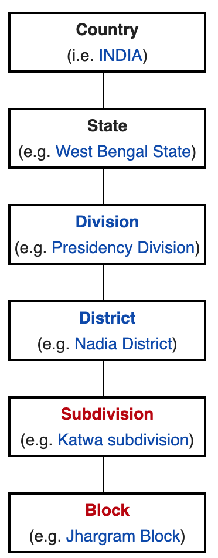

# Indian States and UTs

Created: 2020-01-05 17:16:34 +0500

Modified: 2022-01-30 11:58:21 +0500

---

[India](https://en.wikipedia.org/wiki/India) is a [federal](https://en.wikipedia.org/wiki/Federalism) union comprising 28 [states](https://en.wikipedia.org/wiki/Federated_state) and 9 [union territories](https://en.wikipedia.org/wiki/Union_territory), for a total of 37 entities. The states and union territories are further subdivided into [districts](https://en.wikipedia.org/wiki/List_of_districts_in_India) and smaller [administrative divisions](https://en.wikipedia.org/wiki/Administrative_divisions_of_India).

<table>
<colgroup>
<col style="width: 7%" />
<col style="width: 3%" />
<col style="width: 4%" />
<col style="width: 4%" />
<col style="width: 9%" />
<col style="width: 7%" />
<col style="width: 5%" />
<col style="width: 6%" />
<col style="width: 5%" />
<col style="width: 11%" />
<col style="width: 34%" />
</colgroup>
<thead>
<tr class="header">
<th><strong>State</strong></th>
<th><a href="https://en.wikipedia.org/wiki/ISO_3166-2:IN"><strong>ISO 3166-2:IN</strong></a></th>
<th>
<a href="https://en.wikipedia.org/wiki/Vehicle_registration_plates_of_India"><strong>Vehicle</strong></a>

<a href="https://en.wikipedia.org/wiki/Vehicle_registration_plates_of_India"><strong>code</strong></a>
</th>
<th><a href="https://en.wikipedia.org/wiki/Zonal_Council"><strong>Zone</strong></a></th>
<th><strong>Capital</strong></th>
<th><strong>Largest city</strong></th>
<th><strong>Statehood</strong></th>
<th><strong>Population</strong><a href="https://en.wikipedia.org/wiki/States_and_union_territories_of_India#cite_note-census2011.co.in-35">[35]</a></th>
<th>
<a href="https://en.wikipedia.org/wiki/List_of_states_and_union_territories_of_India_by_area"><strong>Area</strong></a>

<strong>(km2)</strong>
</th>
<th>
<strong>Official</strong>

<strong>languages</strong><a href="https://en.wikipedia.org/wiki/States_and_union_territories_of_India#cite_note-langoff50-36">[36]</a>
</th>
<th>
<strong>Additional official</strong>

<strong>languages</strong><a href="https://en.wikipedia.org/wiki/States_and_union_territories_of_India#cite_note-langoff50-36">[36]</a>
</th>
</tr>
</thead>
<tbody>
<tr>
<td><a href="https://en.wikipedia.org/wiki/Andhra_Pradesh">Andhra Pradesh</a></td>
<td>IN-AP</td>
<td>AP</td>
<td><a href="https://en.wikipedia.org/wiki/Southern_Zonal_Council">Southern</a></td>
<td>
<a href="https://en.wikipedia.org/wiki/Hyderabad,_India">Hyderabad</a>(<em>de jure</em>)

<a href="https://en.wikipedia.org/wiki/Amaravati">Amaravati</a>(<em>de facto</em>)
</td>
<td><a href="https://en.wikipedia.org/wiki/Visakhapatnam">Visakhapatnam</a></td>
<td>1 October 1953</td>
<td>49,506,799</td>
<td>160,205</td>
<td><a href="https://en.wikipedia.org/wiki/Telugu_language">Telugu</a></td>
<td>—</td>
</tr>
<tr>
<td><a href="https://en.wikipedia.org/wiki/Arunachal_Pradesh">Arunachal Pradesh</a></td>
<td>IN-AR</td>
<td>AR</td>
<td><a href="https://en.wikipedia.org/wiki/North-Eastern_Zonal_Council">North-Eastern</a></td>
<td><a href="https://en.wikipedia.org/wiki/Itanagar">Itanagar</a></td>
<td></td>
<td>20 February 1987</td>
<td>1,383,727</td>
<td>83,743</td>
<td><a href="https://en.wikipedia.org/wiki/English_language">English</a></td>
<td>—</td>
</tr>
<tr>
<td><a href="https://en.wikipedia.org/wiki/Assam">Assam</a></td>
<td>IN-AS</td>
<td>AS</td>
<td>North-Eastern</td>
<td><a href="https://en.wikipedia.org/wiki/Dispur">Dispur</a></td>
<td><a href="https://en.wikipedia.org/wiki/Guwahati">Guwahati</a></td>
<td>26 January 1950</td>
<td>31,205,576</td>
<td>78,550</td>
<td><a href="https://en.wikipedia.org/wiki/Assamese_language">Assamese</a></td>
<td><a href="https://en.wikipedia.org/wiki/Bengali_language">Bengali</a>,<a href="https://en.wikipedia.org/wiki/Bodo_language">Bodo</a></td>
</tr>
<tr>
<td><a href="https://en.wikipedia.org/wiki/Bihar">Bihar</a></td>
<td>IN-BR</td>
<td>BR</td>
<td><a href="https://en.wikipedia.org/wiki/Eastern_Zonal_Council">Eastern</a></td>
<td><a href="https://en.wikipedia.org/wiki/Patna">Patna</a></td>
<td></td>
<td>26 January 1950</td>
<td>104,099,452</td>
<td>94,163</td>
<td><a href="https://en.wikipedia.org/wiki/Hindi">Hindi</a></td>
<td><a href="https://en.wikipedia.org/wiki/Urdu">Urdu</a></td>
</tr>
<tr>
<td><a href="https://en.wikipedia.org/wiki/Chhattisgarh">Chhattisgarh</a></td>
<td>IN-CT</td>
<td>CG</td>
<td><a href="https://en.wikipedia.org/wiki/Central_Zonal_Council">Central</a></td>
<td><a href="https://en.wikipedia.org/wiki/Naya_Raipur">Naya Raipur</a></td>
<td></td>
<td>1 November 2000</td>
<td>25,545,198</td>
<td>135,194</td>
<td><a href="https://en.wikipedia.org/wiki/Hindi">Hindi</a></td>
<td>—</td>
</tr>
<tr>
<td><a href="https://en.wikipedia.org/wiki/Goa">Goa</a></td>
<td>IN-GA</td>
<td>GA</td>
<td><a href="https://en.wikipedia.org/wiki/Western_Zonal_Council">Western</a></td>
<td><a href="https://en.wikipedia.org/wiki/Panaji">Panaji</a></td>
<td><a href="https://en.wikipedia.org/wiki/Vasco_da_Gama,_Goa">Vasco da Gama</a></td>
<td>30 May 1987</td>
<td>1,458,545</td>
<td>3,702</td>
<td><a href="https://en.wikipedia.org/wiki/Konkani_language">Konkani</a></td>
<td><a href="https://en.wikipedia.org/wiki/English_language">English</a>,<a href="https://en.wikipedia.org/wiki/Marathi_language">Marathi</a></td>
</tr>
<tr>
<td><a href="https://en.wikipedia.org/wiki/Gujarat">Gujarat</a></td>
<td>IN-GJ</td>
<td>GJ</td>
<td>Western</td>
<td><a href="https://en.wikipedia.org/wiki/Gandhinagar">Gandhinagar</a></td>
<td><a href="https://en.wikipedia.org/wiki/Ahmedabad">Ahmedabad</a></td>
<td>1 May 1960</td>
<td>60,439,692</td>
<td>196,024</td>
<td><a href="https://en.wikipedia.org/wiki/Gujarati_language">Gujarati</a></td>
<td>—</td>
</tr>
<tr>
<td><a href="https://en.wikipedia.org/wiki/Haryana">Haryana</a></td>
<td>IN-HR</td>
<td>HR</td>
<td><a href="https://en.wikipedia.org/wiki/Northern_Zonal_Council">Northern</a></td>
<td><a href="https://en.wikipedia.org/wiki/Chandigarh">Chandigarh</a></td>
<td><a href="https://en.wikipedia.org/wiki/Faridabad">Faridabad</a></td>
<td>1 November 1966</td>
<td>25,351,462</td>
<td>44,212</td>
<td><a href="https://en.wikipedia.org/wiki/Hindi">Hindi</a></td>
<td><a href="https://en.wikipedia.org/wiki/Punjabi_language">Punjabi</a><a href="https://en.wikipedia.org/wiki/States_and_union_territories_of_India#cite_note-39">[39]</a><a href="https://en.wikipedia.org/wiki/States_and_union_territories_of_India#cite_note-40">[40]</a></td>
</tr>
<tr>
<td><a href="https://en.wikipedia.org/wiki/Himachal_Pradesh">Himachal Pradesh</a></td>
<td>IN-HP</td>
<td>HP</td>
<td>Northern</td>
<td>
<a href="https://en.wikipedia.org/wiki/Shimla">Shimla</a>(Summer)

<a href="https://en.wikipedia.org/wiki/Dharamshala">Dharamshala</a>(Winter)
</td>
<td><a href="https://en.wikipedia.org/wiki/Shimla">Shimla</a></td>
<td>25 January 1971</td>
<td>6,864,602</td>
<td>55,673</td>
<td><a href="https://en.wikipedia.org/wiki/Hindi">Hindi</a></td>
<td><a href="https://en.wikipedia.org/wiki/English_language">English</a></td>
</tr>
<tr>
<td><a href="https://en.wikipedia.org/wiki/Jharkhand">Jharkhand</a></td>
<td>IN-JH</td>
<td>JH</td>
<td>Eastern</td>
<td><a href="https://en.wikipedia.org/wiki/Ranchi">Ranchi</a></td>
<td><a href="https://en.wikipedia.org/wiki/Jamshedpur">Jamshedpur</a></td>
<td>15 November 2000</td>
<td>32,988,134</td>
<td>74,677</td>
<td><a href="https://en.wikipedia.org/wiki/Hindi">Hindi</a></td>
<td><a href="https://en.wikipedia.org/wiki/Urdu">Urdu</a><a href="https://en.wikipedia.org/wiki/States_and_union_territories_of_India#cite_note-41">[41]</a></td>
</tr>
<tr>
<td><a href="https://en.wikipedia.org/wiki/Karnataka">Karnataka</a></td>
<td>IN-KA</td>
<td>KA</td>
<td>Southern</td>
<td><a href="https://en.wikipedia.org/wiki/Bangalore">Bangalore</a></td>
<td></td>
<td>1 November 1956</td>
<td>61,095,297</td>
<td>191,791</td>
<td><a href="https://en.wikipedia.org/wiki/Kannada_language">Kannada</a></td>
<td><a href="https://en.wikipedia.org/wiki/English_language">English</a></td>
</tr>
<tr>
<td><a href="https://en.wikipedia.org/wiki/Kerala">Kerala</a></td>
<td>IN-KL</td>
<td>KL</td>
<td>Southern</td>
<td><a href="https://en.wikipedia.org/wiki/Thiruvananthapuram">Thiruvananthapuram</a></td>
<td><a href="https://en.wikipedia.org/wiki/Kochi">Kochi</a></td>
<td>1 November 1956</td>
<td>33,406,061</td>
<td>38,863</td>
<td><a href="https://en.wikipedia.org/wiki/Malayalam">Malayalam</a></td>
<td><a href="https://en.wikipedia.org/wiki/English_language">English</a></td>
</tr>
<tr>
<td><a href="https://en.wikipedia.org/wiki/Madhya_Pradesh">Madhya Pradesh</a></td>
<td>IN-MP</td>
<td>MP</td>
<td>Central</td>
<td><a href="https://en.wikipedia.org/wiki/Bhopal">Bhopal</a></td>
<td><a href="https://en.wikipedia.org/wiki/Indore">Indore</a></td>
<td>1 November 1956</td>
<td>72,626,809</td>
<td>308,252</td>
<td><a href="https://en.wikipedia.org/wiki/Hindi">Hindi</a></td>
<td>—</td>
</tr>
<tr>
<td><a href="https://en.wikipedia.org/wiki/Maharashtra">Maharashtra</a></td>
<td>IN-MH</td>
<td>MH</td>
<td>Western</td>
<td>
<a href="https://en.wikipedia.org/wiki/Mumbai">Mumbai</a>(Summer)

<a href="https://en.wikipedia.org/wiki/Nagpur">Nagpur</a>(Winter)
</td>
<td><a href="https://en.wikipedia.org/wiki/Mumbai">Mumbai</a></td>
<td>1 May 1960</td>
<td>112,374,333</td>
<td>307,713</td>
<td><a href="https://en.wikipedia.org/wiki/Marathi_Language">Marathi</a></td>
<td>—</td>
</tr>
<tr>
<td><a href="https://en.wikipedia.org/wiki/Manipur">Manipur</a></td>
<td>IN-MN</td>
<td>MN</td>
<td>North-Eastern</td>
<td><a href="https://en.wikipedia.org/wiki/Imphal">Imphal</a></td>
<td></td>
<td>21 January 1972</td>
<td>2,855,794</td>
<td>22,347</td>
<td><a href="https://en.wikipedia.org/wiki/Meitei_language">Meitei</a></td>
<td><a href="https://en.wikipedia.org/wiki/English_language">English</a></td>
</tr>
<tr>
<td><a href="https://en.wikipedia.org/wiki/Meghalaya">Meghalaya</a></td>
<td>IN-ML</td>
<td>ML</td>
<td>North-Eastern</td>
<td><a href="https://en.wikipedia.org/wiki/Shillong">Shillong</a></td>
<td></td>
<td>21 January 1972</td>
<td>2,966,889</td>
<td>22,720</td>
<td><a href="https://en.wikipedia.org/wiki/English_language">English</a></td>
<td><a href="https://en.wikipedia.org/wiki/Khasi_language">Khasi</a><a href="https://en.wikipedia.org/wiki/States_and_union_territories_of_India#cite_note-43">[a]</a></td>
</tr>
<tr>
<td><a href="https://en.wikipedia.org/wiki/Mizoram">Mizoram</a></td>
<td>IN-MZ</td>
<td>MZ</td>
<td>North-Eastern</td>
<td><a href="https://en.wikipedia.org/wiki/Aizawl">Aizawl</a></td>
<td></td>
<td>20 February 1987</td>
<td>1,097,206</td>
<td>21,081</td>
<td><a href="https://en.wikipedia.org/wiki/English_language">English</a>,<a href="https://en.wikipedia.org/wiki/Hindi">Hindi</a>,<a href="https://en.wikipedia.org/wiki/Mizo_language">Mizo</a></td>
<td>—</td>
</tr>
<tr>
<td><a href="https://en.wikipedia.org/wiki/Nagaland">Nagaland</a></td>
<td>IN-NL</td>
<td>NL</td>
<td>North-Eastern</td>
<td><a href="https://en.wikipedia.org/wiki/Kohima">Kohima</a></td>
<td><a href="https://en.wikipedia.org/wiki/Dimapur">Dimapur</a></td>
<td>1 December 1963</td>
<td>1,978,502</td>
<td>16,579</td>
<td><a href="https://en.wikipedia.org/wiki/English_language">English</a></td>
<td>—</td>
</tr>
<tr>
<td><a href="https://en.wikipedia.org/wiki/Odisha">Odisha</a></td>
<td>IN-OR</td>
<td>OD</td>
<td>Eastern</td>
<td><a href="https://en.wikipedia.org/wiki/Bhubaneswar">Bhubaneswar</a></td>
<td></td>
<td>1 April 1936</td>
<td>41,974,218</td>
<td>155,820</td>
<td><a href="https://en.wikipedia.org/wiki/Odia_language">Odia</a></td>
<td>—</td>
</tr>
<tr>
<td><a href="https://en.wikipedia.org/wiki/Punjab,_India">Punjab</a></td>
<td>IN-PB</td>
<td>PB</td>
<td>Northern</td>
<td><a href="https://en.wikipedia.org/wiki/Chandigarh">Chandigarh</a></td>
<td><a href="https://en.wikipedia.org/wiki/Ludhiana">Ludhiana</a></td>
<td>1 November 1966</td>
<td>27,743,338</td>
<td>50,362</td>
<td><a href="https://en.wikipedia.org/wiki/Punjabi_language">Punjabi</a></td>
<td>—</td>
</tr>
<tr>
<td><a href="https://en.wikipedia.org/wiki/Rajasthan">Rajasthan</a></td>
<td>IN-RJ</td>
<td>RJ</td>
<td>Northern</td>
<td><a href="https://en.wikipedia.org/wiki/Jaipur">Jaipur</a></td>
<td></td>
<td>1 November 1956</td>
<td>68,548,437</td>
<td>342,269</td>
<td><a href="https://en.wikipedia.org/wiki/Hindi">Hindi</a></td>
<td><a href="https://en.wikipedia.org/wiki/English_language">English</a></td>
</tr>
<tr>
<td><a href="https://en.wikipedia.org/wiki/Sikkim">Sikkim</a></td>
<td>IN-SK</td>
<td>SK</td>
<td>North-Eastern</td>
<td><a href="https://en.wikipedia.org/wiki/Gangtok">Gangtok</a></td>
<td></td>
<td>16 May 1975</td>
<td>610,577</td>
<td>7,096</td>
<td><a href="https://en.wikipedia.org/wiki/Nepali_language">Nepali</a>,<a href="https://en.wikipedia.org/wiki/English_language">English</a></td>
<td><a href="https://en.wikipedia.org/wiki/Bhutia_language">Bhutia</a>,<a href="https://en.wikipedia.org/wiki/Gurung_language">Gurung</a>,<a href="https://en.wikipedia.org/wiki/Lepcha_language">Lepcha</a>,<a href="https://en.wikipedia.org/wiki/Limbu_language">Limbu</a>,<a href="https://en.wikipedia.org/wiki/Manggar_language">Manggar</a>,<a href="https://en.wikipedia.org/wiki/Mukhia_language">Mukhia</a>,<a href="https://en.wikipedia.org/wiki/Newari_language">Newari</a>,<a href="https://en.wikipedia.org/wiki/Rai_languages">Rai</a>,<a href="https://en.wikipedia.org/wiki/Sherpa_language">Sherpa</a>,<a href="https://en.wikipedia.org/wiki/Tamang_language">Tamang</a></td>
</tr>
<tr>
<td><a href="https://en.wikipedia.org/wiki/Tamil_Nadu">Tamil Nadu</a></td>
<td>IN-TN</td>
<td>TN</td>
<td>Southern</td>
<td><a href="https://en.wikipedia.org/wiki/Chennai">Chennai</a></td>
<td></td>
<td>26 January 1950</td>
<td>72,147,030</td>
<td>130,058</td>
<td><a href="https://en.wikipedia.org/wiki/Tamil_language">Tamil</a></td>
<td><a href="https://en.wikipedia.org/wiki/English_language">English</a></td>
</tr>
<tr>
<td><a href="https://en.wikipedia.org/wiki/Telangana">Telangana</a></td>
<td>IN-TG</td>
<td>TS</td>
<td>Southern</td>
<td><a href="https://en.wikipedia.org/wiki/Hyderabad">Hyderabad</a></td>
<td></td>
<td>2 June 2014</td>
<td>35,193,978<a href="https://en.wikipedia.org/wiki/States_and_union_territories_of_India#cite_note-telangana-44">[43]</a></td>
<td>114,840<a href="https://en.wikipedia.org/wiki/States_and_union_territories_of_India#cite_note-telangana-44">[43]</a></td>
<td><a href="https://en.wikipedia.org/wiki/Telugu_language">Telugu</a>,<a href="https://en.wikipedia.org/wiki/Urdu">Urdu</a><a href="https://en.wikipedia.org/wiki/States_and_union_territories_of_India#cite_note-45">[44]</a></td>
<td>—</td>
</tr>
<tr>
<td><a href="https://en.wikipedia.org/wiki/Tripura">Tripura</a></td>
<td>IN-TR</td>
<td>TR</td>
<td>North-Eastern</td>
<td><a href="https://en.wikipedia.org/wiki/Agartala">Agartala</a></td>
<td></td>
<td>21 January 1972</td>
<td>3,673,917</td>
<td>10,492</td>
<td><a href="https://en.wikipedia.org/wiki/Bengali_language">Bengali</a>,<a href="https://en.wikipedia.org/wiki/English_language">English</a>,<a href="https://en.wikipedia.org/wiki/Kokborok_language">Kokborok</a></td>
<td>—</td>
</tr>
<tr>
<td><a href="https://en.wikipedia.org/wiki/Uttar_Pradesh">Uttar Pradesh</a></td>
<td>IN-UP</td>
<td>UP</td>
<td>Northern</td>
<td><a href="https://en.wikipedia.org/wiki/Lucknow">Lucknow</a></td>
<td><a href="https://en.wikipedia.org/wiki/Kanpur">Kanpur</a></td>
<td>26 January 1950</td>
<td>199,812,341</td>
<td>243,286</td>
<td><a href="https://en.wikipedia.org/wiki/Hindi">Hindi</a></td>
<td><a href="https://en.wikipedia.org/wiki/Urdu">Urdu</a></td>
</tr>
<tr>
<td><a href="https://en.wikipedia.org/wiki/Uttarakhand">Uttarakhand</a></td>
<td>IN-UT</td>
<td>UK</td>
<td>Northern</td>
<td><a href="https://en.wikipedia.org/wiki/Dehradun">Dehradun</a></td>
<td></td>
<td>9 November 2000</td>
<td>10,086,292</td>
<td>53,483</td>
<td><a href="https://en.wikipedia.org/wiki/Hindi">Hindi</a></td>
<td><a href="https://en.wikipedia.org/wiki/Sanskrit">Sanskrit</a><a href="https://en.wikipedia.org/wiki/States_and_union_territories_of_India#cite_note-46">[45]</a></td>
</tr>
<tr>
<td>
<a href="https://en.wikipedia.org/wiki/West_Bengal">West Bengal</a>

<a href="https://youtu.be/76u1LJ_WUJg">West Bengal Politics Explained &amp; Its Geostrategic importance | WB elections 2021</a>
</td>
<td>IN-WB</td>
<td>WB</td>
<td>Eastern</td>
<td><a href="https://en.wikipedia.org/wiki/Kolkata">Kolkata</a></td>
<td></td>
<td>26 January 1950</td>
<td>91,276,115</td>
<td>88,752</td>
<td><a href="https://en.wikipedia.org/wiki/Bengali_language">Bengali</a>,<a href="https://en.wikipedia.org/wiki/Nepali_language">Nepali</a><a href="https://en.wikipedia.org/wiki/States_and_union_territories_of_India#cite_note-47">[b]</a></td>
<td><a href="https://en.wikipedia.org/wiki/Hindi">Hindi</a>,<a href="https://en.wikipedia.org/wiki/Odia_language">Odia</a>,<a href="https://en.wikipedia.org/wiki/Punjabi_language">Punjabi</a>,<a href="https://en.wikipedia.org/wiki/Santali_language">Santali</a>,<a href="https://en.wikipedia.org/wiki/Urdu">Urdu</a></td>
</tr>
</tbody>
</table>
-   [**^Note 1**](https://en.wikipedia.org/wiki/States_and_union_territories_of_India#ref_1) Andhra Pradesh was divided into two states, [Telangana](https://en.wikipedia.org/wiki/Telangana) and a residual [Andhra Pradesh](https://en.wikipedia.org/wiki/Andhra_Pradesh) on 2 June 2014.^[[46]][https://en.wikipedia.org/wiki/States_and_union_territories_of_India#cite_note-The_Times_Of_India-48]([47)][https://en.wikipedia.org/wiki/States_and_union_territories_of_India#cite_note-APGazetteMar1-49]([48)](https://en.wikipedia.org/wiki/States_and_union_territories_of_India#cite_note-APGazetteMar4-50)^[Hyderabad](https://en.wikipedia.org/wiki/Hyderabad,_India), located entirely within the borders of Telangana, is to serve as the capital for both states for a period of time not exceeding ten years.[^[49]^](https://en.wikipedia.org/wiki/States_and_union_territories_of_India#cite_note-51) The Government of Andhra Pradesh and the Andhra Pradesh Legislature completed the process of relocating to temporary facilities in the envisaged new capital city [Amaravati](https://en.wikipedia.org/wiki/Amaravati) in early 2017.[^[37]^](https://en.wikipedia.org/wiki/States_and_union_territories_of_India#cite_note-gulte.com-37)
-   [**^Note 2**](https://en.wikipedia.org/wiki/States_and_union_territories_of_India#ref_2) Dehradun is the interim capital of Uttarakhand. The town of [Gairsain](https://en.wikipedia.org/wiki/Gairsain) is envisaged as the state's new capital.

<table>
<colgroup>
<col style="width: 10%" />
<col style="width: 5%" />
<col style="width: 6%" />
<col style="width: 12%" />
<col style="width: 6%" />
<col style="width: 10%" />
<col style="width: 8%" />
<col style="width: 23%" />
<col style="width: 15%" />
</colgroup>
<thead>
<tr class="header">
<th><strong>Union territory</strong></th>
<th><a href="https://en.wikipedia.org/wiki/ISO_3166-2:IN"><strong>ISO 3166-2:IN</strong></a></th>
<th><a href="https://en.wikipedia.org/wiki/Vehicle_registration_plates_of_India"><strong>Vehicle code</strong></a></th>
<th><strong>Capital</strong></th>
<th><strong>Largest city</strong></th>
<th><strong>Population</strong><a href="https://en.wikipedia.org/wiki/States_and_union_territories_of_India#cite_note-census2011.co.in-35">[35]</a></th>
<th>
<a href="https://en.wikipedia.org/wiki/List_of_states_and_union_territories_of_India_by_area"><strong>Area</strong></a>

<strong>(km2)</strong>
</th>
<th>
<strong>Official</strong>

<strong>languages</strong><a href="https://en.wikipedia.org/wiki/States_and_union_territories_of_India#cite_note-langoff50-36">[36]</a>
</th>
<th>
<strong>Additional official</strong>

<strong>languages</strong><a href="https://en.wikipedia.org/wiki/States_and_union_territories_of_India#cite_note-langoff50-36">[36]</a>
</th>
</tr>
</thead>
<tbody>
<tr>
<td><a href="https://en.wikipedia.org/wiki/Andaman_and_Nicobar_Islands">Andaman and Nicobar Islands</a></td>
<td>IN-AN</td>
<td>AN</td>
<td><a href="https://en.wikipedia.org/wiki/Port_Blair">Port Blair</a></td>
<td></td>
<td>380,581</td>
<td>8,249</td>
<td><a href="https://en.wikipedia.org/wiki/English_language">English</a>,<a href="https://en.wikipedia.org/wiki/Hindi">Hindi</a></td>
<td>—</td>
</tr>
<tr>
<td><a href="https://en.wikipedia.org/wiki/Chandigarh">Chandigarh</a></td>
<td>IN-CH</td>
<td>CH</td>
<td><a href="https://en.wikipedia.org/wiki/Chandigarh">Chandigarh</a></td>
<td>—<a href="https://en.wikipedia.org/wiki/States_and_union_territories_of_India#cite_note-52">[c]</a></td>
<td>1,055,450</td>
<td>114</td>
<td><a href="https://en.wikipedia.org/wiki/English_language">English</a></td>
<td>—</td>
</tr>
<tr>
<td><a href="https://en.wikipedia.org/wiki/Dadra_and_Nagar_Haveli">Dadra and Nagar Haveli</a></td>
<td>IN-DN</td>
<td>DN</td>
<td><a href="https://en.wikipedia.org/wiki/Silvassa">Silvassa</a></td>
<td></td>
<td>343,709</td>
<td>491</td>
<td><a href="https://en.wikipedia.org/wiki/Gujarati_language">Gujarati</a>,<a href="https://en.wikipedia.org/wiki/Hindi">Hindi</a></td>
<td><a href="https://en.wikipedia.org/wiki/Marathi_language">Marathi</a></td>
</tr>
<tr>
<td><a href="https://en.wikipedia.org/wiki/Daman_and_Diu">Daman and Diu</a></td>
<td>IN-DD</td>
<td>DD</td>
<td><a href="https://en.wikipedia.org/wiki/Daman,_Daman_and_Diu">Daman</a></td>
<td></td>
<td>243,247</td>
<td>112</td>
<td><a href="https://en.wikipedia.org/wiki/English_language">English</a>,<a href="https://en.wikipedia.org/wiki/Gujarati_language">Gujarati</a>,<a href="https://en.wikipedia.org/wiki/Hindi">Hindi</a>,<a href="https://en.wikipedia.org/wiki/Konkani_language">Konkani</a><a href="https://en.wikipedia.org/wiki/States_and_union_territories_of_India#cite_note-53">[d]</a></td>
<td>—</td>
</tr>
<tr>
<td><a href="https://en.wikipedia.org/wiki/Delhi">Delhi</a></td>
<td>IN-DL</td>
<td>DL</td>
<td><a href="https://en.wikipedia.org/wiki/New_Delhi">New Delhi</a></td>
<td>—<a href="https://en.wikipedia.org/wiki/States_and_union_territories_of_India#cite_note-54">[e]</a></td>
<td>16,787,941</td>
<td>1,490</td>
<td><a href="https://en.wikipedia.org/wiki/Hindi">Hindi</a></td>
<td><a href="https://en.wikipedia.org/wiki/Punjabi_language">Punjabi</a>,<a href="https://en.wikipedia.org/wiki/Urdu">Urdu</a><a href="https://en.wikipedia.org/wiki/States_and_union_territories_of_India#cite_note-55">[50]</a></td>
</tr>
<tr>
<td><a href="https://en.wikipedia.org/wiki/Jammu_and_Kashmir_(union_territory)">Jammu and Kashmir</a></td>
<td>IN-JK</td>
<td>JK</td>
<td>
<a href="https://en.wikipedia.org/wiki/Srinagar">Srinagar</a>(Summer)

<a href="https://en.wikipedia.org/wiki/Jammu">Jammu</a>(Winter)
</td>
<td><a href="https://en.wikipedia.org/wiki/Srinagar">Srinagar</a></td>
<td>12,258,433</td>
<td>55,538<a href="https://en.wikipedia.org/wiki/States_and_union_territories_of_India#endnote_3">Note 3</a></td>
<td><a href="https://en.wikipedia.org/wiki/Hindi">Hindi</a>,<a href="https://en.wikipedia.org/wiki/English_language">English</a></td>
<td><a href="https://en.wikipedia.org/wiki/Dogri_language">Dogri</a>,<a href="https://en.wikipedia.org/wiki/Kashmiri_language">Kashmiri</a>,<a href="https://en.wikipedia.org/wiki/Urdu">Urdu</a></td>
</tr>
<tr>
<td><a href="https://en.wikipedia.org/wiki/Ladakh">Ladakh</a></td>
<td>IN-LA</td>
<td>LA</td>
<td><a href="https://en.wikipedia.org/wiki/Leh">Leh</a>,<a href="https://en.wikipedia.org/wiki/Kargil">Kargil</a></td>
<td><a href="https://en.wikipedia.org/wiki/Leh">Leh</a></td>
<td>290,492</td>
<td>174,852<a href="https://en.wikipedia.org/wiki/States_and_union_territories_of_India#endnote_4">Note 4</a></td>
<td><a href="https://en.wikipedia.org/wiki/Ladakhi_language">Ladakhi</a></td>
<td><a href="https://en.wikipedia.org/wiki/Balti_language">Balti</a></td>
</tr>
<tr>
<td><a href="https://en.wikipedia.org/wiki/Lakshadweep">Lakshadweep</a></td>
<td>IN-LD</td>
<td>LD</td>
<td><a href="https://en.wikipedia.org/wiki/Kavaratti">Kavaratti</a></td>
<td></td>
<td>64,473</td>
<td>32</td>
<td><a href="https://en.wikipedia.org/wiki/Malayalam_language">Malayalam</a></td>
<td><a href="https://en.wikipedia.org/wiki/English_language">English</a></td>
</tr>
<tr>
<td><a href="https://en.wikipedia.org/wiki/Puducherry">Puducherry</a></td>
<td>IN-PY</td>
<td>PY</td>
<td><a href="https://en.wikipedia.org/wiki/Pondicherry">Pondicherry</a></td>
<td></td>
<td>1,247,953</td>
<td>492</td>
<td><a href="https://en.wikipedia.org/wiki/English_language">English</a>,<a href="https://en.wikipedia.org/wiki/States_and_union_territories_of_India#cite_note-56">[51]</a><a href="https://en.wikipedia.org/wiki/Tamil_language">Tamil</a></td>
<td><a href="https://en.wikipedia.org/wiki/Malayalam_language">Malayalam</a>,<a href="https://en.wikipedia.org/wiki/Telugu_language">Telugu</a></td>
</tr>
</tbody>
</table>
-   [**^Note 3**](https://en.wikipedia.org/wiki/States_and_union_territories_of_India#ref_3) Jammu and Kashmir has 42,241 km^2^of area administered by India and 13,297 km^2^of area controlled by [Pakistan](https://en.wikipedia.org/wiki/Pakistan) under [Azad Kashmir](https://en.wikipedia.org/wiki/Azad_Kashmir) which is claimed by India as part of Jammu and Kashmir.
-   [**^Note 4**](https://en.wikipedia.org/wiki/States_and_union_territories_of_India#ref_4) Ladakh has 59,146 km^2^of area administered by India and 72,971 km^2^of area controlled by [Pakistan](https://en.wikipedia.org/wiki/Pakistan) under [Gilgit-Baltistan](https://en.wikipedia.org/wiki/Gilgit-Baltistan), which is claimed by India as part of Ladakh. Additionally, it has 5,180 km^2^of area controlled by the [People's Republic of China](https://en.wikipedia.org/wiki/People%27s_Republic_of_China) under [Trans-Karakoram Tract](https://en.wikipedia.org/wiki/Trans-Karakoram_Tract) and 37,555 km^2^of area controlled by the [People's Republic of China](https://en.wikipedia.org/wiki/People%27s_Republic_of_China) under [Aksai Chin](https://en.wikipedia.org/wiki/Aksai_Chin), which is claimed by India as part of Ladakh.

## Adminstrative Divisions of India

Indian states and territories frequently use different local titles for the same level of subdivision (e.g., the [*mandals*](https://en.wikipedia.org/wiki/Mandal_(country_subdivision)) of [Andhra Pradesh](https://en.wikipedia.org/wiki/Andhra_Pradesh) and [Telangana](https://en.wikipedia.org/wiki/Telangana) correspond to [*tehsils*](https://en.wikipedia.org/wiki/Tehsil) of [Uttar Pradesh](https://en.wikipedia.org/wiki/Uttar_Pradesh) and other [Hindi-speaking states](https://en.wikipedia.org/wiki/Hindi_Belt) but to [*talukas*](https://en.wikipedia.org/wiki/Taluka) of [Gujarat](https://en.wikipedia.org/wiki/Gujarat), [Goa](https://en.wikipedia.org/wiki/Goa), [Karnataka](https://en.wikipedia.org/wiki/Karnataka), [Kerala](https://en.wikipedia.org/wiki/Kerala), [Maharashtra](https://en.wikipedia.org/wiki/Maharashtra), and [Tamil Nadu](https://en.wikipedia.org/wiki/Tamil_Nadu)).[^[1]^](https://en.wikipedia.org/wiki/Administrative_divisions_of_India#cite_note-1)

## Tiers of India

## Zones

The States have been grouped into six zones having an Advisory Council "to develop the habit of cooperative working" among these States.[Zonal Councils](https://en.wikipedia.org/wiki/Zonal_Council) were set up vide Part-III of the [States Reorganisation Act](https://en.wikipedia.org/wiki/States_Reorganisation_Act), 1956. The North Eastern States' special problems are addressed by another statutory body - The North Eastern Council, created by the North Eastern Council Act, 1971.[^[2]^](https://en.wikipedia.org/wiki/Administrative_divisions_of_India#cite_note-2) The present composition of each of these Zonal Councils is as under:[^[3]^](https://en.wikipedia.org/wiki/Administrative_divisions_of_India#cite_note-3)

- [Northern Zonal Council](https://en.wikipedia.org/wiki/Northern_Zonal_Council), comprising [Chandigarh](https://en.wikipedia.org/wiki/Chandigarh), [Delhi](https://en.wikipedia.org/wiki/Delhi), [Haryana](https://en.wikipedia.org/wiki/Haryana), [Himachal Pradesh](https://en.wikipedia.org/wiki/Himachal_Pradesh), [Jammu and Kashmir](https://en.wikipedia.org/wiki/Jammu_and_Kashmir_(union_territory)), [Ladakh](https://en.wikipedia.org/wiki/Ladakh), [Punjab](https://en.wikipedia.org/wiki/Punjab,_India), and [Rajasthan](https://en.wikipedia.org/wiki/Rajasthan);
- [North Eastern Council](https://en.wikipedia.org/wiki/North_Eastern_Council), comprising [Assam](https://en.wikipedia.org/wiki/Assam), [Arunachal Pradesh](https://en.wikipedia.org/wiki/Arunachal_Pradesh), [Manipur](https://en.wikipedia.org/wiki/Manipur), [Meghalaya](https://en.wikipedia.org/wiki/Meghalaya), [Mizoram](https://en.wikipedia.org/wiki/Mizoram), [Nagaland](https://en.wikipedia.org/wiki/Nagaland) and [Tripura](https://en.wikipedia.org/wiki/Tripura); The State of [Sikkim](https://en.wikipedia.org/wiki/Sikkim) has also been included in the North Eastern Council vide North Eastern Council (Amendment) Act, 2002 notified on 23 December 2002.[^[4]^](https://en.wikipedia.org/wiki/Administrative_divisions_of_India#cite_note-4)
- [Central Zonal Council](https://en.wikipedia.org/wiki/Central_Zonal_Council), comprising the States of [Chhattisgarh](https://en.wikipedia.org/wiki/Chhattisgarh), [Madhya Pradesh](https://en.wikipedia.org/wiki/Madhya_Pradesh), [Uttarakhand](https://en.wikipedia.org/wiki/Uttarakhand) and [Uttar Pradesh](https://en.wikipedia.org/wiki/Uttar_Pradesh);
- [Eastern Zonal Council](https://en.wikipedia.org/wiki/Eastern_Zonal_Council), comprising [Bihar](https://en.wikipedia.org/wiki/Bihar), [Jharkhand](https://en.wikipedia.org/wiki/Jharkhand), [Odisha](https://en.wikipedia.org/wiki/Odisha), and [West Bengal](https://en.wikipedia.org/wiki/West_Bengal);
- [Western Zonal Council](https://en.wikipedia.org/wiki/Western_Zonal_Council), comprising [Dadra and Nagar Haveli](https://en.wikipedia.org/wiki/Dadra_and_Nagar_Haveli), [Daman and Diu](https://en.wikipedia.org/wiki/Daman_and_Diu), [Goa](https://en.wikipedia.org/wiki/Goa), [Gujarat](https://en.wikipedia.org/wiki/Gujarat), and [Maharashtra](https://en.wikipedia.org/wiki/Maharashtra);
- [Southern Zonal Council](https://en.wikipedia.org/wiki/Southern_Zonal_Council), comprising [Andhra Pradesh](https://en.wikipedia.org/wiki/Andhra_Pradesh), [Karnataka](https://en.wikipedia.org/wiki/Karnataka), [Kerala](https://en.wikipedia.org/wiki/Kerala), [Puducherry](https://en.wikipedia.org/wiki/Puducherry), [Tamil Nadu](https://en.wikipedia.org/wiki/Tamil_Nadu), and [Telangana](https://en.wikipedia.org/wiki/Telangana).
- [Andaman and Nicobar Islands](https://en.wikipedia.org/wiki/Andaman_and_Nicobar_Islands), [Lakshadweep](https://en.wikipedia.org/wiki/Lakshadweep) are not members of any of the Zonal Councils.[^[5]^](https://en.wikipedia.org/wiki/Administrative_divisions_of_India#cite_note-5) However, they are presently special invitees to the [Southern Zonal Council](https://en.wikipedia.org/wiki/Southern_Zonal_Council)
