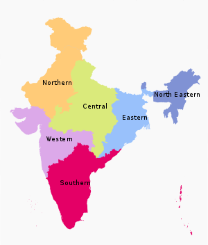

# Indian States and UTs

Created: 2020-01-05 17:16:34 +0500

Modified: 2022-01-30 11:58:21 +0500

---

[India](https://en.wikipedia.org/wiki/India) is a [federal](https://en.wikipedia.org/wiki/Federalism) union comprising 28 [states](https://en.wikipedia.org/wiki/Federated_state) and 9 [union territories](https://en.wikipedia.org/wiki/Union_territory), for a total of 37 entities. The states and union territories are further subdivided into [districts](https://en.wikipedia.org/wiki/List_of_districts_in_India) and smaller [administrative divisions](https://en.wikipedia.org/wiki/Administrative_divisions_of_India).

<table>
<colgroup>
<col style="width: 7%" />
<col style="width: 3%" />
<col style="width: 4%" />
<col style="width: 4%" />
<col style="width: 9%" />
<col style="width: 7%" />
<col style="width: 5%" />
<col style="width: 6%" />
<col style="width: 5%" />
<col style="width: 11%" />
<col style="width: 34%" />
</colgroup>
<thead>
<tr class="header">
<th><strong>State</strong></th>
<th><strong>ISO 3166-2:IN</strong></th>
<th>
<strong>Vehicle</strong>

<strong>code</strong>
</th>
<th><strong>Zone</strong></th>
<th><strong>Capital</strong></th>
<th><strong>Largest city</strong></th>
<th><strong>Statehood</strong></th>
<th><strong>Population</strong></th>
<th>
Area

<strong>(km2)</strong>
</th>
<th>
<strong>Official</strong>

<strong>languages</strong>
</th>
<th>
<strong>Additional official</strong>

<strong>languages</strong>
</th>
</tr>
</thead>
<tbody>
<tr>
<td>Andhra Pradesh</td>
<td>IN-AP</td>
<td>AP</td>
<td>Southern</td>
<td>
Hyderabad(de jure)

Amaravati(de facto)
</td>
<td>Visakhapatnam</td>
<td>1 October 1953</td>
<td>49,506,799</td>
<td>160,205</td>
<td>Telugu</td>
<td>—</td>
</tr>
<tr>
<td>Arunachal Pradesh</td>
<td>IN-AR</td>
<td>AR</td>
<td>North-Eastern</td>
<td>Itanagar</td>
<td></td>
<td>20 February 1987</td>
<td>1,383,727</td>
<td>83,743</td>
<td>English</td>
<td>—</td>
</tr>
<tr>
<td>Assam</td>
<td>IN-AS</td>
<td>AS</td>
<td>North-Eastern</td>
<td>Dispur</td>
<td>Guwahati</td>
<td>26 January 1950</td>
<td>31,205,576</td>
<td>78,550</td>
<td>Assamese</td>
<td>Bengali</a>,<a href="https://en.wikipedia.org/wiki/Bodo_language">Bodo</td>
</tr>
<tr>
<td>Bihar</td>
<td>IN-BR</td>
<td>BR</td>
<td>Eastern</td>
<td>Patna</td>
<td></td>
<td>26 January 1950</td>
<td>104,099,452</td>
<td>94,163</td>
<td>Hindi</td>
<td>Urdu</td>
</tr>
<tr>
<td>Chhattisgarh</td>
<td>IN-CT</td>
<td>CG</td>
<td>Central</td>
<td>Naya Raipur</td>
<td></td>
<td>1 November 2000</td>
<td>25,545,198</td>
<td>135,194</td>
<td>Hindi</td>
<td>—</td>
</tr>
<tr>
<td>Goa</td>
<td>IN-GA</td>
<td>GA</td>
<td>Western</td>
<td>Panaji</td>
<td>Vasco da Gama</td>
<td>30 May 1987</td>
<td>1,458,545</td>
<td>3,702</td>
<td>Konkani</td>
<td>English</a>,<a href="https://en.wikipedia.org/wiki/Marathi_language">Marathi</td>
</tr>
<tr>
<td>Gujarat</td>
<td>IN-GJ</td>
<td>GJ</td>
<td>Western</td>
<td>Gandhinagar</td>
<td>Ahmedabad</td>
<td>1 May 1960</td>
<td>60,439,692</td>
<td>196,024</td>
<td>Gujarati</td>
<td>—</td>
</tr>
<tr>
<td>Haryana</td>
<td>IN-HR</td>
<td>HR</td>
<td>Northern</td>
<td>Chandigarh</td>
<td>Faridabad</td>
<td>1 November 1966</td>
<td>25,351,462</td>
<td>44,212</td>
<td>Hindi</td>
<td>Punjabi</a></td>
</tr>
<tr>
<td>Himachal Pradesh</td>
<td>IN-HP</td>
<td>HP</td>
<td>Northern</td>
<td>
Shimla(Summer)

Dharamshala(Winter)
</td>
<td>Shimla</td>
<td>25 January 1971</td>
<td>6,864,602</td>
<td>55,673</td>
<td>Hindi</td>
<td>English</td>
</tr>
<tr>
<td>Jharkhand</td>
<td>IN-JH</td>
<td>JH</td>
<td>Eastern</td>
<td>Ranchi</td>
<td>Jamshedpur</td>
<td>15 November 2000</td>
<td>32,988,134</td>
<td>74,677</td>
<td>Hindi</td>
<td></td>
</tr>
<tr>
<td>Karnataka</td>
<td>IN-KA</td>
<td>KA</td>
<td>Southern</td>
<td>Bangalore</td>
<td></td>
<td>1 November 1956</td>
<td>61,095,297</td>
<td>191,791</td>
<td>Kannada</td>
<td>English</td>
</tr>
<tr>
<td>Kerala</td>
<td>IN-KL</td>
<td>KL</td>
<td>Southern</td>
<td>Thiruvananthapuram</td>
<td>Kochi</td>
<td>1 November 1956</td>
<td>33,406,061</td>
<td>38,863</td>
<td>Malayalam</td>
<td>English</td>
</tr>
<tr>
<td>Madhya Pradesh</td>
<td>IN-MP</td>
<td>MP</td>
<td>Central</td>
<td>Bhopal</td>
<td>Indore</td>
<td>1 November 1956</td>
<td>72,626,809</td>
<td>308,252</td>
<td>Hindi</td>
<td>—</td>
</tr>
<tr>
<td>Maharashtra</td>
<td>IN-MH</td>
<td>MH</td>
<td>Western</td>
<td>
Mumbai(Summer)

Nagpur(Winter)
</td>
<td>Mumbai</td>
<td>1 May 1960</td>
<td>112,374,333</td>
<td>307,713</td>
<td>Marathi</td>
<td>—</td>
</tr>
<tr>
<td>Manipur</td>
<td>IN-MN</td>
<td>MN</td>
<td>North-Eastern</td>
<td>Imphal</td>
<td></td>
<td>21 January 1972</td>
<td>2,855,794</td>
<td>22,347</td>
<td>Meitei</td>
<td>English</td>
</tr>
<tr>
<td>Meghalaya</td>
<td>IN-ML</td>
<td>ML</td>
<td>North-Eastern</td>
<td>Shillong</td>
<td></td>
<td>21 January 1972</td>
<td>2,966,889</td>
<td>22,720</td>
<td>English</td>
<td></td>
</tr>
<tr>
<td>Mizoram</td>
<td>IN-MZ</td>
<td>MZ</td>
<td>North-Eastern</td>
<td>Aizawl</td>
<td></td>
<td>20 February 1987</td>
<td>1,097,206</td>
<td>21,081</td>
<td>English</a>,<a href="https://en.wikipedia.org/wiki/Hindi">Hindi</a>,<a href="https://en.wikipedia.org/wiki/Mizo_language">Mizo</td>
<td>—</td>
</tr>
<tr>
<td>Nagaland</td>
<td>IN-NL</td>
<td>NL</td>
<td>North-Eastern</td>
<td>Kohima</td>
<td>Dimapur</td>
<td>1 December 1963</td>
<td>1,978,502</td>
<td>16,579</td>
<td>English</td>
<td>—</td>
</tr>
<tr>
<td>Odisha</td>
<td>IN-OR</td>
<td>OD</td>
<td>Eastern</td>
<td>Bhubaneswar</td>
<td></td>
<td>1 April 1936</td>
<td>41,974,218</td>
<td>155,820</td>
<td>Odia</td>
<td>—</td>
</tr>
<tr>
<td>Punjab</td>
<td>IN-PB</td>
<td>PB</td>
<td>Northern</td>
<td>Chandigarh</td>
<td>Ludhiana</td>
<td>1 November 1966</td>
<td>27,743,338</td>
<td>50,362</td>
<td>Punjabi</td>
<td>—</td>
</tr>
<tr>
<td>Rajasthan</td>
<td>IN-RJ</td>
<td>RJ</td>
<td>Northern</td>
<td>Jaipur</td>
<td></td>
<td>1 November 1956</td>
<td>68,548,437</td>
<td>342,269</td>
<td>Hindi</td>
<td>English</td>
</tr>
<tr>
<td>Sikkim</td>
<td>IN-SK</td>
<td>SK</td>
<td>North-Eastern</td>
<td>Gangtok</td>
<td></td>
<td>16 May 1975</td>
<td>610,577</td>
<td>7,096</td>
<td>Nepali</a>,<a href="https://en.wikipedia.org/wiki/English_language">English</td>
<td>Bhutia</a>,<a href="https://en.wikipedia.org/wiki/Gurung_language">Gurung</a>,<a href="https://en.wikipedia.org/wiki/Lepcha_language">Lepcha</a>,<a href="https://en.wikipedia.org/wiki/Limbu_language">Limbu</a>,<a href="https://en.wikipedia.org/wiki/Manggar_language">Manggar</a>,<a href="https://en.wikipedia.org/wiki/Mukhia_language">Mukhia</a>,<a href="https://en.wikipedia.org/wiki/Newari_language">Newari</a>,<a href="https://en.wikipedia.org/wiki/Rai_languages">Rai</a>,<a href="https://en.wikipedia.org/wiki/Sherpa_language">Sherpa</a>,<a href="https://en.wikipedia.org/wiki/Tamang_language">Tamang</td>
</tr>
<tr>
<td>Tamil Nadu</td>
<td>IN-TN</td>
<td>TN</td>
<td>Southern</td>
<td>Chennai</td>
<td></td>
<td>26 January 1950</td>
<td>72,147,030</td>
<td>130,058</td>
<td>Tamil</td>
<td>English</td>
</tr>
<tr>
<td>Telangana</td>
<td>IN-TG</td>
<td>TS</td>
<td>Southern</td>
<td>Hyderabad</td>
<td></td>
<td>2 June 2014</td>
<td>35,193,978</td>
<td>114,840</td>
<td>Telugu,Urdu</td>
<td>—</td>
</tr>
<tr>
<td>Tripura</td>
<td>IN-TR</td>
<td>TR</td>
<td>North-Eastern</td>
<td>Agartala</td>
<td></td>
<td>21 January 1972</td>
<td>3,673,917</td>
<td>10,492</td>
<td>Bengali</a>,<a href="https://en.wikipedia.org/wiki/English_language">English</a>,<a href="https://en.wikipedia.org/wiki/Kokborok_language">Kokborok</td>
<td>—</td>
</tr>
<tr>
<td>Uttar Pradesh</td>
<td>IN-UP</td>
<td>UP</td>
<td>Northern</td>
<td>Lucknow</td>
<td>Kanpur</td>
<td>26 January 1950</td>
<td>199,812,341</td>
<td>243,286</td>
<td>Hindi</td>
<td>Urdu</td>
</tr>
<tr>
<td>Uttarakhand</td>
<td>IN-UT</td>
<td>UK</td>
<td>Northern</td>
<td>Dehradun</td>
<td></td>
<td>9 November 2000</td>
<td>10,086,292</td>
<td>53,483</td>
<td>Hindi</td>
<td>Sanskrit</td>
</tr>
<tr>
<td>
West Bengal

West Bengal Politics Explained &amp; Its Geostrategic importance | WB elections 2021
</td>
<td>IN-WB</td>
<td>WB</td>
<td>Eastern</td>
<td>Kolkata</td>
<td></td>
<td>26 January 1950</td>
<td>91,276,115</td>
<td>88,752</td>
<td>Bengali,Nepali</td>
<td>Hindi</a>,<a href="https://en.wikipedia.org/wiki/Odia_language">Odia</a>,<a href="https://en.wikipedia.org/wiki/Punjabi_language">Punjabi</a>,<a href="https://en.wikipedia.org/wiki/Santali_language">Santali</a>,<a href="https://en.wikipedia.org/wiki/Urdu">Urdu</td>
</tr>
</tbody>
</table>
-   [**^Note 1**](https://en.wikipedia.org/wiki/States_and_union_territories_of_India#ref_1) Andhra Pradesh was divided into two states, [Telangana](https://en.wikipedia.org/wiki/Telangana) and a residual [Andhra Pradesh](https://en.wikipedia.org/wiki/Andhra_Pradesh) on 2 June 2014. [Hyderabad](https://en.wikipedia.org/wiki/Hyderabad,_India), located entirely within the borders of Telangana, is to serve as the capital for both states for a period of time not exceeding ten years. The Government of Andhra Pradesh and the Andhra Pradesh Legislature completed the process of relocating to temporary facilities in the envisaged new capital city [Amaravati](https://en.wikipedia.org/wiki/Amaravati) in early 2017.

- [**^Note 2**](https://en.wikipedia.org/wiki/States_and_union_territories_of_India#ref_2) Dehradun is the interim capital of Uttarakhand. The town of [Gairsain](https://en.wikipedia.org/wiki/Gairsain) is envisaged as the state's new capital.

<table>
<colgroup>
<col style="width: 10%" />
<col style="width: 5%" />
<col style="width: 6%" />
<col style="width: 12%" />
<col style="width: 6%" />
<col style="width: 10%" />
<col style="width: 8%" />
<col style="width: 23%" />
<col style="width: 15%" />
</colgroup>
<thead>
<tr class="header">
<th><strong>Union territory</strong></th>
<th>ISO 3166-2:IN</th>
<th>Vehicle code</th>
<th><strong>Capital</strong></th>
<th><strong>Largest city</strong></th>
<th><strong>Population</strong></th>
<th>
Area

<strong>(km2)</strong>
</th>
<th>
<strong>Official</strong>

<strong>languages</strong>
</th>
<th>
<strong>Additional official</strong>

<strong>languages</strong>
</th>
</tr>
</thead>
<tbody>
<tr>
<td>Andaman and Nicobar Islands</td>
<td>IN-AN</td>
<td>AN</td>
<td>Port Blair</td>
<td></td>
<td>380,581</td>
<td>8,249</td>
<td>English</a>,<a href="https://en.wikipedia.org/wiki/Hindi">Hindi</td>
<td>—</td>
</tr>
<tr>
<td>Chandigarh</td>
<td>IN-CH</td>
<td>CH</td>
<td>Chandigarh</td>
<td>—</td>
<td>1,055,450</td>
<td>114</td>
<td>English</td>
<td>—</td>
</tr>
<tr>
<td>Dadra and Nagar Haveli</td>
<td>IN-DN</td>
<td>DN</td>
<td>Silvassa</td>
<td></td>
<td>343,709</td>
<td>491</td>
<td>Gujarati</a>,<a href="https://en.wikipedia.org/wiki/Hindi">Hindi</td>
<td>Marathi</td>
</tr>
<tr>
<td>Daman and Diu</td>
<td>IN-DD</td>
<td>DD</td>
<td>Daman</td>
<td></td>
<td>243,247</td>
<td>112</td>
<td>English,Gujarati,Hindi,Konkani,</td>
<td>—</td>
</tr>
<tr>
<td>Delhi</td>
<td>IN-DL</td>
<td>DL</td>
<td>New Delhi</td>
<td>—</td>
<td>16,787,941</td>
<td>1,490</td>
<td>Hindi</td>
<td>Punjabi,Urdu</td>
</tr>
<tr>
<td>Jammu and Kashmir</td>
<td>IN-JK</td>
<td>JK</td>
<td>
Srinagar(Summer)

Jammu(Winter)
</td>
<td>Srinagar</td>
<td>12,258,433</td>
<td>55,538</td>
<td>Hindi</a>,<a href="https://en.wikipedia.org/wiki/English_language">English</td>
<td>Dogri</a>,<a href="https://en.wikipedia.org/wiki/Kashmiri_language">Kashmiri</a>,<a href="https://en.wikipedia.org/wiki/Urdu">Urdu</td>
</tr>
<tr>
<td>Ladakh</td>
<td>IN-LA</td>
<td>LA</td>
<td>Leh</a>,<a href="https://en.wikipedia.org/wiki/Kargil">Kargil</td>
<td>Leh</td>
<td>290,492</td>
<td>174,852</td>
<td>Ladakhi</td>
<td>Balti</td>
</tr>
<tr>
<td>Lakshadweep</td>
<td>IN-LD</td>
<td>LD</td>
<td>Kavaratti</td>
<td></td>
<td>64,473</td>
<td>32</td>
<td>Malayalam</td>
<td>English</td>
</tr>
<tr>
<td>Puducherry</td>
<td>IN-PY</td>
<td>PY</td>
<td>Pondicherry</td>
<td></td>
<td>1,247,953</td>
<td>492</td>
<td>EnglishTamil</td>
<td>Malayalam</a>,<a href="https://en.wikipedia.org/wiki/Telugu_language">Telugu</td>
</tr>
</tbody>
</table>
-   [**^Note 3**](https://en.wikipedia.org/wiki/States_and_union_territories_of_India#ref_3) Jammu and Kashmir has 42,241 km^2^of area administered by India and 13,297 km^2^of area controlled by [Pakistan](https://en.wikipedia.org/wiki/Pakistan) under [Azad Kashmir](https://en.wikipedia.org/wiki/Azad_Kashmir) which is claimed by India as part of Jammu and Kashmir.
-   [**^Note 4**](https://en.wikipedia.org/wiki/States_and_union_territories_of_India#ref_4) Ladakh has 59,146 km^2^of area administered by India and 72,971 km^2^of area controlled by [Pakistan](https://en.wikipedia.org/wiki/Pakistan) under [Gilgit-Baltistan](https://en.wikipedia.org/wiki/Gilgit-Baltistan), which is claimed by India as part of Ladakh. Additionally, it has 5,180 km^2^of area controlled by the [People's Republic of China](https://en.wikipedia.org/wiki/People%27s_Republic_of_China) under [Trans-Karakoram Tract](https://en.wikipedia.org/wiki/Trans-Karakoram_Tract) and 37,555 km^2^of area controlled by the [People's Republic of China](https://en.wikipedia.org/wiki/People%27s_Republic_of_China) under [Aksai Chin](https://en.wikipedia.org/wiki/Aksai_Chin), which is claimed by India as part of Ladakh.

## Adminstrative Divisions of India

Indian states and territories frequently use different local titles for the same level of subdivision (e.g., the [*mandals*](https://en.wikipedia.org/wiki/Mandal_(country_subdivision)) of [Andhra Pradesh](https://en.wikipedia.org/wiki/Andhra_Pradesh) and [Telangana](https://en.wikipedia.org/wiki/Telangana) correspond to [*tehsils*](https://en.wikipedia.org/wiki/Tehsil) of [Uttar Pradesh](https://en.wikipedia.org/wiki/Uttar_Pradesh) and other [Hindi-speaking states](https://en.wikipedia.org/wiki/Hindi_Belt) but to [*talukas*](https://en.wikipedia.org/wiki/Taluka) of [Gujarat](https://en.wikipedia.org/wiki/Gujarat), [Goa](https://en.wikipedia.org/wiki/Goa), [Karnataka](https://en.wikipedia.org/wiki/Karnataka), [Kerala](https://en.wikipedia.org/wiki/Kerala), [Maharashtra](https://en.wikipedia.org/wiki/Maharashtra), and [Tamil Nadu](https://en.wikipedia.org/wiki/Tamil_Nadu)).

## Tiers of India

## Zones

The States have been grouped into six zones having an Advisory Council "to develop the habit of cooperative working" among these States.[Zonal Councils](https://en.wikipedia.org/wiki/Zonal_Council) were set up vide Part-III of the [States Reorganisation Act](https://en.wikipedia.org/wiki/States_Reorganisation_Act), 1956. The North Eastern States' special problems are addressed by another statutory body - The North Eastern Council, created by the North Eastern Council Act, 1971. The present composition of each of these Zonal Councils is as under:

- [Northern Zonal Council](https://en.wikipedia.org/wiki/Northern_Zonal_Council), comprising [Chandigarh](https://en.wikipedia.org/wiki/Chandigarh), [Delhi](https://en.wikipedia.org/wiki/Delhi), [Haryana](https://en.wikipedia.org/wiki/Haryana), [Himachal Pradesh](https://en.wikipedia.org/wiki/Himachal_Pradesh), [Jammu and Kashmir](https://en.wikipedia.org/wiki/Jammu_and_Kashmir_(union_territory)), [Ladakh](https://en.wikipedia.org/wiki/Ladakh), [Punjab](https://en.wikipedia.org/wiki/Punjab,_India), and [Rajasthan](https://en.wikipedia.org/wiki/Rajasthan);
- [North Eastern Council](https://en.wikipedia.org/wiki/North_Eastern_Council), comprising [Assam](https://en.wikipedia.org/wiki/Assam), [Arunachal Pradesh](https://en.wikipedia.org/wiki/Arunachal_Pradesh), [Manipur](https://en.wikipedia.org/wiki/Manipur), [Meghalaya](https://en.wikipedia.org/wiki/Meghalaya), [Mizoram](https://en.wikipedia.org/wiki/Mizoram), [Nagaland](https://en.wikipedia.org/wiki/Nagaland) and [Tripura](https://en.wikipedia.org/wiki/Tripura); The State of [Sikkim](https://en.wikipedia.org/wiki/Sikkim) has also been included in the North Eastern Council vide North Eastern Council (Amendment) Act, 2002 notified on 23 December 2002.
- [Central Zonal Council](https://en.wikipedia.org/wiki/Central_Zonal_Council), comprising the States of [Chhattisgarh](https://en.wikipedia.org/wiki/Chhattisgarh), [Madhya Pradesh](https://en.wikipedia.org/wiki/Madhya_Pradesh), [Uttarakhand](https://en.wikipedia.org/wiki/Uttarakhand) and [Uttar Pradesh](https://en.wikipedia.org/wiki/Uttar_Pradesh);
- [Eastern Zonal Council](https://en.wikipedia.org/wiki/Eastern_Zonal_Council), comprising [Bihar](https://en.wikipedia.org/wiki/Bihar), [Jharkhand](https://en.wikipedia.org/wiki/Jharkhand), [Odisha](https://en.wikipedia.org/wiki/Odisha), and [West Bengal](https://en.wikipedia.org/wiki/West_Bengal);
- [Western Zonal Council](https://en.wikipedia.org/wiki/Western_Zonal_Council), comprising [Dadra and Nagar Haveli](https://en.wikipedia.org/wiki/Dadra_and_Nagar_Haveli), [Daman and Diu](https://en.wikipedia.org/wiki/Daman_and_Diu), [Goa](https://en.wikipedia.org/wiki/Goa), [Gujarat](https://en.wikipedia.org/wiki/Gujarat), and [Maharashtra](https://en.wikipedia.org/wiki/Maharashtra);
- [Southern Zonal Council](https://en.wikipedia.org/wiki/Southern_Zonal_Council), comprising [Andhra Pradesh](https://en.wikipedia.org/wiki/Andhra_Pradesh), [Karnataka](https://en.wikipedia.org/wiki/Karnataka), [Kerala](https://en.wikipedia.org/wiki/Kerala), [Puducherry](https://en.wikipedia.org/wiki/Puducherry), [Tamil Nadu](https://en.wikipedia.org/wiki/Tamil_Nadu), and [Telangana](https://en.wikipedia.org/wiki/Telangana).
- [Andaman and Nicobar Islands](https://en.wikipedia.org/wiki/Andaman_and_Nicobar_Islands), [Lakshadweep](https://en.wikipedia.org/wiki/Lakshadweep) are not members of any of the Zonal Councils. However, they are presently special invitees to the [Southern Zonal Council](https://en.wikipedia.org/wiki/Southern_Zonal_Council)
