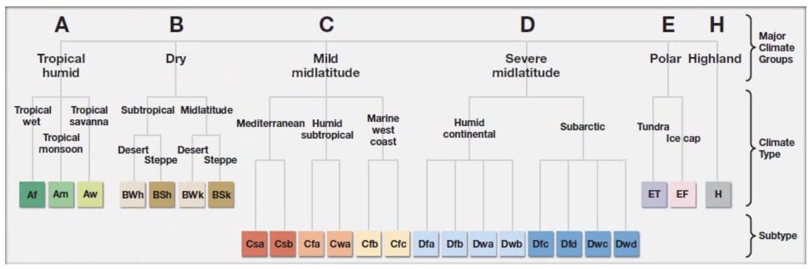
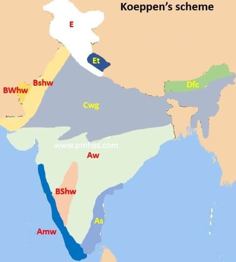

# Others

Created: 2020-01-05 17:12:25 +0500

Modified: 2022-08-11 09:59:14 +0500

---

Summer Solstice - 21 June, 22 June

Winter Solstice - 21 December, 22 December

**South Korea - Hermit Kingdom**

The term**hermit kingdom**is used to refer to any country, organization or society which willfully walls itself off, either metaphorically or physically, from the rest of the world. In the current geopolitical order, the[East Asian](https://en.wikipedia.org/wiki/East_Asia)country of[North Korea](https://en.wikipedia.org/wiki/North_Korea)is regarded as a prime example of a hermit kingdom, and the term is contemporarily used to describe that nation state.

[Map based learning](https://www.youtube.com/playlist?list=PL1vNLZF5gfwdayqTO--hnJUy-nutsb-ZE)

[World Climate - Koppen Classification | All Groups A,B,C,D,E,H | Climatology UPSC, IAS](https://youtube.com/playlist?list=PL1vNLZF5gfwfyFHsGeiBhDw9_51_JB-SB)

![Table 12.1 : Climatic Groups According to Koeppen A - Tropical B - Dry Climates C - Warm Temperate D - Cold Snow Forest Climates E - Cold Climates H - High Land Characteristics Average temperature of the coldest month is 180 C or higher Potential evaporation exceeds precipitation Ihe average temperature of the coldest month of the (Mid-latitude) climates years is higher than minus 30C but below 180C The average temperature of the coldest month is minus 30 C or below Average temperature for all months is below 100 C Cold due to elevation ](media/Others-image2.jpg)

![Climatic Types According to Koeppen Group A-Tropical Humid B-Dry Climate C-Warm temperate (Mid- latitude) Climates D-Cold Snow- forest Climates E-Cold Climates H •Highland Table 12.2 : Type Tropical wet Tropical monsoon Tropical wet and dry Subtropical steppe Subtropical desert Mid-latitude steppe Mid-latitude desert Humid subtropical Meditettanean Marine west coast Humid continental Subarctic Polar ice cap Letter axle Aw BWk Cfa cm EF Characteristics No dry season Monsoonal. short dry season Winter dry season Low-latitude semi arid or dry Low-latitude arid or dry Mid-latitude semi arid or dry Mid-latitude arid or dry No dry season. warm summer Dry hot summer No dry season. warm and cool summer No dry season, severe winter Winter dry and very severe No true summer Perennial ice Highland with snow cover ](media/Others-image3.jpg)

<https://lotusarise.com/koppen-climate-classification-system-upsc

**Climatology: [Climatology](https://www.youtube.com/playlist?list=PL1vNLZF5gfwdEws_cLSiMQfXDC6ev3knK)**
-   Indian Ocean Dipole
-   ENSO (El Nino, Southern Oscillation)
    -   Thermocline
-   Subtropical high, Subpolar low, Easterlies, Westerlies
-   Hadley Cell

[Lakes in India](https://www.youtube.com/playlist?list=PL1vNLZF5gfwd1-1Wli0O6m2J3sJjr1FA5)

