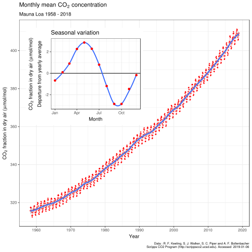

# Others

Created: 2018-12-23 14:58:06 +0500

Modified: 2019-06-09 17:44:33 +0500

---

## Blinkist - The future is history

Totalitarian rule in Russia

## Blinkist - Move Fast and Break Things by Jonathan Taplin
-   Libertarianism
-   Monopoly can cause terrible damage as by East India Trading Company (Great Bengal Famine and wrote legislation that control nation's trade routes)

## Blinkist - Who we are and How we got here by David Reich (30 Nov 2018)

Ancient DNA and the new science of the human past
-   Introduction
    -   DNA consists of twin chains of molecules called *nucleotides* made from the chemicals *adenine (A), cytosine (C), guanine (G) and thymine (T).* Each chain is about three billion chemical blocks in length
    -   In contrast, genes are fragments of these chains, generally around a thousand nucleotides long.
    -   Random variations in these inherited sequences are called mutations.
    -   If you compare two people's mutations, the more differences you find between their genes, the further they are away from sharing a common ancestor.
    -   All humans today are descended from a single female ancestor, known as *Mitochondrial Eve,* and she lived in Africa no more than 200,000 years ago
    -   If the old multi-regional theory held true, then any shared ancestor we had would be close to an incredible two million years old and part of the despersal of Homo erectus globally around 1.8 million years ago
    -   If Mitochondrial Eve is seen as our shared ancestor, then modern humans must have evolved in Africa and only spread across the world 50,000 years ago
-   The ancestors of modern non-African humans interbred with both Neanderthals and Denisovans
    -   Neaderthals descended from Homo erectus
    -   Modern non-African share common mutations with Neanderthals, interbred around 54000 to 49000 years ago
    -   non-African genomes are between 1.5-2.1 percent Neanderthal
    -   Denisovans was discoverd using a strange fingerbone found at Denisova Cave in Siberia, 400 mutational differences from modern humans found. Modern humans have only around 200 mutational differences from Neanderthals
    -   Denisovians more closer to Neanderthals than either species was to modern humans.
    -   Sequence showed Denisovans are actually closer to New Guineans than to other modern populations; 3 to 6 percent of New Guinean ancestory is Denisovan.
    -   Neanderthals were first discovered in the Neander Valley in Germany - "tal" being german for "valley"
-   Migrations patterns thousands of years ago informed the ancestry and languages of modern Europeans
    -   Otzi the Iceman, 5300 year old naturally mummified corpse who was unearthed in the Alps in 1991
-   Indian ancestry is dual in nature, which is still reflected in its languages and caste system
    -   Indo-Aryan in the north
    -   Dravidian in the south
    -   **2007 DNA study showed that all Indians are a mix of two ancient populations, one called Ancestral North Indians (ANI), who were related to Western Eurasians, and the other Ancestral South Indians (ASI), who aren't related to any populations outside the India.**
-   Native Americans are descended from two separate migrations, but their exact history is not yet clear
-   Modern East Asians are descended from migrations that began in the Chinese agricultural heartland
-   Africa has seen just as much population movement as the rest of the world
-   Population mixing is sometimes driven by gender inequality among social groups
-   DNA demonstrates that differences exist between populations, but they don't justify racist generalizations

## Blinkist - The Tangled Tree by David Quammen
-   On the Origin of Species -- Charles Darwin, 1859
    -   Natural selection (survival of the fittest)
-   Symbiosis - that one cell could absorb something like a bacteria and begin to use it as its own organ (symbiogenesis -- merging of two separate organisms)
    -   Chloroplasts (diatoms)
    -   mitochondria
    -   flagella and cilia
    -   all eukaryotic cells
-   Molecular phylogenetics
-   Prokaryotic (Proks) - cells that don't have nuclei
-   Eukaryotic (Euks) - cells that do have nuclei
-   Archaea (methanogens -- organisms around thermal underwater vents)
-   Horizontal Gene Transfer (HGT) / Lateral Gene Transfer (LGT)
-   A reticulated tree
-   Transferable resitance factors (antibiotic resistence)

## Blinkist - Other Minds

Evolution of octopus

Life 3.2 billion years ago, but animals 1.1 billion years ago

## Blinkist - Power, Sex, Suicide by Nick Lane (14 Aug 2018)
-   Multicellular organisms are called eukaryotes, and each of their celss contains a nucleus. These are what humans and animals are made up of.
-   More simple organisms, such as bacteria, are known as prokaryotes. They contain no nucleus.
-   Cellular respiration - The act of breathing provides our cells with oxygen, which we use to burn glucose.
-   Mitochondria produce power by pushing protons through membranes within a cell, which creates an electric charge. During cellular respiration, the membranes function like a dam and a reservoir of protons builds up, thus storing energy in the cell. Then, the stored-up protons can slowly be released to produce **adenosine triphosphate (ATP),** or what's known as the "energy currency of life". This process is called **chemiosmotic coupling.**
-   Rats are used in research labs because their lifespan is a sped-up version of ours. Rat organs work at a faster pace: they breathe more quickly, their hearts beat faster - in essence, they metabolize more rapidly. They are also very similar to us.
-   Apoptosis - programmed cell death, or cell suicide.
-   Only female sex passes on organelles, which include mitochondria.
-   Mitochondrial Eve or African Eve, laid the foundation for the **Out of Africa** theory, which supposes that all mordern human beings originated in Africa.
-   Free radicals are molecules or atoms that have one, unpaired electron and are thus unstable.

## Keeling Curve

TheKeeling Curveis a graph of the accumulation of[carbon dioxide in the Earth's atmosphere](https://en.wikipedia.org/wiki/Carbon_dioxide_in_Earth%27s_atmosphere)based on continuous measurements taken at the[Mauna Loa Observatory](https://en.wikipedia.org/wiki/Mauna_Loa_Observatory)on the island of[Hawaii](https://en.wikipedia.org/wiki/Hawaii)from 1958 to the present day. The curve is named for the scientist[Charles David Keeling](https://en.wikipedia.org/wiki/Charles_David_Keeling), who started the monitoring program and supervised it until his death in 2005.

Keeling's measurements showed the first significant evidence of rapidly increasing[carbon dioxide](https://en.wikipedia.org/wiki/Carbon_dioxide)(CO

2) levels in the atmosphere.According to Dr[Naomi Oreskes](https://en.wikipedia.org/wiki/Naomi_Oreskes), Professor of History of Science at[Harvard University](https://en.wikipedia.org/wiki/Harvard_University), the Keeling curve is one of the most important scientific works of the[20th century](https://en.wikipedia.org/wiki/20th_century).[[2]](https://en.wikipedia.org/wiki/Keeling_Curve#cite_note-clidis-2)Many scientists credit the Keeling curve with first bringing the world's attention to the current increase of[CO](https://en.wikipedia.org/wiki/Carbon_dioxide)

[2](https://en.wikipedia.org/wiki/Carbon_dioxide)in the atmosphere.

