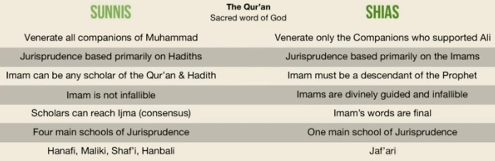
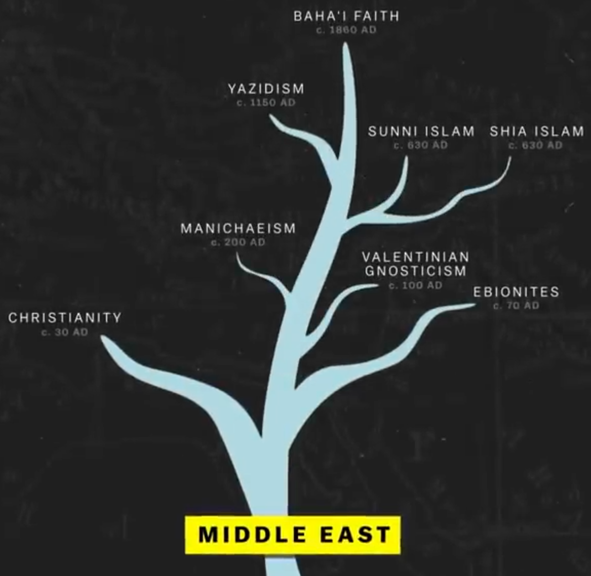
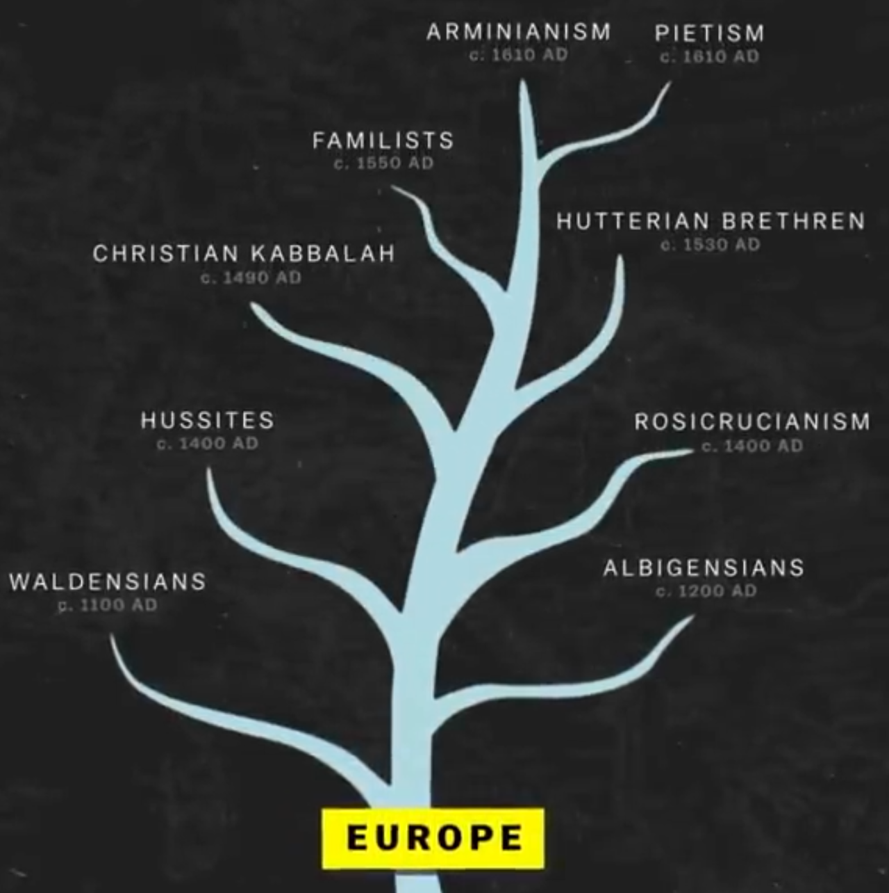
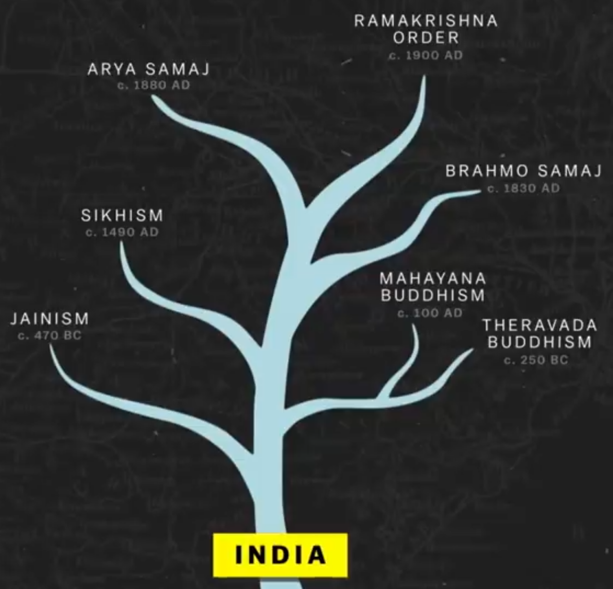

# Religion

[Branches of Islam & Family Tree of Shia Imams](https://www.youtube.com/watch?v=e5YynfMfJXA)

- 85% sunni
- 15% shias (majority - Iran / Iraq)

## Theological Differences

## New Religious Movement (NRM)

<https://en.wikipedia.org/wiki/New_religious_movement>
