# Marketing / Sales

Created: 2019-07-03 11:43:20 +0500

Modified: 2022-12-05 12:30:11 +0500

---

## Consumer Immersion Exercise

## ORM - Online Reputation Management

## Charm Pricing

involves pricing just Re 1 less from the bigger whole number. For example Rs. 1999 than Rs. 2000

Good marketing can sell once, but only a good product can sell twice.

In the long run, your performance reverts to the value you provide.

Great Marketing kills a bad product faster

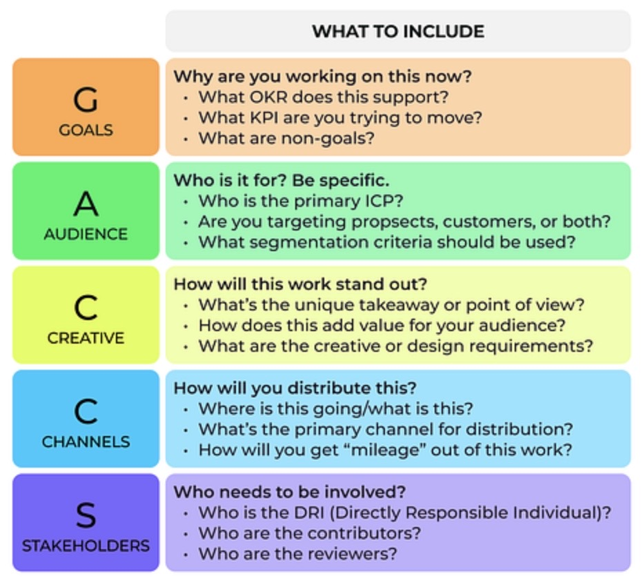

## Sales model

In a bottoms-up model, engineers within an enterprise start using your product to solve a well-defined problem such as API management. As more and more employees within the organization start to use your prodct, you can begin to engage the enterprise about becoming a paying customer for your product for your product. Since the enterprise is already using your prouct, the sales conversation is much easier.

In the top-down model, you engage the CIO, CEO, or CTO directly and try to convince them that your product is worth paying for. When the senior leadership of a bank buys into your product idea, you can count on that senior leadership to convince their developers to use your product within the bank.

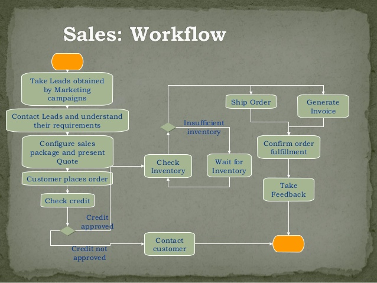

[**https://www.helloroketto.com/saas-marketing**](https://www.helloroketto.com/saas-marketing)

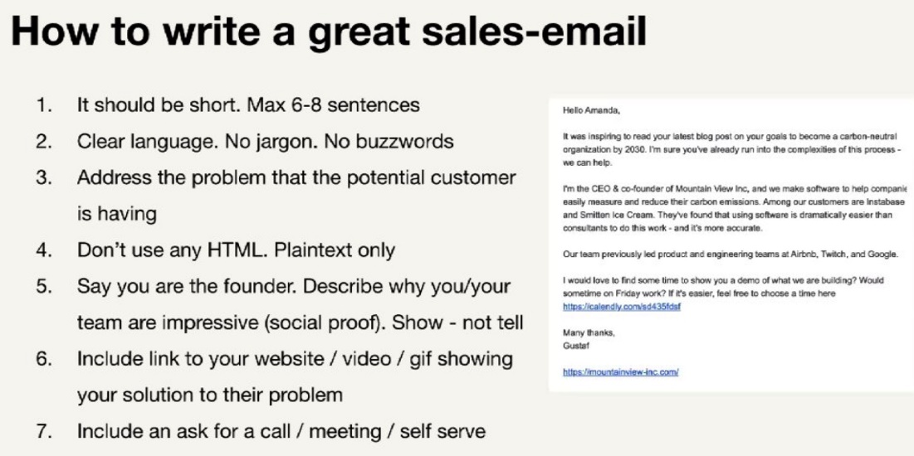

## Customer satisfaction

Jean-Louis Gassée, the former Head of Apple France, wisely stated that when it comes to handling customer compliants, there are two possible options. You can treat the complaint as highly important or you can shrug your shoulders and deem it trivial. Whatever position you choose to take, your customer will choose the other. That means that you'd better that every customer complaint seriously, because if youd don't the customer will.

So, the next time a customer complains, remember to choose the right attitude. If you don't, you're forcing them to up the ante and ultimately burdening yourself with more conflict.

## Traditional Sales Funnel

A sales funnel allows you to view the entire process of acquiring a user in a simple format. This format makes it much easier to spot areas for improvement by detecting "leaks" in the funnel.

Sales funnels allow for a numbers-based approach to improvement. Without them, efforts to improve an app's profitability would be far less focused and therefore less efficient, further reducing profit margins.

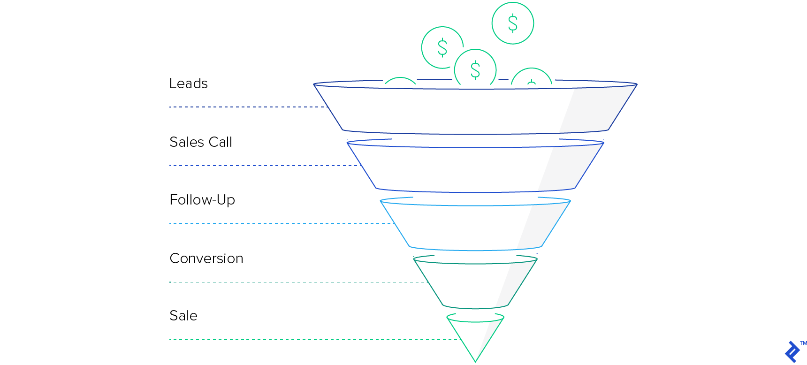

<https://www.toptal.com/app/profit-from-mobile-funnel>

## Blinkist - The Science of Selling by David Hoffeld

Proven Strategies to Make Your Pitch, Influence Decisions, and Close the Deal

The Science of Selling(2016) is a detailed handbook on the science of making a sale. Combining insights from neuroscience and social psychology, this guide presents an evidence-based approach to making a convincing pitch.

1. Science also shows us what can improve sales outcomes. In fact, research has uncovered many surprising methods for boosting sales called**peripheral routes of influence**. One example is the**asymmetric dominance effect**. This dictates that customers are more likely to buy when presented with two options -- one good and one great. Why does this make the sale easier? Because having a good option makes the great one seem even better.

Scientifically-proven approaches like this are based on a simple idea: salespeople are more effective when they understand what's happening in a customer's brain. After all, if you understand what a buyer is thinking, you can tailor your pitch more effectively to their needs and desires.

"What the research shows is that a salesperson's message should mirror the way that buyers' brains formulate buying decisions."

2. **Smooth out the sales process by answering the Six Whys**

A shopper is browsing a grocery store when he spots a new cereal on the shelf. He walks closer and looks at the box. After a moment, he puts it in his cart with the rest of his purchases. But why?

When asked this question, salespeople give all sorts of answers. Maybe it was the box art, or the price, or just the fact that he was hungry at the time. And while none of these answers is wrong, none of them is completely right.

Deciding to buy a product isn't the result of a single choice. It's actually the final outcome of a series of six choices. Your job as a salesperson is to help consumers through the process.

When buyers decide to make a purchase, they ask themselves a series of six questions that the author calls the Six Whys. If a salesperson can answer each of these questions, the sale is easy. If at any point the salesperson is unsure, the sale is lost.

The first question is **"why change?"** Humans are wired to prefer things as they already are. And because making a new purchase means changing in some way, it needs to feel justified. So, when answering this question, make sure you can explain what's lacking or undesirable about the buyer's current situation.

The second question is **"why now?"** Here you must explain why buying makes sense at this specific time. For example, is there a temporary discount or another factor that creates urgency?

The third question is **"why your industry?"** Before you pitch your specific product, you must pitch your entire industry. Think about it. If you sell online courses, you have to explain why online courses in general are better than alternatives like seminars or books.

The fourth and fifth questions are **"why your company?"** and **"why your product?"** This is when you get into the specifics and pitch the things that make your offering stand out -- whether that's the quality, the expertise, or the countless satisfied customers.

The sixth and final question is **"why spend the money?"** To answer this, point out the financial benefits of your product or service. Be sure to mention both cost-savings and any loss-prevention qualities it may have, such as better payment tracking.

As you walk potential buyers through each of these steps, their hesitation about purchasing should disappear. That's how you'll make the sale.

3. **Boost your sales by lifting your buyer's mood**

Neuroscientists have found that positive emotional states make us more outgoing and open to persuasion, while negative emotional states close us down and make us harder to influence. Understanding and using this dynamic is crucial when it comes to making a sale.

A good salesperson won't always rely on snacks when there are other ways to encourage positive feelings. For instance, you can project an upbeat attitude with your body language and vocal tones. Thanks to a phenomenon called**emotional cognition**, these non-verbal cues can be contagious. This means that if you approach others with a big smile and bright demeanor, they'll often mirror your cheerful emotional state.

Even a bit of casual chit-chat can go a long way. For example, if a buyer seems to be in a bad mood, try lightening things up with positive conversation and questions that trigger happier thoughts, whether it's about his last vacation or hobbies he's recently come to love. This type of banter can shift the atmosphere enough to smooth out the sales process. That way, everyone leaves happy.

4. **Focus your sales pitch with powerful questions**

For medical professionals, questions are tools of the trade and are just as important as thermometers or stethoscopes. That's why a trip to the doctor is often filled with all kinds of queries about what's bothering you, how long it's been a problem, which treatments you've tried, and so on.

Even though it can feel like a bit of an interrogation, it's exactly what you want. Just think of how strange it would be if your physician began prescribing pills before asking you a single question to figure out what was wrong. You'd probably feel like the doc didn't understand you at all.

The same concept applies to sales. So, before you can start selling your product or service as an answer, you need to ask the right questions.

Why are questions such an important part of the selling process? For one, even asking basic questions can influence a person's behavior, as was demonstrated in a study published in theJournal of Applied Psychology. It found that merely asking someone if they were going to vote increased their chances of voting by 25 percent.

Whenever you ask a question, you start a mental process called**instinctive elaboration**. Without even realizing it, the person answering will reorient their thinking toward the subject. For instance, when you ask a manager about her business needs, her brain will immediately start conjuring up all the problems and priorities she'd like to address.

Even though questions are a great way to focus a conversation, you shouldn't start your sale with detailed ones. According to a phenomenon called**social penetration theory**, humans think most clearly when information is presented in layers. This means it's important to ask questions in the right order -- starting with general inquiries before narrowing your focus based on the answers you get.

For example, to get basic facts about your customer's current situation, ask broad questions such as "how was your revenue last quarter?" Then shift to more evaluative queries, like "why do you think income has slowed?" Finally, finish with specific questions about buying motives, such as "do you want a product that will boost efficiency by 6 percent?"

By following this framework, you'll discover exactly what issues are most important to your customer. You'll also show her how your product or service can address those concerns.

5. **Make sales based on your buyer's actual needs.**

There's a classic story about two sisters fighting over an orange. Both assume the other wants the whole thing, so they compromise and split the fruit in half. That's a win-win, right?

Unfortunately, no. As it turns out, one sister was just thirsty for the juice while the other only needed the peel for a cake recipe. If only they had known each other's true desires, they would have both gotten more of what they wanted.

This just goes to show that listening can make a huge difference. This is especially true when it comes to sales. More often than not, the key to closing a deal is taking the time to understand exactly what the buyer wants.

According to theHarvard Business Review, all top-performing salespeople share a similar quality. They can see the world from their customers' perspectives. It makes perfect sense. If you truly understand your clients' needs and desires, you can more easily adjust your pitch to their particular situations.

Unfortunately, most salespeople fail to meet this simple standard. They get so focused on highlighting what they think is important that they don't consider what will actually appeal to their buyers. Psychologists call this phenomenon**inattentional blindness.** Salespeople who fall into this trap might spend all their time talking about a product's great price when their customers only care about how well it works.

If you don't want this bias to trip you up, identify your customers' primary buying motivators. These are the key elements people consider when making a purchase and are often about the problems they need to solve. By using the power of pointed questions, you can guide your clients toward explaining the problems they face. You can even suggest common problems to see if they resonate.

Once you understand the problem, identify any other key criteria your buyers consider essential. These are the minimum requirements your products or services must satisfy if you want to make the sale.

They could be obvious features like falling within your customers' budgets, or they could be less obvious concerns like satisfying a specific decision-maker within the buyers' organizations. Either way, once you know your clients' needs and desires, you can tailor your pitch to address those specific points.

6. **Make sales seem worth it by demonstrating the value of your product or service**

Imagine two scientists show you a photo of a man. Just by looking at him, could you tell if he was a hero or a villain? Well, it depends on what those scientists tell you.

In a famous experiment, behavioral scientists Myron Rothbart and Pamela Birrell showed people images of an unassuming individual. They told half the participants that he was a decorated war hero and the other half that he was a notorious war criminal. Amazingly, the first group thought the man looked kind and selfless, while the second group claimed he looked evil and heartless.

As this study shows, how we perceive the world depends on how it's presented to us. For salespeople, this means it's crucial to present offerings in the right way.

Many scientists who study human behavior agree that a lot of social interaction can be explained by**social exchange theory.** This states that people like to maximize their value while minimizing costs. In other words, when it comes to human relationships people are happiest when they feel like they're getting a good deal.

Given this basic fact, it's important that salespeople present their products or services as valuable investments. To do this, most salespeople merely point out key features.

For instance, they might explain that their tax reporting software has certain functions like robust fact-checking tools. But this isn't enough. To demonstrate value, they must also explain how those features connect to their buyer's specific primary motivators.

For example, if you know that your client wants to save money, you could highlight that your tax software's fact-checking ability will catch errors before they occur. Then you'd explain how this creates value by cutting accounting costs and avoiding expensive audits in the future. By taking a generic feature and turning it into a specific benefit, the software seems like a bargain!

You can further highlight your offering's value by comparing it with inferior competitors. This is sometimes called **inoculation**, because it prevents objections before they happen.

For instance, after you explain the amazing upsides of your tax software, briefly point out which of these features and benefits aren't available from anyone else. Once it's clear that competitors can't offer the same value as your excellent cost-cutting tools, your buyer won't consider anyone else.

7. **Perfect your sales presentation with scientifically-proven strategies.**

You've probably heard that variety is the spice of life. When it comes to sales, however, working with too many spices can ruin your dish. To find out why, let's take another trip to the grocery store.

In an instructive experiment, social scientists Sheena Iyengar and Mark Lepper arranged a tasting booth of jams at an upscale market. When they presented 24 jams, only 3 percent of customers made purchases. But when the array was reduced to six jams, sales shot up 900 percent.

It turns out that the human brain is better at making decisions when there are fewer options to choose from. The more you can apply this and other mental quirks to your next pitch, the more you'll succeed at making sales.

The human brain is a funny thing. Scientists have found that it works in unusual ways and can be influenced by unlikely factors. So, if you want to be a better salesperson, you must apply insights from psychology and behavioral science to improve your outcomes.

Take the psychological phenomenon of **anchoring**. This occurs when you unconsciously compare new information to old information. For instance, a $30 bottle of wine may seem expensive. But if you're first offered a $500 bottle, that high price becomes the anchor. Suddenly, a $30 bottle seems like a great deal! You can apply this concept to your next sales pitch by presenting expensive anchors -- perhaps from competitors -- before you reveal the true price.

Another useful psychological trick isthe **narrative paradigm**. This refers to your brain's natural tendency to be swayed more easily by stories than by plain facts. According to neurological research, a compelling story can bypass your critical thinking faculties and tap directly into the emotional part of your mind. So, when crafting your next pitch, present your offering within a narrative framework.

Rather than just giving a dry list of details, introduce a character, a conflict, and a resolution. You could, for example, talk about previous clients. First, explain what issues they faced. Then, tell the exciting tale of how your product or service helped them out. This simple trick will introduce your offering and give it a satisfying emotional resonance.

Ultimately, your goal is to tailor your pitch to fit the ways brains actually work. With these scientifically-sound methods, you'll see real results.

## Actionable Advice - Hire intrinsically motivated salespeople

Good salespeople are motivated to close a deal. Great salespeople are also motivated by their personal desire to hone their abilities and do their best. So, when hiring sales staff, look for workers who have a desire to continuously improve their skills. These internally motivated individuals are destined to be top performers in the long run.

## Sell Like Crazy - Sabri Suby

- **Halo effect**

The halo effect is a term for a consumer's favoritism toward a line of products due to positive experiences with other products by this maker. The halo effect is correlated to brand strength, [brand loyalty](https://www.investopedia.com/terms/b/brand-loyalty.asp), and contributes to brand equity.

The opposite of the halo effect is the horn effect, named for the horns of the devil. When consumers have an unfavorable experience, they correlate that negative experience with everything associated with a brand.

## KEY TAKEAWAYS

- Companies chase the halo effect because it establishes both brand loyalty and repeat, loyal customers.
- The concept of the "halo effect" can be traced back to 1920 from a paper written by American psychologist Edward L. Thorndike.
- Companies use the halo effect to establish themselves as leaders in their industries.
- The halo effect can be a double-edged sword: if a brand has an extremely positive perception, this can extend into its new products and boost customer retention and loyalty. If not, a poor brand image can also be passed onto new products.
- The opposite of the halo effect is called the horn effect, which is when a company releases a bad product that destroys loyalty and positive market perception.

- **Find Customers Hopes and dreams, pains and fears, barriers and strategies**
- **Top 4% gives 64% of revenue**
- **HVCO (High Value Content Offer)**
  - Attention grabing headline
  - Every point touches a burning issue
  - Keep it simple
- How to X when Y
- Compelling image
- Free cheetsheets if you give your email
- Offer that customers cannot refuse (crazy offer) - Godfather offer
  - Rationale why are you making that offer
  - Build value
  - Break the final value down to daily / weekly figure
  - Price for a coffee per day you get X
  - Give 3 offers
  - Premium
  - Free gifts
  - If you order right now you get x too
  - Power guarantee (12 months guarantee)
  - Scaricity (countdown, only X are left)
- Mutiple Traffic channels
- Only when you know how much you make off a customer, you will know how much you can spend to get one
- Magic lantern technique (2-3 videos with pure values - informs what problems your service solves)
- Add CTA (Call To Action)

<https://www.investopedia.com/terms/h/halo-effect.asp>

<https://answerthepublic.com>

[Why we make bad decisions | Dan Gilbert](https://www.youtube.com/watch?v=c-4flnuxNV4)

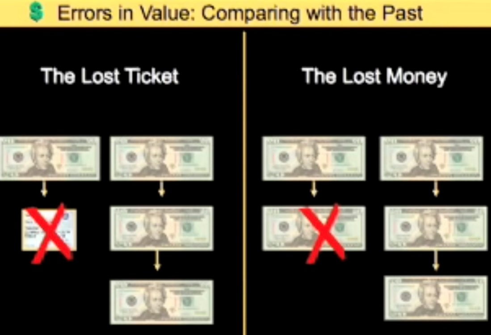

## Email Marketing

I see email being used, by and large, exactly the way I envisioned. In particular, it's not strictly a work tool or strictly a personal thing. Everybody uses it in different ways, but they use it in a way they find works for them. -- Ray Tomlinson (Inventor - Email)

- Abandon Cart Campaign
  - Email 1: 4 hours later
  - Email 2: 16 hours later
  - Email 3: 2 days later

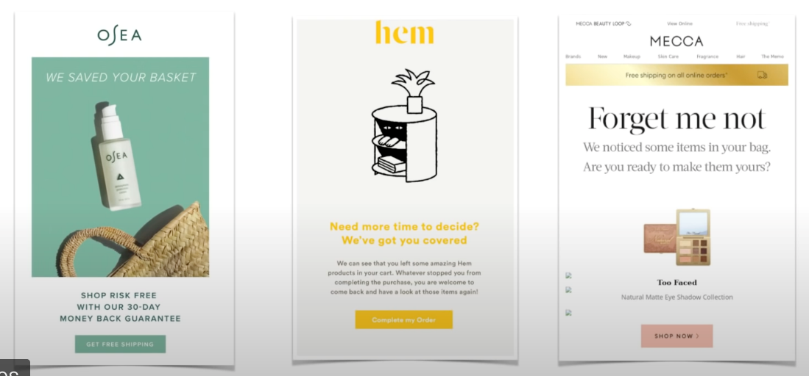

- Flash sale: This is a simpe campaign with a few emails and a discount/promotion with a time-limit which persuades your customers to buy right now AKA Impulse Buying. [This campaign works well during holidays like Christmas, Halloween, Black Friday]
  - Email 1: Day 1
  - Email 2: Day 2
  - Email 3: Day 4
  - Email 4: Day 5

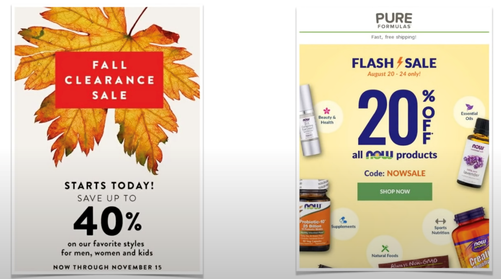

- Customer Nurturing: This is basically a flow to show your new customers that you care about them! It's a chance to educate them more about your brand
  - Email 1: Immediately
  - Email 2: 2 days later
  - Email 3: 4 days later
  - Note: Tell the customer how to use the product in the best way possible

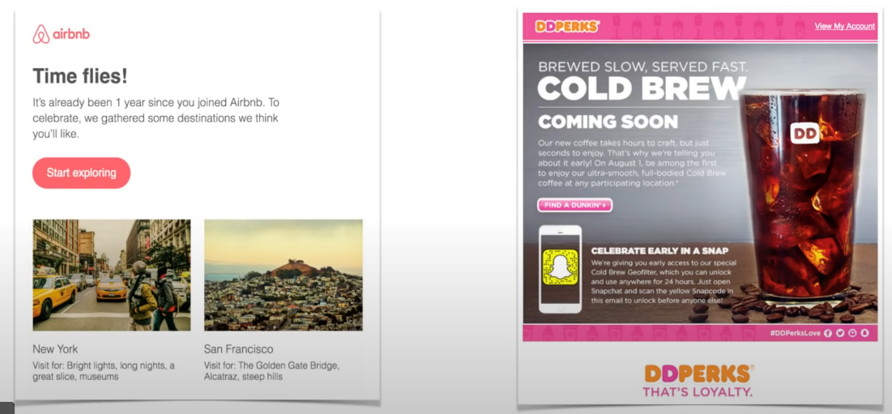

- Win-Back: A meticulously crafted campaign designed to pique the interest of existing leads and customers that haven't visited or purchased in around 120 days. It's a great way to encourage them to come back

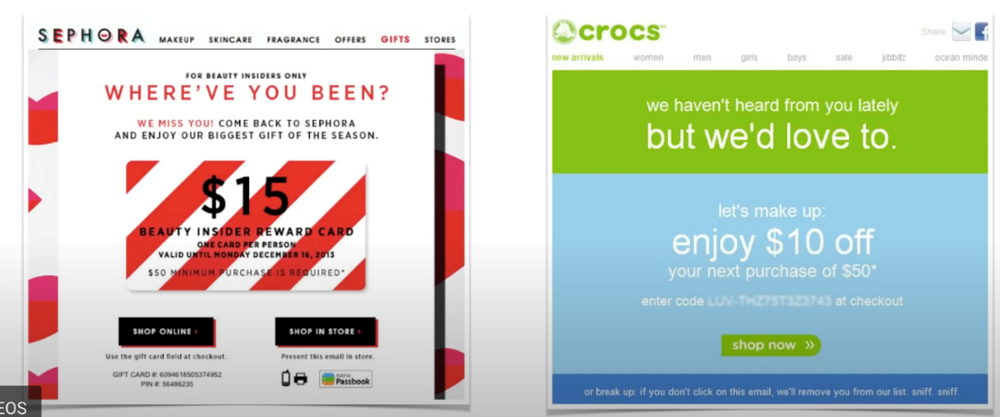

- Emails with personalized subject lines generate 50% higher open rates
- Sending three abandoned card emails results in 69% more orders than a single email
- Videos added to your email increase click rates by 300%
- The most popular days to send emails are Tuesdays, Wednesdays & Thursdays
- Since these days are very popular, you may have a better chance at an open rate if you send them on Mondays and Fridays instead.

Creating a Flow Template

Most Used Flows

Welcome Flow

Post Purchase flow

Cross Sell Sequence

Value & Engagement Sequence

UGC sequence

Customer Surveys

Incentive Video Reviews

Win Back Flow

Creating a flow template

Repeat Purchase Flow

Sales Cycle Abandon Flow & Trigger

Shopping Cart Abandonment Flow

Abandonment Sequences

Holidays & Specials

Social Proof

How to Create Urgency and Scarcity

Limited Offers: Countdown Timer

How to Develop Relationships with LeadNurturing

Automating your emails

Email Retargeting

How to Fix Email Errors

How Spam Filters React to Your CampaignEmail

How To Bypass Spam Filter

Why Your Audience is Not Receiving anyEmails

A/B Split Testing for Email Marketing

Viewing the Reports

Monitoring clicks and Conversions

Email Marketing Tools You Should Use

Achieving Maximum Engagement

Best Times To Send Emails

Webinars

Automation triggers

Cold email

How Email Marketing Fits into Your OmniChannelStrategy

How to Use This Course

SummaryLESSON 2 - Testing & Tweaking

Contact Profiling: Understanding Your Contacts Want

11 Type of Emails To Generate a Response

Proven Layout & Wireframing

Email Templates

How To Optimize Body Content

Best Practices for Optimizing CTA

Optimize for Mobile

How to Write Effective Subject Lines

Copywriting Hacks for Email Marketing

- Lead Nurturing
  - You can follow-up with your leads for weeks, months and years to come
  - You can give them value & build good will for years to come

- You don't need a fortune to be fortunate -- Neil Patel

## Lesson 1 - Email Optmization

- Contact Profiling: Understanding Your Contacts Want
- 11 Type of Emails To Generate a Response
- Proven Layout & Wireframing
- Email Templates
- How To Optimize Body Content
- Best Practices for Optimizing CTA
- Optimize for Mobile
- How to Write Effective Subject Lines
- Copywriting Hacks for Email Marketing

## Lesson 2 - Testing and Tweaking

- How to Develop Relationships with LeadNurturing
- Automating your emails
- Email Retargeting
- How to Fix Email Errors
- How Spam Filters React to Your CampaignEmail
- How To Bypass Spam Filter
- Why Your Audience is Not Receiving anyEmails
- A/B Split Testing for Email Marketing
- Viewing the Reports
- Monitoring clicks and Conversions
- Google Analytics Email Reports
- Email Marketing Tools You Should Use

## Lesson 3 - Workflows & Sequences

- Creating a Flow Template
- Most Used Flows
- Welcome Flow
- Post Purchase flow
- Cross Sell Sequence
- Value & Engagement Sequence
- UGC sequence
- Customer Surveys
- Incentive Video Reviews
- Win Back Flow
- Creating a flow template
- Repeat Purchase Flow
- Sales Cycle Abandon Flow & Trigger
- Shopping Cart Abandonment Flow
- Abandonment Sequences
- Holidays & Specials
- Social Proof
- How to Create Urgency and Scarcity
- Limited Offers: Countdown Timer

<https://sendgrid.com/resource/complete-email-metrics-guide>

<https://blog.hubspot.com/blog/tabid/6307/bid/30684/the-ultimate-list-of-email-spam-trigger-words.aspx>

## Acquiring Leads

- **Identify your target audience**

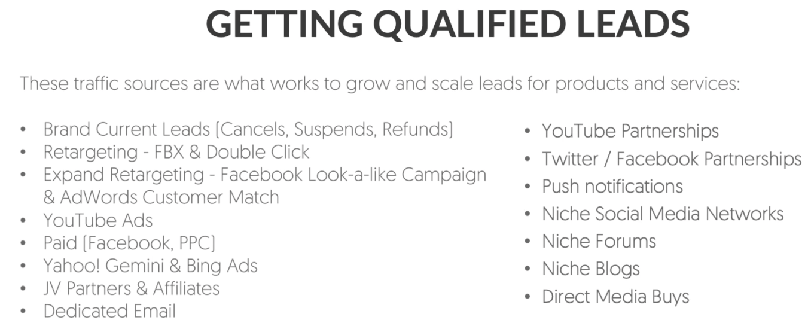

- Use Exit Intent

- **Conduct market research**
  - Learn about customer's buying habits through direct contact, such as:
    - Surveys
    - Interviews
    - Focus groups
- **Create an irresistible offer**
- **Use personalization to reel them in**
- **Setting up Email Campaigns**
  - Document your campaign's requirements
  - Draft email copy
  - Add copy to template
  - Set up tracking
  - Test your email
  - Use data and make iterations
- **Campaign Requirements**
  - Know the goal of the campaign
  - Utilize the right tone & voice in the copy that represents your brand
  - A clear "from" address & name
  - A segmented email list
  - Compelling subject line

## Workflows and sequences

- **Welcome sequence**
  - You should have a lead nurturing sequence - That warms up your leads with the best offers you company has
  - Once the first 15-day lead nurturing sequence ends, you will have to take them from off the autoresponder list and put them into a brodcast list
- **Autoresponder vs Broadcase**
  - Autoresponder - One the subscriber signs up to a chosen list automatically emails will be delivered to their inbox as per your preset rules [Date, time, e-mails...]
  - Broadcast - can be sent out right now or scheduled the email as per your requirement at any time or list you choose
- **Campaign stacking**
  - You can't build ONE email campaign or workflow to make your email marketing work
  - It just isn't enough to provide value & build a relationship
  - **The secret:** You campaign to stack them back-to-back to get the maximum sales from your contacts
- **Segment Subscribers**
- **Segmentation**
  - Dividing your list into manageable segments of people that have something in common
  - Used as a personalization to deliver more relevant email marketing to subsribers will increase conversions

## Strategies for getting a higher open-rate

- **The Double Opt-In Technique**
  - Write one email and two subject lines. Send the email with subject line one.Then the next day, send the email with subject line two to the people who didn't open subject line one. This has been shown to increase open-rateby30%.
- **Test Send Days & Times**
  - Don't listen to the myths. Every email list is different when it comes to thebest day and time to send your email. In fact many are opened as far as 2 days after they are sent. Test to see what works for you.
- **Name From Company**
  - Make sure that your readers know who is sending them messages. Make your send-from address "Name fromCompany". For example, Neil fromNeil Patel.
- **Optimize Your Preheader**
  - Most major email providers now have a"preheader"-an area next to the subject line displayed in your inbox that gives a preview of the email inside. Use this real estate wisely!
- **Optimize Your Subject Lines**
  - Constantly test subject lines to see which gets you a better open-rate. This is almost always the biggest reasonwhy someone does or does not open an email.
- **Optimize for Mobile Readers**
  - More than 50% of emails are read on a mobile device. Make sure that your email is optimized for mobile reading, so you don't miss out on getting an openfrom a mobile reader!
- **Segment Your Emails For Better Targeting**
  - People want to feel like they'respending their precious time on something that was specially meant for them. Segment your emails as specifically as possible to better give them that thoughtful one-on-one experience with your emails.

## Conversion sequence brainstorm worksheet

1. What can I use as an immediate upsell? (i.e. Email Course, Postcards/Mail, Exclusive Newsletters, Tele-Coaching, Live Events)

2. How can I leverage Facebook Custom Audiences with my list? What will I advertise regularly to stay in front of my clients on Facebook?

3. What is the best way I can leverage retargeting? What offer can I make to those people that said no to my lead magnet, tripwire, etc. to get them coming back? (Hint: You want to segment what you send them based on where they left your sales process. Personal targeting ALWAYS converts better)

4. What other product, service, or experience can I offer to expand upon, compliment, or complete my initial offer?

5. What other outside products, services, or experiences areavailable to offer from complimentary JV or Affiliate Partners?

6. What products or services can I offer with recurring billing? What product, service or experience can I offer that I can bill my customers for ongoing?

7. What different pricing levels can I offer as a billing option?How many levels of access will I offer? What will be included with each level? What price will each level be? And what pain should they fear if they disconnect?

## Digital Marketing

<https://neilpatel.com/blog/social-media-shortcuts>

- Analytics
  - What was the ROI of the billboard in Times Square?
  - Do people who use feature X have a higher LTV?
  - Do users in segment Y have higher engagement with feature Z?

## Marketing Popups

One of the best compliments an interaction designer can get is when a user repeatedly uses and interacts with the platform over an extended period of time. Unfortunately, marketing pop-ups are known to achieve the exact opposite, due to their reputation of irritating users and visitors.

Pop-ups by themselves are not harmful, provided they are implemented correctly. For example, if a pop-up is employed as a way to interact with the end user to confirm if they really intended to delete a certain file or folder, a cautionary pop-up is useful and not irritating.

At the same time, marketing pop-ups are mainly focused on increasing the number of sign-ups, subscribers, etc.

This type of pop-up should be avoided in IxD if there isany other wayto get the project finished without them. If not, there are a few ways of making them less irritating

- Make them simple
- Make the close button very visible
- Reduce the amount of pop-ups
- Allow the user to unsubscribe/opt-out
- Avoid audible notifications
- Make them fast

## C-commerce / Conversational-commerce

B2C2B

Giveaway marketing

## Account Based Marketing (ABM)

Account based marketing (ABM) is a business marketing strategy that concentrates resources on a set of target accounts within a market. It uses personalized campaigns designed to engage each account, basing the marketing message on the specific attributes and needs of the account.

ABM also takes a more holistic view of marketing, beyond just [lead generation](https://www.optimizely.com/optimization-glossary/lead-generation/). Marketing to existing customer accounts to encourage upselling and cross-selling is one of the keys to getting the most value from your largest accounts.

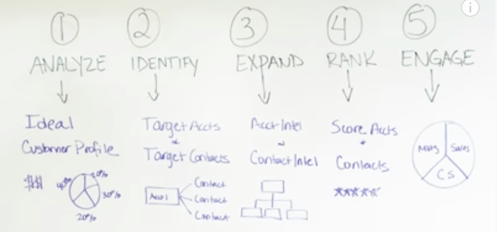

<https://blog.hubspot.com/marketing/account-based-marketing-guide>

## Acquiring your first 1000 users

1. Go to your users, offline

2. Go to your users, online

3. Invite your friends

4. Create FOMO

5. Leverage influencers

6. Get press

7. Build a community

<https://www.lennysnewsletter.com/p/how-the-biggest-consumer-apps-got>

## Snake Oil

Snake oilis a term used to describe [deceptive marketing](https://en.wikipedia.org/wiki/False_advertising), [health care fraud](https://en.wikipedia.org/wiki/Health_care_fraud), or a scam. Similarly, "snake oil salesman" is a common expression used to describe someone who sells, promotes, or is a general proponent of some valueless or fraudulent cure, remedy, or solution. The term comes from the "snake oil" that used to be sold as a cure-all elixir for many kinds of physiological problems. Many 19th-century United States and 18th-century European entrepreneurs advertised and sold [mineral oil](https://en.wikipedia.org/wiki/Mineral_oil)(often mixed with various [active](https://en.wikipedia.org/wiki/Active_ingredient) and [inactive](https://en.wikipedia.org/wiki/Inactive_ingredient) household herbs, spices, drugs, and compounds, but containing no snake-derived substances whatsoever) as "snake oil [liniment](https://en.wikipedia.org/wiki/Liniment)", making claims about its efficacy as a [panacea](https://en.wikipedia.org/wiki/Panacea_(medicine)).[Patent medicines](https://en.wikipedia.org/wiki/Patent_medicine) that claimed to be a panacea were extremely common from the 18th century until the 20th, particularly among vendors masking addictive drugs such as [cocaine](https://en.wikipedia.org/wiki/Cocaine), [amphetamine](https://en.wikipedia.org/wiki/Amphetamine), alcohol and [opium](https://en.wikipedia.org/wiki/Opium)-based concoctions or [elixirs](https://en.wikipedia.org/wiki/Elixir), to be sold at [medicine shows](https://en.wikipedia.org/wiki/Medicine_show) as medication or products promoting health.

<https://en.wikipedia.org/wiki/Snake_oil>

## Interstitial Ads

Interstitial ads are full-screen ads that cover the interface of their host app. They're typically displayed at natural transition points in the flow of an app, such as between activities or during the pause between levels in a game. When an app shows an interstitial ad, the user has the choice to either tap on the ad and continue to its destination or close it and return to the app

<https://developers.google.com/admob/android/interstitial>

[20 Years Of Marketing - 7 Most Important Lessons Learned](https://www.youtube.com/watch?v=VS4ECrG_0uM)

1. Start small, but look out for scale, okay? So here's what I mean by that. When we're thinking about scale, typically, I start off small. When I mean small, I'm talking not 5,000, not 10,000, I usually start off less than $1,000, even at our size, and I try to see what works. It doesn't mean I won't ramp up the next day to 10,000 or a 100,000, but I really try to start off small to try to figure out what works. Now, if I'm paying for services or hiring an agency, it's a little bit different because someone's creating a plan for me, and then executing on it. But if I'm doing it myself, I try to start off small because just because a channel or a tactic work for a competitor, it doesn't mean it works for me, so I try to start off small.

2. The second lesson I ended up learning, my biggest skillset and my buddy, Eric, always talks about this, is I execute extremely fast. Speed is everything. So I focused on executing fast and then adapting, and A/B testing, and tweaking, to make it better over time. It's just like a website design. Everyone's like, "Oh, I'm going to release a new website." We don't do that. We just continually A/B test our websites until we come up with a perfect variation. And then you can have someone tweak the designs and make sure it works. But that's the model we use.

3. The third one, learn from your mistakes. In marketing, you're going to make a lot of mistakes. When I first started out my career when I was a 16 year old kid. Keep in mind those, really young. I would be like, "Black Hat SEO, what's this? Let's try, oh cool, I'm ranking at top making money." Now times are changing, I would never recommend anyone to do that. I was a foolish 16 year old kid. I wish I had a time machine. I can go back in time and tell myself, "Don't do that again."

4. The next lesson, hire people who have done it before. This one, I actually didn't learn until roughly a year ago. So the way I usually built my businesses is you build a business, you keep learning from your failures and mistakes, and then you just keep at it. And you just keep going, you execute fast, you know, and hopefully things work out. But what I learned, and this took me a long time to learn. There's other people out there who have been where I am. There's other people out there who have been where I want to be, which is even better.

5. Next one, be consistent. Look, I can't tell you how many times that people would have had a massive business and done well on their marketing, if they were just consistent. If you're consistent, you'll do well. So when you constantly put your brand and associate it with influencers or other trustworthy elements, or other things that you know people are paying attention to, it helps build a brand, and that builds longevity.

6. Last but not least, make it easy for people to buy from you. If you make it hard, no one's going to really buy from you. PayPal, Shopify Pay, these are all solutions that make it really easy. Now, more than 18% of our customers use PayPal, but before PayPal, literally, if we got 100 conversions, we ended up with 118 after PayPal. Now, what portion you pay through PayPal or pay through other sources like credit card, or using Stripe, or Adyen, or anything like that? It varies, but just adding PayPal as a payment option because it's super simple, roughly 18% increase.

## SMS Marketing

<https://yourstory.com/2018/03/5-point-guide-sms-marketing>

## Cloud Services

<https://www.gigsmedia.in>

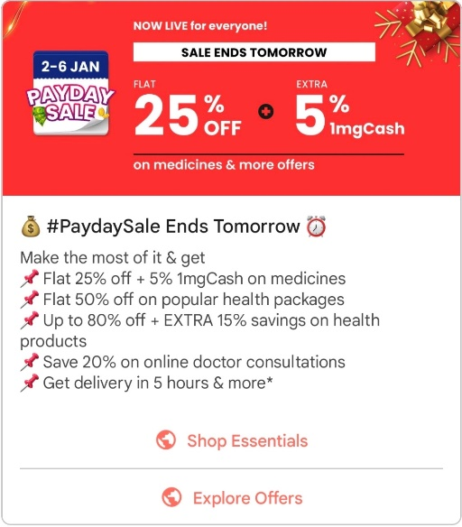

## Channels

1. **SMS**

    a.  msg91

    b.  pinpoint

2. **Email**

    a.  pinpoint

    b.  sendgrid

3. **Push notifications**

    a.  Firebase

4. **IVR**

5. **In-app messaging**
    - **in-app notification (banners)**
    - **native notification**
    - **in-app with deep linking notification**
    - [**https://developers.google.com/business-communications/rcs-business-messaging/guides/learn/what-can-rbm-do**](https://developers.google.com/business-communications/rcs-business-messaging/guides/learn/what-can-rbm-do)

6. **App Inbox / Notification Center**

<https://docs.clevertap.com/docs/app-inbox>

<https://docs.leanplum.com/docs/app-inbox-messages>

7. MSG91

8. FCM

9. Telegram

10. Whatsapp

## Metrics

On the available statistics reports, you will find that your deliverability is broken down by the following metrics. Each one gives you a different piece of information about how SendGrid or your recipients interact with your email.

- [Blocks](https://sendgrid.com/docs/glossary/blocks/)- The number of emails that were not allowed to be delivered by ISPs.
- [Bounces](https://sendgrid.com/docs/glossary/bounces/)- The number of emails that bounced instead of being delivered.
- [Clicks](https://sendgrid.com/docs/glossary/clicks/)- The number of links that were clicked in your emails.
- [Delivered](https://sendgrid.com/docs/glossary/deliveries/)- The number of emails SendGrid was able to confirm were actually delivered to a recipient.
- Invalid Emails- The number of recipients that you sent emails to, who had malformed email addresses or whose mail provider reported the address as invalid.
- [Opens](https://sendgrid.com/docs/glossary/opens/)- The total number of times your emails were opened by recipients.
- [Requests](https://sendgrid.com/docs/glossary/request/)- The number of emails you requested to send via SendGrid.
- [Spam Reports](https://sendgrid.com/docs/glossary/spam-reports/)- The number of recipients who marked your email as spam.
- [Unique Opens](https://sendgrid.com/docs/glossary/opens/)- The number of unique recipients who opened your emails.
- [Unique Clicks](https://sendgrid.com/docs/glossary/clicks/)- The number of unique recipients who clicked links in your emails.
- Unsubscribes- The number of recipients who unsubscribed from your emails.
- Unsubscribe Drops- The number of emails dropped by SendGrid because the recipient unsubscribed from your emails.

## SMS Metrics

## Delivery Rate-- The percentage of texts that are actually delivered from those you sent

## Open Rates-- This allows you to know how many texts were open

## Response Rate-- If the message required a response how did it go?

## Offers Used-- This is also easy to track, check how many users took advantage of the offer

## Click Rate-- Find out how many people have accessed your link

## Opt-Out Rate-- The percentage of people who unsubscribed after receiving your SMS

## Conversion Rate-- The percentage of subscribers who turned into customers by taking the required action

Tools / Cloud vendors / Agencies

## Sending Mails / SMS / Notifications

- MailChimp
- Twilio SendGrid (Twilio)
- mailgun
- Amazon SES
- **sendinblue**
- **sendpulse**
- **Onesignal**
- msg91
- Yellowmessenger
- Pinpoint
- <https://convertkit.com>
- Gmass

- Digital marketing
  - <https://hootsuite.com>
  - <https://www.radaar.io>
  - <https://ads.google.com>
    - DV360 (Display & Video 360)
- Content Creation

<https://www.peppercontent.io>

<https://www.peppertype.ai>

- <https://clevertap.com>
- <https://developers.google.com/business-communications/rcs-business-messaging>
- Google postmaster tools
- <https://www.sinch.com>
- Agencies

<https://www.havas.com>

<https://initiative.com>

- Frontend
  - neuronimbus
- Sales Tools

<https://www.pipedrive.com>

- Localization
  - Words Lead - Voice Over and Dubbing services
- SAAS
  - Josh Digital

## Others

<https://www.lennysnewsletter.com/p/what-is-good-retention-issue-29>

<https://neilpatel.com/blog/ai-tools-media>

[**https://medium.datadriveninvestor.com/how-nestl%C3%A9-conquered-japan-with-the-greatest-tactic-12ed4d3c87eb**](https://medium.datadriveninvestor.com/how-nestl%C3%A9-conquered-japan-with-the-greatest-tactic-12ed4d3c87eb)

[How to get your ideas to spread | Seth Godin](https://www.youtube.com/watch?v=xBIVlM435Zg)

<https://www.smartinsights.com/marketing-planning/marketing-models/use-bcg-matrix>

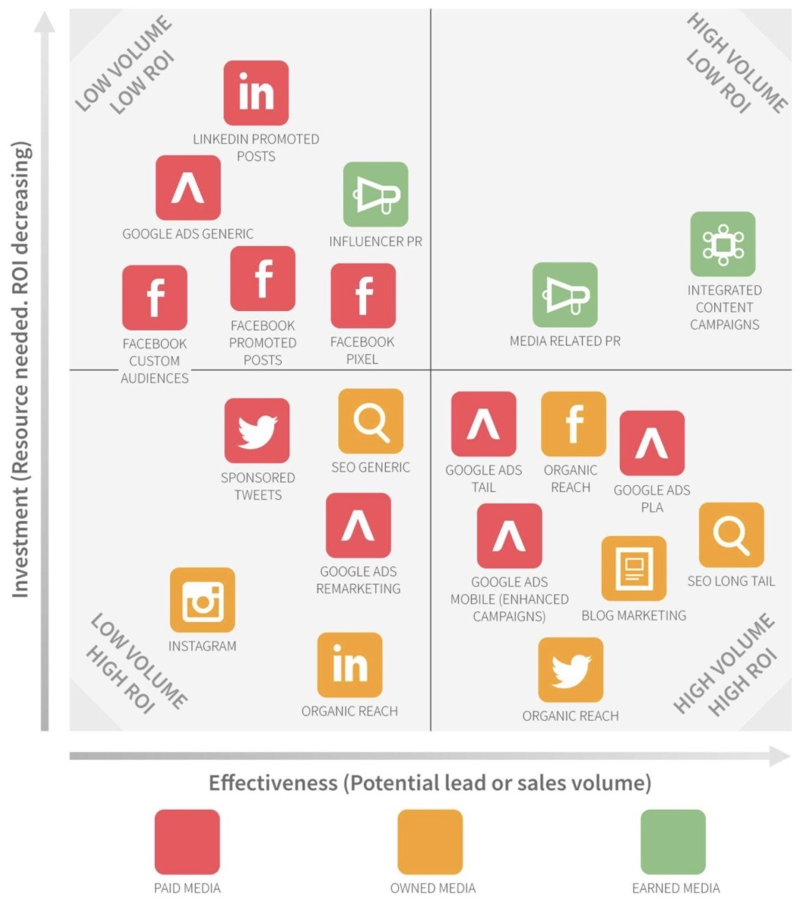

## Instagram Followers

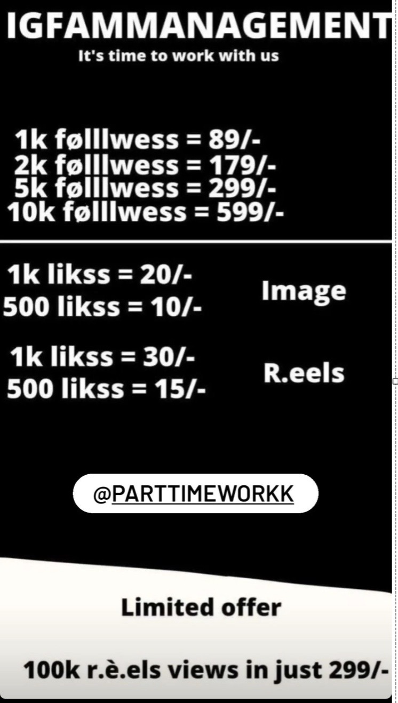

## Ad Recall

According to Behavioral Economics, anything that has high frequency builds better familiarity thereby aiding better recall from memory

Clever marketers create this Top Of Mind Awareness (TOMA) by repeatedly using the brand or product name in the ad over a period of time

Ex - Airtel produced a full song dedicated to friendship. This song had "Har ek friend zaroori hota hai" mentioned 7 times
