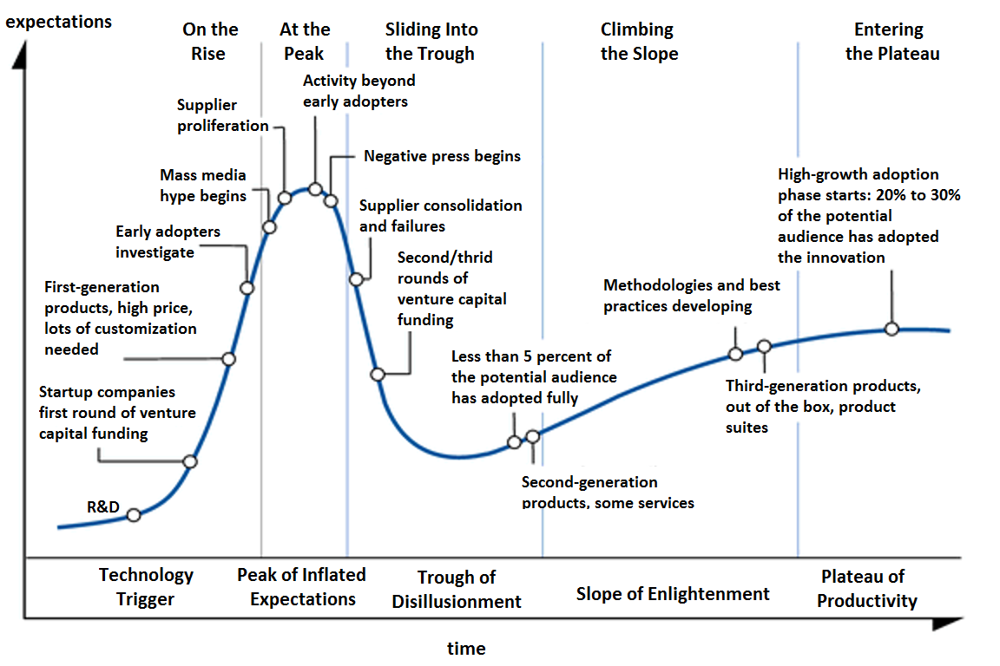
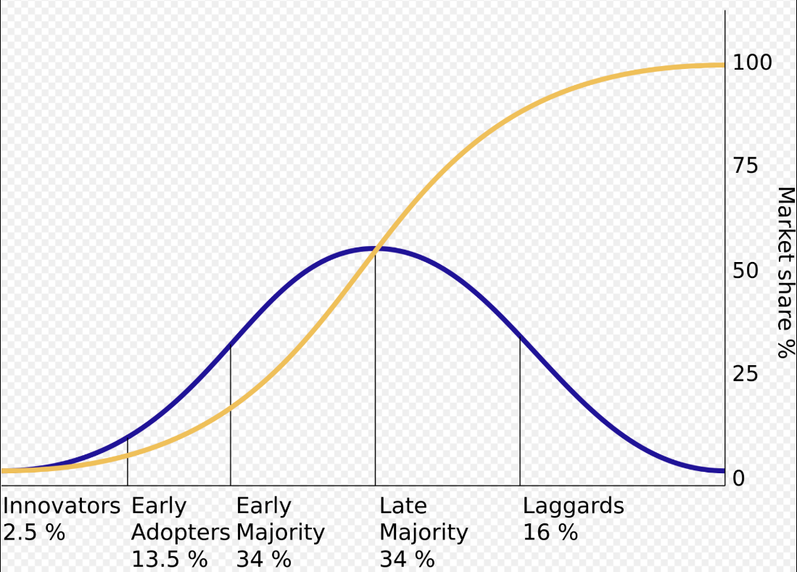

# Others

Created: 2018-09-03 17:19:36 +0500

Modified: 2021-05-31 01:20:17 +0500

---

# SWOT Analysis -

## SWOT analysis**(or**SWOT matrix) is a strategic planning technique used to help a person or organization identify the*Strengths*,*Weaknesses*,*Opportunities*, and*Threats*related to[business](https://en.wikipedia.org/wiki/Business)competition or project planning.[^[1]^](https://en.wikipedia.org/wiki/SWOT_analysis#cite_note-1)It is intended to specify the objectives of the business venture or project and identify the internal and external factors that are favorable and unfavorable to achieving those objectives. Users of a SWOT analysis often ask and answer questions to generate meaningful information for each category to make the tool useful and identify their competitive advantage.

Strengths and Weakness are frequently internally-related, while Opportunities and Threats commonly focus on environmental placement.
-   ***S**trengths*: characteristics of the business or project that give it an advantage over others.
-   ***W**eaknesses*: characteristics of the business that place the business or project at a disadvantage relative to others.
-   ***O**pportunities*: elements in the environment that the business or project could exploit to its advantage.
-   ***T**hreats*: elements in the environment that could cause trouble for the business or project.

The degree to which the internal environment of the firm matches with the external environment is expressed by the concept of[strategic fit](https://en.wikipedia.org/wiki/Strategic_fit). Identification of SWOTs is important because they can inform later steps in planning to achieve the objective. First, decision-makers should consider whether the objective is attainable, given the SWOTs. If the objective is*not*attainable, they must select a different objective and repeat the process.

<https://en.wikipedia.org/wiki/SWOT_analysis>

## PEST Analysis (political, economic, social and technological)

PEST Analysis is a management method whereby an organization can assess major external factors that influence its operation in order to become more competitive in the market. As described by the acronym, those four areas are central to this model.

# Kanban

Kanban is a method for managing the creation of products with an emphasis on continual delivery while not overburdening the development team.

## Kanban is based on 3 basic principles:
-   **Visualize what you do today (workflow):**seeing all the items in context of each other can be very informative
-   **Limit the amount of work in progress (WIP):**this helps balance the flow-based approach so teams don't start and commit to too much work at once
-   **Enhance flow:**when something is finished, the next highest thing from the backlog is pulled into play

<https://resources.collab.net/agile-101/what-is-kanban>

# Using Lanes to grow Teams

<https://medium.com/teads-engineering/growing-a-feature-team-using-lanes-2e50d5521006>

## churn rate

is the percentage of subscribers to a service who discontinue their subscriptions to the service within a given time period. For a company to expand its clientele, its growth rate, as measured by the number of new customers, must exceed its churn rate.

## SE Radio Episode 352 - Johanathan Nightingale on Scaling Engineering Management

## Law of Diminishing Returns - used to refer to a point at which the level of profits or benefits gained is less than the amount of money or energy invested.

## Failure Premortem

Imagine the most important goal or project you are working on right now. Now fast forward six months andassume the project or goal has failed.

Tell the story of how it happened. What went wrong? What mistakes did you make? How did it fail? In other words, think of your main goal and ask yourself, "What could cause this to go horribly wrong?"

This strategy is sometimes called the "**kill the company**" exercise in organizations because the goal is to spell out the exact ways the company could fail. Just like a Premeditation of Evils, the idea is to identify challenges and points of failure so you can develop a plan to prevent them ahead of time.

## Gartner Hype Cycle

## Diffusion of Innovation

Diffusion of innovationsis a[theory](https://en.wikipedia.org/wiki/Theory)that seeks to explain how, why, and at what rate new[ideas](https://en.wikipedia.org/wiki/Idea)and[technology](https://en.wikipedia.org/wiki/Technology)spread.[Everett Rogers](https://en.wikipedia.org/wiki/Everett_Rogers), a professor of[communication studies](https://en.wikipedia.org/wiki/Communication_studies), popularized the theory in his bookDiffusion of Innovations; the book was first published in 1962, and is now in its fifth edition (2003).Rogers argues that diffusion is the process by which an[innovation](https://en.wikipedia.org/wiki/Innovation)is communicated over time among the participants in a social system. The origins of the diffusion of innovations theory are varied and span multiple disciplines.

The diffusion of innovations according to Rogers. With successive groups of consumers adopting the new technology (shown in blue), its[market share](https://en.wikipedia.org/wiki/Market_share)(yellow) will eventually reach the saturation level. The blue curve is broken into sections of adopters.

<https://en.wikipedia.org/wiki/Diffusion_of_innovations>

## Work First Mindset

A "work first" mindset means that you plan your day around your work. Your work literally comes first.

## Force Majeure

Force Majeure is a common clause in contract law. It allows a party to limit their liability due to unforeseeable, extraordinary events. Maybe a hurricane hit the stadium, cancelling a game. Force Majeure. An earthquake brings down a building. Stuff like that.

## Human Resource Management

<https://www.keka.com
