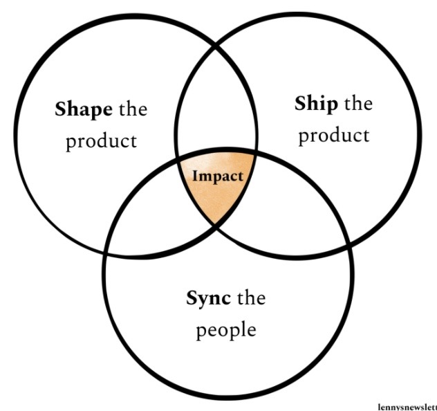
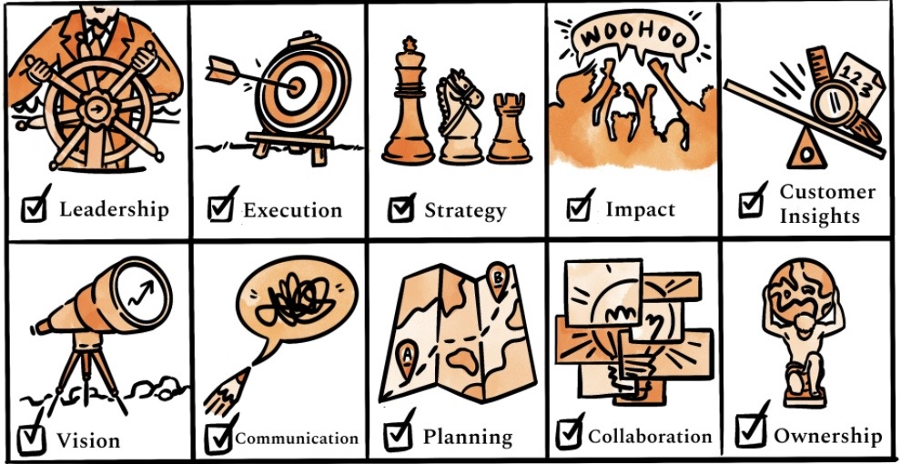
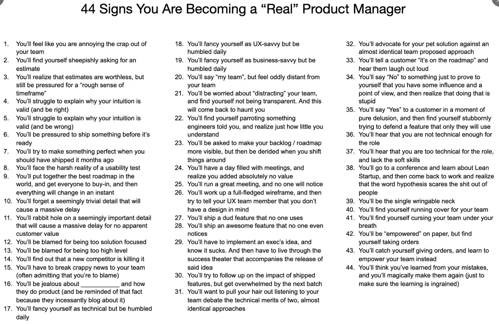
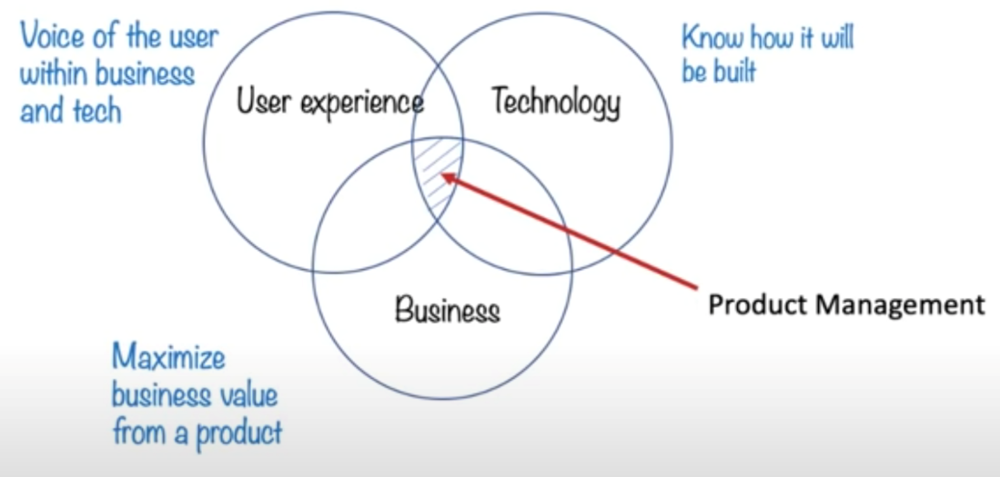
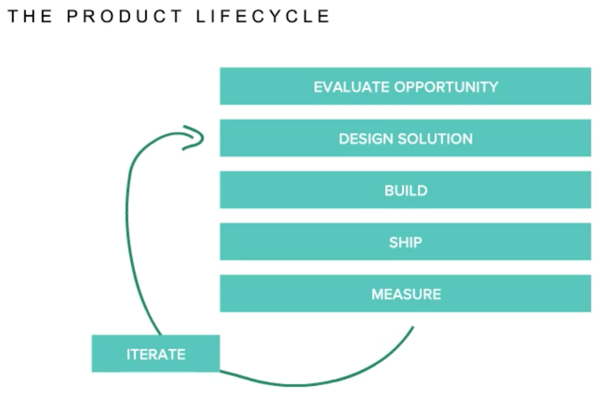
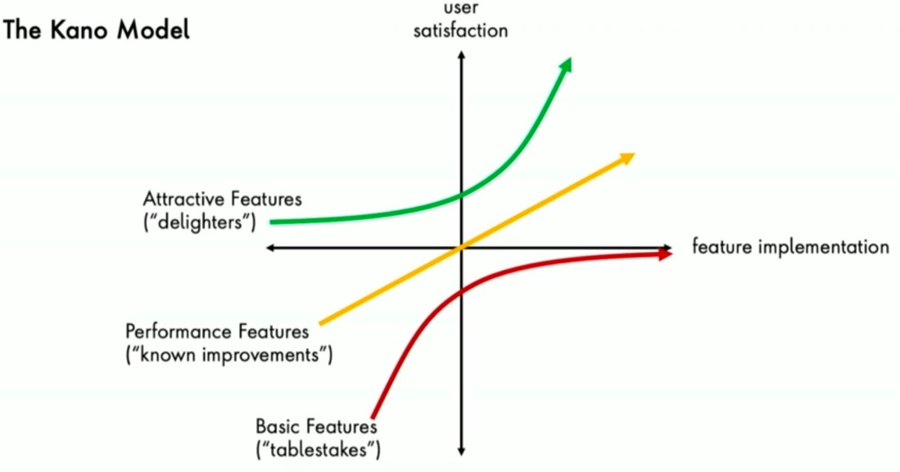
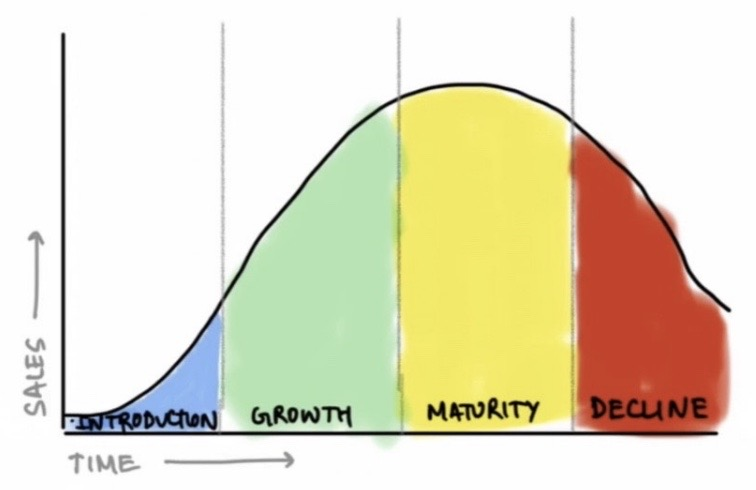

# Product Management

Created: 2020-03-16 08:47:52 +0500

Modified: 2022-12-09 23:56:28 +0500

---

At the end of the day, everything is a **toaster,** i.e. no matter how wonderful your product, if it is successful then others will copy it and sooner rather than later your product will be as easy to make as a toaster. -- Prof Bruce Greenwald

Asking (or forcing?) your team to stay late to hit those deadlines only accomplishes two things: it burns them out quicker, and it fosters resentment towards you. You can maybe do this once or twice each year, but neither of these are feasible if you're looking to cultivate a healthy and lasting relationship with your engineering teams.

So, the question becomes what do you do? Well as a product manager it's your job to figure these problems out, and sometimes you'll unfortunately need to have difficult conversations with certain stakeholders.

Regardless, there'sonly 3 ways to sustainably hit seemingly impossible deadlines:

- Reduce Scope
- Get More Resources
- Get More Time

## Reduce Scope

One of the three ways to hit impossible deadlines is to reduce scope. This means to remove features or functionality from your product to hit the deadline. This is usually the most demoralizing option, yet also the most realistic option.

The stakeholders this solution impacts the most are sales, account managers, direct product reports, and your customers.

To effectively reduce scope you need to do the following things in this order:

- List out all features and label them either: Must Haves, Should Haves, or Nice To Haves.
- Immediately get your engineering team to focus on Must Haves first, then Should Haves, then Nice To Haves.
- List out the cost of each feature and the status of completion for each feature.
- Create a plan documenting which features you'll hit with your team, what you need to de-scope, and how you'll communicate this to stakeholders.
- Communicate with your 1-up and 2-up (Director of Product and VP of Product, for example) this particular plan and get their input on priority. Take their edits into consideration. Here, it's important to be as upfront as possible. They're likely going to try to scope in more, but if you're not going to hit the deadlines don't fold here and promise something you know your team won't be able to accomplish.
- Loop in all people immediately affected. If you're building a B2B SaaS product, this likely means your account managers and sales. If you're building a consumer app, it likely means your communication, support and marketing teams.
- If you're building a B2B product, you'll need to formulate a communication strategy with your sales and account management teams to effectively communicate the news to potential and existing customers.
- Communicate to your team the revised scope.
- Execute to hit your revised scope.

## Get More Resources

The next strategy is to get more engineering resources. Unless your deadline is months away, hiring new engineers is usually not realistic. So where do you get the additional resource(s)? You'll need to pull from a different team by negotiating with their product manager and your direct reports. Here, you risk hurting your relationship with other product teams, and should only be used if you can create a reasonable strategy and if the features you're building are objectively more valuable to the company.

Here you'll want to focus on aligning each stakeholder on the organizaton's core goal. Other teams will feel slighted, but reminding them you're all working together towards this common goal can help.

The stakeholders it affects most are other product teams, your engineering team, and your direct reports.

To effectively negotiate for more resources, you should do the following in order:

- List out all features and label them either: Must Haves, Should Haves, or Nice To Haves.
- List out the cost of each feature and the status of completion for each feature.
- Calculate the value of building your feature to your core product and organizational metrics (for example, top-line revenue, MAU, growth, etc.).
- List out all other product teams, their engineering resources, and the value of their features to the organization.
- Create a plan that outlines how many more resources you'll need and which teams are most likely to contribute based on value.
- Communicate with your 1-up and 2-up your plan, outlining why you'll need more resources and which features are at risk. Work on finalizing any resource plans together.
- Directly reach out to the product team you're looking to borrow resources from and explain the situational need for more resources. Here, make sure to focus on how appreciative you are, rather than simply outlining that your features are more valuable - no one wants to hear that even if it's true.
- If you are granted more resources, now is time to onboard them. Do this with an intro meeting with your engineering team lead. Explain the situation and start pushing certain responsibilites over to the new developer.
- Execute to hit your revised scope.
- Show appreciation to the other team that you've borrowed resources from. They did you a huge favor and they deserve to be acknowledged. You can do this by expressing a heartfelt thank you, publically acknowleding them to other teams, or repay them in the future by lending resources when they need it more than you.

## Get More Time

This is the most obvious strategy, yet oftentimes the least realistic. We've promised certain features by a certain date and now you can't meet the specified date, so you ask for an extension. This is another undesirable scenario. It's important for this to consider code freezes, company-wide release policies, and potential affected customers.

The stakeholders this solution affects the most are sales, account managers, QA, marketing, and your customers.

To effectively push deadlines, you should do the following:

- List out all features and label them either: Must Haves, Should Haves, or Nice To Haves.
- List out the cost of each feature and the status of completion for each feature.
- Create a plan with three different milestones: one to hit all Must Haves, one to hit all Must Haves and Should Haves, and one to hit everything.
- Set a meeting with your direct reports and outline your proposed milestones. Here, you'll spend time negotiating and reprioritizing certain features by certain dates. Since you've costed out all features, you'll know what's realistic. Do not overpromise - you've already missed one deadline and you do not want to miss another.
- Communicate your new scope based on your revised deadline to your team immediately. Explain how you're unlikely to hit the deadline and so you've negotiated for more time.
- Execute to hit your revised scope.

## What does it all mean?

If you're running into this issue often, it likely means you're not effectively tracking how much work your team can accomplish, you're not accounting for enough edge cases in your product spec, or you're unable to effectively manage your stakeholders' expectations. The best strategy is always to be preventative rather than reactionary.

Regardless, by following these strategies, you accomplish four critical goals in a bad situation:

- You take responsibility early, creating trust and respect with all parties

- You communicate unified expectations to everyone involved, limiting potential backlash

- You create a collaborative situation with all stakeholders, limiting blame and internal fighting

- You build trust and respect with your engineering team, limiting resentment and burnout

This is the best-case scenario out of a worst-case scenario.

Your job as a PM is to deliver business impact by marshaling the resources of your team to identify and solve the most impactful customer problems.

There are three parts to this, each essential:

1. Deliver business impact

Fundamentally, you are responsible for delivering business impact. If your team drives positive impact - hitting important goals, reducing costs, shipping an important project, etc.---you're doing your job.

2. Marshaling the resources of your team

Your job isn't to do the building yourself but instead to increase the leverage of your cross-functional teammates - designers, engineers, data scientists, researchers - to deliver impact. To paraphrase [Andy Grove](https://email.mg2.substack.com/c/eJwlkM1yhSAMhZ9Glg4_irhg0U37CF0yaKKXuQgWsLe-ffGaYXIIIXMm32wLrjGdeo-5kCuZcu6oA76yx1IwkSNjMg606AXrGSWgO2CqV8RlsyTEzTqvSzqQ7Mfk3WyLi-EaYFR1PXnohUs79KOdl4HhICdmbU_VskhOuarX29Ye4DDMqGPwp9mtA-L1o5Q9N-Kj4Z_1YGhf7ul2BGfbmNb6dNVVPgIkfJmvFH-x4eI7ueLCamwAU9DOj1oQp6sfqyGZ5IKKlrcAUo5qGUfFJLAe2k71599P9k1Ht5W3-ZhysfOzneNGkgbE3T5zjCDZWL-s1-rvXt3cVN2O4MppMNjJI9xQyo32jcmsGDBV5GBs0UyKgQ6j4rSj8oZQqXUdrZw7Qao5xDoVtMcQzn-dRI-e), a product manager's output = the output of their team.

3. Identify and solve the most impactful customer problems

Business impact comes from solving customer problems. Thus, it's your job to lead your team to correctly identify, prioritize, and solve the mostimpactfulcustomer problems.

PMs are the ultimate business lever.

1. **Shape the product:**Harness insights from customers, stakeholders, and data to prioritize and build a product that will have the most impact on the business.

2. **Ship the product:**Ship high-quality product on time and free of surprises.

3. **Synchronize the people:**Align all stakeholders around one vision, strategy, goal, roadmap, and timeline to avoid wasted time and effort.

The most important PM attributes

[**https://medium.com/productmanagement101/spotify-squad-framework-part-i-8f74bcfcd761**](https://medium.com/productmanagement101/spotify-squad-framework-part-i-8f74bcfcd761)

- High alignment, High Autonomy
  - We need to cross the river (Management) , figure it out how (Squads)
  - Alignment enables autonomy
- If you need to know exactly who is making decisions, you are in the wrong place
- If everything is under control you are going too slow

[Spotify Engineering Culture (by Henrik Kniberg)](https://www.youtube.com/watch?v=4GK1NDTWbkY)

Playlist - [Spotify Squads/Tribes/Guilds](https://www.youtube.com/playlist?list=PLcb4e6GmmJKTxdVwg44TLPx7WkE2UQ6XB)

<https://www.jeremiahlee.com/posts/failed-squad-goals>

There is no one size fits all

There is no perfect PEPSI there are only perfect PEPSIs

## Frameworks

<https://www.scaledagileframework.com>

<https://basecamp.com/shapeup>

## What is Product Management

## The Product Lifecycle

- Concept, Introduction, Growth, Maturity, Decline, Withdrawal

- Think like a CEO
- Execute like a COO
- Story-tell like a CMO
- Deliver like a CFO

## Characteristics / Req of PMs

- Communication ninja (Internal / External)
- Execution Expert (Ship it)
- Stakeholder Management (Ducks in a row)
- Metrics Analysis (How are we doing?)
- Customer Empathy (Be the User)
- Research / Context (Know the User)
- Marketing / Biz counterpart (Impact the revenue)
- Team Champion (Face of the team)
- Vision / Passion / Own (mini-CEO?)

## PM Types

- Project Managers
- Program Managers
- Product Managers
- Technical Product Managers (TPMs)
- Product Marketing Managers
- Specializations
  - UX
  - Tech
  - Customer Experience (CX) / Ops
  - Based on vertical
  - Data Platforms
  - B2B vs B2C vs B2B2C

## COCA - Cost of customer acquisation

## CAC - Customer Acquisition Cost

<https://neilpatel.com/blog/customer-acquisition-cost>

## Helpful things

- Have an eye to detail
- Blog
- Network with PMs - understand real life PM stuff
- Read / Consume a lot
- See if you genuinely might fit

## Product Manager

<https://hackernoon.com/how-to-plan-your-career-change-and-become-a-product-manager-my-tips-and-tricks-for-success-fnv231pc>

## Career Ladder - <https://docs.google.com/spreadsheets/d/1F1Y3YtjsvAJUZMqS-rK0LGQGg7eHYubq9KqedPwLCDE/edit#gid=1755575210>

## 1% Problem

- Is the problem something that less than 1% of your users face?
- Is your solution going to inconvenience the remaining 99%?

The tricky part is to figure outwhich1% problems to solve and which ones to ignore. You might decide that the wrong cab problem, even though it's a 1% problem, is worth solving. And so every rider must announce a four-digit pin to the driver to start a trip. To solve a 1% problem, you decide to inconvenience the 99%.

<https://blackboxofpm.com/product-management-mental-models-for-everyone-31e7828cb50b>

## TAM - Total Addressable or Accessible Market

## TSM - Total Servicable Market

Remonetisation plan - hook and bait the customers

## BRD - Business Requirement Document

## PRD - Product Requirement Document

## FRD - Functional Requirement Document

## User Stories / User Story

In [software development](https://en.wikipedia.org/wiki/Software_development) and [product management](https://en.wikipedia.org/wiki/Product_management), auser storyis an informal, natural language description of features of a software system. They are written from the perspective of an [end user](https://en.wikipedia.org/wiki/User_(computing)#End-user) or [user of a system](https://en.wikipedia.org/wiki/User_(system)), and may be recorded on index cards, [Post-it notes](https://en.wikipedia.org/wiki/Post-it_note), or digitally in project management software.Depending on the project, user stories may be written by different stakeholders like client, user, manager, or development team.

User stories are a type of [boundary object](https://en.wikipedia.org/wiki/Boundary_object). They facilitate [sensemaking](https://en.wikipedia.org/wiki/Sensemaking) and communication; and may help software teams document their understanding of the system and its context.

<https://en.wikipedia.org/wiki/User_story>

## Checklist

<https://getting-started-in-product.mailerpage.com/posts/s7e5o0-product-management-checklists-how>

## Purple Cow by Seth Godin

- Take risks at being remarkable, and don't worry about criticism.
- Target the people who are both willing to try new things and very vocal at spreading the word to others.
- Invent the product with marketing.
- Target and measure your marketing effectively.
- Don't emulate the leader, because you'll never learn the process of turning risks into success.
- The traditional form of advertising is no longer effective because in today's overwhelmingly advertised world capturing the consumer's attention is almost impossible.
- In today's crowded marketplace, there is no room for "ordinary."
- Being ridiculed can be a good thing, as it spreads word about you and your product.

## Tipping Point by Malcolm Gladwell

- To spread an idea, you must make sure it sticks first. It has to be something special, catchy, unique, and remarkable to cut through the market noise.
- Keep the group smaller than 150 if the goal is to effectively spread a message.
- The spread of ideas is similar in behavior to the spread of epidemics.
- The tipping point is when ideas spread from an initial niche user base into the mass majority.
- A select few types of people are generally responsible for ideas to spread: connectors, salesmen, and mavens.
- External elements influence our behavior. Such influence is generally greater than what we perceive it to be.
- Small changes in context caused by external elements can have a big ripple effect.

## The Innovator's Dilemma by Clayton Christensen

- Have two innovation incubation models for an established firm.
- Observe how customers are actually using the product.
- Have discovery-driven planning that is adaptable to various factors of change.
- Be creative at finding the right customers who can directly benefit from your innovation, rather than a large, less targeted market.
- Expect trial and error so that a new organization can fail early and without great expense.
- Don't develop products and services based on what customers say they would like.
- Don't innovate in a singular quality such as performance oversupply. What does innovation look like in functionality, reliability, convenience, and price?
- Established and entrant firms bring different types of innovations to market.
- Established firms bring sustaining innovations to maintain market positions and profit margins. However, they still lose market dominance because of their focus on sustaining profits while ignoring new markets brought by disruptive technologies.
- Knowing what customers want through surveys, focus groups, and interviews is good at incremental improvement, but not effective at creating the next thing.
- A tunnel-vision chasing of profit margin should be moderated with long term expectations.
- The difficulty of predicting emerging markets means an established company can't justify the investment. Consequently, they usually miss out on disruptive technologies and the emerging market that comes with it.
- Sometimes firms are too inflexible with its Resources/Processes/Values (RPV) framework to adapt to changing conditions.
- Theoretical models for innovation rarely work in the real world.
- Disruptive innovations are usually variations on existing technologies that open up a new customer base.
- The best way for an established company to take advantage of a disruptive technology is to create or acquire an organization that is small but utilizes flexible processes.

## The Lean Startup by Eric Ries

- Focus the whole team on finding a sustainable business model. The faster the model is found, the likelier the start-up is to succeed.
- Learn through a scientific approach, constantly validating your findings.
- Validate your hypotheses by speaking with real customers.
- Move from believing to knowing by testing the value and growth hypotheses of your product.
- Test the demand of your product by building a minimal viable product.
- Establishing the build-measure-learn cycle as fast as possible will get you to your sustainable business model quickly.
- Split-test all your features to distinguish what would be valuable to your customers and what would be a waste of time.
- Pick an engine of growth (sticky, viral, or paid) and focus.
- You must examine the right metric, not superficial metrics that don't help you towards your goal.
- Traditional strategies cannot manage start-ups because start-ups lack a history.
- Don't be afraid of pivoting your fundamental core assumptions.
- The main goal for a start-up is to find and build a sustainable business model.
- Value hypothesis assumes early adopters will accept a product.
- Growth hypothesis assumes a product will appeal to a larger group of people later.

## Zero to One by Peter Thiel

- Think about the future as a definitive vision. This is a vision you want to focus on and attain.
- When thinking about the future, think about the progress which stands between now and the future.
- Finding ideas most people don't know about, or agree with, is key to being successful.
- First aim to be a profitable monopoly at a specific and narrowly defined target market, then expand to other markets.
- The initial team members are critical. You must find the right mix of skills, vision, and personal connections with each other. This makes it easier to foster a strong company culture.
- Have balanced owner interests to avoid future misalignments that may cause the company to suffer.
- Two types of progress bridge the now and the future: horizontal progress (one ton) and vertical progress (zero to one).
- Vertical progress is hard because it does not exist yet. It requires you to see the present differently. It also requires you to find a truth most people don't see or agree with.
- A startup has only one specific future vision leading to success. One must parse decisions relevant to specific conditions.
- Perfect competition is good for consumers, but it does not drive progress.
- Real progress, the zero to one type of vertical progress, usually results in monopolies. That means you're producing something much better than everyone else is.
- Sales and distribution is vital because your products will never sell themselves. Optimize your sales effort per distribution point to include various sales strategies.
- Founders tend to be strange people. However, the vision they have is indispensable because the decisions are made to realize that original vision.

## Start With Why by Simon Sinek

- Think inside out (starting with why), not outside in (starting with what). Communicatethe whyas it fosters a sense of belonging.
- The goal is to do business with people who believe what you believe.
- People don't buywhatyou do, they buywhyyou do it. What you do simply proves what you believe.
- Excited employees and customers who believe in your cause are the most powerful resources an organization can have.
- Financial incentives or punishments do not motivate people on a deep and emotional level.
- Customer manipulation may work in the short term, but it doesn't foster trust and is ultimately counterproductive.
- The Golden Circle consists of three concentric circles. Thewhatis the outer layer, thehowis middle layer, and thewhyis the core.
- Making profit is a result of thewhatand thehow, not thewhy.
- The Law of Diffusion on innovation breaks down to 2.5% innovators, 13.5% early adapters, 34% early majority, 34% late majority and 16% laggards. If you want mass-market success, you have to achieve a 15--18% tipping point.
- The early majority won't accept something until early adapters have tried it and accepted it, and you won't get early adapters until they believe in what you have.

## Kano Model

## Categories

1. **Must-be Quality**

Simply stated, these are the requirements that the customers expect and are taken for granted. When done well, customers are just neutral, but when done poorly, customers are very dissatisfied. Kano originally called these "Must-be's" because they are the requirements that must be included and are the price of entry into a market.

Examples: In a hotel, providing a clean room is a basic necessity. In a call center, greeting customers is a basic necessity.

2. **One-dimensional Quality**

These attributes result in satisfaction when fulfilled and dissatisfaction when not fulfilled. These are attributes that are spoken and the ones in which companies compete. An example of this would be a milk package that is said to have ten percent more milk for the same price will result in customer satisfaction, but if it only contains six percent then the customer will feel misled and it will lead to dissatisfaction.

Examples: Time taken to resolve a customer's issue in a call center. Waiting service at a hotel.

3. **Attractive Quality (User Delights)**

These attributes provide satisfaction when achieved fully, but do not cause dissatisfaction when not fulfilled. These are attributes that are not normally expected, for example, a thermometer on a package of milk showing the temperature of the milk. Since these types of attributes of quality unexpectedly delight customers, they are often unspoken.

Examples: In a callcenter, providing special offers and compensations to customers or the proactive escalation and instant resolution of their issue is an attractive feature. In a hotel, providing free food is an attractive feature.

Examples: if you ask Google assistant for a reminder for tomorrow morning at 1 am, it sets it at same day morning 8:00 am and not tomorrow i.e. the next day morning

4. **Indifferent Quality**

These attributes refer to aspects that are neither good nor bad, and they do not result in either customer satisfaction or customer dissatisfaction. For example, thickness of the wax coating on a milk carton. This might be key to the design and manufacturing of the carton, but consumers are not even aware of the distinction. It is interesting to identify these attributes in the product in order to suppress them and therefore diminish production costs.

Examples: In a callcenter, highly polite speaking and very prompt responses might not be necessary to satisfy customers and might not be appreciated by them. The same applies to hotels.

5. **Reverse Quality**

These attributes refer to a high degree of achievement resulting in dissatisfaction and to the fact that not all customers are alike. For example, some customers prefer high-tech products, while others prefer the basic model of a product and will be dissatisfied if a product has too many extra features.

Examples: In a callcenter, using a lot of jargon, using excessive pleasantries, or using excessive scripts while talking to customers might be off-putting for them. In a hotel, producing elaborate photographs of the facilities that set high expectations which are then not satisfied upon visiting can dissatisfy the customers.

<https://en.wikipedia.org/wiki/Kano_model>

## Design X for Y (X = Product, Y = Customer)

What do these questions test

1. Setting objectives

2. Customer empathy

3. Prioritization

4. Creative thinking

## CIRCLES Method

Is a framework to help solve design questions in PM interviews

1. **C - Comprehend Situation -** What? Who? Why? How?

ask clarifying questions

understand the situation

2. **I - Identify Customer -** Personas

3. **R - Report customer needs**

4. **C - Cut through prioritization -** ROI Estimate?

5. **L - List Solutions**

6. **E - Evaluate trade-offs -** thoughtful, analytical, objective

7. **S - Summarize recommendation -** What, recap, why others

After getting the answer to RCA, keep on going to all other points, just to confirm for multiple factors in play

## Become a product manager if you are fulfilled by

- Solving people's problems (both your users' and your team's)
- Driving business growth
- Working closely with a variety of people
- Developing a strategy
- Getting shit done
- Leading a team (through influence, not authority)
- Communicating often and broadly
- Making decisions
- Creating amazing experiences for people
- Being organized, detail oriented, and prepared

## Do not become a product manager if you are primarily fulfilled by

- Appreciation
- Having your way
- Being left alone
- Always being right
- Designing or building things yourself
- Everyone liking you
- Flow states
- Avoiding meetings
- Avoiding email
- Avoiding people

<https://www.lennysnewsletter.com/p/how-to-get-into-product-management>

- What are you trying to do?

Articulate your objectives using absolutely no jargon

- How is it done today, and what are the limits of current practice?
- What is new in your approach and why do you think it will be successful?
- Who cares? If you are successful, what difference will it make?
- What are the risks?
- How much will it cost?
- How long will it take?
- What are the mid-term and final exams to check for success?

## Product Market Fit

<https://www.lennysnewsletter.com/p/how-to-know-if-youve-got-productmarket>

<https://www.lennysnewsletter.com/p/how-to-kickstart-and-scale-a-marketplace>

## GTM - Go To Market

A go-to-market (GTM) strategy is a step-by-step plan for launching a new product or expanding an existing product into a new market. It sets your initiative up for success by answering the following questions:

- Whatproduct are you selling, and what unique problem does it solve?
- Whois your ideal customer, and what pain points do they experience?
  - **Ideal customer profile (ICP)**
  - **Buyer personas**
- Wherewill you sell your product? What markets do you want to pursue, and what does the demand and competition look like in those markets?
- Howwill you reach your target customers and create demand?

<https://asana.com/resources/go-to-market-gtm-strategy>

## 7 common ways to differentiate a product

1. Be the cheapest

2. Be the highest quality

3. Be the most convenient

4. Be the safest

5. Sell a proprietary product

6. Sell something that makes people feel great buying

7. Focus on a niche underserved market

<https://www.lennysnewsletter.com/p/how-to-differentiate>

## Organizational skills

- Time management
- Communication
- Setting goals
- Delegation
- Working under pressure
- Self-motivation
- Analytical thinking
- Attention to detail
- Decision-making
- Strategic planning

## Success Metrics

[PM School - Defining Success Metrics for a product | Solving Metrics Questions in PM interviews](https://www.youtube.com/watch?v=WBG0Ggmhu2M)

- Clarify - Goals vs Metrics, Functionality, Mission/Vision
- PLC (Product Life Cycle) Stage - Pick the stage of the company / product

- Product / Customer Goal - Decide on the key customer goal
- Funnel metrics
  - Identify key actions to encourage
    - Ex: Netflix (focusing on Acquisition/Adoption)
  - Define metrics for a time frame
  - Categorize metrics if needed
- Prioritize
  - **1 North Star Metric (NSM)**
    - broad indicator of success, not complex or difficult to understand
    - Should be actionable
  - 4-5 L1 supporting metrics
- Critique your metrics

## Product Strategy + GTM (Go To Market)

[PM School - Should Google enter the OTT market? | Strategy and GTM questions in PM Interviews](https://www.youtube.com/watch?v=TG657u78MOQ)

- CXO Thinking Skills
- How well you breakdown an ambiguous & vague problem
- Should X enter Y market
- Do not jump to conclusions, don't say yes or no without an approach/framework

5C Framework

- Competition
  - How competitive is the industry?
  - Too many/few players?
  - Any unfair advantages others have that we don't
- Customers (Synergies)
  - Existing customers
  - Future customers in new market
- Company
  - Do we have what it takes from a skillset standpoint?
    - Strengths
    - Weaknesses
- Collaborators
  - Do we need to partner with anyone to enter this market?
- Climate
  - Political / Economic / Regulatory

Where & How to enter?

- Where - Look at customer journey / value chain
- How - Think about business model

## Pricing Strategy

[PM School - How do you price Spotify Premium? | Pricing Questions in PM Interviews](https://www.youtube.com/watch?v=lDwqjTQs6Qk)

- Pricing is not just a number (it can make or break your product)
- Analysis
  - What is the product?
  - Who is the customer?
  - What is the problem?
  - What is the company?
- Business
  - Goal
  - Market (Competition)
  - Brand
  - Willingness to pay (alternatives)
  - Cost (manufacturing)
- Strategies
  - Price Skimming
    - Initially charge the highest price customers will pay and gradually reduce the price
    - Works when technology is new
    - There is little to no competition
    - Goal: Gather as much revenue as possible until demand is high
  - Market penetration
    - Price really low at the start to beat competition, and then graudually increase price
  - Premium pricing
    - Price really high for aspirational products
  - Bundled pricing
    - Combine high & low value products & price the bundle lower than the combined price of each of the products taken individually
  - Freemium
    - Offer a basic version for free, and a paid upgraded version (ex - SAAS products)
- Frequency of payment (Annual / Monthly)

## Product Sense

Product sense is the skill of consistently being able to craft products (or make changes to existing products) that have the intended impact on their users.

Product sense relies on

1. Empathyto discover meaningful user needs

2. Creativityto come up with solutions that effectively address those needs

## Building empathy

1. Observe people interacting with products

2. Deconstruct everyday products

## Improving creativity

1. Learn from great product thinkers

2. Be curious about changes in technology and your domain

<https://www.lennysnewsletter.com/p/product-sense>

## Others

<https://www.freecodecamp.org/news/why-understanding-software-requirements-matter-to-you-as-a-software-engineer>

<https://rohankatyal.com/How-I-prepared-for-Facebook-PM-execution-metrics-interviews-24a8aff4830645389d4895bbe33ac801>

[What It Takes To Become A Great Product Manager](https://www.youtube.com/watch?v=SrAraT1q94c&ab_channel=CodingTech)

<https://www.lennysnewsletter.com/p/a-product-managers-guide-to-web3>

## Resources

<https://www.lennysnewsletter.com>

<https://noidea.dog/glue>
