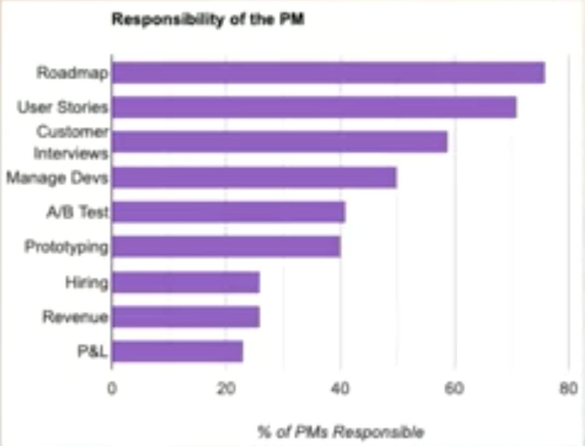
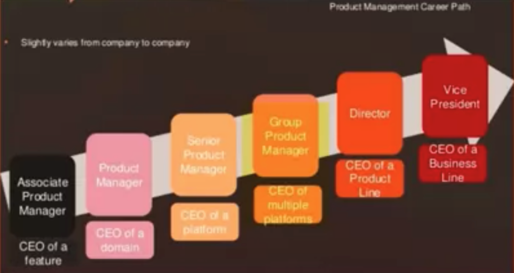

# Coursera - PM

Created: 2020-09-16 20:38:31 +0500

Modified: 2021-11-07 13:57:10 +0500

---

<https://www.coursera.org/specializations/real-world-product-management>

## Applied Learning Project

Bring your own product or idea as we:

1. Map your customer personas and journeys

2. Involve non-buyers to influence buyers

3. Apply Bain's elements of value

4. Draft PRDs and PRFAQs

5. Size your product market using TAM, SAM, and SOM

6. Perform competitive analyses

7. Draft your product vision, roadmap, and backlog

8. Draft Google-style OKRs

9. Design an A/B test

10. Calculate NPS, CSAT, and CES

11. Addict your customers across your product journey

12. Price your product

13. Research competitors' LTV

14. Analyze financial statements

15. Lead with designers & engineers

16. Answer real technical PM interview questions

17. Practice real behavioral, product design, strategy, data analysis, and estimation PM interview questions. (Facebook calls the question types above leadership & drive, product sense, and execution -- you'll practice those too!)

18. Resist your proxies

19. Realign your metrics with your product vision

## Skills

Technology Leadership

Go-to-market Strategy

Product/Market Fit

Tech Leadership

B2B Sales

Monetization Strategy

A/B/n testing

Customer Retention

<http://growth.eladgil.com/book/introduction/welcome-to-the-high-growth-handbook>

## WHAT DO PRODUCT MANAGERS DO?

1. Product strategy and vision

2. Product prioritization & problem solving

3. Execution: timelines, resources, and removal of obstacles

4. Communication and coordination (overlays all of the above)

- Strategic thinking and vision
- Written and verbal communication
- Collaborating and influencing your peers more effectively
- Mastering the art of shipping on time while keeping your team happy
- Leveraging user research, metrics, and stakeholders to prioritize
- Delivering better presentations

## Characteristics of great product managers

1. Product taste

2. Ability to prioritize

3. Ability to execute

4. Strategic sensibilities

5. Top 10% communication skills

6. Metrics and data-driven approach

## The four type of product managers

1. Business product manager

2. Technical product manager

3. Design product manager

4. Growth product manager

Not a product manager: Project managers

Associate product managers (APMs) / Rotational Product Managers (RPMs)

## Interviewing PMs

1. Product insights

2. Contribution to past successful products

3. Prioritization

4. Communication and team conflicts

5. Metrics and data

6. "For all hires reference-checking is incredible important" -- Elad Gil

## VP Product

1. **Drive product strategy, road-mapping, and execution across the organization**
    - **Set product vision and roadmap**
    - **Think strategically and articulate that strategy**
    - **Make cross-functional, strategic trade-offs**

2. **Create and empower a professional product management discipline**
    - **Recruit experienced product managers who have overseen multiple stages of the lifecycle of high use products**
    - **Represent product management at the executive level**
    - **Empower PMs in their organization to work effectively and get things done**
    - **Build programs to train and support new PMs**

3. **Set cross-company product management processes**
    - **Develop processes needed to run product development efficiently, prioritize product decisions, and launch products**

## Product management processes

1. PRD templates and product roadmaps

2. Product reviews

3. Launch process and calender

4. Retrospectives

- 1 PM per 7-8 engineers
- 1 PM every 3 sales people

## Courses

[The Business of Product Management I](https://www.coursera.org/learn/the-business-of-product-management-one)

[The Business of Product Management II](https://www.coursera.org/learn/real-world-product-management-skills)

[The Art & Science of Product Management](https://www.coursera.org/learn/pms-leading-design-engineering-ai-ml)

[Acing the Product Management Interview](https://www.coursera.org/learn/acing-product-management-interviews)

<https://www.coursera.org/professional-certificates/google-project-management>

<https://www.coursera.org/specializations/uva-darden-digital-product-management>

<https://www.coursera.org/specializations/product-management>

## 6 Month Product MBA

#### Month 1

✉ Newsletter: Lenny’s Newsletter by [Lenny Rachitsky](https://www.linkedin.com/in/ACoAAABGvmoB4S920iEQfSFO_P91nw2wPqfPoic)
📚 Book: Inspired by [Marty Cagan](https://www.linkedin.com/in/ACoAAAAAjycBVwSf0tRMLhZIJgQhgC8WlvNo9g8).
🎙 Podcast: Product Thinking with [Melissa Perri](https://www.linkedin.com/in/ACoAAADufjUBixvWZNsGEm88A8k3N47Ig2pArvs)
👩‍🏫 Conversation topic: “What is the role of a Product Manager in a company and a Tech team?”
📽 Online Course: Product Manager Foundations at [One Month PM](https://www.linkedin.com/company/onemonthpm/)
📝 Analysis challenge: [Airbnb](https://www.linkedin.com/company/airbnb/) (Marketplace)

#### Month 2

✉ Newsletter: Ask Gib by [Gibson Biddle](https://www.linkedin.com/company/gibson-biddle/)
📚 Book: Continuous Discovery Habits by [Teresa Torres](https://www.linkedin.com/in/ACoAAAAABQIBksTwFRyWlc2Rz43Z-BbuVG8zw54)
🎙 Podcast: Lenny’s Podcast by [Lenny Rachitsky](https://www.linkedin.com/in/ACoAAABGvmoB4S920iEQfSFO_P91nw2wPqfPoic)
👩‍🏫 Conversation topic: “How do you run customer and user discovery?”
📽 Online Course: Growth Product Management at [One Month PM](https://www.linkedin.com/company/onemonthpm/)
📝 Analysis challenge: [Revolut](https://www.linkedin.com/company/revolut/) (Fintech)

#### Month 3

✉ Newsletter: The Beautiful Mess by [John Cutler](https://www.linkedin.com/in/ACoAAABkgVcByXwZ4Zke2hKjaekv4qJxDWQeqsY)
📚 Book: Escaping the build trap by [Melissa Perri](https://www.linkedin.com/in/ACoAAADufjUBixvWZNsGEm88A8k3N47Ig2pArvs)
🎙 Podcast: The Product Podcast by [Product School](https://www.linkedin.com/company/product-school/)
👩‍🏫 Conversation topic: “How do you prioritise and what frameworks do you use?”
📽 Online Course: Data for Product Managers at [One Month PM](https://www.linkedin.com/company/onemonthpm/)
📝 Analysis challenge: [Shopify](https://www.linkedin.com/company/shopify/) (Ecommerce)

#### Month 4

✉ Newsletter: SVPG by [Marty Cagan](https://www.linkedin.com/in/ACoAAAAAjycBVwSf0tRMLhZIJgQhgC8WlvNo9g8)
📚 Book: Sprint by [Jake Knapp](https://www.linkedin.com/in/ACoAAACDrXsB2wHc_jrcpjwmk-iMbKeXfbXVxds).
🎙 Podcast: 20Product by [Harry Stebbings](https://www.linkedin.com/in/ACoAAAqiFJsBpNbbD_8asbx88kYlVbb_DAspWwE) at [20VC](https://www.linkedin.com/company/20vc/)
👩‍🏫 Conversation topic: “How do you build and manage your roadmaps?”
📽 Online Course: No Code Foundations at [One Month PM](https://www.linkedin.com/company/onemonthpm/)
📝 Analysis challenge: [Netflix](https://www.linkedin.com/company/netflix/) (Consumer)

#### Month 5

✉ Newsletter: ProductTalk by [Teresa Torres](https://www.linkedin.com/in/ACoAAAAABQIBksTwFRyWlc2Rz43Z-BbuVG8zw54)
📚 Book: Hooked by [Nir Eyal](https://www.linkedin.com/in/ACoAAAAHyQEBDr9figMsc4ImSK0wgU_97M8PmMU).
🎙 Podcast: How I built this by [Guy Raz](https://www.linkedin.com/in/ACoAADAm41YBuzIKPIublsOOXtV3kLlVkt1OEsQ)
👩‍🏫 Conversation topic: “How do you manage stakeholders and management as a PM?”
📽 Online Course: AI Product Manager at [One Month PM](https://www.linkedin.com/company/onemonthpm/)
📝 Analysis challenge: [TikTok](https://www.linkedin.com/company/tiktok/) (Social)

#### Month 6

✉ Newsletter: High-Impact Product Management by [Itamar Gilad](https://www.linkedin.com/in/ACoAAAAik0wBQRTB6Tpmz8Z8-9Qq_csOtJBPM-U)
📚 Book: Empowered by [Marty Cagan](https://www.linkedin.com/in/ACoAAAAAjycBVwSf0tRMLhZIJgQhgC8WlvNo9g8).
🎙 Podcast: The Product Experience by [Mind the Product](https://www.linkedin.com/company/mind-the-product/)
👩‍🏫 Conversation topic: “How do you launch products and features and set them for success?”
📽 Online Course: Web3 PM at [One Month PM](https://www.linkedin.com/company/onemonthpm/)
📝 Analysis challenge: [Notion](https://www.linkedin.com/company/notionhq/) (B2B SaaS)
