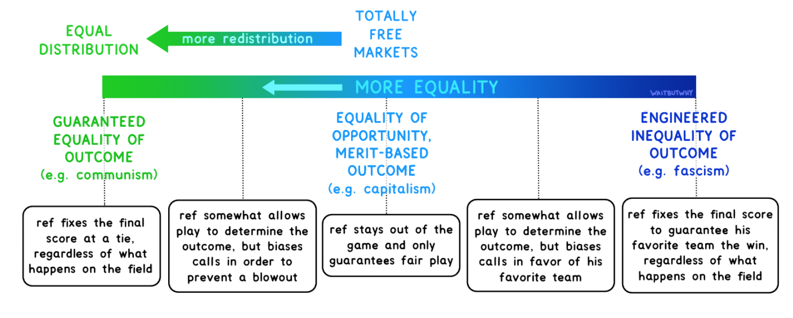
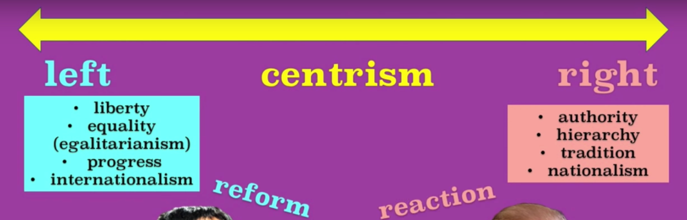
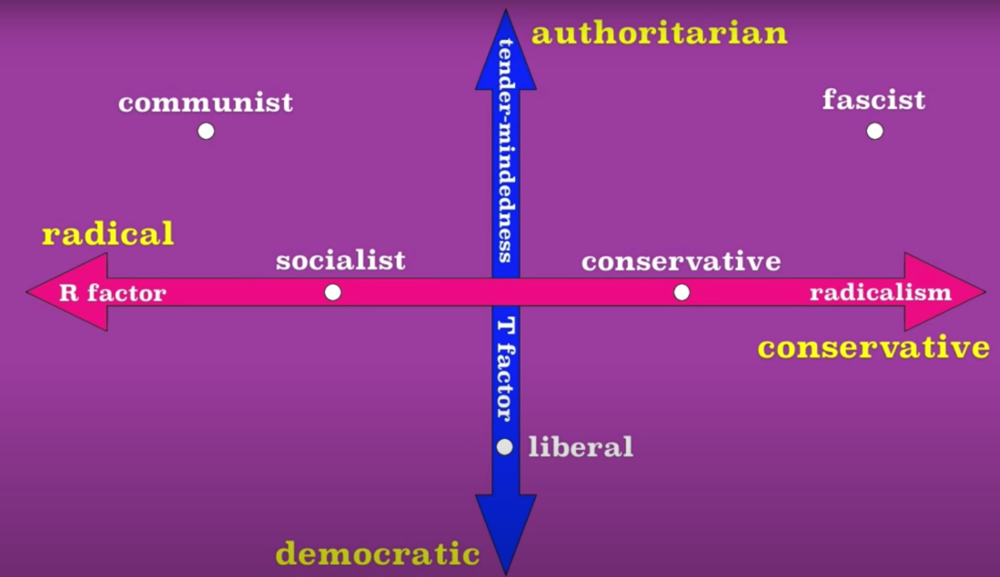
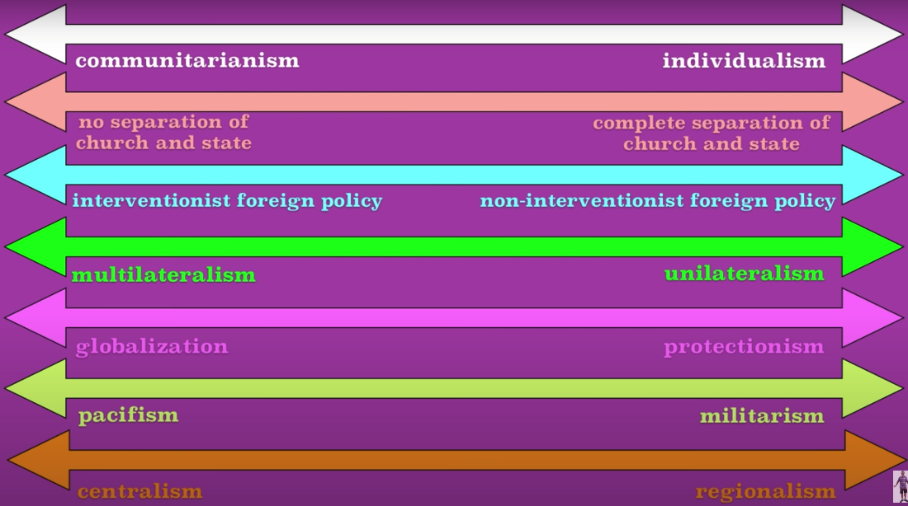
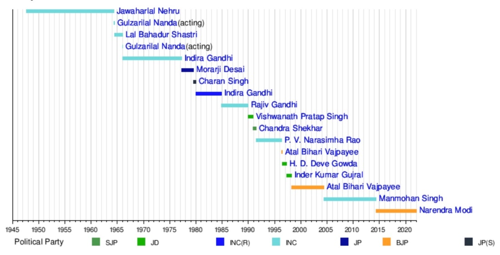
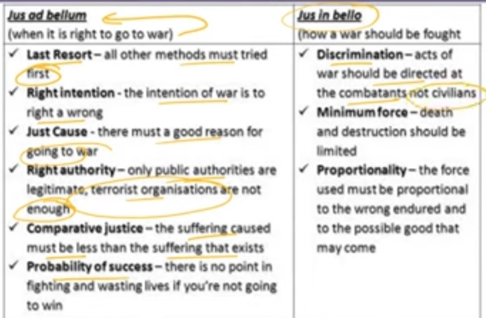
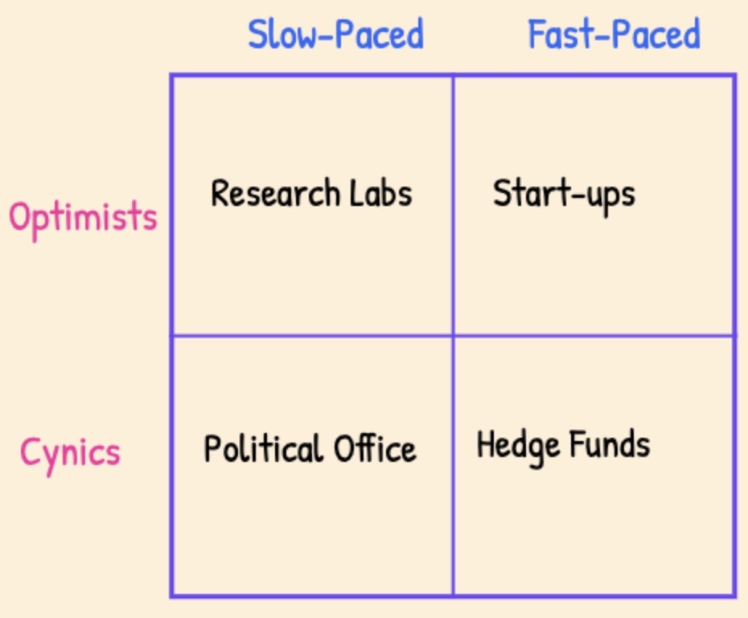

# Politics

Created: 2018-12-23 15:25:26 +0500

Modified: 2022-11-28 13:52:59 +0500

---

Lennon will always remain a freedom seeker, a liberal globalizer who dreamed of a world with no country, with nothing to kill or die for, and no religion too. Impossible? Maybe , but dreams need to go beyond the mere possible.

Only the dead can be forgiven

Free speech is a privilege that must only be given to only set of filtered people.

## Types of Governments (Political Ideology)
-   Monarchy
-   Democracy
-   Oligarchy

a small group of people having control of a country or organization.
-   Authoritarianism

the enforcement or advocacy of strict obedience to authority at the expense of personal freedom.
-   Totalitarianism

a system of government that is centralized and dictatorial and requires complete subservience to the state.
-   Meritocracy
-   Populism

a political approach that strives to appeal to ordinary people who feel that their concerns are disregarded by established elite groups.
-   Federalism

Federalismis the mixed or compound mode of[government](https://en.wikipedia.org/wiki/Government), combining a general government (the central or "federal" government) with regional governments (provincial, state, cantonal, territorial or other sub-unit governments) in a single political system.

Federalism can thus be defined as a form of government in which there is a division of powers between two levels of government of equal status.

<https://en.wikipedia.org/wiki/Federalism>
-   Egalitarian

believing in or based on the principle that all people are equal and deserve equal rights and opportunities.
-   Socialism

a political and economic theory of social organization which advocates that the means of production, distribution, and exchange should be owned or regulated by the community as a whole.
-   Capitalism

an economic and political system in which a country's trade and industry are controlled by private owners for profit, rather than by the state.
-   Feudalism

the dominant social system in medieval Europe, in which the nobility held lands from the Crown in exchange for military service, and vassals were in turn tenants of the nobles, while the peasants (villeins or serfs) were obliged to live on their lord's land and give him homage, labour, and a share of the produce, notionally in exchange for military protection.
-   Imperialism

a policy of extending a country's power and influence through colonization, use of military force, or other means.
-   Sectarianism

Excessive attachment to a particular sect or party, especially in religion.
-   Secularism

The principle of separation of the state from religious institutions.
-   Communism

Communism(from[Latin](https://en.wikipedia.org/wiki/Latin)communis, 'common, universal')is a [philosophical](https://en.wikipedia.org/wiki/Political_philosophy), [social](https://en.wikipedia.org/wiki/Social_philosophy), [political](https://en.wikipedia.org/wiki/Political_movement), [economic](https://en.wikipedia.org/wiki/Economic_ideology) ideology and [movement](https://en.wikipedia.org/wiki/Political_movement) whose ultimate goal is the establishment of a[communist society](https://en.wikipedia.org/wiki/Communist_society), namely a [socioeconomic](https://en.wikipedia.org/wiki/Socioeconomics) order structured upon the ideas of[common ownership](https://en.wikipedia.org/wiki/Common_ownership)of the[means of production](https://en.wikipedia.org/wiki/Means_of_production)and the absence of[social classes](https://en.wikipedia.org/wiki/Social_class),[money](https://en.wikipedia.org/wiki/Money)and the[state](https://en.wikipedia.org/wiki/State_(polity)).

<https://en.wikipedia.org/wiki/Communism>

-   Orwellian

"Orwellian" is an[adjective](https://en.wikipedia.org/wiki/Adjective)describing a situation, idea, or societal condition that[George Orwell](https://en.wikipedia.org/wiki/George_Orwell)identified as being destructive to the welfare of a free and[open society](https://en.wikipedia.org/wiki/Open_society). It denotes an attitude and a brutal policy of draconian control by [propaganda](https://en.wikipedia.org/wiki/Propaganda), [surveillance](https://en.wikipedia.org/wiki/Surveillance), [disinformation](https://en.wikipedia.org/wiki/Disinformation), [denial of truth](https://en.wikipedia.org/wiki/Denialism) ([doublethink](https://en.wikipedia.org/wiki/Doublethink)), and manipulation of the past, including the "[unperson](https://en.wikipedia.org/wiki/Unperson)"---a person whose past existence is expunged from the public record and memory, practiced by modern repressive governments. Often, this includes the circumstances depicted in his novels, particularly[Nineteen Eighty-Four](https://en.wikipedia.org/wiki/Nineteen_Eighty-Four)[[2]](https://en.wikipedia.org/wiki/Orwellian#cite_note-2)but political[doublespeak](https://en.wikipedia.org/wiki/Doublespeak)is criticized throughout his work, such as in[Politics and the English Language](https://en.wikipedia.org/wiki/Politics_and_the_English_Language).

<https://en.wikipedia.org/wiki/Orwellian>

<https://en.wikipedia.org/wiki/Nineteen_Eighty-Four>

-   gerontocracy - a state, society, or group governed by old people
-   paedocracy - Rule by children

<https://en.wikipedia.org/wiki/Government>
-   Full presidential republics
-   Semi-presidential republics
-   Republics with an executive president elected by or nominated by the legislature that may or may not be subject to parliamentary confidence
-   Parliamentary republics
-   Parliamentary constitutional monarchies
-   Parliamentary semi-constitutional monarchies which have a separate head of government but where royalty holds significant executive and/or legislative power
-   Absolute monarchies
-   One-party states
-   Countries where constitutional provisions for government have been suspended (e.g. military dictatorships)
-   Countries which do not fit any of the above systems (e.g. provisional governments/unclear political situations)

<https://en.wikipedia.org/wiki/Parliamentary_system>

## Blinkist - Edge of Chaos (Why democracy is failing to deliver economic growth - and how to fix it) by Dambisa Moyo

1.  Economic growth improves living standards, while political instability and short-term policies harm the economy.

    i.  China
        -   Raising low wages
        -   Increasing education spending
        -   Affordable housing

    ii. Argentina
        -   1913 - world's tenth-richest country
        -   1930 - 1970s - six military coups
        -   hyperinflation
        -   Failed to invest in education
        -   Unemployment

2.  Some types of government debt, limited resources and population growth threaten economic growth.
    -   going into debt can be beneficial for national economies

3.  Automation and the decline of the global workforce threaten nations' economies
    -   Aging population
    -   Automation - driverless vehicles

4.  Trends towards protectionism negatively affect the global economy
    -   UK voted to leave the EU in the Brexit referendum
    -   Smoot-Hawley Tariff Act, which enforced an effective tax rate of 60 percent on over 3,200 products imported into the US, other countries retaliated by imposing tariffs on American products, due to which America's GDP plummeted from $104.6 billion in 1929 to only $57.2 billion in 1933.
    -   Enforce effective immigration policies to deal with labor shortages like in Canada, Japan and Australia. Established a points-based system (judge on their academic achievements and work experience)

5.  China's state-regulated economy has become a model for growth, but state intervention poses long-term economic risks
    -   Authoritarian state capitalism - prioritizing collectivism over individual rights and freedoms

6.  Economic stability in this climate requires long-term policy decisions, a limit on campaign donations and higher public-sector wages

7.  Longer terms of office and real-world experience lead to better politicians, while compulsory voting breeds better policies
    -   Australia, singapore and belgium fines people if they do not show up for voting.

## The Political Spectrums - Left wing vs right wing, centrism (Crap)

## Left (Liberal)
-   Liberty
-   Equality (egalitarianism)

The idea of fairness for all humans
-   Progress
-   Internationalism
-   **Reform**

## Right (Conservative)
-   Authority
-   Hierarchy
-   Tradition
-   Nationalism
-   **Reaction**

<https://www.youtube.com/watch?v=8SOQduoLgRw>

## Quotes

If you want the truth to stand clear before you, never be for or against. The struggle between **for** and **against** is the mind's worst disease -- Sent-ts'an, c. 700 C.E.

The problem with election is one of them is going to win.

The best argument against democracy is a five-minute conversation with the average voter. -- Winston Churchill

## Reforms India
-   Anti-defection law
-   Electoral Bonds should be banned

## Terms

## Bipartisan

Of or involving the agreement or cooperation of two political parties that usually oppose each other's policies.

"the reforms received considerable bipartisan approval"

## Blinkist - Leadership and the Rise of Great Powers By Yan Xuetong

There are four types of international leadership: humane authority, hegemonic, anemocratic, and tyrannical.

The first kind of leadership style is known as**humane authority**.This type of leadership is seen to be trustworthy by others on the international stage. By respecting international laws and norms -- like, say, a UN resolution -- a humane authority sets a good example to other states. In modern history, US president Franklin D. Roosevelt could be considered an example of this kind of leadership. He demonstrated this during his presidency when the US played a leading role in liberating countries occupied by Nazi Germany. He also helped lay the groundwork for the establishment of the United Nations.

Secondly, we come to**hegemonic leadership**. This is a type of dominant leadership that's trustworthy -- but follows a double standard. To its allies, it's helpful and trustworthy, but to its rivals, it's ruthless and doesn't abide by international norms. The leaderships of the US and the Soviet Union during the period of the Cold War could be considered hegemonic.

Then, we come to what the author calls**anemocratic leadership.** This type of leadership is both untrustworthyandfollows a double standard in its international behavior. This type of leadership doesn't follow international norms, and often acts in a contradictory and confused manner. Because of its lack of moral foundation, it's usually perceived as having zero credibility -- even with its allies. Some American scholars consider Donald Trump's leadership to be a classic example of anemocracy.

Lastly, we come to**tyrannical leadership**.When a leadership is untrustworthyandconsistent in its untrustworthiness, it's considered tyrannic. This kind of leadership has no moral restraint in the pursuit of its goals, and is feared and distrusted by both ally and rival alike. When a tyrannical state becomestheworld's dominant state, moral norms perish rather than expand. Adolf Hitler's fascist Germany and Japan's militarist government during World War II are both considered tyrannies.

Out of these four leadership styles, humane authority is best placed to create a stable international order. By embracing moral values, a humane authority will gain international credibility and be able to muster support for its ideas and reforms.

## Schools of Thoughts
-   Idealism
-   Realism (Neorealism)
-   Just war theory
-   Dharma in foreign policy

## Marxism

Marxismis a method of[socioeconomic](https://en.wikipedia.org/wiki/Socioeconomic)analysis that uses a[materialist](https://en.wikipedia.org/wiki/Materialist)interpretation of historical development, better known as[historical materialism](https://en.wikipedia.org/wiki/Historical_materialism), to understand[class](https://en.wikipedia.org/wiki/Social_class)relations and[social conflict](https://en.wikipedia.org/wiki/Social_conflict)as well as a[dialectical](https://en.wikipedia.org/wiki/Dialectic)perspective to view[social transformation](https://en.wikipedia.org/wiki/Social_transformation). It originates from the works of 19th-century German philosophers[Karl Marx](https://en.wikipedia.org/wiki/Karl_Marx)and[Friedrich Engels](https://en.wikipedia.org/wiki/Friedrich_Engels). As Marxism has developed over time into various branches and[schools of thought](https://en.wikipedia.org/wiki/Schools_of_thought), there is currently no single definitive[Marxist theory](https://en.wikipedia.org/wiki/Marxist_philosophy).

Some[Marxist schools of thought](https://en.wikipedia.org/wiki/Marxist_schools_of_thought)place greater emphasis on certain aspects of[classical Marxism](https://en.wikipedia.org/wiki/Classical_Marxism)while rejecting or modifying other aspects. Some schools have sought to combine Marxian concepts and non-Marxian concepts which has then led to contradictory conclusions.It has been argued that there is a movement toward the recognition of[historical](https://en.wikipedia.org/wiki/Historical_materialism)and[dialectical materialism](https://en.wikipedia.org/wiki/Dialectical_materialism)as the fundamental conceptions of all Marxist schools of thought.This view is rejected by some[post-Marxists](https://en.wikipedia.org/wiki/Post-Marxism)such as[Ernesto Laclau](https://en.wikipedia.org/wiki/Ernesto_Laclau)and[Chantal Mouffe](https://en.wikipedia.org/wiki/Chantal_Mouffe), who claim that history is not only determined by the[mode of production](https://en.wikipedia.org/wiki/Mode_of_production)but also by consciousness and will.

<https://en.wikipedia.org/wiki/Marxism>

<https://www.e-ir.info/2018/02/25/introducing-marxism-in-international-relations-theory

## ASEAN (Association of Southeast Asian Nations)

[Indonesia](https://www.google.com/search?q=Indonesia&stick=H4sIAAAAAAAAAOPgE-LQz9U3KMxLK1MCs4yLKvO09DPKrfST83NyUpNLMvPz9HNTc5NSi4ozMgvi84vSE_MyqxJB4sVWUIlFrJyeeSn5eanFmYkATdfNaVMAAAA&sa=X&ved=2ahUKEwjc79H5zJjhAhVJQo8KHa_tBwQQmxMoATAaegQIDBAl),[Thailand](https://www.google.com/search?q=Thailand&stick=H4sIAAAAAAAAAOPgE-LQz9U3KMxLK1MCs8zTDCu09DPKrfST83NyUpNLMvPz9HNTc5NSi4ozMgvi84vSE_MyqxJB4sVWUIlFrBwhGYmZOYl5KQCcnvE1UgAAAA&sa=X&ved=2ahUKEwjc79H5zJjhAhVJQo8KHa_tBwQQmxMoAjAaegQIDBAm),[Malaysia](https://www.google.com/search?q=Malaysia&stick=H4sIAAAAAAAAAOPgE-LQz9U3KMxLK1PiBLEsC3Kzy7T0M8qt9JPzc3JSk0sy8_P0c1Nzk1KLijMyC-Lzi9IT8zKrEkHixVZQiUWsHL6JOYmVxZmJAJCgcytTAAAA&sa=X&ved=2ahUKEwjc79H5zJjhAhVJQo8KHa_tBwQQmxMoAzAaegQIDBAn),[Singapore](https://www.google.com/search?q=Singapore&stick=H4sIAAAAAAAAAOPgE-LQz9U3KMxLK1MCs8xKjEq09DPKrfST83NyUpNLMvPz9HNTc5NSi4ozMgvi84vSE_MyqxJB4sVWUIlFrJzBmXnpiQX5RakAQLdNv1MAAAA&sa=X&ved=2ahUKEwjc79H5zJjhAhVJQo8KHa_tBwQQmxMoBDAaegQIDBAo),[Philippines](https://www.google.com/search?q=Philippines&stick=H4sIAAAAAAAAAOPgE-LQz9U3KMxLK1MCs0zLLJK19DPKrfST83NyUpNLMvPz9HNTc5NSi4ozMgvi84vSE_MyqxJB4sVWUIlFrNwBGZk5mQUFmXmpxQBQgZaQVQAAAA&sa=X&ved=2ahUKEwjc79H5zJjhAhVJQo8KHa_tBwQQmxMoBTAaegQIDBAp),[Vietnam](https://www.google.com/search?q=Vietnam&stick=H4sIAAAAAAAAAOPgE-LQz9U3KMxLK1PiBLEMk4tSTLX0M8qt9JPzc3JSk0sy8_P0c1Nzk1KLijMyC-Lzi9IT8zKrEkHixVZQiUWs7GGZqSV5ibkARlh_aFIAAAA&sa=X&ved=2ahUKEwjc79H5zJjhAhVJQo8KHa_tBwQQmxMoBjAaegQIDBAq),[Cambodia](https://www.google.com/search?q=Cambodia&stick=H4sIAAAAAAAAAOPgE-LQz9U3KMxLK1PiBLEMK5LSK7T0M8qt9JPzc3JSk0sy8_P0c1Nzk1KLijMyC-Lzi9IT8zKrEkHixVZQiUWsHM6JuUn5KZmJAHJFpqpTAAAA&sa=X&ved=2ahUKEwjc79H5zJjhAhVJQo8KHa_tBwQQmxMoBzAaegQIDBAr),[Brunei](https://www.google.com/search?q=Brunei&stick=H4sIAAAAAAAAAOPgE-LQz9U3KMxLK1MCswzNzMu09DPKrfST83NyUpNLMvPz9HNTc5NSi4ozMgvi84vSE_MyqxJB4sVWUIlFrGxORaV5qZkAah8-ZFAAAAA&sa=X&ved=2ahUKEwjc79H5zJjhAhVJQo8KHa_tBwQQmxMoCDAaegQIDBAs),[Myanmar (Burma)](https://www.google.com/search?q=Myanmar&stick=H4sIAAAAAAAAAOPgE-LQz9U3KMxLK1MCs0wq8uK19DPKrfST83NyUpNLMvPz9HNTc5NSi4ozMgvi84vSE_MyqxJB4sVWUIlFrOy-lYl5uYlFABOulxxRAAAA&sa=X&ved=2ahUKEwjc79H5zJjhAhVJQo8KHa_tBwQQmxMoCTAaegQIDBAt),[Laos](https://www.google.com/search?q=Laos&stick=H4sIAAAAAAAAAOPgE-LQz9U3KMxLK1MCs0wyMsq09DPKrfST83NyUpNLMvPz9HNTc5NSi4ozMgvi84vSE_MyqxJB4sVWUIlFrCw-ifnFAFRUTElOAAAA&sa=X&ved=2ahUKEwjc79H5zJjhAhVJQo8KHa_tBwQQmxMoCjAaegQIDBAu)

## Deterrence & Coersion

1.  Turning of the screw

2.  Try and see

3.  Tacit ultimatum

4.  Full-fledged ultimatum

## India Polity

[Complete M Laxmikanth Polity in 100 Parts by Dr Sidharth Arora | Crack UPSC CSE/IAS 2021/22/23](https://www.youtube.com/watch?v=TXhSrKJ1ahk)

## PMO

<https://en.wikipedia.org/wiki/Prime_Minister_of_India>

## Western Culture

"Wang recorded his observations in a memoir that would become his most famous work: the 1991 book America Against America. In it, he marvels at homeless encampments in the streets of Washington DC, out-of-control drug crime in poor black neighborhoods in New York and San Francisco, and corporations that seemed to have fused themselves to and taken over responsibilities of government. Eventually, he concludes that America faces an "unstoppable undercurrent of crisis" produced by its societal contradictions, including between rich and poor, white and black, democratic and oligarchic power, egalitarianism and class privilege, individual rights and collective responsibilities, cultural traditions and the solvent of liquid modernity.

"The real cell of society in the United States is the individual," he finds. This is so because the cell most foundational (per Aristotle) to society, "the family, has disintegrated." Meanwhile, in the American system, "everything has a dual nature, and the glamour of high commodification abounds. Human flesh, sex, knowledge, politics, power, and law can all become the target of commodification." This "commodification, in many ways, corrupts society and leads to a number of serious social problems." In the end, "the American economic system has created human loneliness" as its foremost product, along with spectacular inequality. As a result, "nihilism has become the American way, which is a fatal shock to cultural development and the American spirit."

## demagogues

a political leader who seeks support by appealing to the desires and prejudices of ordinary people rather than by using rational argument.

## War

## Just War Criteria

