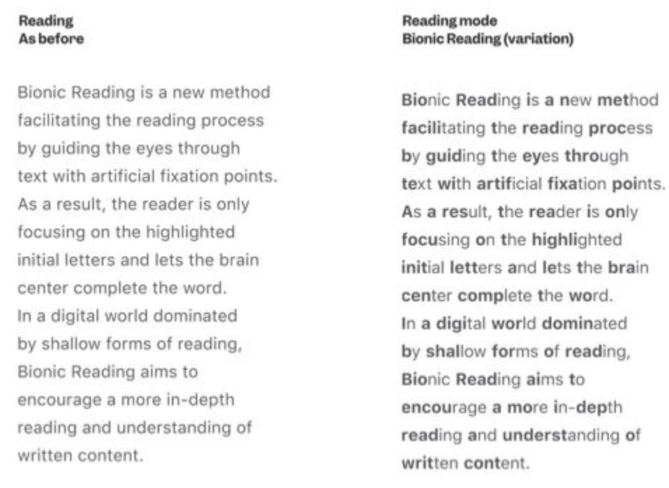

# Speed Reading

---

Read to Lead

There is only one way to read, which is to browse in libraries and bookshops, picking up books that attract you, reading only those, dropping them when they bore you, skipping the parts that drag -- and never, never reading anything because you feel you ought, or because it is part of a trend or a movement. Remember that the book which bores you when you are twenty or thirty will open doors for you when you are forty or fifty-and vise versa. Don't read a book out of its right time for you.

Current reading speed (Blinkist) - 219 WPM

1. Saccades - Movement of the eye from one word to another (takes about 30 ms)

2. Fixation -

Eyes region -

1. Foveal (spans around 2 visual degrees right in the center of retina)

2. Parafoveal (5 degree at either side of fixation)

3. Peripheral

3. Congnitive Processing

Remove subvocalization (auditory reassurance)

1. Rapid Visual Serial Presentation (RSVP) (Does not work, doesn't look regression)

2. Stroop's test - where color and written name of color doesn't match

1. Use a pacer (pen, or finger)

## Tips

1. Humming

2. Chewing gum

3. Counting silently from 1 to 10 repeatedly

4. Pressing tip of the tongue on top of your mouth

## 5 obstacles to reading

1. Lack of Education

2. Lack of Focus

3. **Subvocalization**

4. **Regression**

5. **Fixations**

## Book - Breakthrough Rapid Reading

1. Use a visual pacer - finger
    - Eliminate **regressions**

2. Drilling
    - Reading same paragraph again and again with less and less time reducing the time it needs to read the same passage.

3. Better comprehension

"You could try to pound your head against the wall and think of original ideas or you can cheat by reading them in books."

## Bionic Reading

[Read To Become A Better Investor | ET Money](https://youtu.be/_Y1Bn_OWCOA)

Post it notes - visual cue and target

## Apps

- Reader pro
