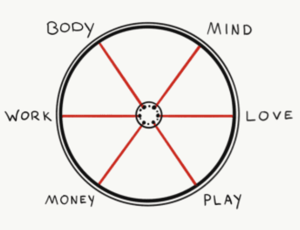
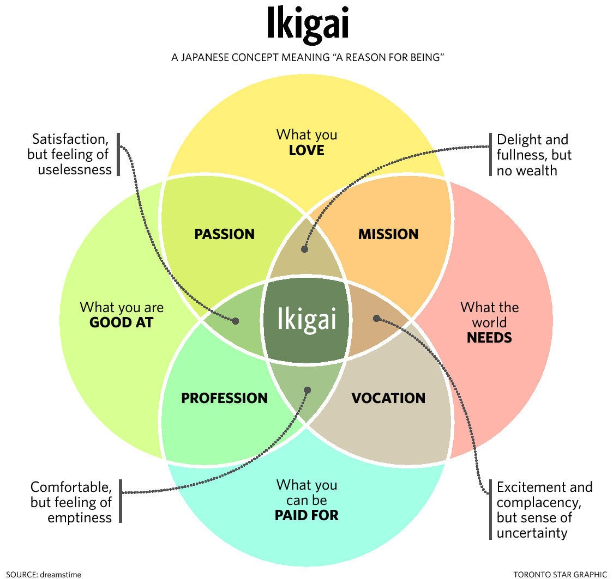

# Life / Relationship / People

Created: 2018-07-13 21:47:55 +0500

Modified: 2022-10-02 22:21:39 +0500

---

When working with people, assume good intentions.

When listening to people, interpret their words in a generous way.

You will occasionally get burned and mistreated by always assuming the best in others, but it is a far better way to live than the opposite

Never tell people that they are moron

**Ernest Hemingway**

Before you talk, listen.

Before you react, think.

Before you spend, earn.

Before you criticise, wait.

Before you pray, forgive.

Before you quit, try.

[Building a Life - Howard H. Stevenson](https://youtu.be/wLn28DrSF68)
-   What makes you happy
-   What you want to achieve

**Relationship Quotes**

Marrying well makes everything easier.

It's okay to dislike someone, or even dislike someone for no reason. But it's not okay to disrespect, degrade, and humiliate that person

Find a partner who is ready to build with you.

It is not about finding perfection in another person, it is about realizing when you come across an undeniable connection that nourishes your being and matches the type of support you are looking for. Getting lost in the idea of perfection is a hindrance. Being with someone who is committed to going through the ups and downs of life together is truly priceless.

When two people embrace their imperfections and commit to growing into better versions of themselves, it will naturally enhance the happiness they share in the relationship.

Double down on your best relationship.

It's the investment with the highest return.

it's easier to destroy a relationship than build one.

The secret to feeling great about yourself is not to be found in searching for people who are less than you and then show yourself superior to them, but in searching for people who are more than you and then show yourself worthy of their company.

1.  **Body:**The condition of your body, including your diet, stamina, strength, and recovery.

2.  **Mind:**[Your ability to focus](http://email.c.kajabimail.net/c/eJwdjstuwyAURL_GbCoQl5fDgkWqJlLX_YAIw3VCYkOEcdT-fWml2cxopHOi0zrGiSQnuODcCgDFreQMmOLHk7Yn825Go_o6KB7Yw9_9lFafFpaxkZvjQhmp7AzChzjJcNDj7HXQdoSDVRLI4m6tPbdBHgdx7om-pn2bSy37Nwtl7dNcwr7RCVvDSlef_RWp7yW3VDLNpdGWVuxHgn_kS8QlvbD-XFJ0FEajFVjgilQXEZ_-sZUSDdgufP037RTS3Fdq-Pb5MQiplda_n4hMdg), rest, and acquire knowledge.

3.  **Love:**Your relationship with family, friends, kids, and intimate partner.

4.  **Work:**How much inner satisfaction and financial rewards you receive from your career.

5.  **Money:**What you do with the money youhave.

6.  **Play:**How well you're able to entertain yourself.

<https://dariusforoux.com/six-spokes-theory

**Date nights (Questions to wife) - Blinkist - Eight Dates by John Gottman**

1.  Trust and commitment

2.  Addressing conflict

3.  Sex and intimacy

4.  Money and savings

5.  Family and children

6.  Play and adventure

7.  Goals and Sprituality

8.  Dreams (sacrificing, shared dreams)

9.  Actionable Advice - Be present and attentive when talking to your partner

Don't tell your whole life on the 1st date night

"A good marriage is one in which each spouse secretly thinks he or she got the better deal, and this is true also of our friendships."

What most people call love today is little more than a mutual benefit scheme. Love is an unconditional sweetness of emotion. -- Sadhguru

What you need to make your marriage successful is not the perfect person. What you need is absolute integrity. -- Sadhguru

The idea of marriage is to multiply the joy. Multiplying misery is a crime against Humanity. -- Sadhguru

If one spouse commutes longer than 45 minutes, that couple is 40% more likely to get divorced

There is really no such thing as conditional love and unconditional love -- there are conditions, and there is love. -- Sadhguru

Love is not a noun, but a verb. It's a thing you do.

Always give value before you ask for value.

Not taking things personally is a superpower.

EntrepreneurCindy Gallopon how to build a successful business:

"There is a formula for success in business, and it goes like this: You set out to find the very best talent in the marketplace, and then give them a compelling and inspirational vision of what you want them to achieve for you and the company. Then you empower them to achieve those goals using their own skills and talents in any way they choose. If, at the same time, you demonstrate how enormously you value them, not just through compensation, but also verbally, every single day, and if you enable that talent to share in the profit that they help create for you, you'll be successful. It's so simple, and virtually nobody does it, because it requires a high-trust working environment, and most business environments are low-trust. In order to own the future of your business, you have to design it around trust."

The less rigid your personality, the more powerful your presence. -- Sadhguru

Having expectations of others means you are trying to fix their lives. Fix your own life -- that is freedom. -- Sadhguru

Love is not about somebody. Love is not some kind of act. Love is the way you are.

I want to live in a world where friends feel **ok** to drop by each other's home unannounced

**Facts**

15 percent of pregnancies end in miscarriage

**7 secrets to a healthy relationship**

1.  Appreciate your partner's efforts

If you want your relationship to work, constantly remind yourself that the other is more significant than you.

2.  Learn to respect personal space

3.  Express your emotions

4.  Discuss your concerns

5.  Trust your partner

6.  Share your passions

7.  Avoid blame game

**Gottman Ratio - 5 to 1 (can be used for habits also, for every one slip, do right 5/4 times)**

This means that for every one negative feeling or interaction between partners, there must be five positive feelings or interactions. Stable and happy couples share more positive feelings and actions than negative ones. Unhappy couples tend to have more negative feelings and actions than positive ones. Partners who criticize each other, provide constant negative feedback, aren't supportive of each other, don't demonstrate affection or appreciation, or behave uninterested in their partner are in relationships that are out of balance.

**The 5 love languages**

1.  Positive, uplifting words of affirmation

    a.  Praise is the sweetest of all sounds

    b.  Verbal compliments

        i.  appreciate their sense of humor

        ii. look great in a new outfit

        iii. praise their ability to care for your children

2.  Spend quality time with your partner

3.  Gifts are visual symbols of love and surprising your partner with regular presents, regardless of their monteary value, is a great way to show affection

4.  Doing useful things for your partner is a common way to express love

5.  Physical touch is a powerful way to show your love

6.  Greatest gift - Helping your partner through hard times (simply standing by your partner during rough periods)

**How to be an adult in relationships by David Richo**
-   The emotional support we seek when we're young can be broken down into what the author callsthe five A's. They are attention, acceptance, appreciation, affection, and allowing others to be who they are.
    -   First up,attention. In relationships, being attentive to our partners means listening to their thoughts and emotions. Often, this involves being what the author calls a "mindful witness." Our loved ones may have suffered abuse, betrayals, or hurts in the past and, as their partners, it's our job to listen to their stories respectfully.
    -   Second, there isacceptance-- of ourselves and others. Mutual acceptance is the bedrock of a healthy relationship. When we find someone who loves us -- with all our feelings and emotional burdens -- we feel liberated. We don't have to hide behind a mask because our partner loves us for all that we are.
    -   The third thing isappreciation.This involves valuing our partners' gifts, knowing and understanding their limitations, and supporting them in the pursuit of their dreams and desires.
    -   Affection is the fourthAon the list. It involves holding and touching our partners in respectful ways. Receiving affection in the form of kisses, hugs, or even a gentle smile across a room helps us feel loved and wanted. It meets our childlike need to feel safe and secure.
    -   The fifth and finalAisallowinglife and love to be just what they are -- with all their sorrow, ecstasy, and heartache -- without trying to take control. This is what it takes to bepresentin a relationship: to love and to be loved.
-   Working through our issues involves paying attention and letting go.
-   mindfulness -- an ancient Buddhist practice that brings our attention to what is happening in the present. Through mindfulness techniques, clients learn to notice the thoughts or feelings that arise within them -- but, instead of holding on to them, they learn to let them go.
-   To begin, sit in a quiet space with your eyes open or closed, your back straight, and your hands placed in your lap. Pay attention to your breath. When thoughts or anxieties enter your mind, notice them, label them as "thoughts," and then return to your breathing. Of course, this takes practice. Eventually, your breath will drown out any distracting thoughts in the back of your mind.
-   **This is how we can think of relationships, too: they start out with romance, they progress into conflict, and then repose in commitment. And these cycles can repeat themselves again and again.**
    -   Romance > Conflict > Compromise
    -   In a committed relationship, couples are able to give and receive thefive A's. They let go of their desire to be right in arguments, and instead search for compromise. They may still fight, but they do not stop loving each other.
    -   "The rose of relationship grows petals in romance, thorns in conflict, and roots in commitment."
-   Admit,Allow, andAct As If.
    -   First, you have to admit your fears to yourself and others. This involves naming your fears without blaming anyone. For example, you could say to your partner,"I am scared to get close to you because . . . ," or"my fear of betrayal comes from . . . ."
    -   Then, you have to allowyourself to feel your fears, without judging them. This aligns with our practice of mindfulness: we allow our feelings to emerge, we recognize them for what they are, and then we let them go.
    -   Next up, act as if you have no fear. For example, if you fear abandonment, try to get comfortable being away from your partner for one minute more each day. And, if you fear engulfment, try to stay away from your partner for one minute less.
-   Loving one person teaches us how to love the rest of the world.

**Friendship**

![Does This Friendship Make Sense Graph The And a sample distribution of where a typical person's friends might fall HIGH FRIENDSHIP ENJOYABILITY - Comfortable and natural _ Fun - Stimulating - Laughy - Passes the 'Traffic Test' LOW FRIENDSHIP ENJOYABILITY - Awkward and forced - Fake - Boring - Feels like a chore - Sustaining force: inertia or obligation O o O Q3: Enjoyable but Not Healthy PROBLEMATIC Q4: Not Healthy, Not Enjoyable COME ON QI : Healthy and Enjoyable IDEAL Q2: Healthy but Not Enjoyable PROBLEMATIC How Healthy the Friendship is LOW FRIENDSHIP HEALTH - Negative vibe - Disdain - Envy - Lust is part of the equation - Unrequited love is involved - Lopsided power dynamic - Secretly rooting against each other - More enemy than friend - Generally toxic HIGH FRIENDSHIP HEALTH - Love is the core emotion - Positive vibe - Lots of trust - Equal power dynamic - Equal priority - Supportive - Genuinely rooting for each other ](media/Life---Relationship---People-image2.jpeg)

**Tips**
-   Always make the first move
-   In marriages, there are divergent expectations. The woman expects the man to change. The man expects the woman to never change.
-   Early concepts of intimacy: Young humans use saliva sharing to infer close relationships - <https://www.science.org/doi/10.1126/science.abh1054>

**Party / Host / Hosting / Ceremony / Anchor / Commentator**

MC is short for **Master of Ceremonies** and may often be written as **emcee**. An MC can be an important part of a birthday party, acting as a host to allow the birthday boy or girl to enjoy the party along with guests. Although the party atmosphere will provide a good time, the MC ideally remains focused on the multifaceted responsibilities the job demands.
-   Annoucements
-   Music selection
-   Setting the tone
-   Setting the place

<https://pdfslide.net/documents/emcee-academic-debate-script.html>

<https://www.ehow.com/info_8146690_mcs-duties-birthday-party.html>

<https://www.ehow.com/info_8201232_duties-emcee.html>

1.  **Arrive to the party venue well before the guests** so you can become familiar with the sound system and test the microphone. Showing up early will also allow you to see how the party site is set up, so you know where to make eye contact to keep the audience engaged.

2.  **Look at the program for your manager's farewell party**. As the MC, you'll need to know how to introduce each speaker that will present an award or kind word to the **guest of honor.** If you have a small speech prepared, becoming familiar with the program will give you an idea of when you should present it. If necessary, jot down a few notes on the program that will help you with guest introductions, such as "worked with guest of honor the longest" or "closest professional friend."

3.  Take your place on the stage or podium before guests arrive so you can welcome all the party goers.

4.  **State the reason for the gathering,** and lead the guests in showing your manager a round of applause as she's ushered into the room or seated at the main table.

5.  **Introduce each individual** before he gets up to share a short speech or poem at the celebration, using your notes as guidelines. Encourage the crowd to give every presenter a round of applause as he walks to the front of the room.

6.  **Conclude the speaking portion** of the farewell party by sharing a fond memory you have of your manager, and calling her up to the front so you can present her with a gift from you and the rest of your colleagues, like a plaque or large bouquet of flowers.

7.  **Thank everyone for coming** to the farewell celebration and prompt everyone to continue socializing or dining or cordially dismiss them from the party venue, depending on how the program is scheduled.

**Techniques for preparing for stressed events beforehand**
-   Prospective Hindsight
-   Pre-mortem

**Pregnancy / Birth Plan**

<https://www.youtube.com/watch?v=F_ssj7-8rYg>

<https://www.parents.com/pregnancy/giving-birth/labor-and-delivery/checklist-how-to-write-a-birth-plan

Pregnency daily time lapseNeha pregnency daily time lapse

**Parenting / children**
-   **Homeschooling / Home School / Homeschool**
    -   Khan academy
    -   <https://primer.com
-   **Thoughts**
    -   **I want to raise my children in UK or US (good child care programs, that develops childs brain)**
    -   Or parents live with me
    -   1st 3 years of the child's brain development is most important
    -   Never ever fight before the children
    -   How to develop curiosity in a child (thirst and passion of knowledge)
        -   Hard working
        -   Balanced life
-   Have child early, so that phase is complete and then you can focus on ageing parents (so they both don't coincide)
-   Children do not cry if they fall down if no one is around, they will standup and find their parents, and seeing their parents, they will start crying
-   Have 3 serial marriages over the lifetime (Youthful passion, Parenthood, Companionship, and all 3 can be the same too) - there are 3 different demands
-   **Pre-Marital Genetic Counselling (for rare diseases defect)**
-   Minimilism Tricks on Kids - Tell kids that they can have all the toys they want until they can be stored in a cupboard. So they have to make choices, of what they want to buy or what they want to keep. Like they can have all the arts and crafts until they fit in a box.
-   Acknowledge their emotions - tell them that their emotions are valid
-   There are no bad children, only bad influences -- Sadhguru
-   Record their voice and let them hear it
-   If you have children, first of all, you have to establish integrity. Your words and your actions should match. -- Sadhguru
-   Don't be a Helicoptor Parent
-   Eat candy and sweets only on Saturday
    -   [Lördagsgodis: Sweden's delicious Saturday tradition that prevents decay - BBC Reel](https://youtu.be/BQCbJOwA51k)
-   [Japan's ancient secret to better cognitive memory - BBC REEL](https://youtu.be/s6OmqXCsYt8)

[How touch can make or break your relationship - BBC REEL](https://youtu.be/FN7Buz0CMfI)

Attachment theory

1.  Securely attached (good parenting)

2.  Anxious (inconsistent parenting)

3.  Avoidant

**Things that shouldn't be teached to children**
-   Religion
-   Astrology
-   No superstiotious beliefs (like spirits and all)
-   No god (only power)
-   No racism

**Books**
-   The Conscious Parent by Dr. Shefali Tsabary
-   Youtube - Seeker baby

**Schooling**

Schooling isn't just about education, it is also a form a childcare

**13 Things Mentally Strong Parents Don't Do**
-   Promote responsibility and perseverance over a victim mentality
-   Don't parent with a strategy of avoidance. Instead, teach you kids healthy ways to deal with guilt and fear
-   Set strong boundaries so your child doesn't think the world revolves around her or that she holds power over you
-   Don't expect perfection or intervene every time your child makes a mistake
    -   Try to resolve his own conflicts in the playground
-   Mentally strong parents don't shelter their child from pain
-   Don't prevent your children from experiencing the whole spectrum of human emotions
    -   Let them have boredom, sadness
-   Mentally strong parents understand the difference between discipline and punishment
-   Mentally strong parents make sure their actions match their values
-   Actionable advice
    -   Teach children how to **change the channel**
        -   Think about white bears for 30 sec
        -   Don't think about white bears for 30 sec (fail)
        -   Do engaging task (sorting a deck of cards) for 30 sec
        -   He would not have thought of white bear
        -   Changing your behavior can change his thoughts

[Molly Wright: How every child can thrive by five | TED](https://www.youtube.com/watch?v=aISXCw0Pi94&ab_channel=TED)

[Why School Is Bad For You](https://www.youtube.com/watch?v=M4u6oOQ77mg)

[Some Parents Live Out Dreams Through Their Children. Sudha Murthy addressing parents.](https://youtu.be/wPX_iQP-4Rc)

[How to Raise Successful Kids -- Without Over-Parenting | Julie Lythcott-Haims | TED](https://www.youtube.com/watch?v=CyElHdaqkjo)
-   Checklist

**Boundaries**

You have a boundary issue if...
-   you feel like people take advantage of you or use your emotions for their own gain.
-   you feel like you're constantly having to "save" people close to you and fix their problems all the time.
-   you find yourself sucked into pointless fighting or debating regularly.
-   you find yourself more invested in a person than you should.
-   you tell people how much you hate drama but seem to always be stuck in the middle of it.
-   you spend a lot of time defending yourself for things you believe aren't your fault

<https://deepstash.com/article/3412/the-guide-to-strong-boundaries>

**The Courage to be Happy by Ichiro Kishimi**
-   The purpose of education is to teach self-reliance
-   Respect is seeing another person for who they are
    -   Give children respect, so they respect you
-   Don't scold problem behavior... but don't praise good behavior, either
    -   Don't praise children for good behavior
        -   They need to do that behavior
    -   Don't scold them for bad behavior which they don't know is bad
    -   Children are attention seeking, so they will do same things again and again to get attention
        -   Ex - Manuj throws tantrum so he get the family's attention, Family gives attention to him and it's a vicious cycle
-   Praise inhibits growth and encourages unhealthy competition
    -   Giving praise says, "I respect you when you act in one way, but not in other ways."
    -   In marathon, surrounded by other runners, you feel no rivalry towards others. That's what competition without rivalry looks like
-   Your friendship is the most powerful lesson you can give your students
-   Birth order influences children's behavior... and adults' too
    -   equal relationships with each children
-   Love supports the transition from dependence to self-reliance
-   Actionable advice: Don't dole out praise, cultivate empathy
    -   Don't say, "You are kind for sharing", instead say,
    -   When you shared your toy with Neha, you made her feel very happy

Trust does not mean that others have to do things the way you expect them to. Trust means to become vulnerable.

Trust involves vulnerability, which involves risk. So **Dispositional Trust,** is tied to an idea called **Risk Aversion**, or how much you avoid risks.

"Friends are better than money. Almost anything money can do, friends can do better. In so many ways a friend with a boat is better than owning a boat."

Cognitive trust can be earned by Competence, Intent and Integrity.

<https://ideas.ted.com/there-are-three-sides-to-every-argument

**Types of people**

1.  Maker

2.  Scientist

3.  Maven (learning/knowledge acquisition)

4.  Essentialist (organizer)

5.  Performer

6.  Warrior

7.  Teachers

8.  Advocate

9.  Advisor

10. Nurturer

**Talking**

F - Family

O - Occupation

R - Recreational

D - Dreams

First question must be directed towards the Heart.

Ex - What's the best moment you remember with your father

Start with I'm curious

Daily talk about (rose, thorn, bud excercise)
-   rose - best part of your day
-   thorn - worst part of your day
-   bud - something in your day that gave you hope

**Meaning of life**
-   Belonging
-   Purpose
-   Transcendence
-   Story Telling - How you tell story about yourself, Change your story to change your life

**HEAR (Halt, Empathy, Anticipate, Review)**

**Pleasure**

Extrinsic Pleasure (do work that leads to pleasure)

Intrinsic Pleasure (happiness while doing that work)

Abstain from short term pleasure
-   Meditation
-   Deep Work
-   Not To Do List

**Transcendental Meditation**

Transcendental Meditation(TM) refers to a specific form of silent,[mantra](https://en.wikipedia.org/wiki/Mantra)[meditation](https://en.wikipedia.org/wiki/Meditation)and to the organizations that constitute the[Transcendental Meditation movement](https://en.wikipedia.org/wiki/Transcendental_Meditation_movement).[Maharishi Mahesh Yogi](https://en.wikipedia.org/wiki/Maharishi_Mahesh_Yogi)created and introduced the TM technique and TM movement in[India](https://en.wikipedia.org/wiki/India)in the mid-1950s.

The TM technique involves the use of a silently-used sound called a mantra, and is practiced for 15--20 minutes twice per day. It is taught by certified teachers through a standard course of instruction, which costs a fee that varies by country. According to the Transcendental Meditation movement, it is a non-religious method for relaxation,[stress](https://en.wikipedia.org/wiki/Stress_(biology))reduction, and self-development. The technique has been seen as both religiousand non-religious;[sociologists](https://en.wikipedia.org/wiki/Sociologist), scholars, and a[New Jersey](https://en.wikipedia.org/wiki/New_Jersey)judge and court are among those who have expressed views on it being religious or non-religious.The United States Court of Appeals upheld the federal ruling that TM was essentially "religious in nature" and therefore could not be taught in public schools.

High-quality studies that demonstrate positive health outcomes that can be attributed to the specific practice of TM as compared to other forms of stress reduction do not exist.

<https://en.wikipedia.org/wiki/Transcendental_Meditation>

**Healthy social interactions**

1.  Tolerating frustration

2.  Flexibility

3.  Problem solving abilities

4.  Empathy

5.  Engaged observation

**Implicit Association Test (IAT)**

The**implicit-association test(IAT)** is a[measure](https://en.wikipedia.org/wiki/Measurement)within[social psychology](https://en.wikipedia.org/wiki/Social_psychology)designed to detect the strength of a person's subconscious association between mental representations of objects ([concepts](https://en.wikipedia.org/wiki/Concept)) in [memory](https://en.wikipedia.org/wiki/Memory). It is commonly applied to assess[implicit stereotypes](https://en.wikipedia.org/wiki/Implicit_stereotype)held by test subjects, such as unconsciously associating stereotypically black names with words consistent with black stereotypes. The test's format is highly versatile, and has been used to investigate biases in racial groups, gender, sexuality, age, and religion, as well as assessing self-esteem.

The IAT was introduced in the scientific literature in 1998 by[Anthony Greenwald](https://en.wikipedia.org/wiki/Anthony_Greenwald), Debbie McGhee, and Jordan Schwartz.The IAT is now widely used in social psychology research and, to some extent, in[clinical](https://en.wikipedia.org/wiki/Clinical_psychology),[cognitive](https://en.wikipedia.org/wiki/Cognitive_psychology), and[developmental psychology](https://en.wikipedia.org/wiki/Developmental_psychology)research. The IAT is the subject of much controversy regarding validity, reliability, and whether test results are an accurate representation of[implicit bias](https://en.wikipedia.org/wiki/Implicit_bias).

<https://en.wikipedia.org/wiki/Implicit-association_test>

**Ethnography - Study of people and culture**

in-depth observation of how people behave and interact with their surroundings

**Worst idea of psychology - Mind is a blank slated birth**

Developmental psychology has shown that kids come into the world, already knowing so much about the physical and social world and programmed in such a way as to make it easy to learn certain things and hard to learn others

**Inateness**

1.  **Harm/care**

2.  **Fairness/reciprocity**

3.  **Ingroup/loyalty**

4.  **Authority/respect**

5.  **Purity/sanctity**

6.  

<https://www.youtube.com/watch?v=8SOQduoLgRw>

**Blinkist - Didn't see it coming by Carey Nieuwhof**

Overcoming the 7 greatest challenges that no one expects and everyone experiences

1.  Cynicism

[Jamil Zaki: How to escape the cynicism trap | TED](https://youtu.be/ABHdTi1If0c)

2.  Compromise

3.  Disconnection

4.  Irrelevance

5.  Pride
    -   You are lucky to be what you are
    -   Humility

6.  Burnout

<https://www.lennysnewsletter.com/p/how-to-know-when-to-stop>

7.  Emptiness

**Blinkist - Life Is in the Transitions, Mastering Change at Any Age By Bruce Feiler**
-   What shape has your life story taken?
-   Lifequakes shake the foundations of our existence.
-   Disruptorsaffect every area of our lives
-   Lifequakes force us to reevaluate what makes our lives meaningful.
-   Lifequakes are by their nature disorientating, and even scary. But they also present opportunities to reevaluate our lives and what makes them meaningful.
-   We can't always control disruptive events, but we do control our response to them.
    -   ABC stands for autonomy, belonging, and cause
-   Rituals help us to say goodbye to the lives we're leaving behind.
    -   We can turn destructive events into meaningful transitions, but this requires practice. Luckily, several key tools can help us become masters at dealing with transitions.
    -   The first tool we need to master is acceptance
    -   A very normal reaction to experiencing a lifequake is denial and resistance.
    -   Acceptance can strike in a sudden epiphany, or a series of slow realizations.
-   All major transitions involve a messy middle, where we feel very lost.
-   Our creativity can help us to create a new chapter in a transition.
    -   Every major religious narrative and fairy tale recognizes the value of being lost. Jesus was cast into the desert before he had a major epiphany, and Mohamed gained his wisdom on a mountaintop. The most formative experience of Red Riding Hood's life would never have been possible if she hadn't wandered into that forest.
-   We need to create new life stories that integrate our transitions.
-   Actionable advice: Pay attention to small wins.

**Blinkist - Power Relationships by Andrew Sobel and Jerold Panas (23 May 2019)**

26 irrefutable laws for building extraordinary relationships
-   Power relationships come from great conversations and being unafraid to ask
-   Build a small network of people you like and trust before you need it, including people dissimilar to you
    -   12 - 15 apostles
-   Strengthen your relationships by believing in people, and helping them accomplish their agendas
-   Serious relationships demand a strong foundation, integrity and empathy
    -   Each time you refuse to compromise your integrity, it gets stronger and more resilient
-   Giving trust and changing environments can deepen relationships
-   Focus on the right questions rather than having all the answers, and remember that awkward beginnings can be overcome
-   Earn new clients by treating them like current clients, and keep clients by contributing to their profit and growth
-   Keep people curious in order to remain attractive, but remember to be vulnerable and enthusiastic
-   Remember to give truth, love and praise to show people that you value them, and to help them grow
    -   Every act of generosity creates a ripple
-   **Actionable advice - Create a list of those you want in your network**

**Ikigai**

**ikigaiis seen as the convergence of four primary elements**
-   What you love (your passion)
-   What the world needs (your mission)
-   What you are good at (your vocation)
-   What you can get paid for (your profession)

**10 Rules**

1.  Stay active and don't retire

2.  Leave urgency behind and adopt a slower pace of life

3.  Only eat until you are 80 per cent full

4.  Surround yourself with good friends

5.  Get in shape through daily, gentle exercise

6.  Smile and acknowledge people around you

7.  Reconnect with nature

8.  Give thanks to anything that brightens our day and makes us feel alive

9.  Live in the moment

10. Follow your ikigai

<https://medium.com/thrive-global/ikigai-the-japanese-secret-to-a-long-and-happy-life-might-just-help-you-live-a-more-fulfilling-9871d01992b7>

<https://www.sloww.co/ikigai-book

**Find Your Element by Ken Robinson**
-   Expose yourself to as many new opportunities as possible to discover your unrealized aptitudes.
-   Strive to have a growth mindset. It will allow you to develop and improve your abilities.
-   Find your passions, things you do without noticing the passage of time.
-   Forge your own path, along with an understanding of your happiness, instead of blindly seeking wealth, immediate gratification, or other people's definitions of happiness.
-   Don't plan your life when you're young because life is unpredictable.
-   Don't assume you are bad at something because you performed poorly in that subject in school. Standardized tests only measure one kind of human intelligence and schools only cater to a few learning styles.
-   Every person is special and different because of their genetic makeup (every human who ever existed in history has their own genes) and their environment (everyone has their unique mix of family, friends, and location).
-   If you accept you can't predict or control the future, you will discover many new opportunities.
-   Experiencing positive emotions from your passion reduces stress, chronic pain, and addictions. It also improves sleep and concentration.
-   Finding a group of people who share your passion can be very beneficial, or even necessary, for both you and other members of the group to realize personal goals.

**Old Age**

People have positive attitude towards ageing live 7.2 years longer than people who don't

<https://www.youtube.com/watch?v=o7w5r5PfBKo>

**Weak link vs Strong link**
-   Basketball - strong link
-   Football - weak link
-   Programming - strong link
-   Investment group - strong link
-   Donation to Schools should be weak lint

<https://www.youtube.com/watch?v=UAqZMgBtECQ>

**Programmers Burnout**

<https://medium.com/hackernoon/why-theres-so-much-burnout-in-software-and-what-to-do-about-it-4ef0297ca7cc>

**Blinkist - The Burnout Fix**

1.  Working harder or smarter isn't enough to survive the pressures of the modern workplace.

2.  Dramatic success is created through gradual, sustainable growth.

3.  Mindfulness reduces stress and the risk of burnout.

4.  Make time for silence, sanctuary, and solitude in your daily life.

5.  Successful people seek out support and connection.

6.  Creating a personal mission statement will allow you to stay on track.

7.  We need to regulate our energy levels and emotions.
    -   Instead of tracking time, track your energy.
    -   Energy is our most precious resource - the thing that fuels our days and gives us vitality
    -   Energy Audit - Energy Vampires - they deplete your ideas and motivation, or just require enormous amounts of patience and attention
    -   Develop your emotional literacy and learn to interpret the messages your feelings are sending. you

8.  Leaders have a big role to play in creating workplaces where employees can thrive.

9.  Actional advice: Make a "Not TODO" list

**7 reasons smart, hardworking people don't become successful**

1.  Meet same people, ideas are recycled. Solution is to meet new people

2.  Aversion to change. Solution - be open and curious

3.  Rely on credentials. Solution - Strategic thinking

4.  Not willing to take risks

5.  You can't commit to decisions

6.  Constantly go after exiting things and leave things mid way, Shiny object syndrome

7.  You don't believe in yourself

**Blinkist - How should we live? by Roman Krznaric**
-   Love
    -   **Eros**, the fiery, passionate yet dangerous love
    -   **Philia**, the platonic love between friends and comrades
    -   **Ludus**, the playfulness that is found among new lovers and children
    -   **Pragma**, the deep understanding that grows over time between partners
    -   **Agape**, the selfless, charitable love for our fellow humans
    -   **Philautia**, the love of the self, which could be either a positive acceptance or a detrimental self-obsession

Rather than relying on one partner to satisfy all these needs, the ancient Greeks believed that each role could be fullfilled by different individuals.
-   Husband means House Bound
-   Talk on dinner table about emotions
-   Monotonous work
-   Pin factory method for dividing work
-   Obsession with time
-   Consumerism
-   Travel is a great way to learn about yourself, and broaden our world view
-   Can take a trip near and don't waste fuel going to carribean

**Blinkist - Solve for Happy - Engineer your path to joy by Mo Gawdat (26 June 2018)**
-   Happiness is the absence of unhappiness, caused by the misrepresentation and misunderstanding of reality
    -   Your happiness is equal to or greater than your perception of events minus your expectations of life
-   You are not the voice in your head, but the observer of your life
-   It's important to understand that you really know nothing, and that time is, in fact, a human invention
-   You don't actually have much control over your life, and your fears are often unfounded
-   Our brains tend to see the negative side of things, applying too many filters, assumptions and predictions
-   We tend to elaborate our memories, apply too many labels, succumb to our emotions and exaggerate things
-   Modern life is overly concerned with action and speed, but a calm awareness of the present moment will keep you happy
-   Things are and always will be changing, so relinquish your sense of control and go with the flow
-   Unconditional love is the most important emotion, as it has no expctations, and therefore no disappointments
-   Death is a fundamental part of existence. Acceptance rather than fear will allow you to properly embrace life
-   In the absence of proof and the surprisingly overwhelming odds, perhaps there is a design to the Universe

**Blinkist - Social Intelligence by Daniel Goleman (27 Nov 2018)**

The new science of human relationships
-   empathic accuracy - the capacity to understand yourself and others in social contexts, It allows you to put yourself in someone else's shoes. It's not only about understanding what they're feeling but why they feel that way
-   Many people have trouble paying attention to others and this changes from culture to culture.
-   Japanese culture - amae - to describe kind of intuitive understanding of others' needs and feelings, like a guest's hunger without asking
-   Social predisposition - the way in which a person interact with the world
-   A social studies on money suggests that humans are likely to be more adventurous if they've been exposed to reasonable doses of fear at a young age
-   Poor social inteligence is linked to sexual violence and testosterone is a risk factor in this equation
-   Social interaction can boost recovery and health, which is why we should tackle stigmas around illness
-   Social intelligence can help children with learning difficulties thrive in school
-   Don't be afraid to say or show you are sorry

**Blinkist - The Book of Joy by Dalai Lama and Desmond Tutu (24 Dec 2018)**

Lasting Happiness in a changing world
-   Wherever you have friends that's your country, and wherever you receive love, that's your home.
-   Developing perspective and humility can bring you closer to true joy.
-   Eight pillars of joy

    1.  Perspective - given moment won't last forever, therefore focus on the present and bring joy and hope into your life

    2.  Humility - if you feel that you're better than others, you'll never be able to find joy

    3.  Humor - nothing alleviates a stressful situation better than a good joke

    4.  Acceptance - you'll never find joy if you can't accept that life has its hard moments, most of which you have no control over

    5.  Gratitude - take nothing for granted, to be thankful for everything you have and all you have experienced

    6.  Forgiveness

    7.  Compassionate - reciprocal altruism, a feeling of joy experienced when helping others

    8.  Spending time on other' happiness

**Blinkist - Essentialism by Greg McKeown**
-   How to do better by doing less
-   We should be focusing on what we should do, thinking instead about what is essential to our happiness and well-being
-   4 main points
    -   Do less, but do it better
    -   Reject the notion that we should accomplish everything
    -   Constantly question yourself and update plans accordingly
    -   Changes are put in place
-   **Learned helplessness,** that is, becoming so used to the feeling of being overwhelmed that we approach our lives with passivity. (Dogs with electric shock and a lever with no effect choose to stay in shock zone, because they have learned helplessness)
    -   Opposite - [learned industriousness](https://www.scotthyoung.com/blog/2020/11/02/motivation/#07-05)
-   Take a few hours of blank time for thinking about yourself and always see the bigger picture on why you are doing what you do
-   Sleep and play are as important as work
-   Be ruthless in cutting away things that aren't essential
-   Say "no" to nonessential tasks and plan the essential ones carefully (How will i know when i have reached my goal)
-   Stop doing unncessary things by withdrawing from failure and setting boundaries (Admit errors and mistakes and let go)
-   Keeping on top of what's important requires that you eliminate what slows you down and elminate it.
-   Always take 50% of buffer time that you have expected a work to take
-   Building upon previous progress with small, incremental steps. Small wins create momentum, which gives you the confidence to further succeed.
-   Routine is very important to achieve long term goals

**Blinkist - An Autobiography by M.K. Gandhi (24 Apr 2019)**

The story of my experiments with truth
-   Born into the merchant caste in Porbandar, India, Gandhi was wed in a child marriage at age 13
-   As a teenager, Gandhi had a rebellious phase that was marked by jealousy and lust
-   Despite the disapproval of his caste, Gandhi went to England to study law
-   Seeking professional experience, Gandhi went to South Africa and saw the effects of racism firsthand
-   In addition to his legal work, Gandhi was commited to public service and studying religion
-   Before spreading his message of equality in India, Gandhi's southern African work continued in Natal
-   After helping the wounded in the Boer war, Gandhi stayed humble and informed in India
-   Gandhi was committed to both nonviolence and celibacy
-   Gandhi continued to fight for Indians in South Africa and launched a new form of nonviolent resistance
-   Upon the start of WWI, Gandhi returned to India, where he continued to fight injustice
-   Gandhi suspended satyagraha when it triggered violence, but his noncooperation resolution was ultimately passed

**Blinkist - How to live a good life by Massimo pigliucci**

**A guide to choosing your personal philosohy**
-   The ancient Eastern philosophy of Buddhism values ethics above all.
-   Confucianism is about relationships, while Daoism teaches us to act in harmony with the world
    -   Fundamental toConfucianism, according to the scholar Bryan Van Norden, is the fact that we cannot exist independently of others. After all, our parents are the only reason we exist. So, in order to live well, we must maintain our relationships.
    -   Daoismshares Confucianism's sense of interconnectedness, but it places emphasis onnature. It embraces things on their own terms and never lets emotions cloud thoughts. Some people think that Daoism is just about being with nature, but there's more to it than that. Our relationship with nature can represent the challenges we face in life.
    -   A contemporary example of a Daoist mindset is what Professor Robin R. Wang calls the "Realtor's mentality." A realtor might work for 30 clients at once knowing that only a couple will buy from him. Rather than getting frustrated by the low success rate, the realtor learns not to fixate on any one client and calmly accepts the reality of that situation.
-   Aristotelianism encourages us to flourish -- but acknowledges that external factors also play their part.
    -   AnAristotelianis someone who follows Aristotle's teachings from his famous work,Nicomachean Ethics.
    -   Think of a very talented tennis player -- someone who is good enough to count as one of the all-time greats. If she lives during a period when the competition is weak, she will never be able to prove her talent. That player simply won't have an opportunity to flourish.
    -   Unfortunately, we're not all equally capable of this -- just like that talented tennis player. Think of someone born into an unsupportive family, or someone whose life is ruined by a natural disaster. It's harder for these people to flourishthrough no fault of their own.
-   Stoicism focuses on indifference, while Epicureanism focuses on pleasure.
    -   ataraxia-- a state of tranquility -- so she will be able to cope calmly with misfortune.
    -   Stoics divide things outside their control into two categories:preferredanddispreferred indifferents. Think about wealth. Being rich is always going to be preferred, while being poor is dispreferred. But Stoicism says that your level of wealth doesn't affect how virtuous you are. A rich person may be either good or bad. So, wealth is "indifferent" and doesn't affect whether you're a good person.
    -   A Stoic's focus on indifference can also help with negative emotions. Say someone insults you. Rather than getting angry, think about the criticism. Is there any truth in it? If so, the insulter has done you a favor. If not,who cares? The person is wrong. Not that we should be emotionless. Stoicism does allow for positive emotions like joy and love.
    -   Epicureanismplaces more emphasis on feeling. In fact, it's based around the simple concept ofpleasure.
        -   We all naturally strive for pleasure. Even babies avoid pain and seek pleasure -- it's what philosopher and author Hiram Crespo calls thepleasure-aversion faculty. That doesn't mean unbridled hedonism, though -- not if we practicehedonic calculus. Hedonic calculus involves weighing whether something is likely to prove pleasurable in the longer term.
        -   So an epicure wouldn't simply drink all the beer in one evening. He would recognize that, after a certain number of beers, the overall experience -- hangover included -- wouldn't be pleasurable. Conversely, some major decisions like studying at a university might be painful at first, but pleasurable in the long run.
-   Hinduism and Progressive Islam both bring ancient ideas into a modern context.
    -   Progressive Islam rejects extremism, champions social and gender justice, and embraces the multiple faiths that make up the modern world.
-   "Ethical values like justice and fairness do not remain frozen in time." -- Adis Duderija
-   In both Judaism and Christianity, scripture provides an opportunity for reflection.
-   Ethical Culture and secular humanism are two philosophies that don't involve belief in God.
    -   Ethical Culture, which defines itself as a nontheistic religion. As its name suggests, it places a strong emphasis on ethics and the value of community. It emphasizes the importance of these traditional values by having a clergy, like many theistic religions.
    -   Secular humanism, on the other hand, is not a religion. It's a non-dogmatic philosophy that stresses the importance of independent thinking.
    -   Guided by reason, secular humanism offers a practical way to understand and improve the human condition. The emphasis on reason means that secular humanism respects science deeply.
-   Existentialism and pragmatism both reflect on the ways in which we are free.
    -   Did you choose to be born? No? Neither did anyone else.
    -   That's the starting point for existentialism, the twentieth-century philosophy of Jean-Paul Sartre and Simone de Beauvoir. Having been born, we are conscious and free to make our own choices. Hence, in Sartre's words, we are "condemned to be free."
    -   There's something contradictory about existentialism, as Skye C. Cleary acknowledges. Actually callingyourself an existentialist contradicts what it's really about. We shouldn't let ourselves be defined by any particular set of beliefs; instead, we should simply be authentic to ourselves. And as individuals, we're too complex to be summed up by a simple label anyway -- especially since we're all constantly changing.
    -   Sartre gave the example of a waiter who's good at his job. He comes to believe that being a waiter is what defines him. But no single role caneverdefine a person. We must acknowledge that things will change in the future, just like they did in the past.
-   Effective altruism is just one way we're still exploring philosophical questions today.
    -   Effective altruismtakes a simple approach. It asks its followers to examine how they canmaximizetheir positive impact on the world. In many cases, this is through donating as much as possible to charity. Or it might be through taking on jobs that do exceptional amounts of good.

**Blinkist - The Almanack of Naval Ravikant**
-   **A philosopher is someone who falls down a well while gazing up at the stars**
-   If you're unsure about a decision, then the answer is no
-   A good reputation is an invaluable asset
-   If you secretly despise wealth, it will elude you
    -   Money can't buy happiness or make all your problems disappear, but it will solve your money problems.
    -   Zero-sum game have its uses. Take Politics. If we didn't play it, we wouldn't be able to tell who was in charge of things. Fundamentally, though, it's no more than a necessary evil. That's why you should seek to avoid it in your life. Play it too often and you'll become an angry, combative, and resentful person dedicated to putting others down
    -   The money game is different. It's not zero-sum, it's **positive-sum**. You can win without someone else losing, or become wealthy without condemning someone else to poverty.
-   Money can give you freedom - unless you love it for its own sake
    -   Money fixes a lot of external problems. It removes obstacles that stop you from doing the things you really want to do.
    -   It you love money, there's never enough - it's a **bottomless pit**
-   Happiness is a choice to remain in the present moment
    -   Happiness is understood as the absence of judgements, which is associated with the absence of desire. The **fewer desires** you have, the greater your ability to accept the way things are right now. This brings inner calm.
    -   The more you **live in the present**, the happier you'll be
    -   Think of young children. On balance, they're pretty happy. Why? Easy! They're immersed in the moment rather than caught up in their own heads.
-   A quiet mind is a happy mind
    -   To sit **still** for 30 minutes is happiness. The reason this is so hard to achieve is that we're distracted by our desires
    -   Happiness we think, is "**out there**" in the external world
    -   **Monkey Mind -** Thoughts, the Buddha said, are like branches, and the conscious mind is like a monkey swinging from one branch to the next
    -   The answer to this problem is to train the monkey. Meditation - quieting the simian chatter that prevents us from being present
    -   Meditation comes in different forms. Hiking is Walking meditation, Journaling is Writing meditation, prayer is gratitude meditation. Even showering can be a kind of accidental meditation
-   Discovering what calms your mind and building good habits are keys to happiness
    -   Happiness isn't innate - it's a skill
    -   Try different things and find out what works for you
    -   If it works, use it; if it doesn't, look for something else
    -   Cutting down on alcohol, caffeine and sugar will keep your mood more stable. So will avoiding social media
    -   Regular exercise is a good habit for both your body and your mind
-   Actionable advice - Lean into short-term pain (ex - working out)

![WORTH READING TWICE What Is Education? At the end of World War Il. this letter was found in a Nazi concentration camp. It is addressed to Teachers. DeM Teachers. j am a survrvor of a camp, My eyes saw what no man should mtness: Gas chunbers twitt by learned children potsored by educated physicians. tnfalts killed by trained mjrses. Women and babies shot and tÄJtnt by High School and College Gra"tes. So. I am susp•ctous of edtratm. My request ts, Help your students become hwnan. Yout efforts must never Pf0duce leuned monsters, skdled Psychopaths, edtrated dl'tetates Reading wrrtjng. anthrnettc Me important only 'f they serve towards making our children moce turnane. ](media/Life---Relationship---People-image8.jpg)

**From Strength to Strength: Finding Success, Happiness and Deep Purpose in the Second Half of Life**

Of the 125 people in Marcellus, half a dozen or so people are over 40. After we read Arthur Brooks' book 'From Strength to Strength' (thanks to a gift from a client who has also become a friend), we understood why those of us over 40 contribute the majority of the pieces to Three Longs and Three Shorts. As Brooks explains in this tightly written book, for people like us in the Finance profession, the raw intellectual horsepower or our brain (which is called 'fluid intelligence') starts waning from the age of 40. Thankfully, however, a different type of intelligence starts improving from that age, namely, 'crystallised intelligence' i.e. the ability to absorb lots of different bits of information and influences and join the dots. Brooks uses this framework to give professionals in their 40s and 50s a framework for the second half of their careers.

As Jonathan Knee says in his review of this book:"According to From Strength to Strength...the basic problem is the inevitable decline in our abilities. The decline in peak performance begins far earlier than we are likely to admit across professions, not just in athletes. According to Brooks, "on average, the peak of creative careers occurs at about 20 years after career inception," so that professional decay is likely to commence between ages 35 and 50. Financial professionals peak between 36 and 40.

Like drug addiction, each subsequent hit of success yields a shorter period of satisfaction, necessitating greater feats of performance just as the capacity to produce them declines with age.

Strength to Strength reads like a companion volume to the cult classic from 1979, The Drama of the Gifted Child by Swiss psychoanalyst Alice Miller. Miller pointed out that talented children can become addicted to the positive feedback that their talents inspire, and may never develop an identity independent of the expectations of others."

So what is the solution to the mid-40s fade? How can those of us who are in the second half of our careers capitalise on our crystalised intelligence? Brooks' answer is that we should turn to teaching, writing and mentoring rather than trying to compete with younger people who are at their peak in terms of fluid intelligence.

However, this is not as easy as it sounds. Whilst several of us 40 plusers in Marcellus are writing, teaching and mentoring, we will be the first to admit that old habits are hard to shake off. Says Jim Clemmer:"Arthur devotes a chapter to "Kick Your Success Addiction" with powerful examples, research, and advice on dealing with workaholism and getting off the hedonic treadmill. "The buzz from success is neutralized quickly, leaving a hangover feeling.... after a while, you need constant success hits just not to feel like a failure...the carrot is gradually getting further away, despite the fact that you are running faster than ever. Thus, the dissatisfaction problem compounds the decline problem."

Arthur provides several steps to transitioning from fluid intelligence to the second curve of crystallized intelligence. This includes pondering our death --- what do we want our life to stand for, cultivating (real versus "deal") relationships, deepening our spirituality, making the weakness of our decline a strength to connecting with others, and filling the second half of our lives with opportunities rather than loss. He concludes with a chapter on Seven Words to Remember; "Use things. Love people. Worship the divine.""

Interestingly, Buddhist and Hindu philosophy plays a key role in the prescriptions that Arthur Brooks dispenses in this timely book (timely for those of us who are battling with the decline of our fluid intelligence and the rise of our crystallised intelligence).

**Thoughts about people**

Almost everyone in this world is idiot and have nothing to contribute, but never say this to them... Always say them okay and ignore instead of demeaning him/her, because they cannot handle it

Don't say bad to people whom you don't give money, only if they are dependent on you, and they are fearful you can say something

Otherwise show disappointment

**Financial Experts**

1.  Benjamin Graham

2.  Warren Buffett (concentrated portfolio)

[Warren Buffett's 7 Biggest Mistakes | ET Money](https://youtu.be/nV5pUb3eMjQ)

3.  Ray Dalio (diversified portfolio)

American billionaire investor and hedge fund manager, who has served as co-chief investment officer of the world's largest hedge fund, Bridgewater Associates

4.  Charlie Munger

5.  Joel Greenblatt

6.  Bill ackman

7.  Mohnish Pabrai

8.  Kalpen Parekh

**Role Model / Influential People / People to follow**
-   [Jamsetji TATA : STRATEGY of the GREATEST BUSINESS TYCOON of India](https://www.youtube.com/watch?v=OEB_UviHDq0)
-   Elon Musk - Tesla / SpaceX
-   Bill Gates - Microsoft
-   Paul Graham, the English-American computer programmer, is the legendary founder of the Y Combinator
-   Yuval Noah Harari

Israeli public intellectual, historian and a professor in the Department of History at the Hebrew University of Jerusalem. He is the author of the popular science bestsellers Sapiens: A Brief History of Humankind, Homo Deus: A Brief History of Tomorrow, and 21 Lessons for the 21st Century
-   [Is Gautam Adani Gifted Wealth ? India's Second Richest Man Story 🔥 Business Case Study #gautamadani](https://youtu.be/Z8yKfenzYRI)
    -   If you build great relationships, half of your work is already done before you tell i need you

-   [Netaji Subash Chandra Bose: What Schools don't teach you about India's Real Hero!](https://youtu.be/Wf6X-50OQdE)

**Ubuntu -** I am because you are

Ubuntu is an ancient African word meaning '**humanity to others**'. It is often described as reminding us that 'I am what I am because of who we all are'.

<https://en.wikipedia.org/wiki/Ubuntu_philosophy>

[Michael Burry: 5 Life Lessons That Made Him Rich (UCLA Speech)](https://www.youtube.com/watch?v=b53QBOu_Tos)
-   Be a hyper realist, don't try to assume the world as you want, but take it as it is
-   Question everything
-   Be skeptical for most authoritative sources too
-   Don't stop learning
-   Use information abundance as an advantage
    -   We are privileged to have so much information at our finger tips
-   Do no harm

**Parasocial Relationship**

Parasocial interaction(PSI) refers to a kind of[psychological relationship](https://en.wikipedia.org/wiki/Social_relation)experienced by an audience in their mediated encounters with performers in the[mass media](https://en.wikipedia.org/wiki/Mass_media), particularly on[television](https://en.wikipedia.org/wiki/Television)and on[online platforms](https://en.wikipedia.org/wiki/Internet#Social_impact).Viewers or listeners come to consider media personalities as friends, despite having no or limited interactions with them. PSI is described as an[illusionary](https://en.wikipedia.org/wiki/Illusion)[experience](https://en.wikipedia.org/wiki/Experience), such that media audiences interact with[personas](https://en.wikipedia.org/wiki/Persona)(e.g.,[talk show](https://en.wikipedia.org/wiki/Talk_show)hosts,[celebrities](https://en.wikipedia.org/wiki/Celebrities),[fictional characters](https://en.wikipedia.org/wiki/Fictional_character),[social media influencers](https://en.wikipedia.org/wiki/Influencer_marketing)) as if they are engaged in a[reciprocal relationship](https://en.wikipedia.org/wiki/Reciprocity_(social_psychology))with them. The term was coined by Donald Horton and[Richard Wohl](https://en.wikipedia.org/wiki/Richard_Wohl)in 1956.

<https://en.wikipedia.org/wiki/Parasocial_interaction>

