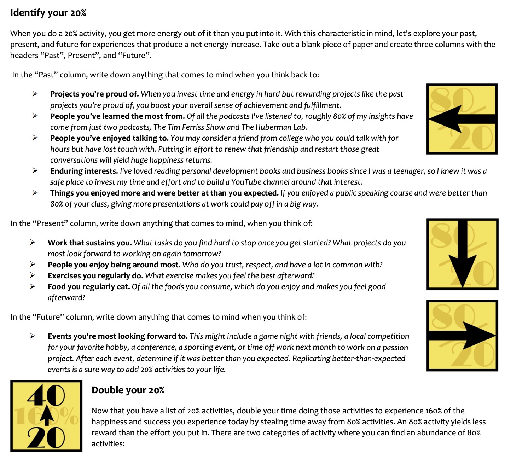

# Mental Models

---

## 80/20 Rule / Pareto Principle

In 1906 there was an Italian economist named Vilfredo Pareto. One day Pareto noticed that every year, 20% of the pea pods in his garden produced approximately 80% of the peas.

## The basic theory is that a limited number of actions create outsized results

This got him thinking about economic output on a larger scale. Sure enough, he began to find that in various industries, societies and even companies, 80% of the production often came from the 20% most productive faction.

## The 80/20 Principle states that 80% of the output or results will come from 20% of the input or action

- What are the 20% of [your possessions](https://markmanson.net/minimalism) you get the most value out of?
- What do you spend 20% of your time doing that gives you 80% of [your happiness](https://markmanson.net/how-to-be-happy)?
- Who are the 20% of people you're close to who [make you the happiest](https://markmanson.net/how-to-be-happy)?
- What are the 20% of the clothes you wear 80% of the time?
- What's the 20% of food you eat 80% of the time?

[THE 80/20 PRINCIPLE by Richard Koch | Core Message](https://www.youtube.com/watch?v=2YDR5-Mij1c)

- About a fifth of your time is likely to give you 4/5ths of your achievement or results and 4/5th of your happiness -- Richard Koch

