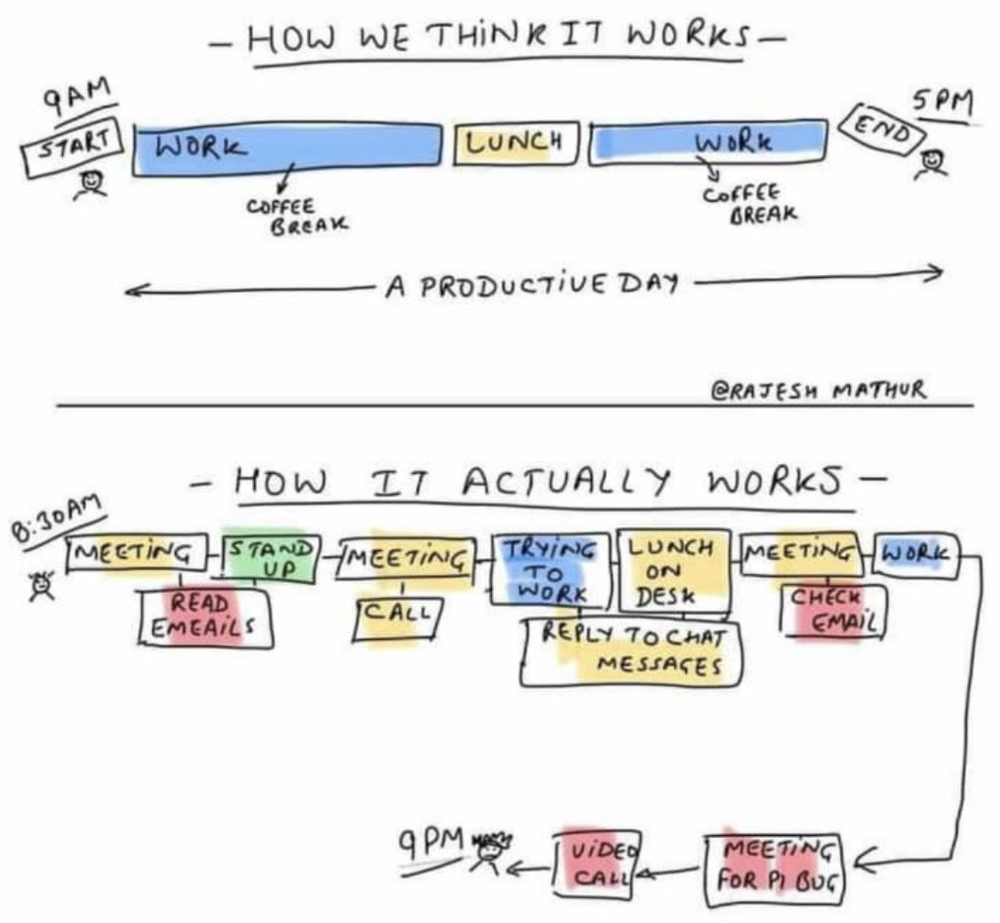
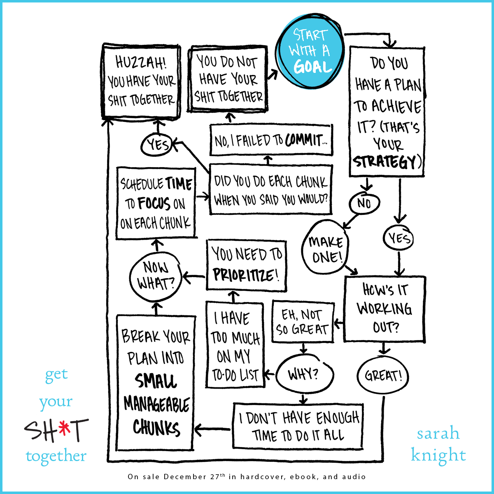
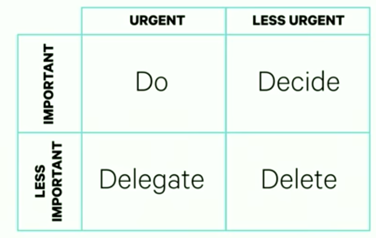
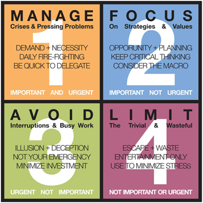

# Productivity / Productive / Time Management / TODO

Created: 2020-04-21 23:28:38 +0500

Modified: 2022-09-10 11:49:44 +0500

---

<https://www.scotthyoung.com/blog/2020/10/26/foundation-practices>

1. Establish an Airtight Productivity System

2. Exercise Every Weekday

3. Read 30 Minutes, Each Day

4. Journal Weekly

5. One Conversation Per Week with Someone Smarter Than You

6. Track Every Purchase

7. Fence In All Your Vices

8. Wake Up on Time Every Morning

9. Always Have a Major Project

10. One New Experience Each Week

<https://www.scotthyoung.com/blog/2020/09/07/beyond-self-improvement>

Focus on being productive instead of being busy. -- Tim Ferriss

Motion does not equal action. Busyness does not equal effectiveness.

Bekaar aadmi kuch kiya kar... Kapde udherkar siya kar...

## Process based vs outcome based

## OHIO principle, also known as "Only Handle it Once."

The secret to being productive is to work on the right thing---even if it's at a slow pace.

Fight procrastination with mini-deadlines that hold you accountable.

Quickly handle low-priority tasks by keeping your perfectionism at bay.

Time famine - People not having enough time for Doctor, Health, etc

The biggest risk to productivity is always the same: working on the wrong thing.

Bekaar Aadmi Kuch Kiya Kar ... Kapde Udherkar Siya Kar

One thing that you cannot recycle is wasted time

Think about what you want today and you'll spend your time.

Think about what you want in 5 years and you'll invest your time.

Productivity is never an accident. It is always the result of a commitment to excellence, intelligent planning, and focused effort.

Two truths that can be at odds:

1) There are no bonus points in life for doing it the hard way.

2) There is a lot to be gained in life by acting fast and giving your best effort.

Don't let the excuse of searching for a better way prevent you from taking action.

"Sometimes the most productive thing you can do is eliminate the task.

Downsize. The rooms you don't have, don't need to be cleaned.

Donate. The items you don't own, don't need to be organized.

Delete. The projects you don't take on, don't need to be finished.

Is this a problem that needs to be solved? Or is it a problem that can be eliminated all together?"

"It is wonderful how much work can be got through in a day, if we go by the rule---map out our time, divide it off, and take up one thing regularly after another. To drift through our work, or to rush through it in a helter-skelter fashion, ends in comparatively little being done. "One thing at a time" will always perform a better day's work than doing two or three things at a time. By following this rule, one person will do more in a day than another does in a week."

## MIT Technique

A Most Important Task (MIT) is a critical task that will create the most significant results. Every day, create a list of two or three M.I.T.s, and focus on getting them done as soon as possible. Keep this list separate from your general to-do list. -[The PersonalMBA](https://personalmba.com/most-important-tasks/)

## Mental Models

- (1)[Makers vs Manager's Schedule](http://www.paulgraham.com/makersschedule.html)--- "When you're operating on the maker's schedule, meetings are a disaster." (related:[Deep Work](http://knowledge.wharton.upenn.edu/article/deep-work-the-secret-to-achieving-peak-productivity/))
- (2)[Murphy's Law](https://en.wikipedia.org/wiki/Murphy%27s_law)--- "Anything that can go wrong, will." (related:[Hofstadter's Law](https://en.wikipedia.org/wiki/Hofstadter%27s_law), "It always takes longer than you expect, even when you take into account Hofstadter's Law.")
- (3)[Parkinson's Law](https://en.wikipedia.org/wiki/Parkinson%27s_law)--- "Work expands so as to fill the time available for its completion."
- (3) Gate's Law --- "Most people overestimate what they can do in one year and underestimate what they can do in ten years."

## Books

- **The Productivity Project -- Chris Bailey**

## Blinkist - The 12 Week Year by Brian P. Moran

Get more done in 12 weeks than others do in 12 months

Plan around a 12-week period, execute tasks and radically improve results

## Choosing a productivity system

1. Your system needs to fit your work (not the other way around)

2. The system should counterbalance your worst tendencies.

3. The system needs a way of dealing with exceptions.

4. A good productivity system shouldn't "feel" productive.

5. If your work changes, your system should too.

6. Always measure against your baseline (not somebody else's).

7. A system cannot give your work meaning or motivation.

<https://www.scotthyoung.com/blog/2020/04/27/productivity-rules>

## Productivity

1. Do the #1 Most Important Task At The Start of the Day

2. Don't Multitask

3. Have Themed Days

4. Discipline Matters More Than Intelligence

5. Recharge and Refresh Mid-Day To Keep Up Your Mental Fitness

6. Devote at Least 50% of Your Time to Building Great Products. Avoid Ego-Gratifying Activities.

7. Write Notes Down on Paper

8. Be Willing to Say No and Give Yourself Time

9. Reduce (or Eliminate) the Meetings You Have

10. Don't Under-Emphasize the Basics: Exercise, Eat Right, and Read

11. Realize You Control Your Time and Simplify Your Calendar

## Planning

The 10% Rule: Taking Planning Seriously

The first step to becoming a better planner is simply to set aside more time for it. Since we're evolved to be seat-of-our-pants doers, not patient planners, we need to counteract that urge by forcing ourselves to map out the path ahead.

Informally, I like to follow the 10% Rule, which says that you should spend, roughly 10% of the total time you anticipate for a project on planning the project. So if you were going to spend 100 hours on a project, you should spend about 10 hours planning it.

At first this seems crazy large. And, admittedly, this rule can be reduced for longer projects (especially those that might need intermediate planning as you learn more). Yet, for new project types where you lack experience, the time spent planning is often the most valuable.

<https://www.scotthyoung.com/blog/2020/12/07/planning>

## Blinkist - Off the Clock by Laura Vanderkam - Feel less busy while getting more done (23 June 2018)

- Learn exactly what you're doing with your time, even if it scares you, by keeping a log
- Make your hours memorable by filling them with exciting moments
- Our own insecurities keep us constantly busy, so learn to free up your calendar
- Spending time with loved ones can stretch our perception of time, and may even increase our lifespan
- *Accept the constraints on your time and lower your expectations*
- Spend your money on enlargin pleasant experiences and minimizing bad ones
- Have time for adventures
  - Figure out where the time actually goes
  - Plan in little adventures
  - Be careful with **yes**
  - Slow down
  - Put friends on your calendar

## Blinkist - Get your shit together by Sarah Knight (2 Jan 2019)

## Blinkist - The Organized Mind by Daniel Levitin (3 Jan 2019)

Thinking straight in the age of information overload

- The brain can only focus on a limited number of stimuli at a time
  - Attentional system
- We're surrounded by more and more information, and as a result, we're focused to make more and more decisions
  - We shouldn't spend too much time on less important everyday choices. Instead, we should find shortcuts and way to simplify our decision making.
- Find a designated place for every single object
  - hippocampus for remembering the location of things
  - Designate a specific location in your house that will be home to these objects. Be strict about adhering to it
- Organize your ideas outside your head
  - Write down ideas
  - No longer have the burden of trying to remeber it all day
  - **Two minute rule -** if the task takes longer than two minutes to complete, write it down. Otherwise, do it right away
  - Writing things down conserves the mental energy expended in worrying that you might forget something and in trying not to forget it.
- Junk drawers for miscellaneous items are incredibly effective - use them every day
- Set aside time to refuel so you can increase your productivity later
  - reduce the number of things it's working on at any given moment.
  - The companies that are winning the productivity battle are those that allow their employees productivity hours, naps, a chance for exercise
- Eat a diet that's got enough protein to help neurons function properly --cellular housekeeping
- Try to avoid complacency, seek out the novel, seek out the new, that's the way to stay young.

## Blinkist - 5 Gears: How to Be Present and Productive When There is Never Enough Time by Jeremie Kubicek, Steve Cockram (7 Jan 2019)

- **First gear -** when you fully rest and recharge (Learning to recharge)
- **Second gear -** when you connect with family or friends without the involvement of work (Connecting deeply)
- **Third gear -** when you are socializing (Why being social matters)
- **Fourth gear -** when you are working and multi-tasking (Leading in the task world)
- **Fifth gear -** when you are fully focused and 'in the zone,' working without interruption (In the Zone)
- **Reverse -** Being responsive in a resistant world

## Blinkist - First Things First by [Stephen Covey](https://en.wikipedia.org/wiki/Stephen_Covey), A. Roger Merrill, and Rebecca R. Merrill (9 Jan 2019)

The book asserts that there are three generations of [time management](https://en.wikipedia.org/wiki/Time_management): first-generation [task lists](https://en.wikipedia.org/wiki/Time_management#Task_list), second-generation [personal organizers](https://en.wikipedia.org/wiki/Personal_organizer) with deadlines and third-generation [values clarification](https://en.wikipedia.org/wiki/Value_(personal_and_cultural)) as incorporated in the [Franklin Planner](https://en.wikipedia.org/wiki/Franklin_Planner). Using the analogy of "the [clock](https://en.wikipedia.org/wiki/Clock) and the [compass](https://en.wikipedia.org/wiki/Compass)," the authors assert that identifying primary [roles](https://en.wikipedia.org/wiki/Role) and principles provides a "true north" and reference when deciding what activities are most important, so that decisions are guided not merely by the "clock" of scheduling but by the "compass" of purpose and values. Asserting that people have a need "to live, to love, to learn, and to leave a legacy" they propose moving beyond "urgency" (not the same as the [quadrant II](https://en.wikipedia.org/wiki/Cartesian_coordinate_system#Cartesian_coordinates_in_two_dimensions) in a Cartesian coordinate system).

Important items are identified by focusing on a few key priorities and roles which will vary from person to person, then identifying small goals for each role each week, in order to maintain a [holistic life balance](https://en.wikipedia.org/wiki/Holistic_health). One tool for this is a worksheet that lists up to seven key roles, with three weekly goals per role, to be evaluated and scheduled into each week before other appointments occupy all available time with things that seem urgent but are not important. This concept is illustrated with a story that encourages people to "place the big rocks first."

[Delegation](https://en.wikipedia.org/wiki/Delegation) is presented as an important part of time management. Successful delegation, according to Covey, focuses on results and benchmarks that are to be agreed in advance, rather than on prescribing detailed work plans.

<https://en.wikipedia.org/wiki/First_Things_First_(book)>

## Blinkist - 5 AM Club by Robin Sharma (15 Feb 2019)

Own your Morning. Elevate your Life

- The solitude and enhanced brain state that you'll experience at 5 a.m. will help you peform like the elite
  - We have a **limited cognitive bandwidth**. Throughout the day it is used up.
  - By getting up at 5 a.m., we can focus on one high-value activity without getting distracted.
  - At 5 a.m, we are well placed to achieve a **state of flow** in our thinking - **trasient hypofrontality**
- 5am is the time of least distraction, highest human glory and greatest peace.
- Historymakers **capitalize** on their talents, avoid distraction, achieve every day and master themselves
  - freedom from distraction is key
  - concentrating on a few amazing work projects rather than many good ones
  - Stripping out everything that distracts you from a relentless focus on what's most important
  - **day-stacking** - the small things done daily are way more important than big things done once in a while
    - Enhancing one ability or skill by just one percent every day. It's a small change, but over a year it amounts to a 365 percent improvement.
  - **personal mastery practice**
- Dedication and discipline beats brilliance and giftedness every day of the week
- Giving attention to each of the four interior empires will allow you to master yourself and your chosen field
  - Mindset
  - Healthset - your physical health
    - you can't be a titan of industry if you're dead
  - Heartset - emotional life and well-being
    - unexpressed emotions will never die. They are buried alive and they will come forth later in uglier ways.
  - Soulset - spirituality
- The 20/20/20 formula ensures that waking up at 5 a.m. generates incredible results
  - 20 minutes to move
  - 20 minutes to reflect
  - 20 minutes to grow
- Embracing sleep and the "twin-cycle of elite performance" is essential to maximizing the potential of the 5am club
- When you wake up, jump out of bed immediately, before the weaker part of our character can come up with reasons to stay under the duvet

## Blinkist - Great at Work by Morten T. Hansen

How top performers do less, work better, and achieve more

- Mastering your own work
  - Do less, then obsess
    - Choosing a few priorities
    - Dedicating your efforts toward excelling at them
  - Redesign your work
    - Start with a value not with a goal
  - Don't just learn, loop
    - Micro-behavior is a small, concrete action you take on a daily basis to improve a skill. The action shouldn't take more than fifteen minutes to perform and review, and it should have a clear impact on skill development.
  - P-squared (Passion and Purpose)
- Mastering working with others
  - Forceful champions
  - Fight and unite
    - Fight - On a meeting, maximize a team debate
    - Unite - Commit to decision at the end of meeting, because best idea wins
  - The two sins of collaboration
- Master your work-life

## Blinkist - Game Changers by Dave Asprey (6 May 2019)

What Leaders, Innovators, and Mavericks do to win at life

- **Biohacking -** Intentionally manipulating your biology to bring body and mind into better harmony with each other and our goals
- Biohacking enables us to update and adjust our mental and physical operating system
  - Body and mind's operating system is outdated - it was build for prehistoric ancestors for survival in a hostile environment
  - Three fundamental factors of a species' survival - *fear, food and fornication.*
- To truly benefit from biohacking, you need to know your goals
  - Identify your true passions in life (these are the things that make you feel excited just thinking about them)
  - Distinguish between your *means goals* and you *end goals.*
    - Means goals are the things you want to achieve in order to achieve something else
    - End goals, in contrast, are things that you want to achieve for their own sake
    - When you're planning you day, it's crucial to remember your end goals. That's because we have an unfortunate tendency to become overly fixated on means goals. When that happens, we lose sight of our end goals and stop working toward them.
- To achieve your goals with the help of biohacking, you need to prioritize and avoid decision fatigue
- Taking charge of your diet requires you to overcome emotional eating
- For a healthier approach to food, identify your emotional eating triggers and eat like your grandma
  - If you're eating the right kinds of food, you should be able to eat a small meal and go five hours without getting hungry again.
- To get a good night's sleep, identify your chronotype and adjust your sleep schedule accordingly
  - Lions - roar with energy before the sun has even risen and then peter out in the evening
  - Wolves - who are naturally inclined to wake up later in the day and have two peaks of energy: one from noon to 2:00 PM, the other beginning after sunset
  - Bears - Who have a natural sleep pattern that follows the rise and fall of the sun
  - Dolphins - Who are prone to insomnia and tend to perform best from midmorning to early afternoon
- To benefit from exercise, you need to counteract its shortcomings and drawbacks
  - Moving is important - body was designed to do that.
  - Problem - Daily exercise doen't benefit until we make other lifestyle adjustments
    - Could end up being a mostly sedentary person who happens to do intense movements from time to time
    - Six hour bout of sitting can negate the benefits of a one-hour workout
  - Problem - High-risk sports can put our bodies at risk of injury, which defeats the whole purpose of exercise
    - Running is a high-risk sport if done the wrong way
  - Problem - Aerobic exercise leads our bodies to produce the stress hormone cortisol
    - Triggers the creation of oxidative substances that make us age faster and cause inflammation
  - To avoid sitting too much, get a standing desk
  - To counteract the negative effects of aerobic exercise, add strength training to your workout routine. This will cause your body to produce anabolic hormones, which will combat oxidation.
  - to further the aging effects of oxidation, you can also supplement your aerobic exercise with antioxidants and probiotics
- To preserve more energy for higher pursuits, minimize the amount you use sex
  - When we're not doing it, we're often thinking about it. And even when we don't think we're thinking about it, we're frequently still thinking about it.
  - If you can sublimate - that is, re-channel - your sex-bound energy into higher pursuits, like creative projects, you'll have more energy to devote to them
  - Muhammad Ali is even said to have avoided having sex for six weeks prior to a boxing match
  - After men ejaculate, their bodies produce the hormone prolactin, which makes them sleepy. It also counteracts another hormone, dopamine, which makes them feel good. That's why they often feel tired and even depressed after sex
  - Women produce prolactin after having orgasms as well, but to a much lesser degree. For them, orgasms produce a number of positive biochemical effects instead.
    - The body's production of stress and inflammation-causing hormone cortisol is lowered
    - Orgasms increase the body's production of the mood-bosting neurotransmitter serotonin, the emotion-mellowing hormone oxytocin and oxytocin-enhancing hormone estrogen
  - To minimize the effects of orgasms on men - limit to one orgasm per week
  - To maiximize the effects of orgasms on women - at least two per week
- Fear is one of the biggest obstacles to success
  - Fear takes us out of the present moment
  - Fear discourages us from taking the risks that lead to success
- You can overcome fear by giving yourself safety cues
  - Listen to a soothing voice (guided meditation)
  - Visualize yourself in a happy place (ex - Bat Cave)
  - Try to feel gratitude for as many things, people and events in your life as possible - even your failures, which you can reinterpret as helpful learning experiences. (write journal)
- Stop using the word **can't**
  - If you say you can't do something, your subconscious will interpret this quite literally and it will give up, since there's no point trying to do something that you can't do.

## 168 Hours By Laura Vanderkam

You Have More Time Than You Think

- You're not too busy -- you're just not in control of your time.
  - Instead of thinking, "I'm too busy," you should ask, "Is that a priority?" If it isn't, simply let it go.
- To live a fulfilling life, focus on your core competencies.
- Choosing a job that uses your core competencies energizes your entire life.
  - "Any 'work' that is not advancing you towards the professional life you want should not count as work. It is wasted time."
- To become time-rich you must control your work calendar.
  - Create habit of excusing yourself from meetings. If you realize a meeting isn't relevant to you, and it's a waste of your time, you should leave. And that time would be better spent pursuing activities that advance your career.
- To achieve a career breakthrough, combine strategy with story.
  - "There's a lot of randomness in the universe, but truly lucky people recognize that fairy godmothers are lazy."
- You can improve your relationships with your children by focusing on your core competencies.
  - If you both love swimming, schedule regular trips to the local pool. A love of music might mean singing together.
- Outsource housework that doesn't align with your core competencies.
- Plan your leisure time to increase its value.
- Actionable advice: Win family time by creating a mini night shift.
  - Working parents often find it difficult to spend time with their children during the week. Overcome this by blocking out 5:00 p.m. to 8:00 p.m. in your calendar every weeknight -- and view this as sacred family time. Counter your shorter day at the office by working from 8:00 p.m. to 10:00 p.m. a few nights a week. By doing this, you'll maximize your time together while the kids are still awake. Otherwise, you're more likely to waste your evening leisure time in front of the TV.

## Getting Things Done (CPR - Capture Process Review)

[GETTING THINGS DONE by David Allen | Core Message (Remastered)](https://youtu.be/4aD8WG49PY4)

1. Capture

2. Process

   - Is it Actionable

   - Would it take 2 minutes or less

       - Yes, do it now

       - Else, go to 3.

3. Organize

   - Project

       - Personal

       - Work

   - Time

       - By deadlines (use calendar)

   - Context

4. Review

   - Weekly review the tasks for next week keeping 3-5 years vision in mind

   - Can do done at same time and place every week

   - Treat yourself after reviewing

5. Engage

- Focus. When other thoughts enter the mind, record them on an external nearby Thought Bucket.
- Empty the Thought Bucket weekly and organize it.
- Remove unimportant items, finish 2-minute tasks, and enter deadlines, or appointments in your calendar.
- Practice outcome thinking by having a project list that tracks steps leading to desired goals. The most urgent step on the project list goes to the Next Action list.
- The Next Action list should stay with you at all times so you can choose to act on them when time frees up.
- The Waiting For list can help expedite things.
- The Tickler File consists of 31 days and 12 months into the future, and is for time sensitive reminders.
- The Someday/Maybe list is for ideas in the future that are not concrete projects yet.
- Set up a functional workplace to create a cockpit of control that eases your mind.
- Review and update all of your lists weekly.
- Natural planning turns ambiguous ideas into brainstorming sessions that reduce the fog and provide clarity into actionable steps.
- Don't multi-task. Focus 100% of your mental capacity on the task at hand.
- Our brain's nature is to think. Thus, thoughts might enter our mind that distract us from the current tasks.
- Daily to-do lists are inefficient because of their warped view of time.

- **Including too many tasks**
  - Ideally, create a 'top three' tasks at the beginning of your to-do list.
  - Long lists are a problem because most people aren't aware that "we only have about three to six good hours of work in us each day."
  - People also tend to underestimate how long a task takes.
- **create a fresh list for each day**

## Primed to Perform by Neel Doshi & Lindsay McGregor (29 Sep 2018)

Direct Motives

1. Play

2. Purpose

3. Potential

Indirect Motives

1. Emotional Pressure

2. Economic Pressure

3. Inertia

Performance measurement

1. Tactical performance

How good you are to execute plans

2. Adaptive performance

Create new plans

## Performance motivation effects

1. Distraction effect

2. Cancellation effect

If you are given incentives for work then you cannot perform the same work without incentive

[https://www.ft.com/content/1f397fb4-da63-4ccd-bac1-343828540bf2](https://linkedin.us19.list-manage.com/track/click?u=52ada2ee20240692fbeb44407&id=3d59387fe1&e=153268bbf0)

Bonuses are outdated in the age of knowledge work

3. Cobra effect

Indian cobra farms released when wrong attribute was incentivised

## Emergence

Emergence occurs when the individual components of a collective are able to organise themselves into a system that is far more complicated than the sum of its parts. (Termites)

Philosophy is the root of knowledge

Blame bias - REAP model of feedback

1. Remember - Assume Positive Intent

2. Explain (yourself)

3. Ask (other person)

4. Plan (together)

The most powerful personal antidote is to come up with five alternative explanations for the behaviour that do not assume a problem with the person.

## Building high ToMo cultures

In God we trust; all others must bring data.

## Managers must be Fire starters

Example - Starbucks where everyone is allowed to make decisions.

- Great leaders inspire curiousity and encourage experimentation
- Helps you to see your work is important and meaningful
- Actively links the work to your personal goals

## Behavioural Code

- Uphold the obligation to dissent
- Do what you don't like for 5 minutes before rejecting it. You will surely like it after doing for 5 minutes.
- Follow the process
- You cannot tell the people that your identity is genuine, they have to feel it.

## Job roles that increase ToMo must have -

1. Theory of impact (end-to-end experience and see the impact that your work make)

2. Inspiration (Test new ideas)

3. Prioritization and planning

4. Performing (playground)

5. Reflection

1. **The Hunting Party**
    - **Free riders (who don't work if the team size is large and try to hide in the crowd)**

## Principles by Ray Dalio (Amarjeet)

[Principles For Success by Ray Dalio (In 30 Minutes)](https://youtu.be/B9XGUpQZY38)

Since the same kinds of things happen over and over again, in your life, a relatively few well-thought-out principles will allow you to deal with just about anything that reality throws at you. Where you get these principles from doesn't matter as much as having them and using them consistently---and that you never stop refining and improving them.

To acquire principles that work, it's essential that you embrace reality and deal with it well. Don't fall into the common trap of wishing that reality worked differently than it does or that your own realities were different. Instead, embrace your realities and deal with them effectively. After all, making the most of your circumstances is what life is all about. This includes being transparent with your thoughts and open-mindedly accepting the feedback of others. Doing so will dramatically increase your learning.

Along your journey you will inevitably experience painful failures. It is important to realize that they can either be the impetus that fuels your personal evolution or they can ruin you, depending on how you react to them. I believe that evolution is the greatest force in the universe and that we all evolve in basically the same way. Conceptually, it looks like a series of loops that either lead upward toward constant improvement or remain flat or even trend downward toward ruin. You will determine what your own loops look like.

Your evolutionary process can be described as a 5-Step Process for getting what you want. It consists of setting goals, identifying and not tolerating problems, diagnosing problems, coming up with designs to get around them, and then doing the tasks required. The important thing to remember is that no one can do all the steps well, but that it's possible to rely on others to help. Different people with different abilities working well together create the most powerful machines to produce achievements.

If you're willing to confront reality, accept the pain that comes with doing so, and follow the 5-Step Process to drive yourself toward your goals, you're on the path to success. Yet most people fail to do this because they hold on to bad opinions that could easily be rectified by going above themselves to objectively look down at their situation and weigh what they and others think about it. It's for that reason I believe you must be radically open-minded.

Our biggest barriers for doing this well are our ego barrier and our blind spot barrier. The ego barrier is our innate desire to be capable and have others recognize us as such. The blind spot barrier is the result of our seeing things through our own subjective lenses; both barriers can prevent us from seeing how things really are. The most important antidote for them is radical open-mindedness, which is motivated by the genuine worry that one might not be seeing one's choices optimally. It is the ability to effectively explore different points of view and different possibilities without letting your ego or your blind spots get in your way. Doing this well requires practicing thoughtful disagreement, which is the process of seeking out brilliant people who disagree with you in order to see things through their eyes and gain a deeper understanding. Doing this will raise your probability of making good decisions and will also give you a fabulous education.

If you can learn radical open-mindedness and practice thoughtful disagreement, you'll radically increase your learning. Finally, being radically open-minded requires you to have an accurate self-assessment of your own and others' strengths and weaknesses. This is where understanding something about how the brain works and the different psychometric assessments that can help you discover what your own brain is like comes in. To get the best results out of yourself and others, you must understand that people are wired very differently.

In a nutshell, learning how to make decisions in the best possible way and learning to have the courage to make them comes from a) going after what you want, b) failing and reflecting well through radical open-mindedness, and c) changing/evolving to become ever more capable and less fearful.

Some more granular principles for how to do all of the above and weigh your options in specific situations to determine the right path to follow are listed below.

1. Recognize that

   - the biggest thread to good decision making is harmful emotions, and

   - decision making is a two-step process (first learning and then deciding)

Never seize on the first available option, no matter how good it seems, before you have asked questions and explored.

2. Synthesize the situation at hand -

   - One of the most important decisions you can make is who you ask questions of

   - Dont believe everything you hear

   - Everything looks bigger up close - That's why it helps to step back to gain perspective and sometimes defer a decision until some time passes

   - New is overvalued relative to great

   - Dont oversqueeze dots - A dot is just one piece of data from one moment in time; keep that perspective as you synthesize

3. Synthesize the situation through time

   - Keep in mind both the rates of change and level of things and the relationships between them

   - Be imprecise - Understand the concept of "by and large" - it is the level at which you need to understand most things in order to make effective decisions

   - Remember the 80/20 rule and know what the key 20 percent (to learn or where your effort should go) is

   - Be an imprefectionist

4. Logic, reason, and common sense are your best tools for synthesizing reality and understanding what to do about it

5. Make your decisions as expected value calculations - all of you have read about "expected value" in your basic probability course. Sometimes its smart to take a chance even when the odds are overwhelmingly against you if the cost of being wrong is negligible relative to the reward that comes with the slim chance of being right.

   - Raising the probability of being right is valuable no matter what your probability of being right already is

   - Knowing when not to bet is as important as knowing what bets are probably worth making

   - The best choices are the ones that have more pros than cons, not those that dont have any cons at all

6. Prioritize by weighing the value of additional information against the cost of not deciding

   - All of your must-dos must be above the bar before you do your like-to-dos

   - Dont mistake possibilities for probabilities

7. Simplify - "Any damn foos can make it complex. It takes a genius to make it simple."

8. Use principles

   - Slow down your thinking so you can note the criteria you are using to make your decision

   - Write the criteria down as a principle

   - Think about those criteria when you have an outcome to assess, and refine them before the next "one of those" comes along

9. Believability weight your decision making - In case of disagreement with others, start by seeing if you can agree on principles that should be used to make that decision. If you disagree on the principles, try to work through your disagreement based on your respective believability.

10. Convert your principles into algorithms and have the computer make decisions alongside you. The process of man's mind working with technology is what elevates us - its what has taken us from an economy where most people dig in the dirt to today's information age. Its for that reason that people who have common sense, imagination and determination, who knows what they value and what they want, and who also use computers, math, and game theory are the best decision makers there are.

You can of course do all of these things alone, but if you've understood anything about the concept of radical open-mindedness, it should be obvious that going it alone will only take you so far. We all need others to help us triangulate and get to the best possible decisions---and to help us see our weaknesses objectively and compensate for them. More than anything else, your life is affected by the people around you and how you interact with each other. Your ability to get what you want when working with others who want the same things is much greater than your ability to get these things by yourself.

## The 4-Hour Workweek by Tim Ferriss

- Aim high so you can create your own reality and write your own rules.
- Step outside of your comfort zone and take action now.
- Try to gain the freedom of remote working within your current job.
- Be effective on the job by working on things with the goal of gaining remote work.
- The 80/20 rule applies with work: 20% of work will bring 80% of results. So, focus on being productive instead of busy.
- Time is money. Remove things that reduce your effectiveness at the job.
- Rate the importance of a task by asking yourself, "If this is the only thing I do today, would I be happy with today?"
- Finish your high priority items before noon.
- Address email and voicemail messages after completing the high priority tasks are done. Then bundle tasks to finish them.
- Have others play by your communication rules.
- Set up an automatic source of income by outsourcing everything. The key is to use as little of your time as possible.
- Have open communication and do not let your input be a requirement in the business process.
- Delegate as much responsibility as possible.
- Validate and test your products before selling. Set up an online store with out-of-stock items and an A/B testing ad campaign.
- Establish credibility in your product category.
- Appear bigger; because people trust larger companies.
- Be picky about your customers. The 20/80 rule applies. Top 20% of your customers will be responsible for 80% of revenue, so attend to them.
- Go premium with your product because premium quality brings higher profit and customer quality.
- Don't lie to yourself and think that when staying within your comfort zone, things will magically be okay.
- Don't start your day by checking emails.
- A fulfilling life can be achieved by being mobile and flexible. This means that you can do whatever you like, whenever you like.
- Moderate, automatic income you can manage anywhere around the world allows for the mobility required for the lifestyle you truly want.
- The worst-case scenario from making a decision is usually not as bad as you think.
- Five steps to independence: 1) start with a full time 9--5 job; 2) move to a full time remote 9--5 job; 3) gain efficiency to reduce 9--5 tasks to 9--1; 4) use other time to automate alternative income; 5) quit old job and live on alternative income.

## The Lazy Genius Way by Kendra Adachi

## Embrace what matters, ditch what doesn't, and get stuff done

- What's in it for me? Learn how to focus on the things that actually matter
- Being a perfectionist is exhausting and lonely -- but there is another way
- Real transformation happens in small steps
- Making fixed decisions can bring calm and focus
- You can defuse stressful situations with a little planning
- Introducing a few simple rules can transform your home
- In order to discover what's important to you, you'll need to take some time out
- We can't escape difficult situations, but we can change how we respond to them
- We need to become our own best friends -- and then allow other people in

## Negotiation Tips / Leverage

You want leverage.

- The person who creates more value has leverage.
- The person who can walk away has leverage.
- The person who is irreplaceable has leverage.
- The person who has a second option has leverage.
- The person who knows the numbers has leverage.
- The person who everyone likes and wants to work with has leverage.
- The person who asks for more, gets more.

And finally, most negotiations are not one-time affairs. The person people continue to like at the end of this negotiation is in a better position for the next one.

Many people work hard, but few people work on the highest and best thing.

Usually, it takes no more effort to work on high leverage tasks than it does to work on low leverage ones.

It's just a matter of directing your energy.

Investor and entrepreneurNaval Ravikanton the importance of leverage:

"Humans evolved in societies where there was no leverage. If I was chopping wood or carrying water for you, you knew eight hours put in would be equal to about eight hours of output. Now we've invented leverage... As a worker, you want to be as leveraged as possible so you have a huge impact without as much time or physical effort.

A leveraged worker can out-produce a non-leveraged worker by a factor of one thousand or ten thousand. With a leveraged worker, judgment is far more important than how much time they put in or how hard they work.

For example, a good software engineer, just by writing the right little piece of code and creating the right little application, can literally create half a billion dollars' worth of value for a company. But ten engineers working ten times as hard, just because they choose the wrong model, the wrong product, wrote it the wrong way, or put it in the wrong viral loop, have basically wasted their time. Inputs don't match outputs, especially for leveraged workers.

What you want in life is to be in control of your time. You want to get into a leveraged job where you control your time and you're tracked on outputs."

- (1)[Focus on High-leverage Activities](https://www.quora.com/Whats-the-single-most-valuable-lesson-youve-learned-in-your-professional-life)--- "Leverage should be the central, guiding metric that helps you determine where to focus your time." (related:[Eisenhower decision matrix](http://www.artofmanliness.com/2013/10/23/eisenhower-decision-matrix/)--- "**what is important is seldom urgent, and what is urgent is seldom important**.", "The best time to plant a tree was 20 years ago. The second best time is now.", [law of triviality](https://en.wikipedia.org/wiki/Law_of_triviality)--- "members of an organisation give disproportionate weight to trivial issues.")

## Eisenhower Matrix

1. Urgent & Important

2. Urgent & Not Important

3. Important & Not Urgent

4. Not Urgent & Not Important

## Blinkist - The Slight Edge

Turning Simple Disciplines into Massive Success and Happiness

The Slight Edge(2005) explores the power of all the small choices we make every day. Far from being insignificant, they are a step in our journey toward success or failure.

- To achieve the slight edge, we need to develop a life philosophy and master the mundane
  - Achieving greatness is often the culmination of years of making the right choices.
  - success is the result of simple, productive actions repeated consistently over time.
  - the life philosophy of Thomas J Watson, the founder of IBM: "The formula for success is quite simple: Double your rate of failure. What we don't understand is that the more we fail, the more chances we have to succeed.
  - "Successful people fail their way to the top."
- In the long run, the choices we make every day work either for us or against us
  - Remember: there are only two destinations. If you're not on track for success, then you're heading toward failure.
- People ignore mundane things in life because they are easy and seem insignificant -- and because the results are invisible
  - Success is gradual, just like failure. By the time your results are visible to everyone, your slight edge choices are history.
  - The mundane matters of life add up with the passage of time, but in the moment, they don't really seem to matter. The difference between success and failure is so tiny that it's very easy to miss.
- Continuous lifelong learning and practice will help you benefit from the slight edge
  - Once you learn something, you need to put it into practice. This deepens your understanding of the knowledge you gain. As the Chinese philosopher Confucius said, **"Knowledge without practice is useless, and practice without knowledge is dangerous."**
  - You can also learn from others. Once you identify a person who has fulfilled aspirations similar to yours, you can observe and copy them.
  - To keep making good choices, you need to train your unconscious brain.How do you do that? You use your conscious brain to identify a practice you want to adopt, then you do it repeatedly until it enters your subconscious and becomes automatic.
- Momentum, completion, reflection, and celebration are the four slight edge allies
  - Momentum is the irresistible force that can push us toward a goal.It takes energy and initiative to start a new activity. But once we get going, momentumtakes over and keeps propelling us forward. Once we're in motion, it becomes easier to make the positive changes needed to reach our goals.
  - Success is the progressive realization of a worthy ideal.
- Cultivate positive, productive habits that help you cope in any circumstances and achieve your dreams
  - The easiest way to get rid of a bad habit is to replace it with a good one.
  - There are seven key habits that can help us to stay on the path to success: show up; be consistent; have a positive outlook; be committed for the long-haul; cultivate a burning desire backed by faith; be willing to pay the price; and practiceslight-edge integrity.
  - Ask yourself: Am I fulfilling my commitments when no one is watching?
- There are three steps to achieving our dreams -- write them down, look at them every day, and develop a plan
- **Actionable advice: Surround yourself with successful people**
  - You may have heard the saying, "Birds of a feather flock together." They do that because they're all heading in the same direction. Similarly, if you want to achieve success, look at the people around you and ask where they're heading. Those around us rub off on us. So if your closest connections are heading for failure, you'll end up there, too. But if they're on the path to success, that will also be your destination.

Organize Tomorrow Today by Jason Selk & Tom Bartow

- Highly successful people rarely complete everything they want to do in a given day, but they always get the most important things done each day.

- Forgot about everything except, hard work and intelligent planning

- Maximize your time each day
- If you do your job, the score takes care of itself

- MIT - Most Important Task

- The ideal time to prioritize tomorrow is today
- 3 most important & 1 most (3 & 1)

- Expect the unexpected tomorrow

- When your day deviates from your plan, Regain control & rebuild momentum
- 1. The 100 second timeout
- 2. Ask and chop

- Make each day your masterpiece

[ORGANIZE TOMORROW TODAY by Jason Selk & Tom Bartow | Core Message](https://youtu.be/yRLEr69qPd4)

## Chunking

1. Start by capturing

2. Look for commonalities

3. Relate it to your purpose

4. Take action

<https://www.tonyrobbins.com/productivity-performance/power-of-chunking>

## Resources

<https://www.freecodecamp.org/news/how-to-get-things-done-lessons-in-productivity>

<https://deepstash.com/article/1700/23-time-management-techniques-of-insanely-busy-people>

<https://www.youtube.com/watch?v=fBr8BKPW5tc>

<https://medium.com/swlh/the-5-most-productive-things-to-do-when-youre-too-tired-to-work-4157efe9091b>

<https://hellonehha.hashnode.dev/how-to-protect-your-time-at-work-cksoxjhtq079dvks125jhewf3>

<https://www.productivitygame.com>

[Personal Productivity](https://www.youtube.com/watch?v=-f3dNkkFBvM)
