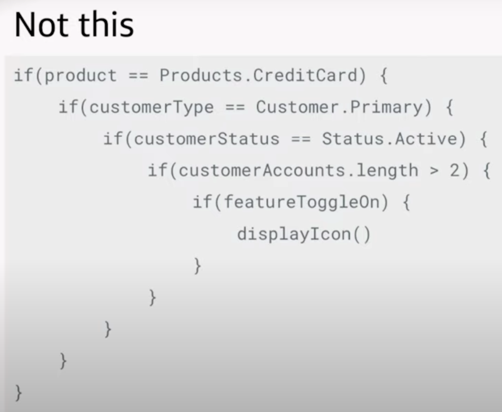
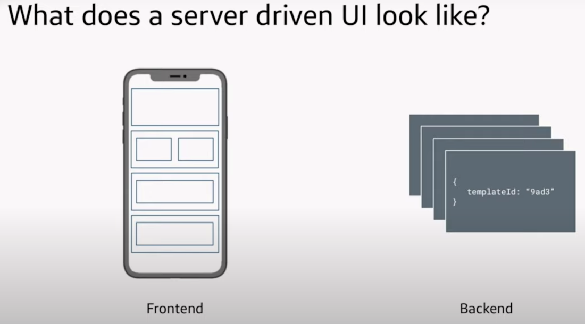
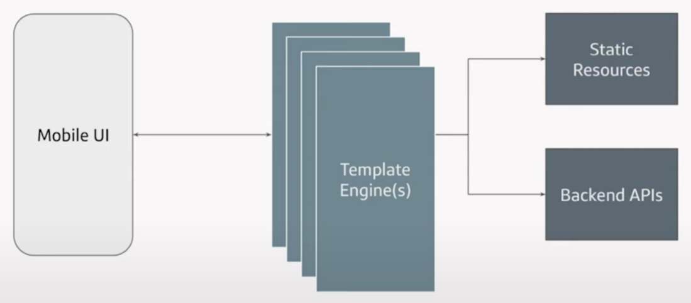
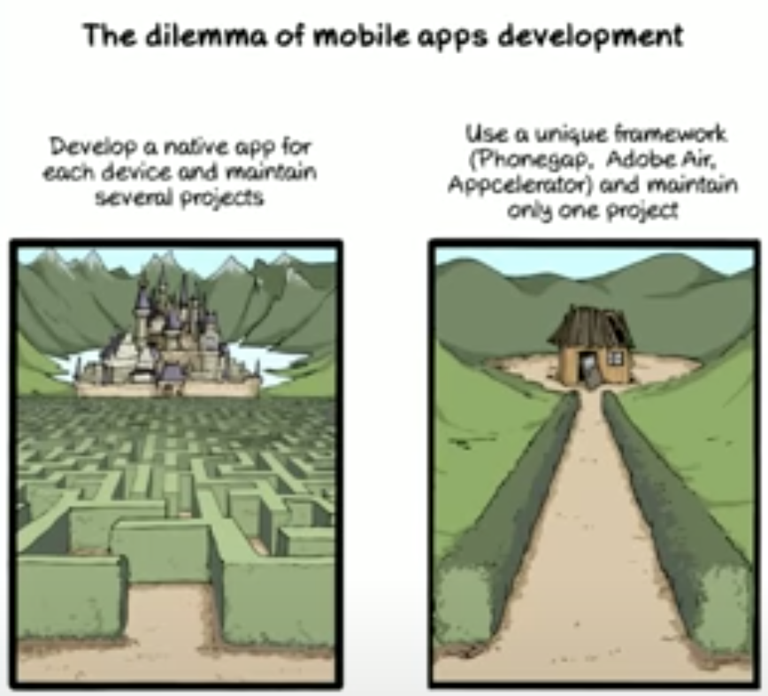

# Server Driven Mobile UIs

Created: 2020-09-29 00:00:50 +0500

Modified: 2022-10-30 23:34:15 +0500

---

## Apps
-   Personlized
-   Smart
-   Dynamic
-   Complex

## Challenges
-   **Context Driven**
    -   Apps behave differently depending on its current context
    -   ML enables hyper-personalization of content and experiences depending on the customer
-   **More Features**
    -   Apps have to support more features, screen real estate is the same
    -   Apps need to actually be useful

## Sideways building

-   **Frontend should be dumb**

-   **Frontend Templates**
    -   Templates are predefined UI layouts
    -   Templates have static layout, but dynamic content
    -   Templates can contain
        -   Text labels
        -   Images
        -   Buttons
        -   Input fields
        -   Toggles
    -   Templates have their own implementation per platform
        -   iOS - Android - Web
-   **Backend -** to provide data to frontend templates
    -   Backend consists of an API server that serves JSON
    -   JSON follows standard template contract and is consistent across platforms
    -   JSON specifies context which includes
        -   Text
        -   Images
        -   Actions
        -   Conditional logic
    -   A single data source means that any update to context and page flow only needs to happen once

## Data Flow

Example
-   Mobile UI initiates call to Template Engine
-   Template Engine returns initial JSON
-   Mobile UI triggers local/external actions
-   Mobile UI calls Template Engine
-   Template Engine returns next set of JSON
-   Repeat until finished

Use Case
-   A/B Testing
    -   Dynamic layouts are great for A/B Testing
    -   Server determines which assets to load based on your own criteria
    -   Iterate through different prototypes quickly
-   Dynamic Messaging
    -   Publish important messaging through templates
    -   Having a variety of template types can help provide more specific details per user
    -   No need for app updates to provide critical messaging
-   User Setup
    -   User setup can be customized based on product type
    -   You can easily create non-linear flows

-   You can easily add new screen without UI updates
-   Isolation of view & business logic enables better testing
    -   Testing of flows can be done on backend!

## Tips & Tricks
-   Define a good use case first
    -   Dynamic and simple content is the best way to start
    -   Find duplicate views and features that are consistent across platforms
-   Define your templates
-   Define your template contract
    -   Determine what are the necessary components that can populate your template
-   Start with static JSON
    -   Host it on the app to start
-   Incrementally build out backend as needed

## Other Considerations
-   Is this worth the extra work?
-   How can I test my UI?
-   How does this scale?
-   Are front-end developers deprecated?

[GOTO 2020 • Server Driven UI on Mobile • JJ Qi](https://www.youtube.com/watch?v=CtSfG8tYRdg&ab_channel=GOTOConferences)

<https://tech.affirm.com/solving-spaghetti-code-with-a-state-machine-aaec159f6659>

<https://medium.com/rocket-fuel/server-driven-ui-for-android-with-jetpack-compose-6763ec60f33e>

<https://medium.com/android-dev-hacks/jetpack-compose-with-server-driven-ui-396a19f0a661>

<https://medium.com/okcredit/oklayoutinflater-3c5cd93c6ebc>

