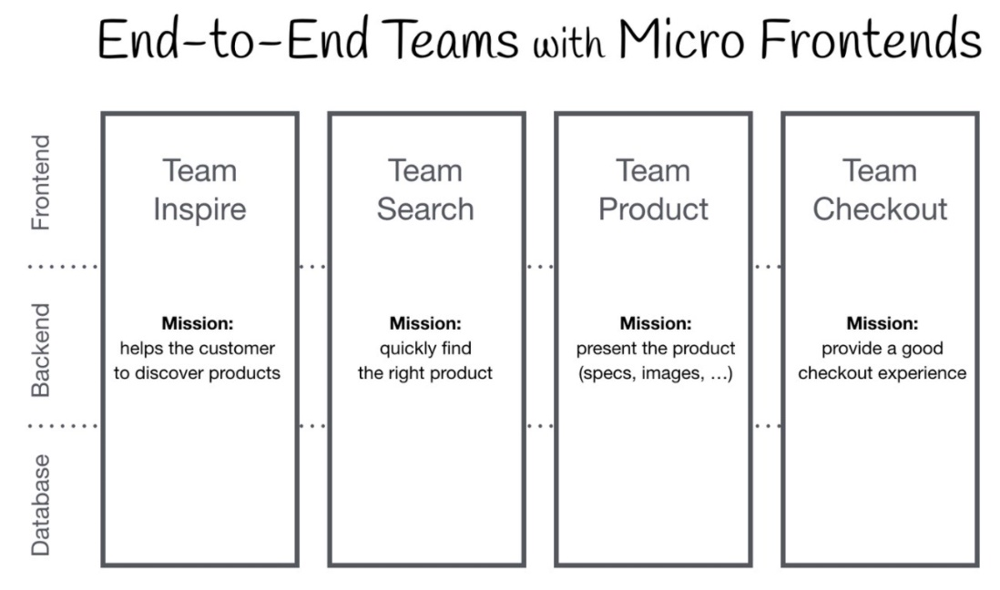

# Microfrontend Architecture

Created: 2021-11-25 22:52:01 +0500

Modified: 2021-11-26 23:17:27 +0500

---

Micro-frontend architecture is a design approach in which a[front-end](https://www.toptal.com/front-end)app is decomposed into individual, semi-independent "microapps" working loosely together.

The benefits of the micro-frontend pattern include

1.  Micro-frontend architectures may be simpler, and thus easier to reason about and manage.

2.  Independent development teams can collaborate on a front-end app more easily.

3.  They can provide a means for migrating from an "old" app by having a "new" app running side by side with it.

<https://www.toptal.com/front-end/micro-frontends-strengths-benefits>

Micro-frontends let you build a website or web app as a composition of features that you can create and work on separately.
-   asynchronous loading, error handling, shared state, cross platform micro-frontends, how to route multiple applications together, and even how to test micro-frontend code.

-   Why Micro-Frontends?
-   Why Module Federation?
-   Asynchronous Loading
-   Error Handling
-   Server Setup
-   Sharing Functions
-   Nomenclature
-   Sever Cart Setup
-   Sharing State
-   Sharing the JWT
-   Sharing the Cart
-   State Sharing Alternatives
-   Finishing the Cart
-   Cross-Platform Micro-Frontends
-   Micro-Frontend Routing
-   Unit Testing
-   End-To-End Testing

<https://www.freecodecamp.org/news/learn-all-about-micro-frontends

<https://micro-frontends.org

<https://medium.com/@lucamezzalira/i-dont-understand-micro-frontends-88f7304799a9>

<https://martinfowler.com/articles/micro-frontends.html>

<https://single-spa.js.org

<https://bit.dev

