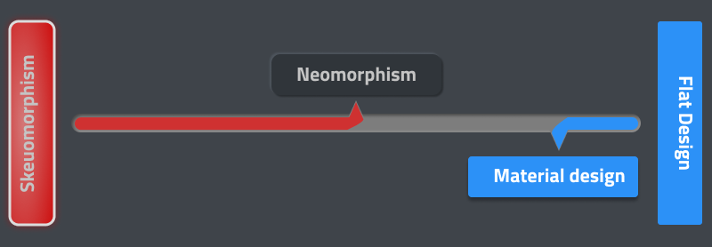
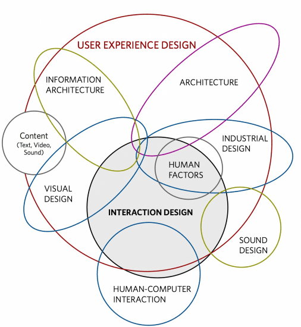
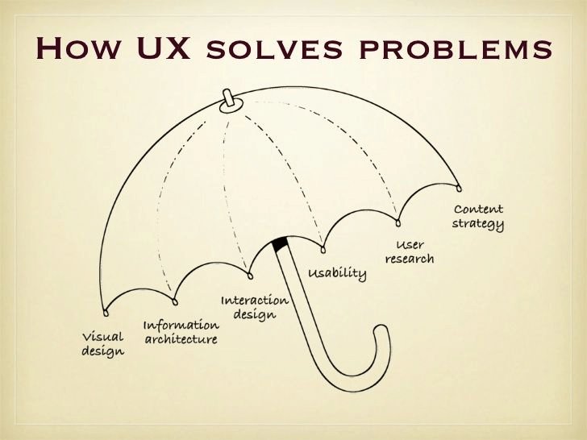
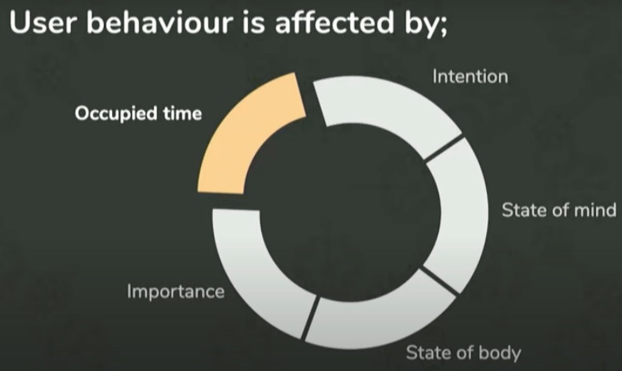
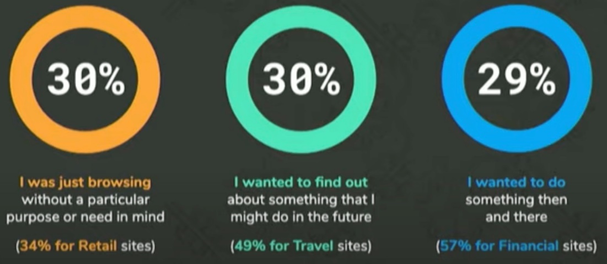

# UI / UX / IxD / Design / Frontend

"Design is not just what it looks like and feels like. Design is how it works."---[Steve Jobs, 2003](https://www.lukew.com/quotes/)

<https://www.freecodecamp.org/news/ui-ux-design-guide>

## UX

[UX Design Fundamentals: What do your users really see - Billy Hollis](https://www.youtube.com/watch?v=80H-9caP7UM)

## Design System

- Consistency

## 20 Usability Heuristics

- User Control: The interface will allow the user to perceive that they are in control and will allow appropriate control
- Human Limitations: The interface will not overload the user's congnitive, visual, auditory, tactile, or motor limits
- Modal Integrity: The interface will fit individual tasks within whatever modality is being used: auditory, visual, or motor/kinesthetic
- Accommodation: The interface will fit the way each user group works and thinks
- Linguistic Clarity: The interface will communicate as efficiently as possible
- Aesthetic Integrity: The interface will have an attractive and appropriate design
- Simplicity: The interface will present elements simply
- Predictability: The interface will behave in a manner such that users can accurately predict what will happen next
- Interpretation: The interface will make reasonable guesses about what the user is trying to do
- Accuracy: The interface will be free from errors
- Technical Clarity: The interface will have the highest possible fidelity
- Flexibility: The interface will allow the user to adjust the design for custom use
- Fulfillment: The interface will provide a satisfying user experience
- Cultural Propriety: The interface will match the user's social customs and expectations
- Suitable Tempo: The interface will operate at a tempo suitable to the user
- Consistency: The interface will be consistent
- User Support: The interface will provide additional assistance as needed or requested
- Precision: The interface will allow the users to perform a task exactly
- Forgiveness: The interface will make actions recoverable
- Responsiveness: The interface will inform users about the results of their actions and the interface's status

<https://www.toptal.com/designers/ui/design-for-developers>

<https://uxplanet.org/9-ui-ux-must-tools-for-designers-df60745d990e>

<https://www.toptal.com/designers/gui/portfolios>

## Dark Pattern Design

Adark patternis "a [user interface](https://en.wikipedia.org/wiki/User_interface) that has been carefully crafted to trick users into doing things, such as buying overpriced insurance with their purchase or signing up for recurring bills". [User experience designer](https://en.wikipedia.org/wiki/User_experience_design) Harry Brignull coined the [neologism](https://en.wikipedia.org/wiki/Neologism) on 28 July 2010 with the registration of darkpatterns.org, a "pattern library with the specific goal of naming and shaming deceptive user interfaces".More broadly, dark patterns supplant "user value...in favor of shareholder value".

- Confirmshaming - Want To Say 'No'? Shame on you!
- Disguised Ads - Where Is The Download?
- Forced Continuity - A Silent Parasite
- Roach Model - Want To Say Goodbye? Not So Easy!
- Tricky Questions - Check or uncheck? That's the question.

[**https://www.darkpatterns.org/types-of-dark-pattern**](https://www.darkpatterns.org/types-of-dark-pattern)

<https://uxdesign.cc/dark-patterns-in-ux-design-7009a83b233c>

<https://medium.com/beautiful-code-smart-design-by-10clouds/5-common-ux-dark-patterns-interfaces-designed-to-trick-you-61fdede9718c>

<https://techcrunch.com/2018/07/01/wtf-is-dark-pattern-design>

[How to Encourage Clicks Without the Shady Tricks | UX Consultant | Paul Boag](https://www.youtube.com/watch?v=6tvR1rz_Nb8)

## The seven most important building blocks of all good user interfaces

- White space
- Color
- Contrast
- Scale
- Alignment
- Typography
- Visual Hierarchy

<https://www.freecodecamp.org/news/learn-ui-design-fundamentals-with-this-free-one-hour-course>

## UX

- Skeuomorphism

Skeuomorphism is a term used to define an interface that mimics real-world items. The most common examples are the recycle bin icon on the desktop screen and the dial icon on mobile phones. They both represent a real-life object, dustbin, and a landline phone that the users are already familiar with.

Skeuomorphism had a huge impact on the early days of computing. The use of Skeupmorphism made interfaces more familiar and intuitive to use.

It served as a bridge between the physical and the digital world. The buttons were purposefully made to look glossy and raised to mimic a real-life button. However, with the popularity of smartphones, people became very accustomed to the graphical user interface. Skeuomorphism served a little role as time progressed. The 3-dimensions looking elements started looking unnecessary and made the UI look cluttered. This led to the rise in Flat Design.

- Flat Design

Flat designs moved away from 3d elements of Skeuomorphism. The idea of Flat Design was inspired by Minimalism. The flat design avoids gradients, shadows, and textures and rather focuses on User Experience (UX) with the use of simple flat elements and flat solid colors.

Apart from its aesthetics, the main benefit of Flat Design is in its implementation. It is far easier to scale flat design elements and make it responsive over different screen sizes.

However, flat design is limiting at times and may make designs too minimal and less intuitive. Therefore, a new improved and evolved form of Flat Design, Material Design, was then introduced. It makes the use of animations, gravity, and has a sense of physics. The material design utilizes Skeuomorphism subtly. It utilizes shadows and z-index to give a sense of elements being on top of each other.

- Neumorphism (Soft UI)

While neumorphic design looks aesthetically pleasing, it certainly has a lot of limitations. The subtle differences in the color value make it look minimal and aesthetically pleasing. However, having a low contrast ratio presents an accessibility issue. While it is possible to achieve different states of buttons such as active, pressed, and hovered with the use of different types of shadows, it might only be considering the users with clear eyesight. Moreover, it is complex to achieve a visual hierarchy by visually differentiating elements based on their levels of importance without compromising accessibility. Neumorphism might compromise UX for aesthetically pleasing UI if not done correctly.

<https://www.justinmind.com/blog/neumorphism-ui>

<https://medium.com/@artofofiare/neumorphism-the-right-way-a-2020-design-trend-386e6a09040a>

<https://css-tricks.com/neumorphism-and-css>

- **Glassmorphism**

The main aspect of this trend is a semi-transparent background, with a sublime shadow and border.

<https://ui.glass>

<https://www.freecodecamp.org/news/glassmorphism-design-effect-with-html-css>

## Figma

## Icons - Free figma icons

## Templates - <https://www.templatefreebies.com>

<https://www.youtube.com/watch?v=FTFaQWZBqQ8&ab_channel=AJ%26Smart>

<https://www.freecodecamp.org/news/ui-ux-design-tutorial-from-zero-to-hero-with-wireframe-prototype-figma>

<https://www.toptal.com/designers/ui/figma-design-tool>

<https://www.freecodecamp.org/news/learn-how-to-create-a-design-system-in-figma/lo>

<https://www.freecodecamp.org/news/ui-design-with-figma-tutorial>

<https://www.freecodecamp.org/news/use-user-reseach-to-create-the-perfect-ui-design>

Figma Variants - <https://www.freecodecamp.org/news/design-a-scalable-mobile-app-with-figma-variants>

## Accessibility

<https://www.freecodecamp.org/news/designing-keyboard-accessibility-for-complex-react-experiences>

## IxD (Interaction Designers)

Interaction design, often abbreviated asIxD, is "the practice of designing interactive digital products, environments, systems, and services."Beyond the digital aspect, interaction design is also useful when creating physical (non-digital) products, exploring how a user might interact with it. Common topics of interaction design include [design](https://en.wikipedia.org/wiki/Design), [human--computer interaction](https://en.wikipedia.org/wiki/Human%E2%80%93computer_interaction), and [software development](https://en.wikipedia.org/wiki/Programming_tool). While interaction design has an interest in form (similar to other design fields), its main area of focus rests on behavior.Rather than analyzing how things are, interaction design synthesizes and imagines things as they could be. This element of interaction design is what characterizes IxD as a design field as opposed to a science or engineering field.

While disciplines such as software engineering have a heavy focus on designing for technical stakeholders, interaction design is geared toward satisfying the majority of users.

## Five dimensions

The concept of dimensions of interaction design were introduced in Moggridge's bookDesigning Interactions.Crampton Smith wrote that interaction design draws on four existing design languages, 1D, 2D, 3D, 4D.Silver later proposed a fifth dimension, behaviour.

- **Words**

This dimension defines interactions: words are the element that users interact with.

- **Visual representations**

Visual representations are the elements of an interface that the user perceives; these may include but are not limited to "typography, diagrams, icons, and other graphics".

- **Physical objects or space**

This dimension defines the objects or space "with which or within which users interact".

- **Time**

The time during which the user interacts with the interface. An example of this includes "content that changes over time such as sound, video or animation".

- **Behavior**

Behavior defines how users respond to the interface. Users may have different reactions in this interface.

<https://xd.adobe.com/ideas/principles/human-computer-interaction/what-is-interaction-design>

## How do you utilize Hierarchy of Control in your design projects?

This technique is another way Interaction Designers IxD can make users feel comfortable using the platform, which in turn will make them more efficient.

The way Hierarchy of Control can be made clearly apparent is generally by grouping controls which affect an object with the object itself, such as zoom controls on a map. A hierarchy is created by associating controls which influence a smaller group of objects with the entire group.

## Information Architecture (IA)

<https://www.toptal.com/designers/ia/guide-to-information-architecture>

An information architecture is a document that provides an operational map to how a product acts and functions work for users. It's akin to a blueprint for digital products, and it displays pages, content, interactions, and behaviors for the entire product.

Information architecture (IA) involves the way a website/app is structured and how the content is organized. The goal is to help users find information and complete tasks. "In other words, information architecture is the creation of a structure for a website, application, or another project, that allows us to understand where we are as users, and where the information we want is in relation to our position. Information architecture results in the creation of site maps, hierarchies, categorizations, navigation, and metadata. When a content strategist begins separating content and dividing it into categories, she is practicing information architecture. When a designer sketches a top level menu to help users understand where they are on a site, he is also practicing information architecture"- from [uxbooth.com](http://www.uxbooth.com/articles/complete-beginners-guide-to-information-architecture/)

## Some qualifications for IA

- Experience documenting complex digital properties (websites, mobile apps, products, and system services)
- Extremely detailed documentation, ability to find discrepancies, cracks, etc. amongst complex site documentation
- Proficient with Axure, OmniGraffle, Keynote, as well as Visio and any other programs directly related to IA
- Analyze available information and assets to assess optimal IA approach
- Strong communication skills (written and verbal), and an ability to present effectively to agency and client staff
- Needs to be analytical, hardworking, creative, curious and interested in people and ideas
- Must be a confident and motivated self-starter

[UX / UI Inspiration for 2019](https://www.youtube.com/watch?v=7wlM_uOhKH4)

- **producthunt -** <https://www.producthunt.com>
- mobbin.design
- dribble
- evernote.design
- pageflows.com
- informationisbeautiful.net
- figma

[Designing for Speed | Google Senior UX Designer | Mustafa Kurtuldu](https://www.youtube.com/watch?v=Drf5ZKd4aVY)

<https://bit.ly/speedebook>

## Occupied vs Unoccupied time

## Elevators

- Put up mirrors
- Install hand sanitizers

Speed is broken up in two pieces, **real** and **perceived**

## UX important hierarchy

## Design Thinking Process

The five phases of the Design Thinking Process are:

- Empathize
- Define
- Ideate
- Prototype
- Test

<https://www.freecodecamp.org/news/the-design-thinking-process-explained>

## Tools

- draw.io / drawio

Availability zone

ec2 machine

- Gliffy
- Mermaid
- PlantUML
- Lucid Charts (lucidchart)
  - 60 objects contraint
- coggle.it
- moqups (Online Mockup, Wireframe, UI prototyping tool)
- figma

<https://www.figma.com>

- <https://balsamiq.com>
- Mural

<https://www.mural.co>

<https://www.mural.co/templates?template-categories=all-templates>

- Adobe XD vs Sketch vs Figma vs InVision studio
- <http://illustrated.dev/resources>

## Others

<https://dev.to/fullstack_to/units-in-css-em-rem-pt-px-vw-vh-vmin-vmax-ex-ch-53l0>

<https://dev.to/simonholdorf/9-projects-you-can-do-to-become-a-frontend-master-in-2020-n2h>

<https://www.toptal.com/web/website-performance-critical-rendering-path>

<https://www.smashingmagazine.com/2020/01/front-end-performance-checklist-2020-pdf-pages>

<https://www.freecodecamp.org/news/how-hex-code-colors-work-how-to-choose-colors-without-a-color-picker>

<https://www.toptal.com/designers/web/interview-questions>

<https://www.toptal.com/designers/interactive/interview-questions>

<https://github.com/bradtraversy/design-resources-for-developers>

## Courses - <https://www.interaction-design.org>

<https://wittysparks.com/professional-design-process-explained>

<https://www.freecodecamp.org/news/ux-vs-ui-whats-the-difference-definition-and-meaning>
