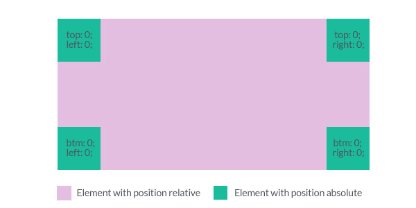
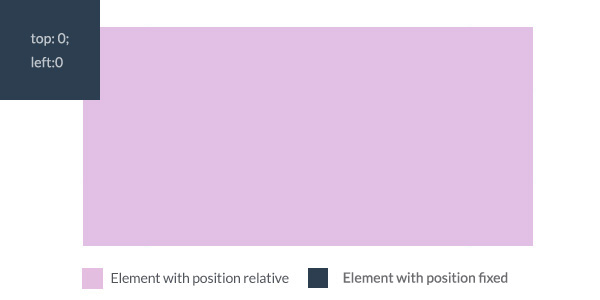

# CSS Positions

Created: 2017-12-16 15:42:22 +0500

Modified: 2021-11-29 13:46:55 +0500

---

CSS Positions allow you to manipulate how elements are positioned to achieve many different visual effects.

**Positioning Values**

CSS Position allows up to 5 different values. But essentially only 4 values are commonly used.

div {
position: static; /* default */
position: relative;
position: absolute;
position: fixed;
position: inherit; /* Not very common */
}

**Static**

All positions are static by default. Meaning they take up the appropriate amount of space they are supposed to take up. Its the default positioning value and every element will use this value, unless otherwise stated.

**Relative**

Position relative allows you to do two different things

1.  To nudge elements in different directions withtop,right,bottomandleftvalues.
    When set to position relative, elements take up the same amount of space at the same exact position it was supposed to take as if its position was static.
    It can however, appear to be pushed to a different location visually.

2.  Allow a child element to be positioned absolutely with reference to it. (See below)

**Absolute**

Position absolute takes the document out of the document flow. This means that it no longer takes up any space like what static and relative does.

When position absolute is used on an element, it is positioned absolutely with reference to the closest parent that has a position relative value.

If there are no parent elements that has a relative position, then the absolutely positioned element will take its reference from the browser window.

**Fixed**

Similar to position absolute, an element that has fixed position is taken out of the document flow. The major difference with position absolute is it always takes its positioning relative to the browser window.

**Sticky**
-   Changes to fixed position if scrolled

**Other Attributes**

Once an element is set to position relative, absolute or fixed, some other positioning attributes become available.
-   top,right,bottom,left- Allows you to set the edge of the element with reference to its containing element. These values can be negative if you want to place them just outside of their containing elements.
-   z-index- Z-index controls the vertical stacking order of elements, and take only numbered integers. The higher the integer, the more forward this element is. (Somewhat like the "bring forward/backward" thing in powerpoint and photoshop).

[Learn CSS Position In 9 Minutes](https://www.youtube.com/watch?v=jx5jmI0UlXU)

