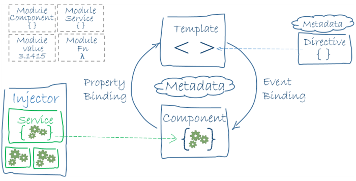

# AngularJS

Created: 2019-02-27 22:28:27 +0500

Modified: 2022-09-14 20:50:47 +0500

---

<https://www.toptal.com/angular/angular-9-tutorial-angular-ivy>

<https://medium.freecodecamp.org/want-to-learn-angular-heres-our-free-33-part-course-by-dan-wahlin-fc2ff27ab451>

<https://www.freecodecamp.org/news/learn-angular-full-course>

<https://www.toptal.com/angular-js/interview-questions>

<https://www.toptal.com/angular/hire-angular-developer>

<https://angular.io/guide/architecture>

## Architecture

You write Angular applications by composing HTML *templates*with Angularized markup, writing *component*classes to manage those templates, adding application logic in *services*, and boxing components and services in *modules*.

Then you launch the app by *bootstrapping* the *root module*. Angular takes over, presenting your application content in a browser and responding to user interactions according to the instructions you've provided.

1. Modules - Angular apps are modular and Angular has its own modularity system called *NgModules*.

## Angular Ivy

Angular Ivy is the new Angular compiler. It's the result of a major refactoring the Angular team worked on for two years. It sets the foundation for many improvements, allowing Angular to stay current with the latest innovations in web development.

## Commands

# Install

npm install -g @angular/cli

# Create a new project

ng new my-app

# Serve the application

cd my-app

ng serve --open

# Create a Component

ng generate component heroes
