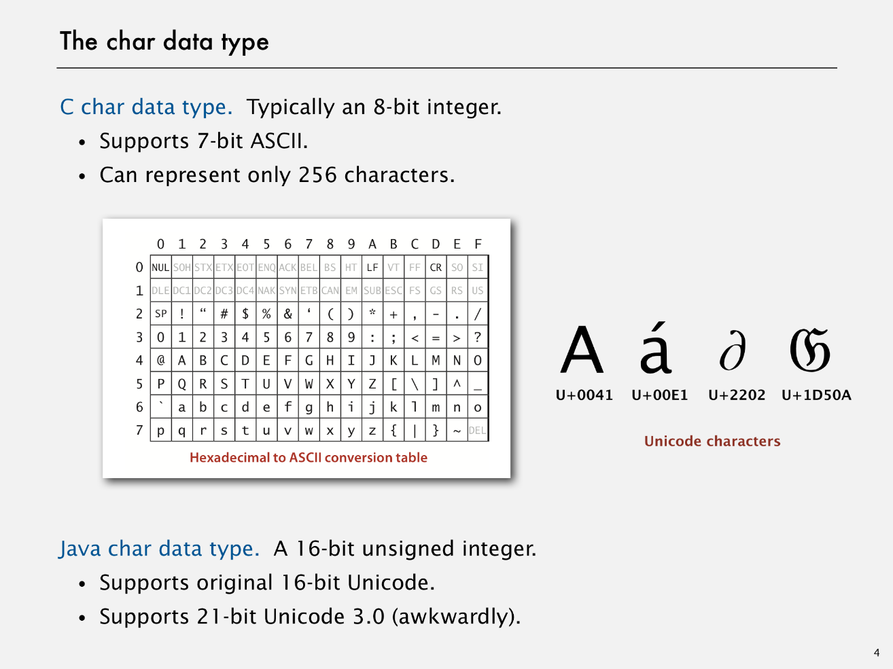

# Others

Created: 2018-02-17 14:09:46 +0500

Modified: 2019-12-22 16:09:25 +0500

---

Jshell for java REPL (Read-Eval-Print Loop, interactive toplevel or language shell)

**Generics**

1.  Avoid casting in client.

2.  Discover type mismatch errors at compile-time instead of run-time.

3.  AutoBoxing

Stack<Integer> stack = new Stack<Integer>();

s.push(17) // s.push(new Integer(17));

int a = s.pop() // int a = s.pop().intValue();

**Iterators**

Iterable Interface

What is Iterable?

It is a class that has a method that returns an Iterator.

What is Iterator?

Class that has methods hasNext() and next() (also remove(), but not used)

**Comparator Interface -**

Supports multiple orderings of a given data type.

Decouples the definition of the data type from the definition of what it means to compare two objects of that type.
-   To Use Java system sort:
    -   Create Comparator object
    -   Pass as second argument to Arrays.sort()
    -   Bottom line - Decouples the definition of the data type from the definition of what it means to compare two objects of that type.

**String vs StringBuilder**

{width="5.979166666666667in" height="4.479166666666667in"}

{width="5.979166666666667in" height="4.479166666666667in"}

![The String data type: Java implementation public final class String impl ements Comparabl e<Stri private char C] value; private int offset; private int length; private int hash; public int length() { return length; } public char charAt(int i) characters index of fi rst char in array length of string cache of hashCode() length val ue [ ] x o x 1 2 offset 3 4 5 { return value[i + offset] ; String(int offset, int length, pri vate this. offset = offset; this. length = length; char C] val ue) ](media/Others-image3.png){width="5.979166666666667in" height="4.479166666666667in"}

![The String data type: performance String data type (in Java). Sequence of characters (immutab Underlying implementation. Immutable char[] array, offset, Stri ng guarantee extra space operation 1 ength() charAt() substri ng C) concat() ](media/Others-image4.png){width="5.979166666666667in" height="4.479166666666667in"}

![The StringBuiIder data type StringBuiIder data type. Sequence of characters (mutable). Underlying implementation. Resizing char[] array and lengt Stri ng guarantee extra space Stri ngBui1der guarantee extra spa operation 1 ength() charAt() substri ng C) concat() ](media/Others-image5.png){width="5.979166666666667in" height="4.479166666666667in"}

{width="5.979166666666667in" height="4.479166666666667in"}

Java

JMH - Java Microbenchmark Harness

Mule ESB

Service-oriented architecture (SOA) [Characteristics - abstraction, autonomy, composability, discoverability, formal contract, loose coupling, reusability and statelessness.]

Enterprise Application Integration (EAI)

Enterprise Integration Patterns

Domain-Driven-Design for the N-Tier Architecture

Daisy Architecture

<http://www.codeproject.com/Articles/1182588/Application-Architecture-First-Know-Dependency-Bef>

Visible Dependencies

Hidden Dependencies

Direct Dependencies

Indirect Dependencies

Compile-Time Dependencies

Run-Time Dependency

