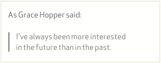
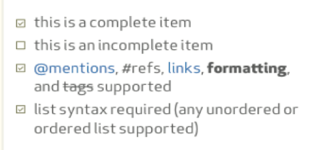
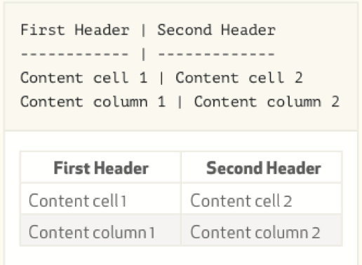

# Markdown

Created: 2017-11-15 23:12:53 +0500

Modified: 2022-12-11 12:34:24 +0500

---

Markdown is a way to style text on the web. You control the display of the document; formatting words as bold or italic, adding images, and creating lists are just a few of the things we can do with Markdown. Mostly, Markdown is just regular text with a few non-alphabetic characters thrown in, like # or *.

## Editor

 [Online Markdown Editor - Dillinger, the Last Markdown Editor ever.](https://dillinger.io/)

1. **Strikethrough**

~~Strikethrough~~

2. **Bold**

**bold**

3. **Italics**

*Italics*

1. **Headers**

```markdown
# This is an <h1> tag
## This is an <h2> tag
###### This is an <h6> tag
```

5. **Emphasis**

```markdown
*This text will be italic*

_This will also be italic_

**This text will be bold**

__This will also be bold__

*You **can** combine them*
```

6. **BlockQuotes**

```markdown
As Grace Hopper said:
>  I've always been more interested
>  in the future than in the past.
```



1. **Lists**

```markdown
1. Unordered
 *  Item 1
 *  Item 2
   *  Item 2a
   *  Item 2b
1. Ordered
 1. Item 1
 2. Item 2
 3. Item 3
   * Item 3a
   * Item 3b
```

8. **Images**

```markdown


Format: 
```

9. **Links**

```markdown
[http://github.com](http://github.com) - automatically created

[Github](http://github.com) - Using default text
```

10. **Backslash Escapes**

Markdown allows you to use backslash escapes to generate literal characters which would otherwise have special meaning in Markdown's formatting syntax.

\*Literal asterisks\*

<table>
<colgroup>
<col style="width: 45%" />
<col style="width: 54%" />
</colgroup>
<thead>
<tr class="header">
<th></th>
<th>Backslash</th>
</tr>
</thead>
<tbody>
<tr>
<td>`</td>
<td>Backtick</td>
</tr>
<tr>
<td></td>
<td>Asterisk</td>
</tr>
<tr>
<td>_</td>
<td>Underscore</td>
</tr>
<tr>
<td>{}</td>
<td>Curly braces</td>
</tr>
<tr>
<td>[]</td>
<td>Square brackes</td>
</tr>
<tr>
<td>()</td>
<td>Parentheses</td>
</tr>
<tr>
<td>#</td>
<td>Hash mark</td>
</tr>
<tr>
<td>+</td>
<td>Plus sign</td>
</tr>
<tr>
<td><ul class="incremental">
<li><blockquote>
<p></p>
</blockquote></li>
</ul></td>
<td>Minus sign (hyphen)</td>
</tr>
<tr>
<td>.</td>
<td>Dot</td>
</tr>
<tr>
<td>!</td>
<td>Exclamation mark</td>
</tr>
</tbody>
</table>

11. **Code: Block**

To specify an entire block of pre-formatted code, indent every line of the block by 1 tab or 4 spaces. Ampersands and angle brackets will automatically be translated into HTML entities.

Markdown:

```markdown
 If you want to mark something as code, indent it by 4 spaces.
 <p>This has been indented 4 spaces.</p>
```

# Github Flavored Markdown (GFM)

## Username@Mentions

Typing an '@' symbol, followed by a username, will notify that person to come and view the comment. This is called an "@mention". You can also @mention teams within an organization.

## Issue References

Any number that refers to an issues or PR will be automatically converted into a link.
github-flavored-markdown#1
defunkt/github-flavored-markdown#1

## Emoji

[www.emoji-cheat-sheet.com](http://www.emoji-cheat-sheet.com)

Examples

* :+1:
* :sparkles:
* :camel:
* :tada:
* :rocket:
* :metal:
* :octocat:

## Fenced Code Blocks

Markdown uses 4 leading spaces or 1 tab to represent a code block.
With GFM we can use ``` to create a code block withouth the leading spaces.
Optional language identifier can be added to give code syntax highlighting.

Ex:

```javascript
function test() {
 console.log("look ma', no spaces");
}
```

## Task Lists

```markdown
-  [x] this is a complete item
-  [ ] this is an incomplete item
-  [x] @mentions, #refs, [links](), **formatting**, and <del>tags</del> supported
-  [x] list syntax required (any unordered or ordered list supported)
```



## Tables

Tables aren't part of the core Markdown spec, but they are part of GFM and *Markdown Here* supports them.

We can create tables by assembling a list of words and dividing them with hyphens '-' (for the first row), and then separating each column with a pipe |:



Colons can be used to align columns.

| Tables | Are | Cool |
| ------------- |:-------------:| -----:|
| col 3 is | right-aligned | $1600 |
| col 2 is | centered | $12 |
| zebra stripes | are neat | $1 |

There must be at least 3 dashes separating each header cell.
The outer pipes (|) are optional, and you don't need to make the
raw Markdown line up prettily. You can also use inline Markdown.

Markdown | Less | Pretty
--- | --- | ---
*Still* | `renders` | **nicely**
1 | 2 | 3

## Badges


Level | Name | Solution
:----:|:----:|:--------:
1 | The OR symbol | A
2 | A Range of characters | B
3 | Characters NOT to include | C
4 | Zero or more | A A
5 | Zero or one | A B
6 | One or more | A A
7 | Backreference | A A
8 | Specific amount | A A
9 | Space | ' '

## MDX

You write markdown with embedded components through JSX. It gets compiled to JavaScript that you can use in any framework that supports JSX.

MDX allows you to use JSX in your markdown content. You can import components, such as interactive charts or alerts, and embed them within your content. This makes writing long-form content with components a blast.

<https://mdxjs.com>

## Others

<https://github.com/adam-p/markdown-here>
 Google Chrome, Firefox, and Thunderbird extension that lets you write email in Markdown and render it before sending.
 <https://markdown-here.com>

[Markdown vs. HTML – What Makes the Most Powerful Notes Editor?](https://www.thebrain.com/blog/markdown-vs-html)

<https://www.markdownguide.org/basic-syntax>

<https://markdown-it.github.io>

# Markdown Linter and Fixer

[GitHub - igorshubovych/markdownlint-cli: MarkdownLint Command Line Interface](https://github.com/igorshubovych/markdownlint-cli)
