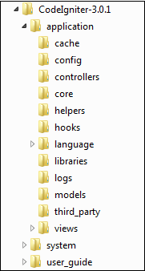
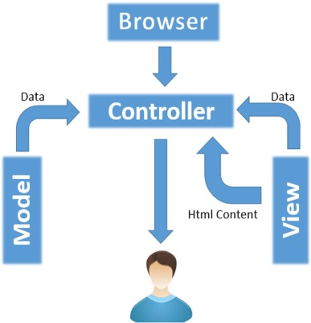

# Application Architecture

Created: 2020-02-08 19:42:49 +0500

Modified: 2020-09-03 00:10:16 +0500

---

## Application Architecture

-   It will first go toindex.phppage
-   In the second step,Routingwill decide whether to pass this request to step-3 for caching or to pass this request to step-4 for security check
-   If the requested page is already inCaching, thenRoutingwill pass the request to step-3 and the response will go back to the user
-   If the requested page does not exist inCaching, thenRoutingwill pass the requested page to step-4 forSecuritychecks
-   Before passing the request toApplication Controller, theSecurityof the submitted data is checked. After theSecuritycheck, theApplication Controllerloads necessaryModels, Libraries, Helpers, PluginsandScriptsand pass it on toView
-   TheViewwill render the page with available data and pass it on forCaching. As the requested page was not cached before so this time it will be cached inCaching, to process this page quickly for future requests

## Directory Structure

The image given below shows the directory structure of the CodeIgniter

CodeIgniter directory structure is divided into 3 folders
-   Application
-   System
-   User_guide

## Application

As the name indicates the Application folder contains all the code of your application that you are building. This is the folder where you will develop your project. The Application folder contains several other folders, which are explained below
-   Cache

This folder contains all the cached pages of your application. These cached pages will increase the overall speed of accessing the pages.
-   Config

This folder contains various files to configure the application. With the help ofconfig.phpfile, user can configure the application. Usingdatabase.phpfile, user can configure the database of the application.

## Files
-   autoload.php
-   config.php
-   constants.php
-   database.php
-   doctypes.php
-   foreign_chars.php
-   hooks.php
-   memcached.php
-   migration.php
-   mimes.php
-   profiler.php
-   routes.php
-   smileys.php
-   user_agents.php

-   Controllers− This folder holds the controllers of your application. It is the basic part of your application.
-   Core− This folder will contain base class of your application.
-   Helpers− In this folder, you can put helper class of your application.
-   Hooks− The files in this folder provide a means to tap into and modify the inner workings of the framework without hacking the core files.
-   Language− This folder contains language related files.
-   Libraries− This folder contains files of the libraries developed for your application.
-   Logs− This folder contains files related to the log of the system.
-   Models− The database login will be placed in this folder.
-   Third_party− In this folder, you can place any plugins, which will be used for your application.
-   Views− Application's HTML files will be placed in this folder

## System

This folder contains CodeIgniter core codes, libraries, helpers and other files, which help make the coding easy. These libraries and helpers are loaded and used in web app development.

This folder contains all the CodeIgniter code of consequence, organized into various folders −
-   Core− This folder contains CodeIgniter's core class. Do not modify anything here. All of your work will take place in the application folder. Even if your intent is to extend the CodeIgniter core, you have to do it with hooks, and hooks live in the application folder.
-   Database− The database folder contains core database drivers and other database utilities.
-   Fonts− The fonts folder contains font related information and utilities.
-   Helpers− The helpers folder contains standard CodeIgniter helpers (such as date, cookie, and URL helpers).
-   Language− The language folder contains language files. You can ignore it for now.
-   Libraries− The libraries folder contains standard CodeIgniter libraries (to help you with e-mail, calendars, file uploads, and more). You can create your own libraries or extend (and even replace) standard ones, but those will be saved in theapplication/librariesdirectory to keep them separate from the standard CodeIgniter libraries saved in this particular folder.

## User_guide

This is your user guide to CodeIgniter. It is basically, the offline version of user guide on CodeIgniter website. Using this, one can learn the functions of various libraries, helpers and classes. It is recommended to go through this user guide before building your first web app in CodeIgniter.

## public

Thepublicfolder holds the browser-accessible portion of your web application, preventing direct access to your source code. It contains the main.htaccessfile,index.php, and any application assets that you add, like CSS, javascript, or images.

This folder is meant to be the "web root" of your site, and your web server would be configured to point to it.

## writable

This directory holds any directories that might need to be written to in the course of an application's life. This includes directories for storing cache files, logs, and any uploads a user might send. You should add any other directories that your application will need to write to here. This allows you to keep your other primary directories non-writable as an added security measure.

## tests

This directory is set up to hold your test files. The_supportdirectory holds various mock classes and other utilities that you can use while writing your tests. This directory does not need to be transferred to your production servers.

Beside these three folders, there is one more important file named "index.php". In this file, we can set the application environment and error level and we can define system and application folder name. It is recommended, not to edit these settings if you do not have enough knowledge about what you are going to do.

<https://codeigniter.com/user_guide/concepts/structure.html>

<https://www.tutorialspoint.com/codeigniter/codeigniter_application_architecture.htm>

## Architecture

CodeIgniter is based on theModel-View-Controller (MVC) development pattern. MVC is a software approach that separates application logic from presentation. In practice, it permits your web pages to contain minimal scripting since the presentation is separate from the PHP scripting.

-   TheModelrepresents your data structures. Typically, your model classes will contain functions that help you retrieve, insert and update information in your database.
-   TheViewis information that is being presented to a user. A View will normally be a web page, but in CodeIgniter, a view can also be a page fragment like a header or footer. It can also be an RSS page, or any other type of "page".
-   TheControllerserves as an intermediary between the Model, the View, and any other resources needed to process the HTTP request and generate a web page.

<https://www.tutorialspoint.com/codeigniter/codeigniter_mvc_framework.htm>
